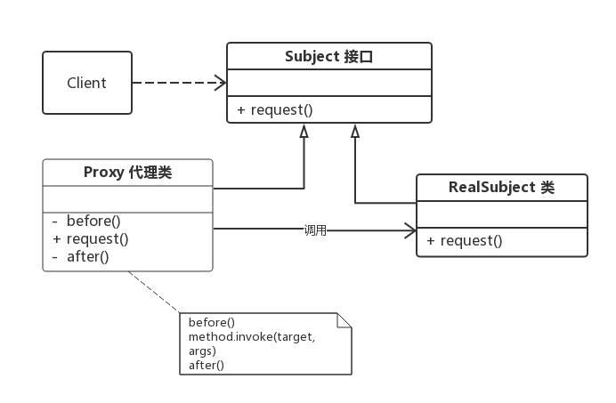

# Java 动态代理

> 参考文档
> https://juejin.cn/post/6924117553782456328?searchId=202312161209044A1A61473779E811BC95
> https://www.jianshu.com/p/e983ecf3e7a5
## 1 基本概念

### 是什么

动态代理在Java中有着广泛的应用，比如Spring AOP、Hibernate数据查询、测试框架的后端mock、RPC远程调用、Java注解对象获取、日志、用户鉴权、全局性异常处理、性能监控，甚至事务处理等。

### 代理模式

代理模式：给某一个对象提供一个代理，并由代理对象来控制对真实对象的访问。代理模式是一种结构型设计模式。
> [设计模式-代理](../../设计模式/3.7%20代理.md)




### 按照场景分类
代理模式按照职责（使用场景）来分类，至少可以分为以下几类：1、远程代理。 2、虚拟代理。 3、只能代理 4、保护（Protect or Access）代理。 

### 按照实现分类

如果根据字节码的创建时机来分类，可以分为静态代理和动态代理：

* 所谓静态也就是在程序运行前就已经存在代理类的字节码文件，代理类和真实主题角色的关系在运行前就确定了。
* 而动态代理的源码是在程序运行期间由JVM根据反射等机制动态的生成，所以在运行前并不存在代理类的字节码文件

## 2 静态代理

### 实例
编写一个接口 UserService ，以及该接口的一个实现类 UserServiceImpl

1. Subject

```java
public interface UserService {
    public void select();   
    public void update();
}
```
2. RealSubject

```java
public class UserServiceImpl implements UserService {  
    public void select() {  
        System.out.println("查询 selectById");
    }
    public void update() {
        System.out.println("更新 update");
    }
}
```
3. Proxy：通过静态代理对 UserServiceImpl 进行功能增强，在调用 select 和 update 之前记录一些日志。写一个代理类 UserServiceProxy，代理类需要实现 UserService

```java
public class UserServiceProxy implements UserService {
    private UserService target; // 被代理的对象

    public UserServiceProxy(UserService target) {
        this.target = target;
    }
    public void select() {
        before();
        target.select();    // 这里才实际调用真实主题角色的方法
        after();
    }
    public void update() {
        before();
        target.update();    // 这里才实际调用真实主题角色的方法
        after();
    }

    private void before() {     // 在执行方法之前执行
        System.out.println(String.format("log start time [%s] ", new Date()));
    }
    private void after() {      // 在执行方法之后执行
        System.out.println(String.format("log end time [%s] ", new Date()));
    }
}
```
4. 客户端

```java
public class Client1 {
    public static void main(String[] args) {
        UserService userServiceImpl = new UserServiceImpl();
        UserService proxy = new UserServiceProxy(userServiceImpl);

        proxy.select();
        proxy.update();
    }
}
```

5. 输出

```java
log start time [Thu Dec 20 14:13:25 CST 2018] 
查询 selectById
log end time [Thu Dec 20 14:13:25 CST 2018] 
log start time [Thu Dec 20 14:13:25 CST 2018] 
更新 update
log end time [Thu Dec 20 14:13:25 CST 2018] 

```

### 静态代理的缺点

静态代理简单，不侵入源代码，但是场景稍微复杂一些时候，就会出现问题：
1. 当需要代理多个类的饿时候。由于代理对象要实现与目标对象一致的接口，有两种方法：  
   1. 只维护一个代理类，由代理类实现多个接口，这样会导致代理类过于庞大。
   2. 新建多个代理类，每个目标对象对应一个代理类，但是这样会产生过多的代理类。
2. 当接口需要增加、删除、修改方法的时候，目标对象与代理类都要同时修改，不易维护。

## 2 动态代理

> AOP就是一种基于动态代理的设计模式，能够代理指定的类，动态添加一些功能，或者直接代理原来的功能。
> Java注解实际上是一种装饰器设计模式，通过注解额外的添加一下功能，例如自动注入、创建Bean、等操作，并不会生成代理类和代理方法，而是在原有的类上做补充。

为了解决冗余的静态代理代码问题，我们可以通过反射对需要添加代理的代码进行批量修改。

### Java类加载原理

Java虚拟机类加载过程主要分为五个阶段：加载、验证、准备、解析、初始化。其中加载阶段需要完成以下3件事情：

1. 通过一个类的全限定名来获取定义此类的二进制字节流
2. 将这个字节流所代表的静态存储结构转化为方法区的运行时数据结构
3. 在内存中生成一个代表这个类的 java.lang.Class 对象，作为方法区这个类的各种数据访问入口

由于虚拟机规范对这3点要求并不具体，所以实际的实现是非常灵活的，关于第1点，获取类的二进制字节流（class字节码）就有很多途径：

* 从ZIP包获取，这是JAR、EAR、WAR等格式的基础
* 从网络中获取，典型的应用是 Applet
* 运行时计算生成，这种场景使用最多的是动态代理技术，在 java.lang.reflect.Proxy 类中，就是用了 ProxyGenerator.generateProxyClass 来为特定接口生成形式为 *$Proxy 的代理类的二进制字节流
* 由其它文件生成，典型应用是JSP，即由JSP文件生成对应的Class类
* 从数据库中获取等等

所以，动态代理就是想办法，根据接口或目标对象，计算出代理类的字节码，然后再加载到JVM中使用。但是如何计算？如何生成？情况也许比想象的复杂得多，我们需要借助现有的方案。


### 常见字节码操作库

1. Apache BCEL (Byte Code Engineering Library)：是Java classworking广泛使用的一种框架，它可以深入到JVM汇编语言进行类操作的细节。
2. ObjectWeb ASM：是一个Java字节码操作框架。它可以用于直接以二进制形式动态生成stub根类或其他代理类，或者在加载时动态修改类。
3. CGLIB(Code Generation Library)：是一个功能强大，高性能和高质量的代码生成库，用于扩展JAVA类并在运行时实现接口。
4. Javassist：是Java的加载时反射系统，它是一个用于在Java中编辑字节码的类库; 它使Java程序能够在运行时定义新类，并在JVM加载之前修改类文件。


### 常见的动态代理方式

通过实现接口的方式 -> JDK动态代理
通过继承类的方式 -> CGLIB动态代理


## 3 JDK动态代理
### 实例
JDK动态代理主要涉及两个类：java.lang.reflect.Proxy 和 java.lang.reflect.InvocationHandler来时先。Proxy-> InvokeHandler -> object


1. 编写一个调用逻辑处理器 LogHandler 类，提供日志增强功能，并实现 InvocationHandler 接口；在 LogHandler 中维护一个目标对象，这个对象是被代理的对象（真实主题角色）；在 invoke 方法中编写方法调用的逻辑处理

```java
package com.ykl.proxy.service;

public interface UserService {

    void select();

    void update();
}

package com.ykl.proxy.service;

public class UserServiceImpl implements UserService {
    @Override
    public void select() {
        System.out.println("selecting");
    }

    @Override
    public void update() {
        System.out.println("updating");
    }
}


```

```java
import java.lang.reflect.InvocationHandler;
import java.lang.reflect.Method;
import java.util.Date;

public class LogHandler implements InvocationHandler {
    Object target;  // 被代理的对象，实际的方法执行者

    public LogHandler(Object target) {
        this.target = target;
    }
    @Override
    public Object invoke(Object proxy, Method method, Object[] args) throws Throwable {
        before();
        Object result = method.invoke(target, args);  // 调用 target 的 method 方法
        after();
        return result;  // 返回方法的执行结果
    }
    // 调用invoke方法之前执行
    private void before() {
        System.out.println(String.format("log start time [%s] ", new Date()));
    }
    // 调用invoke方法之后执行
    private void after() {
        System.out.println(String.format("log end time [%s] ", new Date()));
    }
}
```

1. 编写客户端，获取动态生成的代理类的对象须借助 Proxy 类的 newProxyInstance 方法，具体步骤可见代码和注释

```java
import proxy.UserService;
import proxy.UserServiceImpl;
import java.lang.reflect.InvocationHandler;
import java.lang.reflect.Proxy;

public class Client2 {
    public static void main(String[] args) throws IllegalAccessException, InstantiationException {
        // 设置变量可以保存动态代理类，默认名称以 $Proxy0 格式命名
        // System.getProperties().setProperty("sun.misc.ProxyGenerator.saveGeneratedFiles", "true");
        // 1. 创建被代理的对象，UserService接口的实现类
        UserServiceImpl userServiceImpl = new UserServiceImpl();
        // 2. 获取对应的 ClassLoader
        ClassLoader classLoader = userServiceImpl.getClass().getClassLoader();
        // 3. 获取所有接口的Class，这里的UserServiceImpl只实现了一个接口UserService，
        Class[] interfaces = userServiceImpl.getClass().getInterfaces();
        // 4. 创建一个将传给代理类的调用请求处理器，处理所有的代理对象上的方法调用
        //     这里创建的是一个自定义的日志处理器，须传入实际的执行对象 userServiceImpl
        InvocationHandler logHandler = new LogHandler(userServiceImpl);
        /*
		   5.根据上面提供的信息，创建代理对象 在这个过程中，
               a.JDK会通过根据传入的参数信息动态地在内存中创建和.class 文件等同的字节码
               b.然后根据相应的字节码转换成对应的class，
               c.然后调用newInstance()创建代理实例
		 */
        UserService proxy = (UserService) Proxy.newProxyInstance(classLoader, interfaces, logHandler);
        // 调用代理的方法
        proxy.select();
        proxy.update();
        
        // 保存JDK动态代理生成的代理类，类名保存为 UserServiceProxy
        // ProxyUtils.generateClassFile(userServiceImpl.getClass(), "UserServiceProxy");
    }
}
```

3. 日志
```java
log start time [Thu Dec 20 16:55:19 CST 2018] 
查询 selectById
log end time [Thu Dec 20 16:55:19 CST 2018] 
log start time [Thu Dec 20 16:55:19 CST 2018] 
更新 update
log end time [Thu Dec 20 16:55:19 CST 2018] 
```

### 原理
InvocationHandler和Proxy的主要方法介绍如下：
* java.lang.reflect.InvocationHandler
  * Object invoke(Object proxy, Method method, Object[] args) 定义了代理对象调用方法时希望执行的动作，用于集中处理在动态代理类对象上的方法调用
* java.lang.reflect.Proxy
  * static InvocationHandler getInvocationHandler(Object proxy)  用于获取指定代理对象所关联的调用处理器
  * static Class<?> getProxyClass(ClassLoader loader, Class<?>... interfaces) 返回指定接口的代理类
  * static Object newProxyInstance(ClassLoader loader, Class<?>[] interfaces, InvocationHandler h) 构造实现指定接口的代理类的一个新实例，所有方法会调用给定处理器对象的 invoke 方法
  * static boolean isProxyClass(Class<?> cl) 返回 cl 是否为一个代理类


生成java源代码的方法

```java
import sun.misc.ProxyGenerator;
import java.io.FileOutputStream;
import java.io.IOException;

public class ProxyUtils {
    /**
     * 将根据类信息动态生成的二进制字节码保存到硬盘中，默认的是clazz目录下
     * params: clazz 需要生成动态代理类的类
     * proxyName: 为动态生成的代理类的名称
     */
    public static void generateClassFile(Class clazz, String proxyName) {
        // 根据类信息和提供的代理类名称，生成字节码
        byte[] classFile = ProxyGenerator.generateProxyClass(proxyName, clazz.getInterfaces());
        String paths = clazz.getResource(".").getPath();
        System.out.println(paths);
        FileOutputStream out = null;
        try {
            //保留到硬盘中
            out = new FileOutputStream(paths + proxyName + ".class");
            out.write(classFile);
            out.flush();
        } catch (Exception e) {
            e.printStackTrace();
        } finally {
            try {
                out.close();
            } catch (IOException e) {
                e.printStackTrace();
            }
        }
    }
}
```
自动生成的代理的代码如下
```java
import java.lang.reflect.InvocationHandler;
import java.lang.reflect.Method;
import java.lang.reflect.Proxy;
import java.lang.reflect.UndeclaredThrowableException;
import proxy.UserService;

public final class UserServiceProxy extends Proxy implements UserService {
    private static Method m1;
    private static Method m2;
    private static Method m4;
    private static Method m0;
    private static Method m3;

    public UserServiceProxy(InvocationHandler var1) throws  {
        super(var1);
    }

    public final boolean equals(Object var1) throws  {
        // 省略...
    }

    public final String toString() throws  {
        // 省略...
    }

    public final void select() throws  {
        try {
            super.h.invoke(this, m4, (Object[])null);
        } catch (RuntimeException | Error var2) {
            throw var2;
        } catch (Throwable var3) {
            throw new UndeclaredThrowableException(var3);
        }
    }

    public final int hashCode() throws  {
        // 省略...
    }

    public final void update() throws  {
        try {
            super.h.invoke(this, m3, (Object[])null);
        } catch (RuntimeException | Error var2) {
            throw var2;
        } catch (Throwable var3) {
            throw new UndeclaredThrowableException(var3);
        }
    }

    static {
        try {
            m1 = Class.forName("java.lang.Object").getMethod("equals", Class.forName("java.lang.Object"));
            m2 = Class.forName("java.lang.Object").getMethod("toString");
            m4 = Class.forName("proxy.UserService").getMethod("select");
            m0 = Class.forName("java.lang.Object").getMethod("hashCode");
            m3 = Class.forName("proxy.UserService").getMethod("update");
        } catch (NoSuchMethodException var2) {
            throw new NoSuchMethodError(var2.getMessage());
        } catch (ClassNotFoundException var3) {
            throw new NoClassDefFoundError(var3.getMessage());
        }
    }
}
```
从 UserServiceProxy 的代码中我们可以发现：

* UserServiceProxy 继承了 Proxy 类，并且实现了被代理的所有接口，以及equals、hashCode、toString等方法
* 由于 UserServiceProxy 继承了 Proxy 类，所以每个代理类都会关联一个 InvocationHandler 方法调用处理器
* 类和所有方法都被 public final 修饰，所以代理类只可被使用，不可以再被继承
* 每个方法都有一个 Method 对象来描述，Method 对象在static静态代码块中创建，以 m + 数字 的格式命名
* 调用方法的时候通过 super.h.invoke(this, m1, (Object[])null); 调用，其中的 super.h.invoke 实际上是在创建代理的时候传递给 Proxy.newProxyInstance 的 LogHandler 对象，它继承 InvocationHandler 类，负责实际的调用处理逻辑


## 4 CGLIB的动态代理

### 实现

1. 创建代理逻辑
```java
import java.lang.reflect.Method;
import java.util.Date;

public class LogInterceptor implements MethodInterceptor {
    /**
     * @param object 表示要进行增强的对象
     * @param method 表示拦截的方法
     * @param objects 数组表示参数列表，基本数据类型需要传入其包装类型，如int-->Integer、long-Long、double-->Double
     * @param methodProxy 表示对方法的代理，invokeSuper方法表示对被代理对象方法的调用
     * @return 执行结果
     * @throws Throwable
     */
    @Override
    public Object intercept(Object object, Method method, Object[] objects, MethodProxy methodProxy) throws Throwable {
        before();
        Object result = methodProxy.invokeSuper(object, objects);   // 注意这里是调用 invokeSuper 而不是 invoke，否则死循环，methodProxy.invokesuper执行的是原始类的方法，method.invoke执行的是子类的方法
        after();
        return result;
    }
    private void before() {
        System.out.println(String.format("log start time [%s] ", new Date()));
    }
    private void after() {
        System.out.println(String.format("log end time [%s] ", new Date()));
    }
}
```


2. 创建代理对象，在代理对象中自动生成代码

```java
package com.ykl.proxy;

import com.ykl.proxy.handler.LogInterceptor;
import com.ykl.proxy.service.UserService;
import net.sf.cglib.proxy.Enhancer;

public class CglibDynamicProxy {

    public static void main(String[] args) {
        LogInterceptor logInterceptor = new LogInterceptor();
        Enhancer enhancer = new Enhancer();
        enhancer.setSuperclass(UserService.class);  // 设置超类，cglib是通过继承来实现的
        enhancer.setCallback(logInterceptor);
        UserService userService = (UserService)enhancer.create();   // 创建代理类


        userService.update();
        userService.select();

    }
}

```

3. 可以通过工厂方法批量生成被代理的对象。
```java
package com.bytebeats.codelab.cglib.proxy.impl;

import com.bytebeats.codelab.cglib.proxy.ProxyFactory;
import net.sf.cglib.proxy.Enhancer;
import net.sf.cglib.proxy.MethodInterceptor;
import net.sf.cglib.proxy.MethodProxy;
import java.lang.reflect.Method;
import java.util.Arrays;

/**
 * CgLib动态代理实现
 * @author Ricky
 *
 */
public class CgLibProxyFactory implements ProxyFactory {
    private final Enhancer en = new Enhancer();

    @Override
    public <T> T getProxy(Object target) {

        //进行代理
        en.setSuperclass(target.getClass());
        en.setCallback(new MethodInterceptor() {
            @Override
            public Object intercept(Object o, Method method, Object[] args, MethodProxy methodProxy) throws Throwable {

                if (Object.class.equals(method.getDeclaringClass())) {
                    return method.invoke(this, args);
                }
                String methodName = method.getName();
                //打印日志
                System.out.println("[before] The method " + methodName + " begins with " + (args!=null ? Arrays.asList(args) : "[]"));
                Object result = null;
                try{
                    //前置通知
                    result = methodProxy.invokeSuper(o, args);
                    //返回通知, 可以访问到方法的返回值
                    System.out.println(String.format("after method:%s execute", method.getName()));
                } catch (Exception e){
                    e.printStackTrace();
                    //异常通知, 可以访问到方法出现的异常
                }
                //后置通知. 因为方法可以能会出异常, 所以访问不到方法的返回值
                //打印日志
                System.out.println("[after] The method ends with " + result);
                return result;
            }
        });
        //生成代理实例
        return (T)en.create();
    }
}
```

4. 其测试类如下

```java
package com.bytebeats.codelab.cglib.proxy;

import com.bytebeats.codelab.cglib.proxy.impl.CgLibProxyFactory;
import com.bytebeats.codelab.cglib.proxy.impl.JdkProxyFactory;
import com.bytebeats.codelab.cglib.service.HelloService;
import com.bytebeats.codelab.cglib.service.HelloServiceImpl;

public class ProxyDemo {

    public static void main(String[] args) {

        //需要被代理的类
        HelloService helloService = new HelloServiceImpl();

        //jdk代理
        ProxyFactory jdkProxyFactory = new JdkProxyFactory();
        HelloService jdkProxy = jdkProxyFactory.getProxy(helloService);
        jdkProxy.echo("ricky");
        jdkProxy.hashCode();

        //CgLib代理
        ProxyFactory cgLibProxyFactory = new CgLibProxyFactory();
        HelloService cgLibProxy = cgLibProxyFactory.getProxy(helloService);
        cgLibProxy.echo("ricky");
        jdkProxy.hashCode();
    }

}
```

### 原理

CGLIB 创建动态代理类的模式是：

1. 查找目标类上的所有非final 的public类型的方法定义；
1. 将这些方法的定义转换成字节码；
1. 将组成的字节码转换成相应的代理的class对象；
1. 实现 MethodInterceptor接口，用来处理对代理类上所有方法的请求


## 4 两个框架对比

### 静态代理

代理对象和实际对象都继承了同一个接口，在代理对象中指向的是实际对象的实例，这样对外暴露的是代理对象而真正调用的是 Real Object

优点：可以很好的保护实际对象的业务逻辑对外暴露，从而提高安全性。
缺点：不同的接口要有不同的代理类实现，会很冗余

### JDK 动态代理


为了解决静态代理中，生成大量的代理类造成的冗余；


JDK 动态代理只需要实现 InvocationHandler 接口，重写 invoke 方法便可以完成代理的实现，


jdk的代理是利用反射生成代理类 Proxyxx.class 代理类字节码，并生成对象


jdk动态代理之所以只能代理接口是因为代理类本身已经extends了Proxy，而java是不允许多重继承的，但是允许实现多个接口


优点：解决了静态代理中冗余的代理实现类问题。


缺点：JDK 动态代理是基于接口设计实现的，如果没有接口，会抛异常。


### CGLIB 代理


由于 JDK 动态代理限制了只能基于接口设计，而对于没有接口的情况，JDK方式解决不了；


CGLib 采用了非常底层的字节码技术，其原理是通过字节码技术为一个类创建子类，并在子类中采用方法拦截的技术拦截所有父类方法的调用，顺势织入横切逻辑，来完成动态代理的实现。


实现方式实现 MethodInterceptor 接口，重写 intercept 方法，通过 Enhancer 类的回调方法来实现。


但是CGLib在创建代理对象时所花费的时间却比JDK多得多，所以对于单例的对象，因为无需频繁创建对象，用CGLib合适，反之，使用JDK方式要更为合适一些。


同时，由于CGLib由于是采用动态创建子类的方法，对于final方法，无法进行代理。


优点：没有接口也能实现动态代理，而且采用字节码增强技术，性能也不错。


缺点：技术实现相对难理解些

