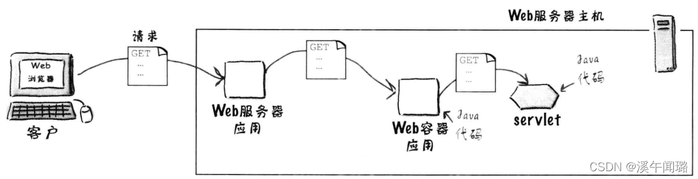

# 网络技术栈
> [参考文档](http://c.biancheng.net/servlet2/container.html)
> [参考文档](https://blog.csdn.net/weixin_47975351/article/details/124655111)

### web服务器

部署动态网站一般需要 Web 服务器的支持，例如：
* 运行 PHP 网站一般选择 Apache 或者 Nginx；
* 运行 ASP/ASP.NET 网站一般选择 IIS；
* 运行 Python 网站一般选择内置的 WSGI 服务器模块——wsgiref。

Web 服务器是一种对外提供 Web 服务的软件，它可以接收浏览器的 HTTP 请求，并将处理结果返回给浏览器。

在部署 Servlet 网站时，同样需要一种类似的软件，例如 Tomcat、Jboss、Jetty、WebLogic 等，但是它们通常被称为“容器”，而不是“服务器”，这究竟是为什么呢？Servlet 容器和传统意义上的服务器有什么不同呢？

我们通常所说的 Web 服务器，比如 Apache、Nginx、IIS 等，它们的功能往往都比较单一，只能提供 http(s) 服务，让用户访问静态资源（HTML 文档、图片、CSS 文件、JavaScript 文件等），它们不能执行任何编程语言，也不能访问数据库，更不能让用户注册和登录。

也就是说，如果只有 Web 服务器，那您只能部署静态网站，不能部署动态网站。要想部署动态网站，必须要有编程语言运行环境（运行时，Runtime）的和数据库管理系统的支持。

部署动态网站一般至少需要三个组件，分别是 Web 服务器、脚本语言运行时和数据库，例如，部署 PHP 网站一般选择「Apache + PHP 运行时 + MySQL」的组合。

### Web容器
> 简单来说，Web容器就是让java能够像脚本语言一样响应用户请求的工具。
Servlet 是基于 Java 语言的，运行 Servlet 必然少不了 JRE 的支持，它负责解析和执行字节码文件（.class文件）。然而 JRE 只包含了 Java 虚拟机（JVM）、Java 核心类库和一些辅助性性文件，它并不支持 Servlet 规范。要想运行 Servlet 代码，还需要一种额外的部件，该部件必须支持 Servlet 规范，实现了 Servlet 接口和一些基础类，这种部件就是 Servlet 容器。

Servlet 容器就是 Servlet 代码的运行环境（运行时），它除了实现 Servlet 规范定义的各种接口和类，为 Servlet 的运行提供底层支持，还需要管理由用户编写的 Servlet 类，比如实例化类（创建对象）、调用方法、销毁类等。

Servlet 中的容器和生活中的容器是类似的概念：生活中容器用来装水、装粮食，Servlet 中的容器用来装类，装对象。

读者可能会提出疑问，我们自己编写的 Servlet 类为什么需要 Servlet 容器来管理呢？这是因为我们编写的 Servlet 类没有 main() 函数，不能独立运行，只能作为一个模块被载入到 Servlet 容器，然后由 Servlet 容器来实例化，并调用其中的方法。

一个动态页面对应一个 Servlet 类，开发一个动态页面就是编写一个 Servlet 类，当用户请求到达时，Servlet 容器会根据配置文件（web.xml）来决定调用哪个类。

1. 您看，Web 服务器是整个动态网站的“大门”，用户的 HTTP 请求首先到达 Web 服务器，Web 服务器判断该请求是静态资源还是动态资源：如果是静态资源就直接返回，此时相当于用户下载了一个服务器上的文件；如果是动态资源将无法处理，必须将该请求转发给 Servlet 容器。
2. Servlet 容器接收到请求以后，会根据配置文件（web.xml）找到对应的 Servlet 类，将它加载并实例化，然后调用其中的方法来处理用户请求；处理结束后，Servlet 容器将处理结果再转交给 Web 服务器，由 Web 服务器将处理结果进行封装，以 HTTP 响应的形式发送给最终的用户。

常用的 Web 容器有 Tomcat、Jboss、Jetty、WebLogic 等，其中 Tomcat 由 Java 官方提供，是初学者最常使用的。

为了简化部署流程，Web 容器往往也会自带 Web 服务器模块，提供基本的 HTTP 服务，所以您可以不用再安装 Apache、IIS、Nginx 等传统意义上的服务器，只需要安装一款 Web 容器，就能部署 Servlet 网站了。正是由于这个原因，有的教材将 Tomcat 称为 Web 容器，有的教材又将 Tomcat 称为 Web 服务器，两者的概念已经非常模糊了。

将 Web 容器当做服务器使用后，上面的流程图就变成了下面的样子：

> 注意，Servlet 容器自带的 Web 服务器模块虽然没有传统的 Web 服务器强大，但是也足以应付大部分开发场景，对初学者来说是足够的。当然，您也可以将传统的 Web 服务器和 Servlet 容器组合起来，两者分工协作，各司其职，共同完成 HTTP 请求。

总结,Servlet 容器就是 Servlet 程序的运行环境，它主要包含以下几个功能：
* 实现 Servlet 规范定义的各种接口和类，为 Servlet 的运行提供底层支持；
* 管理用户编写的 Servlet 类，以及实例化以后的对象；
* 提供 HTTP 服务，相当于一个简化的服务器。

容器提供什么
* 通讯支持：利用容器提供的方法，可以轻松的让servlet与web服务器对话，无需自己建立ServerSocket、监听端口、创建流等。容器知道自己与Web服务器之间的协议。
* 生命周期的管理：控制着Servlet的生与死。
* 多线程支持：容器会自动的为其接收的每个Servlet请求创建一个新的Java线程。
* 声明方式实现安全：利用容器，可以使用XML部署描述文件来配置和修改安全性，而不必将其硬编码写入到Servlet(或其他)类代码中。
* JSP支持：将JSP翻译成Java。

## 常见的Java web容器和服务器

