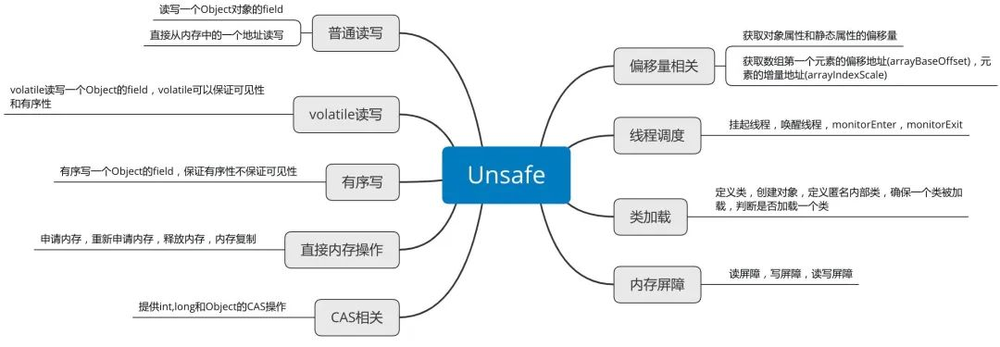

　　我们在阅读JAVA并发编程中JUC包下的类源码的时候，经常看见Unsafe类，但是有一个疑惑，为什么处理并发安全的类，要起名为“不安全”呢？后来对于Unsafe深入理解之后，才知道作者的原意，这里说的不安全并不是针对于并发操作，而是指：该类对于普通程序员来说是“危险”的，一般开发者不应该也不会用到此类。因为Unsafe类功能过于强大，提供了一些可以绕开JVM的更底层的功能。它让JAVA拥有了想C语言的指针一样操作内存空间的能力，能够提升效率，但是也带来了指针的复杂性等问题，所以官方并不建议使用，并且没提供文档支持，甚至计划在高版本去除该类。

## 1 Unsafe构造及获取

　　Unsafe类使用final修饰，不允许继承，且构造函数是private，使用了饿汉式单例，通过一个静态方法getUnsafe()来获取实例。

## 2 Unsage功能概述

内存管理

　　Unsafe的内存管理功能主要包括：普通读写、volatile读写、有序写入、直接操作内存等分配内存与释放内存的功能。

　　3.1.1、普通读写

　　　　Unsafe可以读写一个类的属性，即便这个属性是私有的，也可以对这个属性进行读写。

 

 

 　　　　getInt等用于从对象的指定偏移地址处读取一个值。putInt等用于在对象指定偏移地址处写入一个值。其他原始类型也提供有对应的方法。

　　　　此外，Unsafe的getByte、putByte方法提供了直接在一个地址上进行读写的功能。

　　3.1.2、volatile读写

　　　　普通的读写无法保证可见性和有序性，而volatile读写就可以保证可见性和有序性；但是相对普通读写要更加昂贵。

　　3.1.3、有序写入

　　　　有序写入只保证写入的有序性，不保证可见性，就是说一个线程的写入不保证其他线程立马可见。

　　　　而与volatile写入相比putOrderedXX写入代价相对较低，putOrderedXX写入不保证可见性，但是保证有序性，所谓有序性，就是保证指令不会重排序。

　　3.1.4、直接操作内存

　　　　Unsafe提供了直接操作内存的能力：

 

　　　　也提供了一些获取内存信息的方法：getAddress、addressSize、pageSize

　　　　值得注意的是：利用copyMemory方法可以实现一个通用的对象拷贝方法，无需再对每一个对象都实现clone方法，但只能做到对象浅拷贝。

CAS

　　Unsafe类的CAS操作为Java的锁机制提供了一种新的解决办法，比如AtomicInteger等类都是通过该方法来实现的。compareAndSwap*方法是原子的，可以避免繁重的锁机制，提高代码效率。

　　

 　　CAS一般用于乐观锁，它在Java中有广泛的应用，ReentrantLock、ConcurrentHashMap，ConcurrentLinkedQueue等都有用到CAS来实现乐观锁。

3.3、偏移量

　　Unsafe提供以下方法获取对象的指针，通过对指针进行偏移，不仅可以直接修改指针指向的数据（即使它们是私有的），甚至可以找到JVM已经认定为垃圾、可以进行回收的对象。

// 获取静态属性Field在对象中的偏移量，读写静态属性时必须获取其偏移量
public native long staticFieldOffset(Field var1);
// 获取非静态属性Field在对象实例中的偏移量，读写对象的非静态属性时会用到这个偏移量
public native long objectFieldOffset(Field var1);
// 返回Field所在的对象
public native Object staticFieldBase(Field var1);
// 返回数组中第一个元素实际地址相对整个数组对象的地址的偏移量
public native int arrayBaseOffset(Class<?> var1);
// 计算数组中第一个元素所占用的内存空间
public native int arrayIndexScale(Class<?> var1);

3.4、线程调度

// 唤醒线程
public native void unpark(Object var1);

// 挂起线程
public native void park(boolean var1, long var2);

// 用于加锁，已废弃
public native void monitorEnter(Object var1);

// 用于加锁，已废弃
public native void monitorExit(Object var1);

// 用于加锁，已废弃
public native boolean tryMonitorEnter(Object var1);

　　通过park方法将线程进行挂起， 线程将一直阻塞到超时或中断条件出现。unpark方法可以终止一个挂起的线程，使其恢复正常。

　　整个并发框架中对线程的挂起操作被封装在LockSupport类中，LockSupport类中有各种版本park方法，但最终都调用了Unsafe.park()方法。

3.5、类加载

// 方法定义一个类，用于动态地创建类
public native Class<?> defineClass(String var1, byte[] var2, int var3, int var4, ClassLoader var5, ProtectionDomain var6);

//  动态的创建一个匿名内部类
public native Class<?> defineAnonymousClass(Class<?> var1, byte[] var2, Object[] var3);

// 判断是否需要初始化一个类
public native boolean shouldBeInitialized(Class<?> var1);

// 保证已经初始化过一个类
public native void ensureClassInitialized(Class<?> var1);

 3.6、内存屏障

// 保证在这个屏障之前的所有读操作都已经完成
public native void loadFence();

// 保证在这个屏障之前的所有写操作都已经完成
public native void storeFence();

// 保证在这个屏障之前的所有读写操作都已经完成
public native void fullFence();

 3.7、非常规对象实例化

　　通常，我们通过new或反射来实例化对象，而Unsafe类提供的allocateInstance方法，可以直接生成对象实例，且无需调用构造方法和其他初始化方法；这在对象反序列化的时候会很有用，能够重建和设置final字段，而不需要调用构造方法。

3.8、数组操作

　　arrayBaseOffset（获取数组第一个元素的偏移地址）与arrayIndexScale（获取数组中元素的增量地址）配合起来使用，就可以定位数组中每个元素在内存中的位置。

　　由于Java的数组最大值为Integer.MAX_VALUE，使用Unsafe类的内存分配方法可以实现超大数组。实际上这样的数据就可以认为是C数组，因此需要注意在合适的时间释放内存。

3.9、其他

　　当然，Unsafe类中还提供了大量其他的方法，比如上面提到的CAS操作，以AtomicInteger为例，当我们调用getAndIncrement、getAndDecrement等方法时，本质上调用的就是Unsafe的getAndAddInt方法。

　　如下为两个系统相关的方法：

　　// 返回系统指针的大小。返回值为4（32位系统）或 8（64位系统）。

　　public native int addressSize();

　　// 内存页的大小，此值为2的幂次方。

　　public native int pageSize();

3.10、结语

　　在实践的过程中，如果阅读其他框架或类库实现，当发现用到Unsafe类，可对照该类的整体功能，结合应用场景进行分析，即可大概了解其功能。