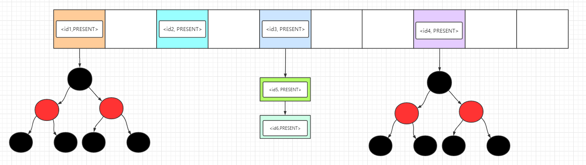

## 0 Set 接口

### Set接口
`Set`接口继承了`Collection`接口，是一个不包括重复元素的集合，更确切地说，Set 中任意两个元素不会出现 `o1.equals(o2)`，而且 Set **至多**只能存储一个 `NULL` 值元素，Set 集合的组成部分可以用下面这张图概括：


在 Set 集合体系中，我们需要着重关注两点：

- 存入**可变元素**时，必须非常小心，因为任意时候元素状态的改变都有可能使得 Set 内部出现两个**相等**的元素，即 `o1.equals(o2) = true`，所以一般不要更改存入 Set 中的元素，否则将会破坏了 `equals()` 的作用！

- Set 的最大作用就是判重，在项目中最大的作用也是**判重**！

接下来我们去看它的实现类和子类： `AbstractSet` 和 `SortedSet`

### AbstractSet 抽象类

`AbstractSet` 是一个实现 Set 的一个抽象类，定义在这里可以将所有具体 Set 集合的**相同行为**在这里实现，**避免子类包含大量的重复代码**

所有的 Set 也应该要有相同的 `hashCode()` 和 `equals()` 方法，所以使用抽象类把该方法重写后，子类无需关心这两个方法。

```Java
public abstract class AbstractSet<E> implements Set<E> {
    // 判断两个 set 是否相等
    public boolean equals(Object o) {
        if (o == this) { // 集合本身
            return true;
        } else if (!(o instanceof Set)) { // 集合不是 set
            return false;
        } else {
            // 比较两个集合的元素是否全部相同
        }
    }
    // 计算所有元素的 hashcode 总和
    public int hashCode() { 
        int h = 0;
        Iterator i = this.iterator();
        while(i.hasNext()) {
            E obj = i.next();
            if (obj != null) {
                h += obj.hashCode();
            }
        }
        return h;
    }
}
```

### SortedSet 接口

`SortedSet` 是一个接口，它在 Set 的基础上扩展了**排序**的行为，所以所有实现它的子类都会拥有排序功能。

```Java
public interface SortedSet<E> extends Set<E> {
    // 元素的比较器,决定元素的排列顺序
    Comparator<? super E> comparator(); 
    // 获取 [var1, var2] 之间的 set
    SortedSet<E> subSet(E var1, E var2); 
    // 获取以 var1 开头的 Set
    SortedSet<E> headSet(E var1); 
    // 获取以 var1 结尾的 Set
    SortedSet<E> tailSet(E var1); 
    // 获取首个元素
    E first(); 
    // 获取最后一个元素
    E last();
}
```

## 1 HashSet

### 底层实现

HashSet 底层借助 `HashMap` 实现，我们可以观察它的多个构造方法，本质上都是 new 一个 HashMap


```Java
public class HashSet<E> extends AbstractSet<E> implements Set<E>, Cloneable, Serializable {
    public HashSet() {
        this.map = new HashMap();
    }
    public HashSet(int initialCapacity, float loadFactor) {
        this.map = new HashMap(initialCapacity, loadFactor);
    }
    public HashSet(int initialCapacity) {
        this.map = new HashMap(initialCapacity);
    }
}
```

我们可以观察 `add()` 方法和`remove()`方法是如何将 HashSet 的操作嫁接到 HashMap 的。

```Java
private static final Object PRESENT = new Object();

public boolean add(E e) {
    return this.map.put(e, PRESENT) == null;
}
public boolean remove(Object o) {
        return this.map.remove(o) == PRESENT;
}
```

我们看到 `PRESENT` 就是一个**静态常量**：使用 PRESENT 作为 HashMap 的 value 值，使用HashSet的开发者只需**关注**于需要插入的 `key`，**屏蔽**了 HashMap 的 `value`



上图可以观察到每个`Entry`的`value`都是 PRESENT 空对象，我们就不用再理会它了。

HashSet 在 HashMap 基础上实现，所以很多地方可以联系到 HashMap：

- 底层数据结构：HashSet 也是采用`数组 + 链表 + 红黑树`实现
- 线程安全性：由于采用 HashMap 实现，而 HashMap 本身线程不安全，在HashSet 中没有添加额外的同步策略，所以 HashSet 也**线程不安全**
- 存入 HashSet 的对象的状态**最好不要发生变化**，因为有可能改变状态后，在集合内部出现两个元素`o1.equals(o2)`，破坏了 `equals()`的语义。


### 继承结构

* 实现了Set接口。
* HashSet中不允许重复的值。
* HashSet中允许一个NULL元素。
* 无序集合，并且不保证集合的迭代顺序。
* 为基本操作（添加，删除，包含和调整大小）提供恒定的时间性能。
* HashSet不同步。 如果多个线程同时访问哈希集，并且至少有一个线程修改了哈希集，则必须在外部对其进行同步。使用Collections.synchronizedSet(new HashSet())方法获取同步的哈希集。


### 基本使用

* 默认初始容量为16 。 我们可以通过在构造函数HashSet(int initialCapacity)传递默认容量来覆盖此默认容量。


```java
public boolean add（E e） ：如果指定的元素不存在，则将其添加到Set中。 此方法在内部使用equals()方法检查重复项。 如果元素重复，则元素被拒绝，并且不替换值。
public void clear() ：从哈希集中删除所有元素。
public boolean contains（Object o） ：如果哈希集包含指定的元素othrweise false ，则返回false 。
public boolean isEmpty() ：如果哈希集不包含任何元素，则返回true ，否则返回false 。
public int size() ：返回哈希集中的元素数量。
public Iterator<E> iterator() ：返回对此哈希集中的元素的迭代器。 从迭代器返回的元素没有特定的顺序。
public boolean remove（Object o） ：从哈希集中删除指定的元素（如果存在）并返回true ，否则返回false 。
public boolean removeAll（Collection <？> c） ：删除哈希集中属于指定集合的​​所有元素。
public Object clone() ：返回哈希集的浅表副本。
public Spliterator<E> spliterator() ：在此哈希集中的元素上创建后绑定和故障快速的Spliterator。
```

## 2 LinkedHashSet

### 底层原理
LinkedHashSet 的代码少的可怜，不信我给你我粘出来


少归少，还是不能闹，`LinkedHashSet`继承了`HashSet`，我们跟随到父类 HashSet 的构造方法看看

```java
HashSet(int initialCapacity, float loadFactor, boolean dummy) {
    this.map = new LinkedHashMap(initialCapacity, loadFactor);
}
```

发现父类中 map 的实现采用`LinkedHashMap`，这里注意不是`HashMap`，而 LinkedHashMap 底层又采用 HashMap + 双向链表 实现的，所以本质上 LinkedHashSet 还是使用 HashMap 实现的。

> LinkedHashSet -> LinkedHashMap -> HashMap + 双向链表


而 LinkedHashMap 是采用 `HashMap`和`双向链表`实现的，这条双向链表中保存了元素的插入顺序。所以 LinkedHashSet 可以按照元素的插入顺序遍历元素，如果你熟悉`LinkedHashMap`，那 LinkedHashSet 也就更不在话下了。

关于 LinkedHashSet 需要注意几个地方：

- 它继承了 `HashSet`，而 HashSet 默认是采用 HashMap 存储数据的，但是 LinkedHashSet 调用父类构造方法初始化 map 时是 LinkedHashMap 而不是 HashMap，这个要额外注意一下
- 由于 LinkedHashMap 不是线程安全的，且在 LinkedHashSet 中没有添加额外的同步策略，所以 LinkedHashSet 集合**也不是线程安全**的

### 继承关系


* 它扩展了HashSet类，后者扩展了AbstractSet类。
* 它实现Set接口。
* LinkedHashSet中不允许重复的值 。
* LinkedHashSet中允许一个NULL元素。
* 它是一个ordered collection ，它是元素插入到集合中insertion-order （ insertion-order ）。
* 像HashSet一样，此类为基本操作（添加，删除，包含和调整大小）提供constant time performance 。
* LinkedHashSet not synchronized 。 如果多个线程同时访问哈希集，并且至少有一个线程修改了哈希集，则必须在外部对其进行同步。
* 使用Collections.synchronizedSet(new LinkedHashSet())方法来获取同步的LinkedHashSet。


### 使用方法

```java
public boolean add（E e） ：如果指定的元素不存在，则将其添加到Set中。 此方法在内部使用equals()方法检查重复项。 如果元素重复，则元素被拒绝，并且不替换值。
public void clear() ：从LinkedHashSet中删除所有元素。
public boolean contains（Object o） ：如果LinkedHashSet包含指定的元素othrweise false ，则返回false 。
public boolean isEmpty() ：如果LinkedHashSet不包含任何元素，则返回true ，否则返回false 。
public int size() ：返回LinkedHashSet中的元素数。
public Iterator<E> iterator() ：返回对此LinkedHashSet中的元素的迭代器。 从迭代器返回的元素没有特定的顺序。
public boolean remove（Object o） ：从LinkedHashSet中移除指定的元素（如果存在）并返回true ，否则返回false 。
public boolean removeAll（Collection <？> c） ：删除LinkedHashSet中属于指定集合的​​所有元素。
public Object clone() ：返回LinkedHashSet的浅表副本。
public Spliterator<E> spliterator() ：在此LinkedHashSet中的元素上创建后绑定和故障快速的Spliterator。 它具有以下初始化属性Spliterator.DISTINCT ， Spliterator.ORDERED 。
```
## 3 TreeSet

### 底层原理
TreeSet 是基于 TreeMap 的实现，所以存储的元素是**有序**的，底层的数据结构是`数组 + 红黑树`。


而元素的排列顺序有`2`种，和 TreeMap 相同：自然排序和定制排序，常用的构造方法已经在下面展示出来了，TreeSet 默认按照自然排序，如果需要定制排序，需要传入`Comparator`。

```Java
public TreeSet() { 
    this(new TreeMap<E,Object>());
}
public TreeSet(Comparator<? super E> comparator) {
    this(new TreeMap<>(comparator));
}
```

TreeSet 应用场景有很多，像在游戏里的玩家战斗力排行榜

```Java
public class Player implements Comparable<Integer> {
    public String name;
    public int score;
    @Override
    public int compareTo(Student o) {
        return Integer.compareTo(this.score, o.score);
    }
}
public static void main(String[] args) {
    Player s1 = new Player("张三", 100);
    Player s2 = new Player("李四", 90);
    Player s3 = new Player("王五", 80);
    TreeSet<Player> set = new TreeSet();
    set.add(s2); set.add(s1); set.add(s3);
    System.out.println(set);
}
// [Student{name='王五', score=80}, Student{name='李四', score=90}, Student{name='张三', score=100}]
```

对 TreeSet 介绍了它的主要实现方式和应用场景，有几个值得注意的点。

- TreeSet 的所有操作都会转换为对 TreeMap 的操作，TreeMap 采用**红黑树**实现，任意操作的平均时间复杂度为 `O(logN)`
- TreeSet 是一个**线程不安全**的集合
- TreeSet 常应用于对**不重复**的元素**定制排序**，例如玩家战力排行榜

> 注意:TreeSet判断元素是否重复的方法是判断compareTo()方法是否返回0，而不是调用 hashcode() 和 equals() 方法，如果返回 0 则认为集合内已经存在相同的元素，不会再加入到集合当中。

### 继承关系


* 它扩展了AbstractSet类，该类扩展了AbstractCollection类。
* 它实现了NavigableSet接口，该接口扩展了SortedSet接口。
* TreeSet中不允许重复的值。
* 在TreeSet中不允许NULL。
* 它是一个ordered collection ，按排序顺序存储元素。
* 与HashSet一样，此类为基本操作（添加，删除，包含和调整大小）提供恒定的时间性能。
* TreeSet不允许插入异构对象，因为它必须比较对象以确定排序顺序。
* TreeSet不synchronized 。 如果多个线程同时访问哈希集，并且至少有一个线程修改了哈希集，则必须在外部对其进行同步。
* 使用Collections.synchronizedSortedSet(new TreeSet())方法获取同步的TreeSet。


### 使用方法
```java
boolean add(E e) ：将指定的元素添加到Set中（如果尚不存在）。
Comparator comparator() ：返回用于对该集合中的元素进行排序的Comparator comparator()如果此集合使用其元素的自然排序，则返回null。
Object first() ：返回当前在此集合中的第一个（最低）元素。
Object last() ：返回当前在此集合中的最后一个（最大）元素。
void clear() ：从TreeSet中删除所有元素。
boolean contains(Object o) ：如果TreeSet包含指定的元素，则返回true否则返回false 。
boolean isEmpty() ：如果TreeSet不包含任何元素，则返回true ，否则返回false 。
int size() ：返回TreeSet中的元素数。
Iterator<E> iterator() ：以ascending order返回此集合中元素的迭代器。
Iterator<E> descendingIterator() ：以Iterator<E> descendingIterator()返回此集合中元素的迭代器。
NavigableSet<E> descendingSet() ：返回此集合中包含的元素的逆序视图。
boolean remove(Object o) ：从TreeSet中移除指定的元素（如果存在）并返回true ，否则返回false 。
Object clone() ：返回TreeSet的浅表副本。
Spliterator<E> spliterator() ：在此TreeSet中的元素上创建后绑定和故障快速的Spliterator。 它与树集提供的顺序相同。
```


## 4 CopyOnWriteArraySet

### 底层原理
HashSet的thread-safe变体，它对所有操作都使用基础CopyOnWriteArrayList 

与CopyOnWriteArrayList相似，它的immutable snapshot样式iterator方法在创建iterator使用对数组状态（在后备列表内）的引用。 这在遍历操作远远超过集合更新操作且我们不想同步遍历并且在更新集合时仍希望线程安全的用例中很有用。

* 作为正常设置的数据结构，它不允许重复。
* CopyOnWriteArraySet类实现Serializable接口并扩展AbstractSet类。
* 使用CopyOnWriteArraySet进行更新操作成本很高，因为每个突变都会创建基础数组的克隆副本并向其添加/更新元素。
* 它是HashSet的线程安全版本。 每个访问该集合的线程在初始化此集合的迭代器时都会看到自己创建的后备阵列快照版本。
* 因为它在创建迭代器时获取基础数组的快照，所以它不会抛出ConcurrentModificationException 。不支持迭代器上的变异操作。 这些方法抛出UnsupportedOperationException 。
* CopyOnWriteArraySet是synchronized Set的并发替代，当迭代的次数超过突变次数时，CopyOnWriteArraySet提供更好的并发性。
* 它允许重复的元素和异构对象（使用泛型来获取编译时错误）。
* 由于每次创建迭代器时都会创建基础数组的新副本，因此performance is slower HashSet 

### 主要方法

```java
CopyOnWriteArraySet() ：创建一个空集。
CopyOnWriteArraySet(Collection c) ：创建一个包含指定集合元素的集合，其顺序由集合的迭代器返回。
boolean add(object o) ：将指定的元素添加到此集合（如果尚不存在）。
boolean addAll(collection c) ：将指定集合中的所有元素（如果尚不存在boolean addAll(collection c)添加到此集合中。
void clear() ：从此集合中删除所有元素。
boolean contains(Object o) ：如果此集合包含指定的元素，则返回true。
boolean isEmpty() ：如果此集合不包含任何元素，则返回true。
Iterator iterator() ：以添加这些元素的顺序在此集合中包含的元素上返回一个迭代器。
boolean remove(Object o) ：从指定的集合中删除指定的元素（如果存在）。
int size() ：返回此集合中的元素数
```


### 实例

```java
CopyOnWriteArraySet<Integer> set = new CopyOnWriteArraySet<>(Arrays.asList(1,2,3));
 
System.out.println(set);    //[1, 2, 3]
 
//Get iterator 1
Iterator<Integer> itr1 = set.iterator();
 
//Add one element and verify set is updated
set.add(4);
System.out.println(set);    //[1, 2, 3, 4]
 
//Get iterator 2
Iterator<Integer> itr2 = set.iterator();
 
System.out.println("====Verify Iterator 1 content====");
 
itr1.forEachRemaining(System.out :: println);   //1,2,3
 
System.out.println("====Verify Iterator 2 content====");
 
itr2.forEachRemaining(System.out :: println);   //1,2,3,4
```