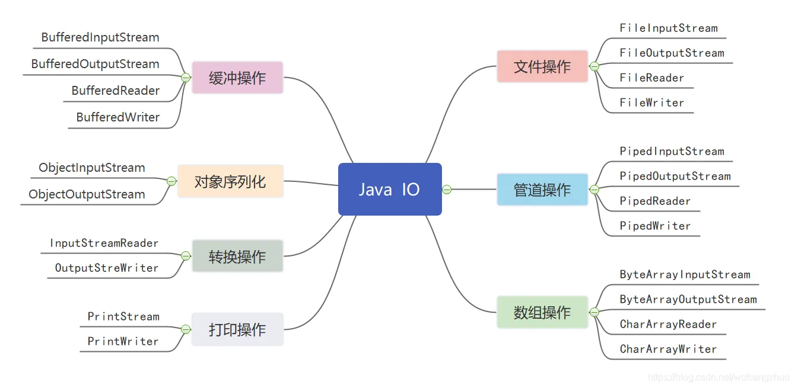
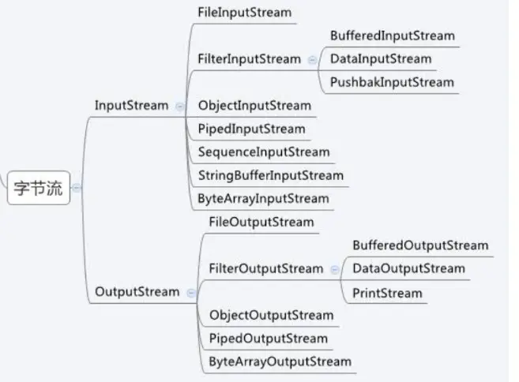

# Java 标准IO
<!-- GFM-TOC -->
- [Java 标准IO](#java-标准io)
  - [1 概览](#1-概览)
    - [IO定义](#io定义)
    - [虚拟内存](#虚拟内存)
    - [IO的分类](#io的分类)
    - [装饰者模式](#装饰者模式)
  - [2 字节操作](#2-字节操作)
    - [InputStream](#inputstream)
    - [OutputStream](#outputstream)
  - [3 字符操作](#3-字符操作)
    - [编码与解码](#编码与解码)
    - [String 的编码方式](#string-的编码方式)
    - [字节字符流转换Reader 与 Writer](#字节字符流转换reader-与-writer)
    - [实现逐行输出文本文件的内容](#实现逐行输出文本文件的内容)
    - [Reader](#reader)
    - [Writer](#writer)
  - [参考文献](#参考文献)
<!-- GFM-TOC -->


## 1 概览


本篇文章的范围应该是涵盖java.io包中的所有类。

### IO定义
> 该理解方式非常有价值。为什么IO的同步和异步如此重要？因为IO操作是整个调用链路上的性能瓶颈。普通的A函数调用B函数，为什么不采用异步操作呢，因为函数都是计算任务，都在内存完成。所以所有的操作都可以分为两种：计算操作（非IO操作，内存中即可完成）和IO操作（从其他设备中读取、写入数据）。计算操作是使用CPU的，IO操作过程中CPU线程是挂起的，等待中。函数、调用可以分为两种，正常调用和IO调用。

缓冲区以及如何处理缓冲区是所有I / O的基础。 术语“输入/输出”仅意味着将数据移入和移出缓冲区。 只要时刻牢记这一点即可。 通常，进程通过请求操作系统从缓冲区中清空数据（ write operation ）或向缓冲区中填充数据（ read operation ）来执行I / O。 以上是I / O概念的全部摘要。 


上图显示了块数据如何从外部源（例如硬盘）移动到正在运行的进程（例如RAM）内部的存储区的简化“逻辑”图。 
1. 首先，该进程通过进行read()系统调用来请求填充其缓冲区。 
2. 此调用导致内核向磁盘控制器硬件发出命令以从磁盘获取数据。 磁盘控制器通过DMA将数据直接写入内核内存缓冲区，而无需主CPU的进一步协助。 
3. 磁盘控制器完成缓冲区填充后，当它请求read()操作时。内核将数据从内核空间中的临时缓冲区复制到进程指定的缓冲区中； 
4. 需要注意的一件事是内核尝试缓存和/或预取数据，因此进程请求的数据可能已经在内核空间中可用。 如果是这样，则将过程所请求的数据复制出来。 如果数据不可用，则该过程将在内核将数据带入内存时挂起。

### 虚拟内存 

虚拟内存具有两个重要优点：

1）多个虚拟地址可以引用相同的物理内存位置。
2）虚拟内存空间可以大于可用的实际硬件内存。

对于第一个特性，通过地址映射mmap，将内核空间逻辑地址与用户空间中虚拟地址映射到相同物理空间。DMA硬件（只能访问物理内存地址）可以填充一个缓冲区，该缓冲区同时对内核和用户空间进程可见。消除了内核空间和用户空间之间的副本，


对于第二个特性，进行虚拟内存分页（通常称为交换）。将虚拟内存空间的页面持久保存到外部磁盘存储中，从而在物理内存中为其他虚拟页面腾出空间。物理内存充当页面调度区域的缓存，当虚拟内存的不在物理内存中时，由物理内存从磁盘空间交换。


### IO的分类
Java 的 I/O可以根据如下方式进行分类。




根据内容的不同可以分为：

- 字节操作：InputStream 和 OutputStream
- 字符操作：Reader 和 Writer
- 输入流 InputStream、Reader
- 输出流 OutputStream、Writer
- 字节转字符：InputStreamReader/OutputStreamWriter


根据对象的不同可以分为：

- 文件操作：File
- 管道操作：Piped
- 数组操作：ByteArray&CharArray
- 对象操作：Object
- 过滤操作：Filter添加额外特性
  - Bufferd
  - Data
  - PushBack
  - LineNumber
- 网络操作：Socket


根据IO模型的不同可以分为：
- 同步阻塞IO：BIO
- 异步IO：NIO
- 异步IO：AIO

根据IO的原理可以分为：
* Block IO  块IO
* Stream IO 流IO


### 装饰者模式

Java I/O 使用了装饰者模式来实现。以 InputStream 为例，

- InputStream 是抽象组件；
- FileInputStream 是 InputStream 的子类，属于具体组件，提供了字节流的输入操作；
- FilterInputStream 属于抽象装饰者，装饰者用于装饰组件，为组件提供额外的功能。例如 BufferedInputStream 为 FileInputStream 提供缓存的功能。

<div align="center">  </div><br>

实例化一个具有缓存功能的字节流对象时，只需要在 FileInputStream 对象上再套一层 BufferedInputStream 对象即可。

```java
FileInputStream fileInputStream = new FileInputStream(filePath);
BufferedInputStream bufferedInputStream = new BufferedInputStream(fileInputStream);
```

DataInputStream 装饰者提供了对更多数据类型进行输入的操作，比如 int、double 等基本类型。


## 2 字节操作



### InputStream

* 基本的InputStream
```
int read() 
int read(byte[] b)
int read(byte[] b, int off, int len)
void close()
long skip(long n)
```
* FileInputStream

```java
FileInputStream(File file)
FileInputStream(String name)
```

* PipedInputStream

```java
PipedInputStream(int pipeSize)
PipedInputStream(PipedOutputStream src)
PipedInputStream(PipedOutputStream src, int pipeSize)

connect(PipedOutputStream src)
receive(int b)
```

* ByteArrayInputStream

```java
ByteArrayInputStream(byte[] buf)
ByteArrayInputStream(byte[] buf, int offset, int length)
```

* ObjectInputStream 持久化对象。用ObjectOutputStream写出，就用这个读入

```java
ObjectInputStream(InputStream in)

readBoolean()、Byte、Char、Double、Float、Int、Long
readFully()
readObject()
```
* FilterInputStream->BufferedInputStream

```java

```

### OutputStream

* 基本的OutputStream

```
close()
flush()
write(byte[] b)
write(byte[] b, int off, int len)
write(int b)
```

* FileOutputStream

```java
FileOutputStream(File file)
FileOutputStream(File file, boolean append)
FileOutputStream(String name)
FileOutputStream(String name, boolean append)
```
* PipedOutputStream

```java
PipedOutputStream(PipedInputStream snk)
connect(PipedInputStream snk)
```

* ByteArrayOutputStream，自带一个字节缓冲区

```java
ByteArrayOutputStream(int size)
	size()
```

* ObjectOutputStream

```java
ObjectOutputStream(OutputStream out)


writeBoolean(boolean val)
writeByte(int val)
writeBytes(String str)
writeChar(int val)
writeChars(String str)
writeInt(int val)
writeLong(long val)
writeObject(Object obj)
```

* FilterOutputStream->BufferedOutputStream

* PrintStream一个特殊的包装器类
```java
print(基础类型和对象)
printf(String format, Object... args)
println(基础类型和对象)
```
## 3 字符操作


### 编码与解码

编码就是把字符转换为字节，而解码是把字节重新组合成字符。

如果编码和解码过程使用不同的编码方式那么就出现了乱码。

- GBK 编码中，中文字符占 2 个字节，英文字符占 1 个字节；
- UTF-8 编码中，中文字符占 3 个字节，英文字符占 1 个字节；
- UTF-16 be编码中，中文字符和英文字符都占 2 个字节。

UTF-16be 中的 be 指的是 Big Endian，也就是大端。相应地也有 UTF-16le，le 指的是 Little Endian，也就是小端。

Java 的内存编码使用双字节编码 UTF-16be，这不是指 Java 只支持这一种编码方式，而是说 char 这种类型使用 UTF-16be 进行编码。char 类型占 16 位，也就是两个字节，Java 使用这种双字节编码是为了让一个中文或者一个英文都能使用一个 char 来存储。

### String 的编码方式

String 可以看成一个字符序列，可以指定一个编码方式将它编码为字节序列，也可以指定一个编码方式将一个字节序列解码为 String。

```java
String str1 = "中文";
byte[] bytes = str1.getBytes("UTF-8");
String str2 = new String(bytes, "UTF-8");
System.out.println(str2);
```

在调用无参数 getBytes() 方法时，默认的编码方式不是 UTF-16be。双字节编码的好处是可以使用一个 char 存储中文和英文，而将 String 转为 bytes[] 字节数组就不再需要这个好处，因此也就不再需要双字节编码。getBytes() 的默认编码方式与平台有关，一般为 UTF-8。

```java
byte[] bytes = str1.getBytes();
```

### 字节字符流转换Reader 与 Writer

不管是磁盘还是网络传输，最小的存储单元都是字节，而不是字符。但是在程序中操作的通常是字符形式的数据，因此需要提供对字符进行操作的方法。

- InputStreamReader 实现从字节流解码成字符流；

```java
InputStreamReader(InputStream in)
InputStreamReader(InputStream in, Charset cs)
InputStreamReader(InputStream in, CharsetDecoder dec)
InputStreamReader(InputStream in, String charsetName)
getEncoding()
```
- OutputStreamWriter 实现字符流编码成为字节流。

```java
OutputStreamWriter(OutputStream out)
OutputStreamWriter(OutputStream out, Charset cs)
OutputStreamWriter(OutputStream out, CharsetEncoder enc)
OutputStreamWriter(OutputStream out, String charsetName)

getEncoding()
```

### 实现逐行输出文本文件的内容

```java
public static void readFileContent(String filePath) throws IOException {

    FileReader fileReader = new FileReader(filePath);
    BufferedReader bufferedReader = new BufferedReader(fileReader);

    String line;
    while ((line = bufferedReader.readLine()) != null) {
        System.out.println(line);
    }

    // 装饰者模式使得 BufferedReader 组合了一个 Reader 对象
    // 在调用 BufferedReader 的 close() 方法时会去调用 Reader 的 close() 方法
    // 因此只要一个 close() 调用即可
    bufferedReader.close();
}
```

### Reader

* 基本的Reader

```java
close()
read()
read(char[] cbuf)
read(char[] cbuf, int off, int len)
read(CharBuffer target)
ready()
skip(long n)
```
* FileReader
```java
FileReader(File file)
FileReader(String fileName)
```

* PipedReader
```java
PipedReader(int pipeSize)
PipedReader(PipedWriter src)
PipedReader(PipedWriter src, int pipeSize)

connect(PipedWriter src)
```
* CharArrayReader
```
CharArrayReader(char[] buf)
CharArrayReader(char[] buf, int offset, int length)
```
* BufferedReader
```
String	readLine()
Stream<String>	lines()
```

### Writer

* 基本的Writer
```java
append(char c)
Writer	append(CharSequence csq)
Writer	append(CharSequence csq, int start, int end)

close()
flush()
write(char[] cbuf)
write(char[] cbuf, int off, int len)
write(int c)
write(String str)
write(String str, int off, int len)
```
* FileWriter

```java
OutputStreamWriter(OutputStream out)
OutputStreamWriter(OutputStream out, Charset cs)
OutputStreamWriter(OutputStream out, CharsetEncoder enc)
OutputStreamWriter(OutputStream out, String charsetName)
getEncoding()
```
* PipedWriter
```java
PipedWriter(PipedReader snk)
connect(PipedReader snk)
```
* CharArrayWriter
```java
size()
char[]	toCharArray()
String	toString(）
```
* BufferedWriter
```
BufferedWriter(Writer out)
BufferedWriter(Writer out, int sz)
newLine()
```

* PrintWriter一个特殊的装饰器类，在write的基础上添加了许多print函数
```java
print(基础类型和对象)
printf(String format, Object... args)
println(基础类型和对象)
```
## 参考文献
- Eckel B, 埃克尔, 昊鹏, 等. Java 编程思想 [M]. 机械工业出版社, 2002.
- [IBM: NIO 入门](https://www.ibm.com/developerworks/cn/education/java/j-nio/j-nio.html)
- [Java NIO Tutorial](http://tutorials.jenkov.com/java-nio/index.html)
- [Java NIO 浅析](https://tech.meituan.com/nio.html)
- [IBM: 深入分析 Java I/O 的工作机制](https://www.ibm.com/developerworks/cn/java/j-lo-javaio/index.html)
- [IBM: 深入分析 Java 中的中文编码问题](https://www.ibm.com/developerworks/cn/java/j-lo-chinesecoding/index.html)
- [IBM: Java 序列化的高级认识](https://www.ibm.com/developerworks/cn/java/j-lo-serial/index.html)
- [NIO 与传统 IO 的区别](http://blog.csdn.net/shimiso/article/details/24990499)
- [Decorator Design Pattern](http://stg-tud.github.io/sedc/Lecture/ws13-14/5.3-Decorator.html#mode=document)
- [Socket Multicast](http://labojava.blogspot.com/2012/12/socket-multicast.html)
