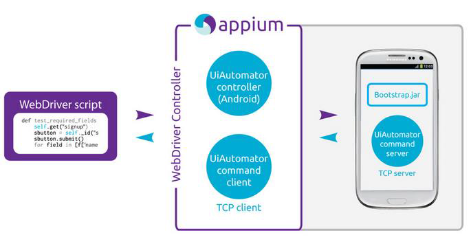

使用appium的原理及过程说明:

运行测试脚本的电脑，我们称为Client。

打开Appium，就开启了Appium Server，默认监听4723端口。

Appium
Server接收到Client命令（测试脚本），翻译成测试机器可以理解的语言，然后发送给测试机器运行。

测试机器运行结束后，再把测试结果返回给Appium Server，之后Appium
Server再把测试结果返回给Client。

1.appium是c/s模式的

2.appium是基于webdriver协议添加对移动设备自动化api扩展而成的，所以具有和webdriver一样的特性，比如多语言支持

3.webdriver是基于http协议的，第一连接会建立一个session会话，并通过post发送一个json告知服务端相关测试信息

4.对于android来说，4.2以后是基于uiautomator框架实现查找注入事件的，4.2以前则是instrumentation框架的，并封装成一个叫Selendroid这玩意提供服务

5.客户端只需要发送http请求实现通讯，意味着客户端就是多语言支持的

6.appium服务端是node.js写的，所以你安装的时候无论哪个平台都是先装node
