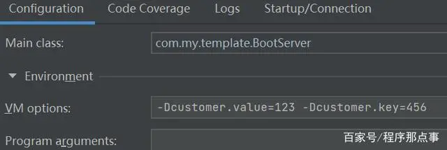

## 概述

### 三种变量


* VM options是JVM变量
* Programp arguments是程序变量
* Environment variables是环境变量

## JVM变量

### 是什么
* 所谓的JVM变量和平时见到的不太一样，比如-Xmx1024m这样的，这里说的JVM变量更确切的说是java命令中的一个选项，我们前边在idea中进行配置的时候，使用的也是“-D”这个选项，在服务启动的时候会设置一个key-value的属性。并且从上面的注释也可以看到对“-D”的解释是“设置系统属性”

### 怎么用

* 需要注意一点这里的配置除了JVM已经定义好的，其他的自定义配置请使用前面说到的“-D”的形式，多个配置使用空格隔开


* JVM启动参数


* 获取JVM变量System.getProperty()
* 也可以设置JVM变量System.setProperty("myproperty", "foo");
```java
@SpringBootApplication
public class BootServer {    
    public static void main(String[] args) {        
        //获取vm参数        
        String value=System.getProperty("customer.value");        
        String key=System.getProperty("customer.key");        
        System.out.println("value:"+value+",key:"+key);        
        SpringApplication.run(BootServer.class);    
    }       
}
```

## 环境变量

### 是什么
* 所谓系统环境变量，更多的理解为某个服务的全局的环境变量，供这个服务中的所有组件来使用，


### 怎样做

* 环境变量的配置，在idea中是下面这样的配置


* 获取环境变量。System.getenv()
```java
@SpringBootApplication
public class BootServer {    
    public static void main(String[] args) {        
        //获取vm参数        
        String value=System.getProperty("customer.value");        
        String key=System.getProperty("customer.key");        
        System.out.println("value:"+value+",key:"+key);        
        //获取环境变量        
        String templateValue=System.getenv("template");        
        System.out.println("环境变量:"+templateValue);        
        SpringApplication.run(BootServer.class);    
    }
}

```
## 程序变量
### 是什么
* 所谓程序变量指的是main方法中的参数


### 怎样做

* 在idea中“Program arguments”中配置程序变量，多个值使用“空格”分隔即可


* 启动参数


* 使用args[0]
```java
@SpringBootApplication
public class BootServer {    
    public static void main(String[] args) {        
        //获取vm参数        
        String value=System.getProperty("customer.value");        
        String key=System.getProperty("customer.key");        
        System.out.println("value:"+value+",key:"+key);        
        //获取环境变量        
        String templateValue=System.getenv("template");        
        System.out.println("环境变量:"+templateValue);        
        //获取程序变量        
        System.out.println(args[0]+","+args[1]+","+args[2]);        
        SpringApplication.run(BootServer.class);    
    }
}
```
