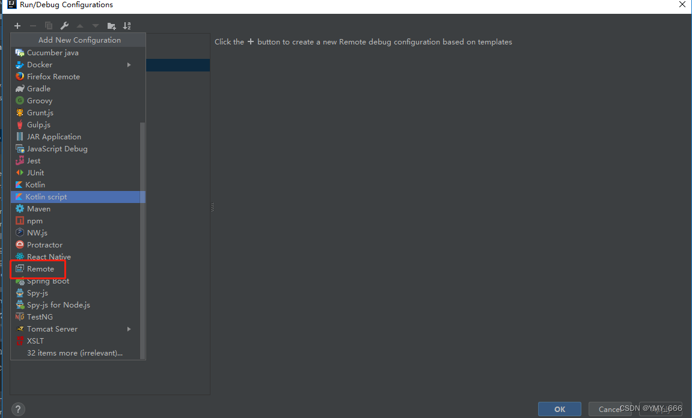
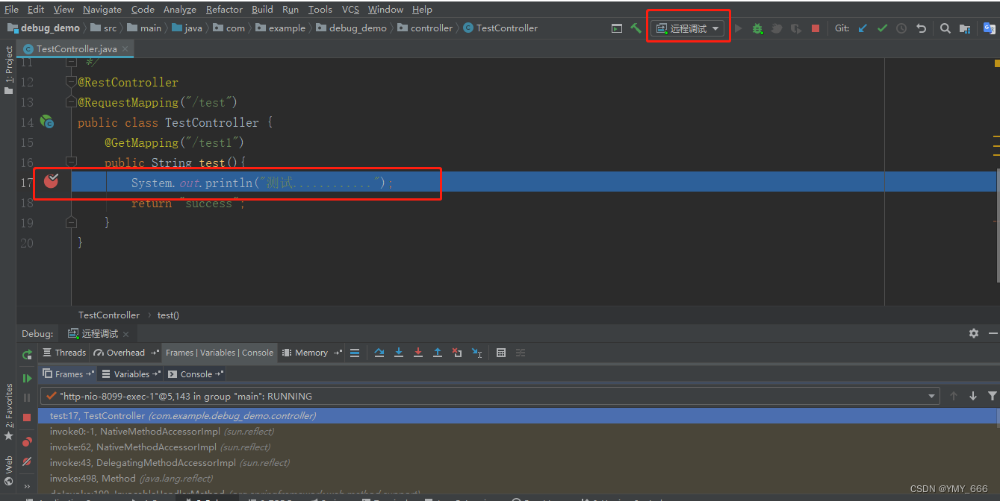

## 1 server端

### 启动命令
> 打jar包允许被远程调试
```
java -agentlib:jdwp=transport=dt_socket,server=y,suspend=n,address=9091 -jar xxx.jar

```

### 参数说明

1. transport： 指定运行的被调试应用和调试者之间的通信协议，它由几个可选值： dt_socket：主要的方式，采用socket方式连接。 dt_shmem：采用共享内存方式连接，仅支持 Windows 平台。
2. server： 指定当前应用作为调试服务端还是客户端，默认为n。 如果你想将当前应用作为被调试应用，设置该值为 y,如果你想将当前应用作为客户端，作为调试的发起者，设置该值为n。
3. suspend： 当前应用启动后，是否阻塞应用直到被连接，默认值为 y。 在大部分的应用场景，这个值为 n，即不需要应用阻塞等待连接。一个可能为 y的应用场景是，你的程序在启动时出现了一个故障，为了调试，必须等到调试方连接上来后程序再启动。
4. address： 暴露的调试连接端口，默认值为 8000。 此端口一定不能与项目端口重复，且必须是服务器开放的端口。
5. onthrow： 当程序抛出设定异常时，中断调试。
6. onuncaught： 当程序抛出未捕获异常时，是否中断调试，默认值为 n。
7. launch： 当调试中断时，执行的程序。
8. timeout： 该参数限定为java -agentlib:jdwp=…可用，单位为毫秒ms。 当 suspend = y 时，该值表示等待连接的超时；当 suspend = n 时，该值表示连接后的使用超时。

### 参考命令
```
-agentlib:jdwp=transport=dt_socket,server=y,address=8000：以 Socket 方式监听 8000 端口，程序启动阻塞（suspend 的默认值为 y）直到被连接。
-agentlib:jdwp=transport=dt_socket,server=y,address=localhost:8000,timeout=5000：以
Socket 方式监听 8000 端口，当程序启动后 5 秒无调试者连接的话终止，程序启动阻塞（suspend 的默认值为
y）直到被连接。
-agentlib:jdwp=transport=dt_shmem,server=y,suspend=n：选择可用的共享内存连接地址并使用
stdout 打印，程序启动不阻塞。
-agentlib:jdwp=transport=dt_socket,address=myhost:8000：以 socket 方式连接到 myhost:8000上的调试程序，在连接成功前启动阻塞。
agentlib:jdwp=transport=dt_socket,server=y,address=8000,onthrow=java.io.IOException,launch=/usr/local/bin/debugstub：以
Socket 方式监听 8000 端口，程序启动阻塞（suspend 的默认值为 y）直到被连接。当抛出 IOException
时中断调试，转而执行 usr/local/bin/debugstub程序。
```

### 直接运行Java程序允许远程调试
命令 
```
-Xdebug -Xrunjdwp:transport=dt_socket,address=8088,server=y,suspend=n
```
具体参数详解：

1. -Xdebug 通知JVM工作在DEBUG模式下；
2. -Xrunjdwp 通知JVM使用(Java debug wire protocol)运行调试环境。该参数同时包含了一系列的调试选项；
3. **transport**指定了调试数据的传送方式，dt_socket是指用SOCKET模式，另有dt_shmem指用共享内存方式，其中，dt_shmem只适用于Windows平台；
4. address 调试服务器的端口号，客户端用来连接服务器的端口号；
5. server=y/n VM 是否需要作为调试服务器执行；
6. suspend=y/n 是否在调试客户端建立连接之后启动 VM；

## IDEA本地

1. 在 IDEA 中，点击 Edit Configurations，在弹框中点击 + 号，然后选择Remote。


2. 填写服务器的地址及端口，点击 OK 即可。


3. 配置完毕后，DEBUG 调试运行即可。


4. 配置完毕后点击保存即可，因为我配置的 suspend=n，因此服务端程序无需阻塞等待我们的连接。我们点击 IDEA 调试按钮，当我访问某一接口时，能够正常调试。



