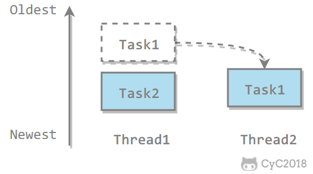

## 1 Executor概述

### 概述
Executor framework框架由三个主要接口（以及许多子接口）组成，即Executor ， ExecutorService和ThreadPoolExecutor 。
* 该框架主要将任务创建和执行分开。 任务创建主要是样板代码，并且很容易替换。
* 对于执行者，我们必须创建实现Runnable或Callable接口的任务，并将其发送给执行者。
* 执行程序在内部维护一个（可配置的）线程池，以通过避免连续产生线程来提高应用程序性能。
* 执行程序负责执行任务，并使用池中的必要线程运行它们。


### 分类

Executor 管理多个异步任务的执行，而无需程序员显式地管理线程的生命周期。这里的异步是指多个任务的执行互不干扰，不需要进行同步操作。

- CachedThreadPool：缓存线程池执行程序 –创建一个线程池，该线程池可根据需要创建新线程，但在可用时将重用以前构造的线程。 如果任务长时间运行，请勿使用此线程池。 如果线程数超出系统可以处理的范围，则可能导致系统崩溃。
- FixedThreadPool：固定线程池执行程序 –创建一个线程池，该线程池可重用固定数量的线程来执行任意数量的任务。 如果在所有线程都处于活动状态时提交了其他任务，则它们将在队列中等待，直到某个线程可用为止。 最适合现实生活中的大多数用例。
- SingleThreadExecutor：相当于大小为 1 的 FixedThreadPool，单线程池执行程序 –创建单线程以执行所有任务。 当您只有一个任务要执行时，请使用它。
- ScheduledThreadPool：调度线程池执行程序 –创建一个线程池，该线程池可以调度命令以在给定延迟后运行或定期执行。
- ForkJoinPool：分支合并线程池，适合用于处理复杂任务。初始化线程容量与 CPU 核心数相关。线程池中运行的内容必须是 ForkJoinTask 的子类型（RecursiveTask,RecursiveAction）。
- WorkStealingPool：JDK1.8 新增的线程池。工作窃取线程池。当线程池中有空闲连接时，自动到等待队列中窃取未完成任务，自动执行。初始化线程容量与 CPU 核心数相关。此线程池中维护的是精灵线程。ExecutorService.newWorkStealingPool();


ThreadPoolExecutor类具有四个不同的构造函数，但是由于它们的复杂性，Java并发API提供了Executors类来构造执行程序和其他相关对象。 尽管我们可以使用其构造函数之一直接创建ThreadPoolExecutor ，但是建议使用Executors类。

```java
public static void main(String[] args) {
    ExecutorService executorService = Executors.newCachedThreadPool();
    for (int i = 0; i < 5; i++) {
        executorService.execute(new MyRunnable());
    }
    executorService.shutdown();
}
```


### 使用


1. 通过executors工具类创建.Executors是一个实用程序类，它提供用于创建接口实现的工厂方法。

```java
//Executes only one thread
ExecutorService es = Executors.newSingleThreadExecutor(); 
 
//Internally manages thread pool of 2 threads
ExecutorService es = Executors.newFixedThreadPool(2); 
 
//Internally manages thread pool of 10 threads to run scheduled tasks
ExecutorService es = Executors.newScheduledThreadPool(10); 
```

2. 创建ExecutorService。我们可以选择ExecutorService接口的实现类，然后直接创建它的实例。 下面的语句创建一个线程池执行程序，该线程池执行程序的最小线程数为10，最大线程数为100，存活时间为5毫秒，并且有一个阻塞队列来监视将来的任务。


```java
import java.util.concurrent.ExecutorService;
import java.util.concurrent.LinkedBlockingQueue;
import java.util.concurrent.ThreadPoolExecutor;
import java.util.concurrent.TimeUnit;
 
ExecutorService executorService = new ThreadPoolExecutor(10, 100, 5L, TimeUnit.MILLISECONDS,   
                                                    new LinkedBlockingQueue<Runnable>());
```

3. Execute Runnable tasks
   1. void execute(Runnable task) –在将来的某个时间执行给定命令。   
   2. Future submit(Runnable task)可运行Future submit(Runnable task) –提交要执行的可运行任务，并返回代表该任务的Future 。 Future的get()方法成功完成后将返回null 。
   3. 提交可运行任务以执行并返回代表该任务的Future 。 Future的get()方法将在成功完成后返回给定的result 

```java

import java.time.LocalDateTime;
import java.util.concurrent.ExecutionException;
import java.util.concurrent.ExecutorService;
import java.util.concurrent.Executors;
import java.util.concurrent.Future;
import java.util.concurrent.TimeUnit;
 
public class Main 
{
    public static void main(String[] args) 
    {
        //Demo task
        Runnable runnableTask = () -> {
            try {
                TimeUnit.MILLISECONDS.sleep(1000);
                System.out.println("Current time :: " + LocalDateTime.now());
            } catch (InterruptedException e) {
                e.printStackTrace();
            }
        };
         
        //Executor service instance
        ExecutorService executor = Executors.newFixedThreadPool(10);
         
        //1. execute task using execute() method
        executor.execute(runnableTask);
         
        //2. execute task using submit() method
        Future<String> result = executor.submit(runnableTask, "DONE");
         
        while(result.isDone() == false) 
        {
            try
            {
                System.out.println("The method return value : " + result.get());
                break;
            } 
            catch (InterruptedException | ExecutionException e) 
            {
                e.printStackTrace();
            }
             
            //Sleep for 1 second
            try {
                Thread.sleep(1000L);
            } catch (InterruptedException e) {
                e.printStackTrace();
            }
        }
         
        //Shut down the executor service
        executor.shutdownNow();
    }
}
```


4. Execute Callable tasks
   1. Future submit(callableTask) –提交一个执行返回值的任务，并返回代表该任务的未决结果的未来。
   2. List<Future> invokeAll(Collection tasks) –执行给定的任务，并when all complete返回保存其状态和结果的Future列表。 注意，仅当所有任务完成时结果才可用。请注意，已完成的任务可能已正常终止，也可能引发异常。
   3. List <Future> invokeAll（Collection task，timeOut，timeUnit） –执行给定的任务，并在所有完成或超时到期时返回保存其状态和结果的Future列表。


```java

import java.time.LocalDateTime;
import java.util.Arrays;
import java.util.List;
import java.util.concurrent.Callable;
import java.util.concurrent.ExecutionException;
import java.util.concurrent.ExecutorService;
import java.util.concurrent.Executors;
import java.util.concurrent.Future;
import java.util.concurrent.TimeUnit;
 
public class Main 
{
    public static void main(String[] args) throws ExecutionException 
    {
        //Demo Callable task
        Callable<String> callableTask = () -> {
            TimeUnit.MILLISECONDS.sleep(1000);
            return "Current time :: " + LocalDateTime.now();
        };
         
        //Executor service instance
        ExecutorService executor = Executors.newFixedThreadPool(1);
         
        List<Callable<String>> tasksList = Arrays.asList(callableTask, callableTask, callableTask);
         
        //1. execute tasks list using invokeAll() method
        try
        {
            List<Future<String>> results = executor.invokeAll(tasksList);
             
            for(Future<String> result : results) {
                System.out.println(result.get());
            }
        } 
        catch (InterruptedException e1) 
        {
            e1.printStackTrace();
        }
         
        //2. execute individual tasks using submit() method
        Future<String> result = executor.submit(callableTask);
         
        while(result.isDone() == false) 
        {
            try
            {
                System.out.println("The method return value : " + result.get());
                break;
            } 
            catch (InterruptedException | ExecutionException e) 
            {
                e.printStackTrace();
            }
             
            //Sleep for 1 second
            try {
                Thread.sleep(1000L);
            } catch (InterruptedException e) {
                e.printStackTrace();
            }
        }
         
        //Shut down the executor service
        executor.shutdownNow();
    }
}
```
## 2 FixedThreadPool
* 如果有任何任务引发异常，则应用程序将捕获该异常并重新启动该任务。
* 如果有任何任务运行完毕，应用程序将注意到并重新启动任务。
```java
package com.howtodoinjava.multiThreading.executors;
 
import java.util.concurrent.ExecutorService;
import java.util.concurrent.Executors;
import java.util.concurrent.Future;
 
public class DemoExecutorUsage {
 
    private static ExecutorService executor = null;
    private static volatile Future taskOneResults = null;
    private static volatile Future taskTwoResults = null;
 
    public static void main(String[] args) {
        executor = Executors.newFixedThreadPool(2);
        while (true)
        {
            try
            {
                checkTasks();
                Thread.sleep(1000);
            } catch (Exception e) {
                System.err.println("Caught exception: " + e.getMessage());
            }
        }
    }
 
    private static void checkTasks() throws Exception {
        if (taskOneResults == null
                || taskOneResults.isDone()
                || taskOneResults.isCancelled())
        {
            taskOneResults = executor.submit(new TestOne());
        }
 
        if (taskTwoResults == null
                || taskTwoResults.isDone()
                || taskTwoResults.isCancelled())
        {
            taskTwoResults = executor.submit(new TestTwo());
        }
    }
}
 
class TestOne implements Runnable {
    public void run() {
        while (true)
        {
            System.out.println("Executing task one");
            try
            {
                Thread.sleep(1000);
            } catch (Throwable e) {
                e.printStackTrace();
            }
        }
 
    }
}
 
class TestTwo implements Runnable {
    public void run() {
        while (true)
        {
            System.out.println("Executing task two");
            try
            {
                Thread.sleep(1000);
            } catch (Throwable e) {
                e.printStackTrace();
            }
        }
    }
}
```

## 3 ForkJoinPool

主要用于并行计算中，和 MapReduce 原理类似，都是把大的计算任务拆分成多个小任务并行计算。

```java
public class ForkJoinExample extends RecursiveTask<Integer> {

    private final int threshold = 5;
    private int first;
    private int last;

    public ForkJoinExample(int first, int last) {
        this.first = first;
        this.last = last;
    }

    @Override
    protected Integer compute() {
        int result = 0;
        if (last - first <= threshold) {
            // 任务足够小则直接计算
            for (int i = first; i <= last; i++) {
                result += i;
            }
        } else {
            // 拆分成小任务
            int middle = first + (last - first) / 2;
            ForkJoinExample leftTask = new ForkJoinExample(first, middle);
            ForkJoinExample rightTask = new ForkJoinExample(middle + 1, last);
            leftTask.fork();
            rightTask.fork();
            result = leftTask.join() + rightTask.join();
        }
        return result;
    }
}
```

```java
public static void main(String[] args) throws ExecutionException, InterruptedException {
    ForkJoinExample example = new ForkJoinExample(1, 10000);
    ForkJoinPool forkJoinPool = new ForkJoinPool();
    Future result = forkJoinPool.submit(example);
    System.out.println(result.get());
}
```

ForkJoin 使用 ForkJoinPool 来启动，它是一个特殊的线程池，线程数量取决于 CPU 核数。

```java
public class ForkJoinPool extends AbstractExecutorService
```

ForkJoinPool 实现了工作窃取算法来提高 CPU 的利用率。每个线程都维护了一个双端队列，用来存储需要执行的任务。工作窃取算法允许空闲的线程从其它线程的双端队列中窃取一个任务来执行。窃取的任务必须是最晚的任务，避免和队列所属线程发生竞争。例如下图中，Thread2 从 Thread1 的队列中拿出最晚的 Task1 任务，Thread1 会拿出 Task2 来执行，这样就避免发生竞争。但是如果队列中只有一个任务时还是会发生竞争。



## 4 ScheduledThreadPool

而是您可能要在一段时间后执行任务或定期执行任务。 为此，Executor框架提供ScheduledThreadPoolExecutor类。

1. 实现一个任务
```java
class Task implements Runnable
{
    private String name;
 
    public Task(String name) {
        this.name = name;
    }
     
    public String getName() {
        return name;
    }
 
    @Override
    public void run() 
    {
        try {
            System.out.println("Doing a task during : " + name + " - Time - " + new Date());
        } 
        catch (Exception e) {
            e.printStackTrace();
        }
    }
}
```

2. Execute a task after a period of time.

```java

package com.howtodoinjava.demo.multithreading;
 
import java.util.Date;
import java.util.concurrent.Executors;
import java.util.concurrent.ScheduledExecutorService;
import java.util.concurrent.TimeUnit;
 
public class ScheduledThreadPoolExecutorExample
{
    public static void main(String[] args) 
    {
        ScheduledExecutorService executor = Executors.newScheduledThreadPool(2);
        Task task1 = new Task ("Demo Task 1");
        Task task2 = new Task ("Demo Task 2");
         
        System.out.println("The time is : " + new Date());
         
        executor.schedule(task1, 5 , TimeUnit.SECONDS);
        executor.schedule(task2, 10 , TimeUnit.SECONDS);
         
        try {
              executor.awaitTermination(1, TimeUnit.DAYS);
        } catch (InterruptedException e) {
              e.printStackTrace();
        }
         
        executor.shutdown();
    }
}
 
Output:
 
The time is : Wed Mar 25 16:14:07 IST 2015
Doing a task during : Demo Task 1 - Time - Wed Mar 25 16:14:12 IST 2015
Doing a task during : Demo Task 2 - Time - Wed Mar 25 16:14:17 IST 2015
```


3. Execute a task periodically

```java
public class ScheduledThreadPoolExecutorExample
{
    public static void main(String[] args) 
    {
        ScheduledExecutorService executor = Executors.newScheduledThreadPool(1);
        Task task1 = new Task ("Demo Task 1");
         
        System.out.println("The time is : " + new Date());
         
        ScheduledFuture<?> result = executor.scheduleAtFixedRate(task1, 2, 5, TimeUnit.SECONDS);
         
        try {
            TimeUnit.MILLISECONDS.sleep(20000);
        } 
        catch (InterruptedException e) {
            e.printStackTrace();
        }
         
        executor.shutdown();
    }
}
 
Output:
 
The time is : Wed Mar 25 16:20:12 IST 2015
Doing a task during : Demo Task 1 - Time - Wed Mar 25 16:20:14 IST 2015
Doing a task during : Demo Task 1 - Time - Wed Mar 25 16:20:19 IST 2015
Doing a task during : Demo Task 1 - Time - Wed Mar 25 16:20:24 IST 2015
Doing a task during : Demo Task 1 - Time - Wed Mar 25 16:20:29 IST 2015
```