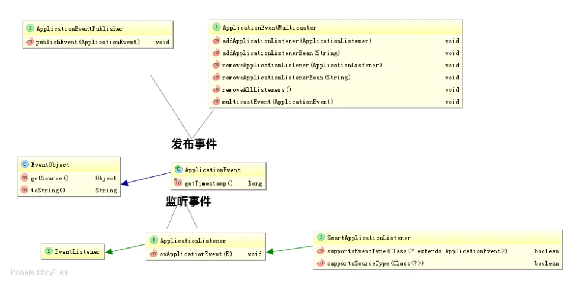

## 1 观察者模式

### 简介

先是一种对象间的一对多的关系；最简单的如交通信号灯，信号灯是目标（一方），行人注视着信号灯（多方）。当目标发送改变（发布），观察者（订阅者）就可以接收到改变。 观察者如何处理（如行人如何走，是快走/慢走/不走，目标不会管的）, 目标无需干涉；所以就松散耦合了它们之间的关系。

别名：观察者模式、事件监听机制、事件通知机制、回调机制

### 关键概念
* 可观察对象、观察者。（观察者模式）
* 事件、响应。（事件驱动、事件监听机制、响应式编程）

### 使用场景
观察着模式在不同场景下的实现。
* java语言中的回调机制
* 设计模式中的观察者模式
* jdk中的observable和observer
* 在操作系统中就是IO多路复用的一种策略
* 在socket网络编程、IO编程中（netty、springWebFlux、sofarpc）就是Reactor模式
* Spring的事件驱动模型
* 在UI框架中就是Listener，事件监听机制和响应机制
* 在web网站开发中，被称为响应式编程。
* 消息队列中的事件通知机制，消息队列中通过Event的事件传递变化。

## 2 服务发现机制

### 简介

观察者模式是一种**传递变化的功能**。强调的是变化发生时，那些关注该变化的角色都会收到相应的通知，而采取对应的操作。

而服务发现机制强调的是**建立关系的过程**，强调的是一个角色B通过某种机制与角色A建立永久的关系，建立关系后角色B和角色A之间往往采取更加直接的联系，例如本地调用或者远程调用。也可能建立关系后进行间接的事件通知逻辑，例如springfactories发现spring.factories中定义的扩展接口后，实例化这些接口，然后通过事件监听机制通知这些接口的实现类发生了变化。

服务发现机制，本质上也是一种解耦。角色B自身的逻辑不会依赖具体的实现，可以由不同的实现方提供。

别名：服务发布机制、订阅发布机制

### 关键概念
* 发布者、订阅者。（发布订阅机制）
* 提供者、消费者

### 使用场景

服务发现机制。以下并不是观察者模式的范畴，是一种更加宏观的机制，可能使用了观察者模式去发现。
* javaSPI。服务提供者接口，在编译阶段基于文件对服务进行发现
* SpringFactories。Spring的服务发现机制，通过文件发现接口的实现。
* 在微服务中就是注册中心的发布订阅过程。发布者订阅者、提供者消费者。
* 消息队列中的订阅发布模式，在消息队列中就是通过topic建立订阅发布关系。

## 3 扩展机制
扩展机制。框架这些东西就是为了给别人用的，写好了核心逻辑，让用户在核心逻辑的基础上进行扩展。这也是软件设计的原则。提供代码复用。

依赖可以分为两种核心依赖。
* 一种是库即工具，你自己创建核心的流程和逻辑，调用库中的方法完成一些简化的操作。
* 一种是框架。框架一般会创建好核心的流程和逻辑，你只是在框架的扩展点上进行扩展，实现一些业务相关的细节。

复用是框架的核心目的，扩展性是衡量框架好快的基本指标，扩展机制主要分为一下三个阶段
* 发现：框架提供给了发现扩展点的方法的方法，有些是框架提供的有些是语言提供的。
  * JavaSPI机制。本地的接口注册和发现。
  * 接口机制。Java提供的设计实现了某些接口就会被发现
  * 注解机制。使用了某些给定的注解就可以视为某个扩展
* 调用：发现扩展点后，如何讲扩展点生效。
  * 直接的调用行为。直接调用发现的服务弯沉给某些操作
  * 回调机制。在生命周期的某个阶段，回调扩展点的具体方法。

## 控制的灵活性
### 应用控制的灵活性
控制的灵活性总共分为一下几种
1. 代码：开发时控制。代码写死，版本固定后无法变更。
2. 参数和环境变量：发布时控制。通过参数和环境变量，控制应用的不同表现行为
3. 动态配置：运行时控制。通过动态配置灵活调整行为。
4. 接口和界面：运行时控制。需要开发运行时接口和界面，控制应用的不同表现行为。

### 服务发现机制中控制的灵活性

不同阶段的服务发现机制的灵活性
1. 编译时服务发现机制，java sdk提供的ServiceLoader机制（SPI）通过反射，在编译时查找具体的实现。
2. 启动时服务发现机制，tomcat、jdbc驱动加载、spring依赖注入都是在启动时根据当前的运行环境查找具体实现。
3. 运行时服务发现机制，注册中心是在运行时进行服务发现的，可能在运行时进行动态变化。