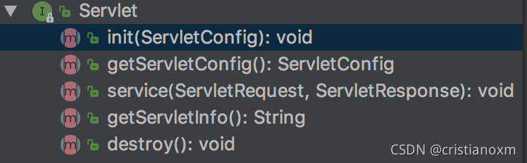
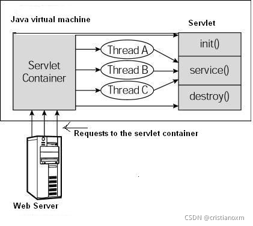
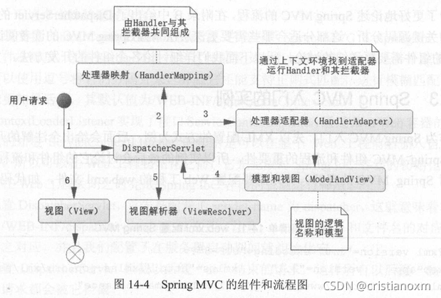
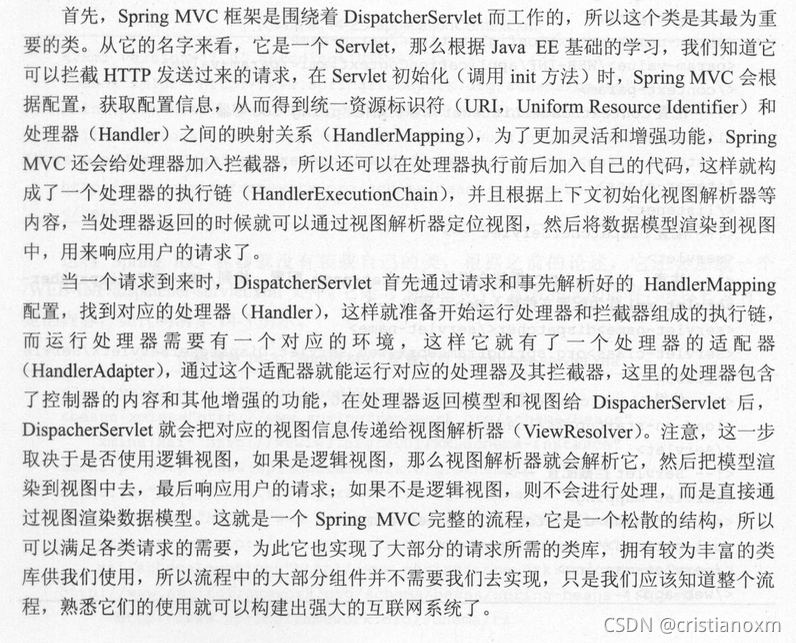
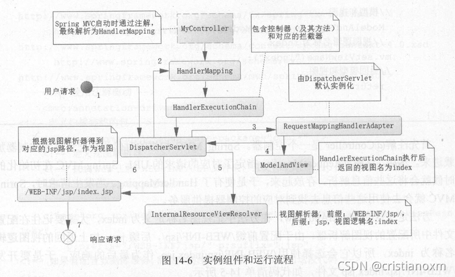

# Servlet容器、Http服务器：Servlet、Tomcat、SpringMVC的关系

> 参考文章
> https://blog.csdn.net/cristianoxm/article/details/121268913
## 1. Servlet

### 概念

servlet就是一个接口；接口就是规定了一些规范，使得一些具有某些共性的类都能实现这个接口，从而都遵循某些规范。有的人往往以为就是servlet直接处理客户端的http请求，其实并不是这样，servlet并不会去监听8080端口；直接与客户端打交道是“容器”，比如常用的tomcat。客户端的请求直接打到tomcat，它监听端口，请求过来后，根据url等信息，确定要将请求交给哪个servlet去处理，然后调用那个servlet的service方法，service方法返回一个response对象，tomcat再把这个response返回给客户端。

简而言之，就是说Servlet是一个小型的JAVA程序，运行在Web 服务器中来处理用户的请求，我们实际上使用的各路Servlet都需要通过各种方式实现这个接口。

### 生命周期

1. 调用 init() 方法初始化
1. 调用 service() 方法来处理客户端的请求
1. 调用 destroy() 方法释放资源，标记自身为可回收
1. 被垃圾回收器回收

### 请求处理

servlet的init方法和destroy方法，一般容器调用这两个方法之间的过程，就叫做servlet的生命周期。调用的整个过程就如上图所示。当请求来容器第一次调用某个servlet时，需要先初始化init()，但当某个请求再次打到给servlet时，容器会起多个线程同时访问一个servlet的service（）方法。 

由此可以看出，多个客户访问同一service（）方法，会涉及线程安全的问题。

1. 如果service()方法没有访问Servlet的成员变量也没有访问全局的资源比如静态变量、文件、数据库连接等，而是只使用了当前线程自己的资源，比如非指向全局资源的临时变量、request和response对象等。该方法本身就是线程安全的，不必进行任何的同步控制。

2. 如果service()方法访问了Servlet的成员变量，但是对该变量的操作是只读操作，该方法本身就是线程安全的，不必进行任何的同步控制。

3. 如果service()方法访问了Servlet的成员变量，并且对该变量的操作既有读又有写，通常需要加上同步控制语句。

4. 如果service()方法访问了全局的静态变量，如果同一时刻系统中也可能有其它线程访问该静态变量，如果既有读也有写的操作，通常需要加上同步控制语句。

5. 如果service()方法访问了全局的资源，比如文件、数据库连接等，通常需要加上同步控制语句。

### Servlet如何同时处理多个请求访问？

单实例多线程: 主要是请求来时，会由线程调度者从线程池李取出来一个线程，来作为响应线程。这个线程可能是已经实例化的，也可能是新创建的。Servlet容器默认是采用单实例多线程的方式处理多个请求的：

1. 当web服务器启动的时候（或客户端发送请求到服务器时），Servlet就被加载并实例化(只存在一个Servlet实例)；
2. 容器初始化化Servlet主要就是读取配置文件（例如tomcat,可以通过servlet.xml的设置线程池中线程数目，初始化线程池通过web.xml,初始化每个参数值等等。
3. 当请求到达时，Servlet容器通过调度线程(Dispatchaer Thread) 调度它管理下线程池中等待执行的线程（Worker Thread）给请求者；
4. 线程执行Servlet的service方法；
5. 请求结束，放回线程池，等待被调用； （注意：避免使用实例变量（成员变量），因为如果存在成员变量，可能发生多线程同时访问该资源时，都来操作它，照成数据的不一致，因此产生线程安全问题）

以上方法主要优点如下

1. 第一：Servlet单实例，减少了产生servlet的开销；
1. 第二：通过线程池来响应多个请求，提高了请求的响应时间；
1. 第三：Servlet容器并不关心到达的Servlet请求访问的是否是同一个Servlet还是另一个Servlet，直接分配给它一个新的线程；如果是同一个Servlet的多个请求，那么Servlet的service方法将在多线程中并发的执行；
1. 第四：每一个请求由ServletRequest对象来接受请求，由ServletResponse对象来响应该请求；

## 2. Tomcat

1. 尽管tomcat非常灵活而强大，可以作为web应用服务器，启动端口，使用Socket进行网络通信实现Web服务器，通过多线程的方式提供请求并发处理能力。
2. 但是tomcat首先是一个Servlet容器,Servlet容器可以对Servlet进行管理，控制其生命周期。使其可以专注于自己应该做的事情，不需要考虑端口啊多线程啊socket之类的东西，也使得Servlet在各种环境下具有适应性。一个基本的流程：tomcat接收请求，找到合适的Servlet来处理请求，如果该Servlet没加载，就顺便编译加载到JVM,如果加载了，就调init方法初始化，调Service方法处理request并返回responser，观测Servlet状态变化，在结束时调用destory方法。

## 3. SpringMVC

任何Spring Web的entry point，都是servlet。

spring的核心就是通过依赖注入、面向切面编程aop、和模版技术，解耦业务与系统服务，消除重复代码。借助aop，可以将遍布应用的关注点（如事物和安全）从它们的应用对象中解耦出来。

### Bean的声明周期

## 4. 三者关系

1. Tomcat和jettey类似，都是HTTP服务器和Servlet容器，负责给类似Spring这种servlet提供一个运行的环境，其中：Http服务器与Servlet容器的功能界限是：可以把HTTP服务器想象成前台的接待，负责网络通信和解析请求，Servlet容器是业务部门，负责处理业务请求。
2. Tomcat和Servlet作为Http服务器和Servlet容器的结合，可以接受网络http请求解析为Servlet规范的请求对象和响应对象。比如，HttpServletRequest对象是Tomcat提供的，Servlet是规范，Tomcat是实现规范的Servlet容器，SpringMVC是处理Servlet请求的应用，其中DispatcherServlet实现了Servlet接口，Tomcat负责加载和调用DispatcherServlet。同时，DispatcherServlet有自己的容器（SpringMVC）容器，这个容器负责管理SpringMVC相关的bean，比如Controler和ViewResolver等。同时，Spring中还有其他的Bean比如Service和DAO等，这些由全局的Spring IOC容器管理，因此，Spring有两个IOC容器。
3. JavaEE中如果只是使用spring(不包含springmvc)，那么是tomcat容器解析xml文件，通过反射实例化对应的类，根据这些servlet规范实现类，触发对应的代码处理逻辑，这个时候tomcat负责http报文的解析和servlet调度的工作。
4. 如果使用spring mvc，那么tomcat只是解析http报文，然后将其转发给dispatchsetvlet，然后由springmvc根据其配置，实例对应的类，执行对应的逻辑，然后返回结果给dispatchservlet，最后由它转发给tomcat,由tomcat负责构建http报文数据。

### Web服务器的实现方案

实现web服务有很多种方案。为了能够模块化每一个功能，将整个web服务器分为一下三个部分。大致分为一下三个步骤：
1. Http服务器：监听端口、解析Http协议的数据包，将处理后的数据包转换成Http格式的数据包返回给操作系统。**提供并发处理请求的能力**，这种并发能力可以基于多种不同的技术实现（多线程、异步非阻塞），但都必须遵循标准。
2. 服务路由映射：将解析后的数据包转换为Java类型的请求，通过Url Mapping到指定的业务处理器上。
3. 业务逻辑处理：根据请求的具体内容，处理业务需求，返回处理结果。

其中典型的实现方案包括一下几种：
1. Servlet with JavaEE。基于Servlet标准提供Web服务，其主要实现包括原生的Servlet服务器。Tomcat、Jetty等Http服务器和Servlet容器实现，客户实现的Servlet中实现了业务逻辑处理。
   1. Tomcat实现了Http服务器
   2. Tomcat实现了Servlet容器，在Servlet容器中实现了服务路由映射。
   3. 在不同Servlet中实现了业务逻辑处理。

2. Servlet with SpringMVC中。和SpringMVC通过封装Servlet实现的Web服务器，+SpringMVC提供的服务路由映射和业务逻辑处理能力
   1. Tomcat实现了Http服务器
   2. Tomcat实现了Servlet容器，将所有请求/**映射到同一个Spring的DispatcherServlet上。
   3. SpringMVC实现了服务路由映射（通过内置的服务路由映射机制路由到具体的业务代码）和Servlet处理业务需求。
3. WebFlux With Netty。底层是Netty，通过异步非阻塞的方式实现的web服务器。异步非阻塞不是指在调用链上的某个节点，而是所有节点都是异步非阻塞的。
   1. Netty实现了Http服务器
   2. SpringMVC实现了服务路由映射
   3. 用户自己实现了业务逻辑处理
4. Jax-RS with Resteasy/Jessy。底层也是Netty，通过多线程阻塞的方式实现web服务器。
   1. Netty实现了Http服务器
   2. Jax-RS实现了服务路由映射和过滤器的标准、Resteasy提供了具体实现。
   3. 用户自己实现了业务逻辑处理。