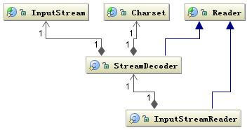
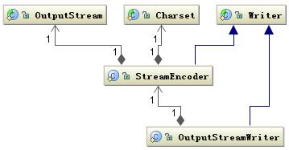

http://tutorials.jenkov.com/java-io/stringreader.html

字符流类(需要考虑编码问题）

**字符流编码**

InputStreamReader 类是字节到字符的转化桥梁，InputStream 到 Reader
的过程要指定编码字符集，否则将采用操作系统默认字符集，很可能会出现乱码问题。StreamDecoder
正是完成字节到字符的解码的实现类。也就是当你用如下方式读取一个文件时：

清单 1.读取文件

| 1 2 3 4 5 6 7 8 9 | try {   StringBuffer str = new StringBuffer();   char[] buf = new char[1024];   FileReader f = new FileReader("file");   while(f.read(buf)\>0){   str.append(buf);   }   str.toString();  } catch (IOException e) {} |
|-------------------|----------------------------------------------------------------------------------------------------------------------------------------------------------------------------------------------------------------------|

通过 OutputStreamWriter 类完成，字符到字节的编码过程，由 StreamEncoder
完成编码过程。

**普通字符流**

1、Reader类和Writer类的常用方法

Reader类是个抽象类，该类的所有方法在错误条件下都会抛出IOException异常．常用方法如下：

(1) abstract void close()：关闭输入源．

(2) void mark(int numChars)：放置一个标记到输入源的当前点．

(3) boolean markSupported()：如果这个流支持mark/reset方法，将返回true．

(4) int read()：读取单个字符．

(5) int read(char[] buf)：读字符读入到字符数组．

(6) abstract int read(char[] buf, int offset, int numChars)：
将字符读入数组的某一部分．

(7) boolean ready()：如果下一个输入请求不必等待，返回true，否则返回false．

(8) void reset()：重置输入指针到前面设置的标记．

(9) long skip(long numChars)：跳过n个字符输入，返回实际跳过的字符数．

Writer类也是个抽象类，常用方法如下：

(1) abstract void close()：关闭输出流．

(2) abstract void flush()：确定输出状态以便清空任何缓存．

(3) void write(int ch)：写入单个字符．

(4) void write(char[] buf)：写入字符数组．

(5) abstract void write(char[] buf, int offset, int
numChars)：写入字符数组的一部分．

(6) void write(String str)：写入字符串．

(7) void write(String str, int offset, int numChars)：写入字符串的一部分．

**文件字符流**

2、FileReader类

FileReader类是继承自InputStreamReader类，而InputStreamReader类又继承自Reader类，因此Reader类与InputStreamReader类所提供的方法均可供FileReader类所创建对象使用．FileReader的构造方法有：

FileReader(File file);

FileReader(FileDescriptor e );

FileReader(String filename);

3、FileWriter类

FileWriter类继承自OutputStreamWriter类，而OutputStreamWriter类又继承自Writer类，因此Writer类与OutputStreamWriter类所提供的方法均可供FileWriter类所创建对象使用．FileWriter的构造方法有：

FileWrite(File filePath);

FileWrite(File f, boolean append);

FileWrite(FileDescriptor e);

FileWrite(String filename);

FileWrite(String filename,boolean append);

**缓冲区字符流**

4、BufferedReader类

BufferedReader类继承自Reader类，BufferedReader类是用来读取缓冲区里的数据．BufferedReader类属于过滤流，常以其它流如FileReader作为它们的输入或输出．它的构造方法有：

BufferedReader(Reader in);

BufferedReader(Reader in, int bufSize);

例如：

FileReader fr=new FileReader("d:\\1.txt");

BufferedReader buf = new BufferedReader(fr);

BufferedReader提供了readerLine()方法用来读取文本每一行．

5、BufferedWriter类

BufferedWriter类继承自Writer类，BufferedWriter类是用来将数据写入到缓冲区里．使用BufferedWriter类与使用BufferedReader类过程相似．不同的是，缓冲区内的数据最后必须要用flush()方法将缓冲区清空，也就是将缓冲区中的数据全部写到文件内．它的构造方法有：

BufferedWriter(Writer out);

BufferedWriter(Writer out, int bufSize);

BufferedReader、BufferedWriter提供了ReadLine、newLine()这种以行为单位的字符读写机制

复制代码

import java.io.\*;public class circle { public static void main(String[] args)
throws Exception { /\* \* FileReader(String fileName) \* Creates a new
FileReader, given the name of the file to read from. \*/ Reader reader = new
FileReader("C:/in.txt"); /\* \* BufferedReader(Reader in) \* Creates a buffering
character-input stream that uses a default-sized input buffer. \*
在Reader之上再包一层Buffer缓冲区的功能 \*/ BufferedReader brd = new
BufferedReader(reader); String data = brd.readLine(); while(data != null) {
System.out.print(data); data = brd.readLine(); } brd.close(); reader.close();
Writer writer = new FileWriter("C:/out.txt"); /\* \* BufferedWriter(Writer out)
\* Creates a buffered character-output stream that uses a default-sized output
buffer. \*/ BufferedWriter bwd = new BufferedWriter(writer); /\* \* write(String
s, int off, int len) \* Writes a portion of a String. \*/bwd.write("Hello
World"); /\* \* newLine() \* Writes a line separator. \*/bwd.newLine();
bwd.close(); writer.close(); } }

**字符数组字符流**

CharArrayReader
是字符数组输入流。它和ByteArrayInputStream类似，只不过ByteArrayInputStream是字节数组输入流，而CharArray是字符数组输入流。CharArrayReader
是用于读取字符数组，它继承于Reader。操作的数据是以字符为单位

复制代码

import java.io.\*;public class circle { public static void main(String[] args)
throws Exception { char a = 'a'; char b = 'b'; char c = 'c'; /\* \*
CharArrayWriter() \* Creates a new CharArrayWriter. \*/ CharArrayWriter carrWrt
= new CharArrayWriter(); /\* \* write(int c) \* Writes a character to the
buffer. \*/ carrWrt.write(a); carrWrt.write(b); carrWrt.write(c); /\* \*
toCharArray() \* Returns a copy of the input data. \*/ char[] buff =
carrWrt.toCharArray(); for(int i = 0; i \< buff.length; i++) {
System.out.println(buff[i]); }
System.out.println("\*\*\*\*\*\*\*\*\*\*\*\*\*\*\*\*\*\*\*\*\*\*\*"); /\* \*
CharArrayReader(char[] buf) \* Creates a CharArrayReader from the specified
array of chars. \*/ CharArrayReader carrRed = new CharArrayReader(buff); /\* \*
read() \* Reads the next byte of data from this input stream. \*/ int data;
while((data = carrRed.read()) != -1) { System.out.println(data); } } }

复制代码

**字符串字符流**

**管道字符流**

PipedReader

PipedWriter

**打印字符流**

PrintWriter

printwriter是向文本输出流打印对象的格式化表示形式，它允许以一种格式化的方式进行数据流的写入，类似C语言中的printf()函数

复制代码

import java.io.FileWriter; import java.io.IOException; import
java.io.PrintWriter;public class circle { public static void main(String[] args)
throws Exception { String filename = "C:/out.txt"; /\* \* PrintWriter(Writer
out) \* Creates a new PrintWriter, without automatic line flushing. \*/
PrintWriter pw = new PrintWriter(new FileWriter(filename)); String[] words = new
String[]{"hello", "world", "!"}; for (int i = 0; i \< words.length; i++) { /\*
\* format(String format, Object... args) \* Writes a formatted string to this
writer using the specified format string and arguments. \*/pw.format("words:
%s\\n", words[i]); } /\* \* flush() \* Flushes the stream. \*/pw.flush(); } }

复制代码

**过滤字符流**

FilterReader

FilterWriter

**计数字符流**

LineNumberReader

**转换字符流**

InputStreamReader

OutputStreamWriter
