第一章 概论

分布计算的定义与挑战

分布计算系统的互连

分布式操作系统

计算机网络与中间件

分布式计算模式

**什么是分布式系统？**

分布式计算系统是由多个相互连接的计算机组成的一个整体，这些计算机在一组系统软件（分布式操作系统或中间件）环境下，合作执行一个共同的或不同的任务，最少依赖于集中的控制过程、数据和硬件。

>   ①包含多个通用资源部件（物理的或逻辑的），可以动态基础上被指定给予各个特定的任务；

>   ②这些资源部件在物理上是分布的，并经过一个通信网相互作用；

>   ③有一个高级操作系统，对各个分布的资源进行统一和整体的控制；

>   ④系统对用户是透明的；

>   ⑤所有的资源都必须高度自治地工作而又相互配合，系统内不存在层次控制。

**分布式系统有哪些特点？**

-   一组由网络互联的、自治的计算机和资源

-   资源为用户所共享

-   可以集中控制，也可以分布控制

-   计算机可以同构，也可以异构

-   分散的地理位置

-   分布式故障点

-   没有全局时钟

-   大多数情况下没有共享内存

**分布式系统的特性？**

-   开放性：通信标准与协议、通过接口、互操作性、可移植性、灵活组合

-   可扩展性：规模上、地域上、管理上

-   异构性：易购的网络、计算机硬件、计算机操作系统、程序设计语言、开发商。通过中间件技术和虚拟化技术隐蔽异构性。

-   透明性：资源隐蔽。访问、位置、并发、失效、复制、迁移、性能、规模都是具有一定的隐蔽性。

-   安全性：身份认证、消息加密、访问控制

**分布式系统的应用？**

-   科学计算和高性能应用

-   现代跨企业的电子商务应用

-   容错应用

-   固有的分布式应用

**分布式系统互联方式？**

-   共享存储器-总线型多处理机

-   共享存储器-交换型多处理机

**分布式系统有哪些结构？简述每种结构的特点。**

-   微内核式

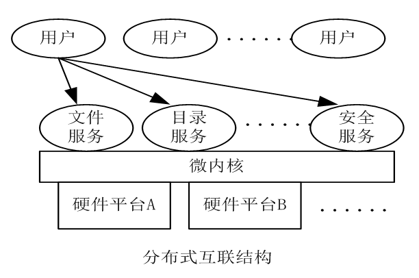

-   集成式：比较完整的OS

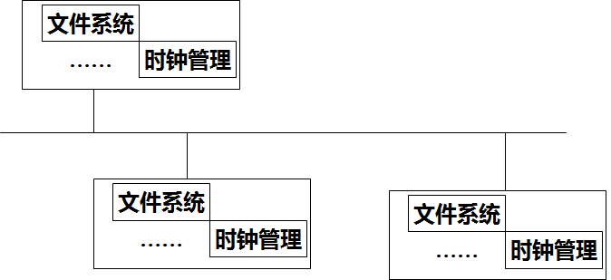

-   客户机-服务器

-   中央式：有一个中央结点和若干卫星节点，每个节点上进程通过中央结点进行通信。

-   分散式：每个节点仅负责部分管理功能，需要各节点协商、合作方式进行管理。

**分布式系统的中间件服务处于什么位置？主要包括哪些服务？**

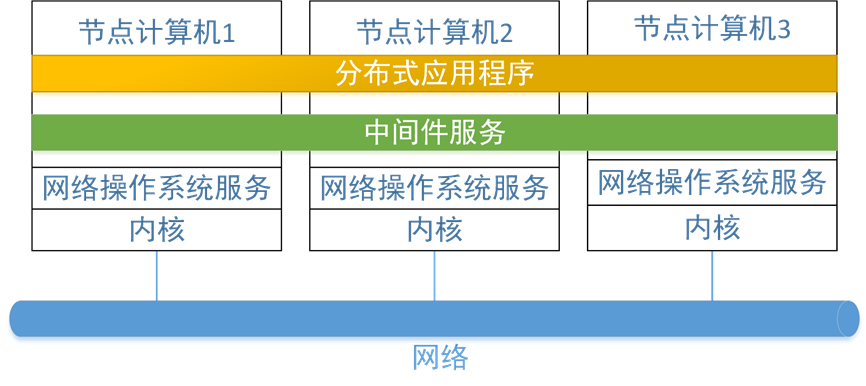

主要包括：命名服务、作业调度、资源管理、数据持久化、分布式事务管理、分布式文档系统、安全服务。由负载均衡系统负责调度分配任务。

**分布式计算有哪些模式？**

-   面向对象模式OOM：面向对象模式OOM（ Object Oriented
    Model）是基于客户/服务器模型（如CORBA，DCOM)

-   面向服务模式SOM：Web Service是这种面向服务模式的一个实例
    ,SOA是一个较完整的软件结构体系。

-   公用计算模式UBM：支持e-科学的计算(如网格Grid等）。

-   志愿参与模式VJM：志愿参与模式VJM(Voluntary Join
    Model)是充分利用网上空闲的计算能力，支持计算量巨大的科学计算。

第二章 名字服务

名字服务结构

域名系统

目录服务X.500

活动目录域服务

**对相关名词进行解释-名字与属性的构成**

-   实体：可以有多个访问点。

-   名字：实体的名字是一个用户可读的、便于记忆的字符串

-   地址：实体的访问点，也是一个特殊的实体，名字为地址。

-   属性：一个实体有若干属性，用属性对类型-值来表示

-   标识符：一个标识符可以引用一个实体。

-   名字空间：命名系统的名字集合构成命令域的命名空间，可以划分为多个名字域。

-   挂载点：挂载不同的名字空间。存储节点标识符的目录节点？？？

-   名字服务器：命名空间的实现与管理。由数据库（需要实体名字和地址的绑定、名字解析的上下文）和名字解析软件组成。

**请简述web页面查找的过程**

-   经域名系统 解析得到IP地址，

-   经ARP解析得到48位的Ethernet地址2:60:8c:2:b0:5a。

-   用Ethernet地址和16位TCP端口号8888访问Web服务器

-   用页面名从Web服务器获取页面。

-   最后用协议HTTP将页面传送给用户。

**请简述名字服务的三种形式**

-   名字服务：白页服务，根据实体的名字查找他的属性地址。名字数据库

-   目录服务：黄页服务，命名实体与其一个或多个属性绑定的集合。

-   合约服务：增强的目录服务，通过技术规范来定位一个命名实体。

**对名字空间的操作主要有哪些**

-   增加名字项和绑定

-   撤销名字项和绑定

-   修改名字项和绑定

-   名字解析：根据实体的名字查找到实体的地址

-   更高要求：处理巨大数量的实体名字和服务；长期生存；高可用性；容忍不信任。

**请简述挂载的过程**

-   目录节点/remote/vn包含有访问外部名字服务器的协议nfs

-   外部名字服务器名称：fits.cs.vn.nl

-   外部名字挂载点：/home/steen

**请简述名字服务器的实现原理**

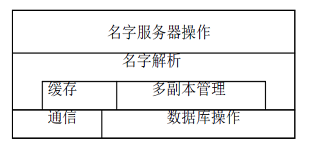

-   客户端名字代理

-   服务器名字服务器：名字解析上下文管理、名字查询解析

-   上下文集中管理：方便管理、单点故障、性能低

-   上下文分布管理：避免了单点故障（一个点故障不影响其他节点工作），性能较高，管理复杂。

-   多副本分布式管理：性能较高（负载平衡），没有单点失效（一个节点故障后可以由其他节点代替其服务），管理复杂。

-   名字服务器操作
    ：管理、查询操作和行政管理。增加、删除和修改上下文的目录项。访问优先权。

-   名字解析 ：根据名字解析请求，得到被解析对象地址。

-   缓存 ：缓存名字查询和解析的结果。

-   多副本管理 ：副本修改和副本一致性维护。

-   通信 ：客户端的名字代理通信和名字服务器之间

-   数据库 ：存放名字解析上下文或其子域。

**请简述名字解析的过程**

-   迭代解析过程

-   递归解析过程（减少客户端通信开销）

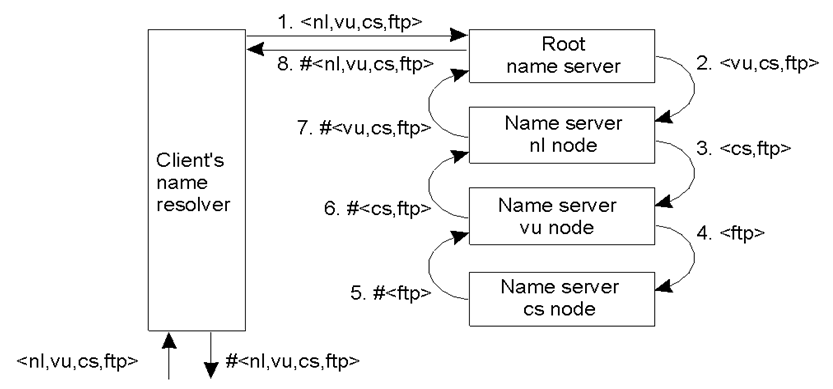

**请简述名字服务——DNS域名系统的工作原理**

-   名称空间：分层组织，名字有63个标识符www.nwpu.edu.cn

-   资源记录：名字：类型：记录的值：TTL生存期（注意每种类型的含义）。

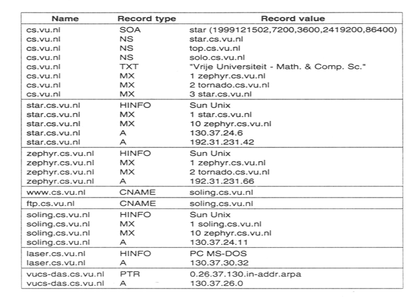

-   四层域名系统：顶级、二级 、三级、四级；机构域名、地理域名

-   DNS查询过程：名字解析，将域名（实体名字）转换为IP地址（实体的地址）

-   不同的域名服务器：本地域名服务器、根域名服务器、授权域名服务器

-   查询方式：迭代查询、递归查询

**请简述目录服务——X.500的工作原理**

-   构成：目录信息数据库（包含目录信息树节点和目录项，多副本分布式）、目录系统代理DSA，目录用户代理DUA、目录管理与DMD

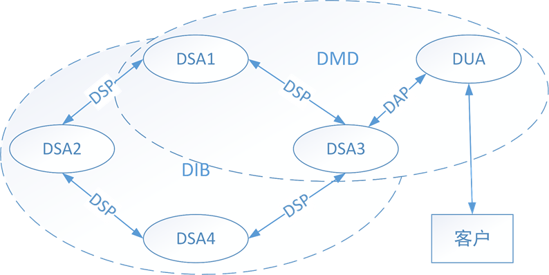

-   操作：目录查询、镜像操作绑定（多副本实现）、层次操作绑定（DSA之间的层次）

-   用户查询过程：成功、失败、转交

-   镜像操作绑定过程（实现了多副本）

-   层次操作绑定（不同的层级结构）

-   目录服务协议：

    ①目录访问协议DAP，DUA用来与DSA通信。

    ②目录系统协议DSP，是两个DSA之间的操作协议，在DSA之间传递查询请求和响应。

    ③目录信息镜像协议DISP，是DSA用来将信息从镜像提供者传送给镜像使用者。

    ④目录操作绑定管理协议DOP，DSA用来层次操作绑定管理和镜像管理。

-   LDAP协议：轻量级数据库访问协议。

分布式进程

分布式进程概念

进程远程执行

进程迁移

分布式对象

**请解释一下概念**

-   进程：进程是操作心痛中堵路存在的实体，可以用有独立的资源。程序是以个静态的指令集合，进程是一个正在胸痛中活动的指令集合。不同状态、并发执行

-   进程地址空间：正文区域（code）固定不可修改的区域，存放进程的代码。数据堆区域（Heap）有存储在程序二进制文件中的数值初始化，像高虚拟地址扩展。堆栈区域（Stack）程序调用时用来存放返回地址，向低虚拟地址扩展。

-   线程：包含在进程中的实体i，线程有自己的运行线索，可以完成一定的任务，可以与其他线程共享进程中的共享变量及部分环境，相互之间协同来完成进程所有要完成的任务。共享同一个进程虚拟空间（进程代码段、公有数据、文件描述符、信号的处理器、进程的当前目录、进程用户ID与进程组ID）。

-   逻辑机：管理主线程的主机？？？

-   进程迁移：将一个正在运行的进程挂起，他的状态从源处理机节点转移到目标节点，并在目标处理机上恢复该进程的运行。特点：灵活且应用广泛的有点，支持动态负载平衡，系统容错，高效使用本地资源，开销相对较大

**请描述进程执行过程**

-   创建

-   运行

-   等待：保存CPU环境，寄存器，程序计数器，堆栈指针。

-   就绪

-   终止

**请简述多线程系统的实现**

-   以线程包的形式提供多线程服务，包括：创建销毁操作、对同步变量的操作。

-   实现现承包的基本方法：用户级线程、内核级线程、混合线程（轻量级进程）。

-   用户级线程：有用户应用程序建立，并负责对线程进行调度和管理。线程与内核无关。特点：能在不支持多线程的操作系统中实现，创建销毁线程开销小，切换效率高，允许每一个进程有自己制定的调度算法，阻塞调用会使所属的整个进程阻塞。

-   内核级线程：所有线程的创建、调度和管理全部由操作系统内核负责。特点：系统开销大。

-   混合形式轻量级线程：线程包在用户空间实现，穿件用户级线程，随机分配到LWP轻量级线程中。

**请简述分布式进程的创建过程**

-   目标主机选择（位置策略、传输策略）

-   执行环境监理（建立地址空间）

-   多线程的应用：Web浏览器使用多个独立连接请求HTML各个部分。文件服务器分发器线程和若干个工作线程。

**请简述进程远程执行的过程（重点，mmp看书来补充这一部分OK）**

-   必要性：选择节点处理机、寻找管理机制、远程执行透明、主人优先原则。

-   逻辑机模型：包括客户节点和远程服务节点。客户节点上的代理进程负责远程服务节点上远程进程执行的初始化。远程服务节点执行客户节赋予的进程。

要求：远程进程能够访问院计算机上的文件系统，远程进程处理逻辑机内任何进程的信号。进程组和树型的进程父子关系必须保持在逻辑机内。

-   进程远程执行——REXEC

rexecd：运行在不同该节点上的守护进程

rexec：客户进程，执行REXEC模型内管理。选择节点，与远程服务节点建立连接TCP。

vexecd：多副本守护进程，提供远程服务街店的发现和选择功能，获取节点状态信息，REXEC模型的资源管理器。

**请简述进程迁移的概念模型**

-   概念模型：两个节点进行迁移协商，进程状态迁移，重建迁移进程，使之从断点出开始继续运行。通知与迁移进程有通信关系的进程，协助他们重建正确的通信连接。相关名词：进程状态、原始主机、源处理机、目标处理机、远程进程、通信关系。

**请简述进程迁移的步骤：**

1.  迁移协商：询问目标处理及是否可以接受迁移进程。

2.  创建恢复进程：在目标处理机上创建恢复进程。

3.  中断迁移进程的运行。在源处理机上收集迁移进程状态，将迁移进程状态传输到目标处理机。

4.  恢复被迁移进程状态，重建进程实例。

5.  通知被迁移进程的新位置，重新建立通信连接。

6.  迁移进程在目标节点恢复运行。

7.  操作转发，利用转发机制保证进程可以在远程处理机透明执行。

**进程迁移的策略：**

-   动态系统管理与维护。信息管理模块主要决定和负载平衡相关的信息策略，判定何时迁移，对负责信息的衡量及相关收集机制成为信息策略。负载信息衡量——\>信息收集策略。

-   动态负载平衡，系统中中浮在处理机转移一部分负载到轻敷在处理机上运行，使得整个集群系统中的所有处理机的负载趋向均衡，从而提高系统整体运行效率。负载平衡模块，依据负载信息管理模块提供的负载信息做出迁移决定，可以细分为：传输策略、选择策略、定位策略。常用的负载平衡激发方式：中央服务器触发方式、发送者触发方式、服务者触发方式、对称触发方式、自适应触发方式。

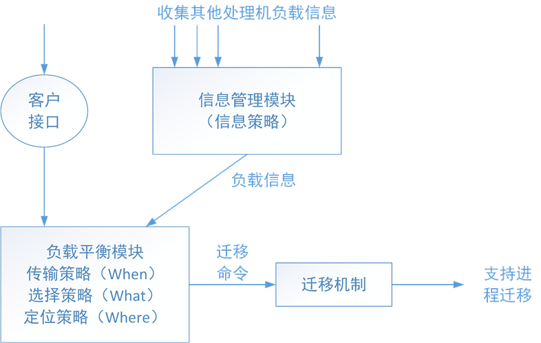

-   系统容错

-   主人优先使用原则

**请简述进程迁移实现的具体过程**

-   进程状态收集和恢复。由用户及上下文、寄存器上下文、系统上下文。内部状态收集（用户主动手机自身状态）、外部状态收集（挂起、操作系统接口对进程状态收集）、出发时状态收集：（信号触发导致对自身状态收集，设置歉意信号及信号处理函数）

-   转发机制：目标处理机访问无法迁移的资源，只能讲对这些资源的操作转发到原始处理机上执行。VDPC转发机制

-   通信恢复：问题：被迁移进程的新地址识别、保证不丢失任何消息、维护消息的正确顺序。措施：建立进程地址映射表，采用特殊路由方式。消息驱赶方法、消息转发方法。长消息分片，确保分片顺序的方法：增加标识信息、源自通信。不通消息的先后顺序方法：消息附加消息序号，采用特定机制保证除与迁移临界区的消息的正确顺序。

-   进程迁移算法：异步迁移算法，同步迁移算法，类异步迁移算法。

分布式系统通信

消息传送

组通信

远程过程调用

远程对象方法调用

事件与通知

**分布式系统通信的定义**

>   分布式系统通信是由一个通信层实现的，它建立在节点操作系统和网络传输层协议之上，提供一组通信原语供应用程序调用。通信层介乎应用程序和操作系统之间，实现各种通信协议

**请简述不同的消息传送模型**

-   发送原语：发送实体+消息接收进程的标识符。

-   接收原语：接收消息体+发送进程的标识符。

-   消息={接收进程标识符，消息体，发送进程标识符}

-   可靠性语义：至少一次、至多一次、事务语义、精确一次。正确完成消息传送

| 通信事件       | 同步消息传送            | 阻塞发送/接收                         | 非阻塞发送/接收     |
|----------------|-------------------------|---------------------------------------|---------------------|
| 定义           | send之前等待Receive到达 | send、receiver发送接收完成时 执行程序 | sendReceive继续执行 |
| 发送启动条件   | 发送接收原语双方均达到  | 发送原语达到                          | 发送原语达到        |
| 发送返回指示   | 消息被接收              | 消息发送完成                          | 消息发送启动        |
| 语义           | 清晰                    | 居中                                  | 易出错              |
| 缓冲消息       | 不需要                  | 需要                                  | 需要                |
| 状态检查       | 不需要                  | 不需要                                | 需要                |
| 等待开销       | 高                      | 居中                                  | 低                  |
| 通信与计算重叠 | 不能                    | 能                                    | 能                  |

**请简述组通信的过程**

-   组：由系统或用户确定的若干个进程的集合

-   通信方式：点到点通信、一到多通信

-   组结构：封闭组（不允许非组成员进程访问）、开放组（允许非组进程访问）、对等组（星状链接，各节点通信对等）、分层组（通过根节点通信、协调员）

-   组通信的应用优势

    -   多副本容错

    -   提高多副本数据修改效率

    -   自发联网的服务发现

    -   时间通知传播

**请简述如何实现可靠的组通信和原子组播（重点，需要看书来了解详细的过程OK）**

-   可靠组播解决组播消息丢失的办法：为发送信息添加序号，按序号发送接受；接收端成功确认、消息丢失确认；发送进程维持一个历史缓冲器，保留发送过的组播消息，消息丢失时，进行消息重传。

-   反馈抑制：不分层反馈抑制：接受到组播消息丢失时，像所有的组播成员组播消息丢失的消息，包括发送进程，丢失相同消息的组不再进行发送。发送端接受到一个消息丢失的反馈之后，就会重新组播消息。分层反馈抑制：分层组织组播消息，向根节点广播。

-   原子组播：要么消息发送到所有的组成员，要么就不想任何一个成员发送消息。虚拟同步：多播消息m应该唯一的与m要传送到的一个进程组列表G关联。消息排序：FIFO排序和因果排序

-   消息排序：可靠不排序组播、可靠FIFO排序、因果排序

**简述远程调用过程**

-   原理：通信时透明性的，消息传递方式无法隐藏通信的存在，允许程序调用其他机器上的进程。

-   本地调用过程：通过堆栈实现。

-   远程调用RPC（remote procedure call）

client 调用client stub

client stub 构造消息，通过trap进入操作系统内核

内核将消息放松到sever的操作系统内核

server的操作系统内核将消息交个server stub

server stub将消息解包，用相应参数调用服务例程

服务例程进行计算，将结果方会给server stub

server stub构造消息，通过trap进入内核

内核将消息发送给client的内核

client 内核接受消息并将它交给相应的stub

stub解包，将调用结果返回给应用程序。

-   参数传递过程。参数格式统一规范或者例外说明；禁止使用指针参数；复杂数据类型GIS配置。

-   数据编码格式ASCII，EDBIC

-   存在的问题及解决办法RPC：客户机不能定位服务器（无法查找标识）、请求消息丢失（超时通知）、应答消息丢失（计时器）、服务器崩溃（可靠性语义）、客户端崩溃（清剿、转世、温和转世、期满）

**请简述远程对象调用的方式（在其他部分讲解）**

**请简述事件与通知的实现方式**

-   事件参与者：感兴趣的对象、事件、通知、订阅者、观察者、发布者

-   时间分送保证语义：为时间通知提供了各种不同过得分送保证

-   观察者角色：转发、通知过滤、事件模式、通知信箱

-   这里的实现途径：直接通知订阅者，通过外部观察者捕获事件。

分布式系统同步

时钟同步

逻辑时钟

选举算法

互斥算法

**为什么需要同步**

-   多个进程需要事件的顺序达成一致。

-   以相对排序而不是绝对事件方式来实现同步

-   通过分布式互斥来保护共享资源

**物理时钟测量同步方式**

-   时钟获取主要有太阳日、原子时钟

-   时钟同步算法：Cristian's算法（询问式同步，逐步修正，事件不能向拨、受网络延迟影响）、Berkeley算法

-   网络时间协议NTP，属性的同步子网结构，三种同步方式：组播模式、过程调用模式、对称模式。

**什么是逻辑时钟**

-   跟踪事件顺序。

-   Lamport逻辑时钟

    -   如果a和b是在同一进程中的两个事件：且a发生在b之前，则a→b为真；

    -   C(a)表示事件a的时钟值（时间戳），性质：

        if a®b；则C(a)\<C(b)

        "a，b；则C(a)¹ C(b)

        C是递增的

-   校正算法

    a®b，if C(b)\<C(a)

    校正：C(b) = Max[C(b), C(a) + 1]

-   逻辑时钟全定序：对所有事件进行排序。

-   向量时间戳

    向量时间戳让每个进程维护一个向量V

    向量V是一个数组，数组元素个数是系统的进程数，元素是升序的整数

    Vi[i]是目前为止进程Pi发生的事件的数量

    Vi[j]=k，表示进程Pi知道进程Pj中已经发生了k个事件

**请简述选举算法**

-   通过选举做出统一决定。选举全局唯一编号最大者作为协调者。环算法、欺负算法

-   环选举算法

    初始，每个进程标记为选举未参与者。

    选举发起者将自己标记为选举参与者，将自己的标识符置于选举消息中，并顺时针传送给下一个邻居（进程）。

    当进程收到一个选举消息，它将选举消息中的标识符与它自己的标识符进行比较，如果消息中的标识符大，进程转发这个选举消息到它的下一个邻居，并将自己标记为选举参与者；

    如果消息中的标识符小且接收进程不是选举参与者，接收进程用它的标识符替换消息中的标识符，并将选举消息转发到下一个邻居,自己也成了选举参与者；

    如果接收进程已经是选举参与者，它只转发选举消息。直到接收进程的标识符与选举消息中携带的进程标识符相等为止。

    标识符中标识符最高者便是新的协调者。

-   欺负算法

    将进程进行排序

    1.P向高的进程发送选举消息E(lection)

    2.如果没有响应，P选举获胜

    3.如果有进程Q响应应答消息OK，则P结束，Q接管选举并继续下去。

    4.选举获胜者向其他进程发送协调者消息C(orrdinator)

**请简述基本互斥算法的实现（需要看书详细了解）**

>   **互斥的定义：**当一个进程必须读或修改某些共享数据结构时，它首先进入临界区获得互斥锁，保证没有其他进程使用该结构。分布式系统算法：集中式算法、分布式算法（基于时间戳的优先权算法）、令牌环算法、分布式互斥算法（基于事件优先权算法）、共享K个相同资源的算法。

-   集中式互斥算法：选举一个协调者，向协调者请求资源→协调者许可→请求者占用资源。没有资源即可。

-   分布式互斥算法（基于时间戳的算法）：访问进程建立一个消息（要访问资源的名字，处理机号，时间）→消息发送给其他进程→发送的消息可靠，每条消息都将被确认（应尽可能使用可靠的组通信，基于时间戳）。返回消息的几种情况：接受者没有访问资源也不想访问，向发送者发送OK消息；接受者获得资源，不必应答；接受者想要访问资源，将对比时间戳，如果时间戳小，则发送OK消息，否则不发送消息。

-   基于令牌环算法：构造逻辑环→获得令牌后决定是否访问资源→不可以用同意令牌立即访问（存在的问题，检测令牌丢失比较困难）

-   分布式互斥算法（基于事件优先权算法）：

-   完全可靠网络算法：

-   不可靠网络算法：

-   共享K个相同资源的算法

多副本一致性与DSM

**为什么使用多副本**

-   提高系统容错能力

-   提高系统效率

-   增强系统可扩展性

**请简述相关的一致模型**

数据为中心的一致性模型、客户为中心的一致性模型

-   严格一致性：最强一致性模型，对数据项的读操作返回的值应该是该数据项最近写入的值。

-   顺序一致性：放弃了时间定序的要求，任何对数据存储的一组操作执行结果相同、客户以同样的次序看到所有的写操作的全局定序。写操作和读操作是按照一定时间顺序被看到的。

-   因果一致性：有因果关系的读写必须有先后顺序，没有因果关系的读写则不要求顺序一致性。

-   FIFO一致性：一个客户的写操作定序在所有副本上是相同的。同一用户的写操作按照一定的顺序被读取。

-   弱一致性：按照一个操作组定序，不是按照单个操作

-   释放一致性：获取操作，释放操作，对于访问互斥变量的一致性，必须在释放之后获取。

-   入口一致性：数据项一次操作与同步变量相关联。

-   客户为中心的一致模型——单点读：一个进程读取数据项x的值之后，该进程的任何后续对x的操作总是返回前一次读同样的值或更新的值。保证本次程序读取同样的值

-   客户为中心的一致模型——单点写：一个进程对数据项x执行写操作，必须在该进程对x执行任何后续写操作之前完成。保证本次程序修改同样的值。

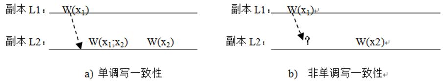

-   客户为中心的一致模型——写后读：写操作总是被后续读操作所见，保证本次程序的读取最新的值。

-   客户为中心的一致模型——读后写：一个进程对数据项x的写操作总是跟统一进程对x读操作之后，保证本次程序读到最新的值。

**请简述分发协议的内容**

-   副本分类：永久副本、服务器启动的副本、客户启动的副本（本地缓存）

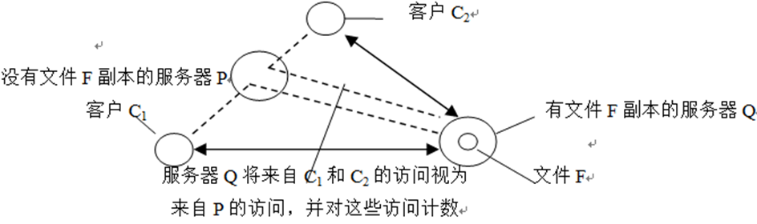

-   更新传播的状态与操作：传播更新通知、传播更新数据、传播更新操作

-   更新传播推协议（更细持有者主动发送给大家）拉协议（更新的接收者定期询问更新）

**请简述一致性协议的内容**

-   **主从副本协议**

    -   远程单副本协议

-   远程主副本协议

-   迁移读写协议

-   迁移主副本写协议

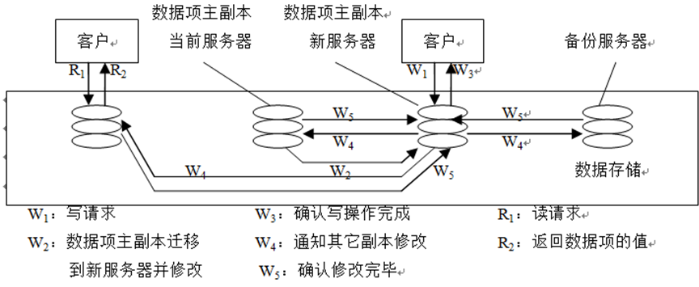

-   **复制写协议：**

    -   主动复制、

-   基于法定数量的协议：要求客户在读或写一个多副本共享数据项之前，向多个副本服务器提出请求，并得到它们的同意。

-   **高速缓存相关协议：**

分布式文件系统

分布式文件系统概述

网络文件系统

Andrew/Coda文件系统

**请简述分布式文件系统的抽象模型**

-   主要包括客户端应用、服务器端（文件服务和目录服务）、网络与远程调用

-   包含文件读写服务和目录服务

-   文件使用模式，命名与名字解析，结构与接口（远程访问模型，上载/下载模型），缓存策略与一致性，文件共享语义（顺序一致性语义，绘画语义，不修改共享文件语义，事务语义），断开操作与容错（有状态无状态服务，服务器多副本，断开操作）

**请简述网络文件系统的实现方式**

-   NFS系统组成

-   系统模型：底层是远程文件访问模型，为客户端提供透明的服务，支持硬件连接和符号连接。搜索名字→得到文件句柄→访问文件。

-   命名：名字空间、文件安装协议、文件属性、文件句柄

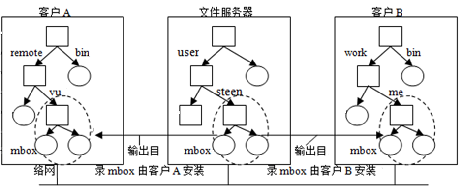

-   远程调用过程：复合调用，RPC重传，安全RPC

-   文件共享：文件加锁，文件访问控制

-   客户端缓存与服务器复制

**请详细描述Andrew/Coda文件系统的具体实现**

-   Coda系统的组成

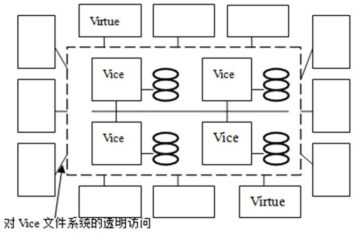

-   AFS/Coda内部组织

-   Coda文件命名

-   文件标识符

-   远程调用RPC2

-   文件共享语义

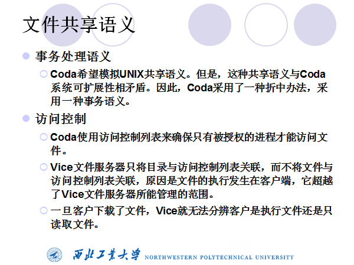

-   缓存与复制机制

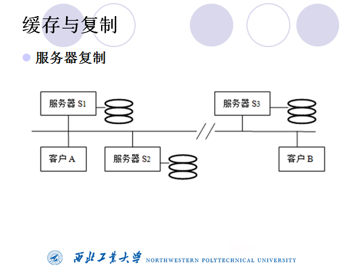

Socket编程

lJava I/O

lJava多线程

lSocket概述

lJava Socket TCP编程

l创建多线程服务器

lJava Socket UDP编程

lHTTP服务的实现

**请简述JAVA IO流的实现和选择**

**请简述java 多线程的机制**

-   扩展java.lang.Thread类

    class MyThread extends Thread {

    public MyThread(String threadName) {

    super(threadName);

    }

    @Override

    public void run() {

    //线程体

    }

    }

    //启动线程

    new MyThread ("A").start();

-   实现java.lang.Runnabe接口

    public class MyThread implements Runnable {

    @Override

    public void run() {

    //线程体

    }

    }

    //启动线程

    Thread thread1 = new Thread(new MyThread());

    thread1.start();

-   线程状态：新建(New)、就绪(start())、运行(执行run())、阻塞(wait(),sleep(),join())、销毁(退出run())

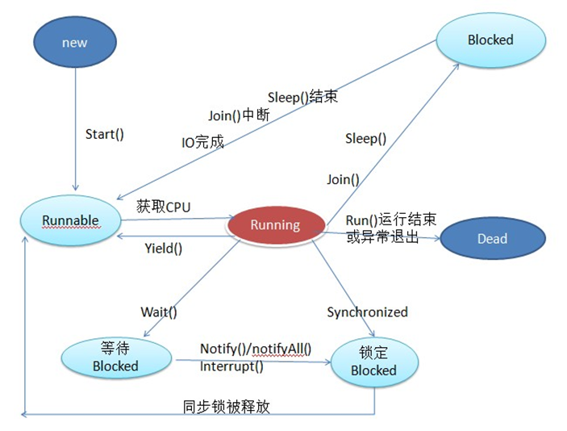

**请简述Socket基本原理**

-   套接字，实现网络进城之间的通信。

-   三元组标识网络进程（ip地址，协议，端口号）

-   包含TCP协议、UDP协议

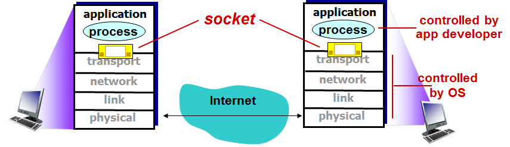

-   相关类InetAddress,InetSocketAddress,URL,

**请简述TCP编程的过程原理**

-   相关类ServerSocket、Socket；

-   步骤：建立连接→数据通信（基于数据流）→拆除连接

-   具体编程参考另一篇文章。

**请简述UDP编程的步骤**

-   相关类：DatagramSocket/DatagramPacket

-   步骤：无需建立连接直接交付数据包。创建DatagramSocket→创建接受或发送数据包DatagramPacket，填入数据→发送和接受创建好的数据包→关闭连接

-   补充：对特定地址进行数据交换，如点对点通信。可以使用connection(InetAddress
    host,int
    port)来限制当前DatagramSocket只对参数指定的主机和UDP端口收发数据。一般情况下只要指明一个数据包DatagramPacket的目的主机就行。

**请简述HTTP服务的实现**

（空白）

面向对象的分布计算

分布式对象

远程对象调用

Java RMI

公共对象请求代理结构CORBA

分布式组件对象模型DCOM

**分布式对象的定义**

分布式对象是一些独立代码的封装提，他向外提供了一个包括一组属性和方法的接口，远程客户程序通过远程方法调用来访问他。

-   特点：位置、实现透明；语言平台独立；通过预先定义好的接口访问；客户与服务器的角色划分是相对或多层次的；在网络上移动的动态性。

**远程对象方法调用**

-   远程对象引用ref={网络地址，端口号，内部ID}

-   远程对象引用的创建方式——客户启动创建新的对象

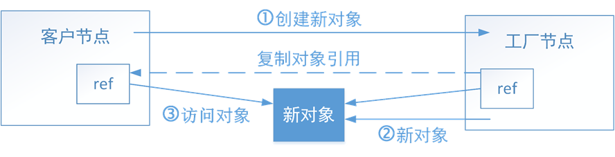

-   远程对象引用的创建方式——工厂启动创建方式

-   对象通信——远程调用（调用和被调用对象在不同过得节点上，成为远程调用）

-   相关语义：可能、至少一次、至多一次

**请简述javaRMI的实现：**

-   远程方法调用RMI（Remote Method
    Invocation）l是Java特有的分布式计算技术。它实质上是通过Java编程语言扩展了常规的过程调用，在网上不仅可以传送对象的数据，而且可以传送对象的代码。

-   RMI的体系结构

-   RMI工作流程

    1.远程对象注册与名字绑定

    2.客户按名字查找远程对象

    3.注册器返回远程对象接口

    4.客户从codebase请求stub类

    5.http服务器返回远程对象的stub类

-   RMI的应用组成

    ①远程服务的接口定义。

    ②远程服务接口的具体实现。

    ③桩(Stub)和骨架(Skeleton)文件。

    ④一个运行远程服务的服务器。

    ⑤一个RMI命名服务，它允许客户端去发现这个远程服务。

    ⑥类文件的提供者(一个HTTP或者FTP服务器)。

    ⑦一个客户端程序。

-   具体的代码示例

    **server.java**

    package server;

    import java.rmi.Naming;

    //import java.rmi.RMISecurityManager;

    import java.rmi.registry.LocateRegistry;

    public class Server {

    private static int PORT = 1099;

    public static void main(String[] args) {

    String registryURL = "rmi://localhost:"+PORT+"/RMIServer";

    try {

    ServiceImpl service = new ServiceImpl();

    LocateRegistry.createRegistry(PORT);

    Naming.bind(registryURL, service);

    System.out.println("Service Started");

    } catch (Exception e) {

    System.out.println(e);

    }

    }

    }

    **client.java**

    package client;

    import java.text.ParseException;

    import java.text.SimpleDateFormat;

    import java.util.Scanner;

    import org.omg.CORBA.PRIVATE\_MEMBER;

    import server.ServiceInterface;

    import java.net.MalformedURLException;

    import java.rmi.\*;

    public class RMIClient {

    private static int PORT;

    private static String serverName;

    public static void main(String[] args) throws Exception {

    if (args.length \< 5) {

    System.out.println("You need contain correct parameter after Client.");

    System.out.println("parameter list");

    System.out.println("usega: \<servername\> \<portunmber\> register
    \<username\> \<password\>");

    System.out.println(

    "usega: \<servername\> \<portunmber\> add \<username\> \<password\>
    \<otherusername\> \<start\> \<end\> \<title\>");

    System.out.println("usega: \<servername\> \<portunmber\> query \<username\>
    \<password\> \<start\> \<end\>");

    System.out.println("usega: \<servername\> \<portunmber\> delete \<username\>
    \<password\> \<meetingid\>");

    System.out.println("usega: \<servername\> \<portunmber\> clear \<username\>
    \<password\>");

    } else {

    //通过输出参数获取远程RMI对象的相关信息

    serverName = args[0];

    PORT = Integer.parseInt(args[1]);

    String cmd = args[2], userName = args[3], password = args[4], returnStr =
    null;

    String registryURL = "rmi://localhost:" + PORT + "/" + serverName;

    SimpleDateFormat format = new SimpleDateFormat("yyyyMMdd");

    //远程对象和访问实现过程对于客户端来说是透明的。

    ServiceInterface service = null;

    try {

    service = (ServiceInterface) Naming.lookup(registryURL);

    if (cmd.equals("register")) {

    returnStr = service.register(userName, password);

    } else if (cmd.equals("add")) {

    returnStr = service.add(userName, password, args[5], format.parse(args[6]),
    format.parse(args[7]),

    args[8]);

    } else if (cmd.equals("query")) {

    returnStr = service.query(userName, password, format.parse(args[5]),
    format.parse(args[6]));

    } else if (cmd.equals("delete")) {

    returnStr = service.delete(userName, password, Integer.parseInt(args[5]));

    } else if (cmd.equals("clear")) {

    returnStr = service.clear(userName, password);

    } else {

    returnStr = "valid cmd";

    }

    System.out.println(returnStr);

    if (returnStr.startsWith("Successful!")) {

    run(service, userName, password, format);

    }

    } catch (MalformedURLException e) {

    // TODO Auto-generated catch block

    e.printStackTrace();

    } catch (RemoteException e) {

    // TODO Auto-generated catch block

    e.printStackTrace();

    } catch (NotBoundException e) {

    // TODO Auto-generated catch block

    e.printStackTrace();

    }

    }

    }

    private static void run(ServiceInterface service, String userName, String
    password, SimpleDateFormat format)

    throws NumberFormatException, RemoteException, ParseException {

    Scanner in = new Scanner(System.in);

    String help = "RMI Meun:\\n" + "\\t 1.add\\n" + "\\t\\t arguments:
    \<username\> \<start\> \<end\> \<title\>\\n"

    \+ "\\t 2.delete\\n" + "\\t\\t arguments: \<meetingid\>\\n" + "\\t
    3.clear\\n" + "\\t\\t arguments: no args\\n"

    \+ "\\t 4.query\\n" + "\\t\\t arguments: \<start\> \<end\>\\n" + "\\t
    5.help\\n" + "\\t\\t arguments: no args\\n"

    \+ "\\t 6.quit\\n" + "\\t\\t arguments: no args\\n" + "\\nInput an
    operation:";

    String cmd;

    while (true) {

    System.out.println(help);

    cmd = in.next();

    if (cmd.equals("add")) {

    System.out.println(service.add(userName, password, in.next(),
    format.parse(in.next()),

    format.parse(in.next()), in.next()));

    } else if (cmd.equals("query")) {

    System.out.println(service.query(userName, password,
    format.parse(in.next()), format.parse(in.next())));

    } else if (cmd.equals("delete")) {

    System.out.println(service.delete(userName, password,
    Integer.parseInt(in.next())));

    } else if (cmd.equals("clear")) {

    System.out.println(service.clear(userName, password));

    } else if (cmd.equals("help")) {

    continue;

    } else if (cmd.equals("quit")) {

    System.out.println("client quit");

    break;

    } else {

    System.out.println("valid cmd");

    }

    }

    }

    }

**请简述公共对象请求代理结构CORBA概念模型**

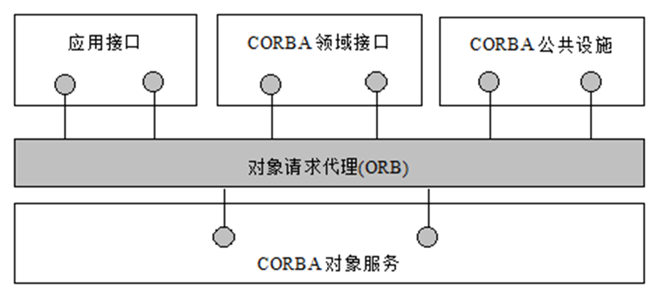

-   ORB和GIOP：CORBA对象之间交互通过对象请求代理ORB透明进行。CORBA远程对象方法调用依赖通用对象请求代理协议GIOP
    ，解决异构环境下分布式对象互操作问题。

-   CORBA公公对象服务：独立于应用领域，提供了基本服务集。

-   CORBA领域接口：与特定的应用领域有关，提供服务接口。

-   CORBA公共设施：提供了高层函数。

-   CORBA应用接口：提供可控制接口的产品。

**CORBA的组成**

-   ORB核心

-   对象适配器接口

-   接口定义与研IDL

-   静态接口

-   动态接口

**ORB提供的操作**

-   ORB初始化

-   ORB接口操作

-   获取初始对象引用

-   与线程有关的操作

-   策略设置与管理

-   对象引用操作

**CORBA的主要特点是什么？功能是什么？简述CORBA系统中ORB的作用。**

特点：

（1）CORBA定义了一种面向对象的软件构件构造方法，使不同的应用可以共享由此构造出来的软件构件；

（2）每个对象都将其内部操作细节封装起来，同时又向外界提供了精确定义的接口，从而降低了应用系统的复杂性，也降低了软件开发费用；

（3）CORBA的平台无关性实现了对象的跨平台引用，开发人员可以在更大的范围内选择最实用的对象加入到自己的应用系统之中；

（4）CORBA的语言无关性使开发人员可以在更大的范围内相互利用别人的编程技能和成果，
是实现软件复用的实用化工具

CORBA的核心是对象请求代理 (ORB，Object Request Broker)
，它提供了网络环境无关性、操作系统无关性和开发语言无关性的公共平台。

在面向对象的应用环境中，CORBA对象的请求者不必知道它所请求的对象是在哪里，是如何实现的，而是由ORB来负责跨平台的运作管理，无须应用系统的开发者干预。

具有的跨平台、分布式、面向对象等优点。

CORBA是一个中间件规范并不是一个实体软件。软件开发者通过使用第三方的ORB工具或IDL语言来定义CORBA对象，实现ORB功能。

功能：

（1）存取来自现行桌面应用程序的分布信息和资源；

（2）使现有业务数据和系统成为可供利用的网络资源；

（3）为某一特定业务用的定制的功能和能力来增强现行桌面工具和应用程序；

（4）改变和发展基于网络的系统以反映新的拓扑结构或新资源；

ORB的作用：

ORB初始化 ORB接口操作 获取初始对象引用 与线程有关的操作 策略设置与管理
对象引用操作

面向服务的分布计算

Web文档

Web Service

面向服务架构SOA

**请简述web文档包括哪些细节**

-   基于浏览器/服务器（B/S）结构

-   浏览器向Web服务器发出Web页面请求；

-   Web服务器对其上资源执行请求操作或通过公共网关接口CGI(Common Gateway
    Interface)查询数据库后，向客户返回响应，在浏览器上显示Web页面。

-   HTML、超链接、HTTP、CGI

**请简述web Service的实现方式（参考纸质版笔记）**

-   XML文档：可扩展标记语言

-   WSDL：web服务描述语言，

-   UDDI：统一描述、发现和集成协议。

-   SOAP：简单独享访问协议

**面向架构的服务实现方式——SOA概念架构（需要看书来了解内容）**
