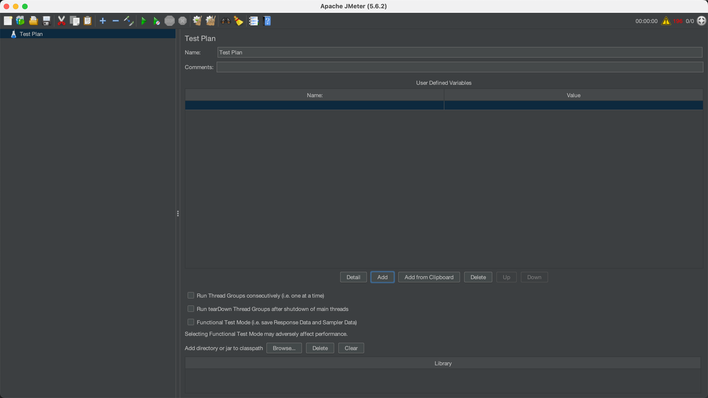
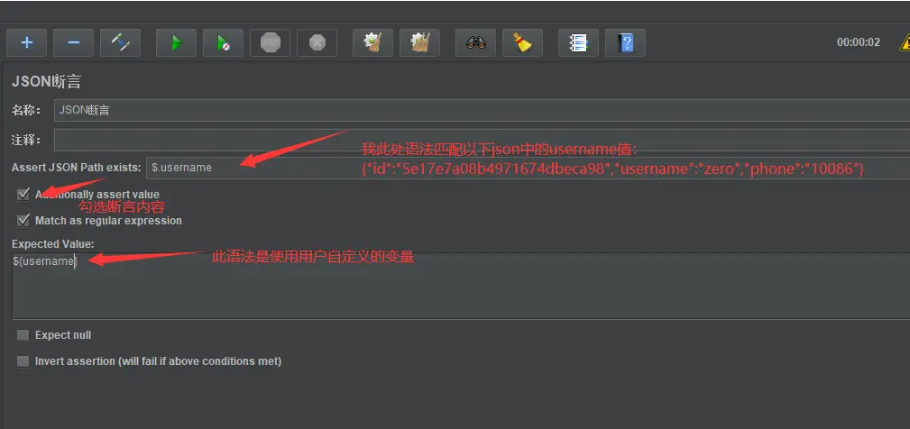

## 1 为什么性能测试

### 概述

软件性能测试是一种非功能性测试，其中应用程序的性能在预期或更高负载下进行评估。
进行性能测试以测量系统的不同性能属性，如响应时间(速度)，可靠性，资源使用，可扩展性，各种负载条件下的稳定性等。

### 基本功能

JMeter也称为“Apache JMeter”，它是一个开源的，100%基于Java的应用程序，带有图形界面。 它旨在分析和衡量Web应用程序和各种服务的性能和负载功能行为。

JMeter主要用于测试Web应用程序或FTP应用程序，但目前，它适用于功能测试，JDBC数据库连接，Web服务，通用TCP连接和OS本机进程。 您可以执行各种测试活动，如性能，负载，压力，回归和功能测试，以便针对您的Web服务器获得准确的性能指标。

* Web Services - SOAP / XML-RPC
* Web - HTTP, HTTPS sites ‘web 1.0’ web 2.0 (ajax, flex 和 flex-ws-amf)
* 通过JDBC驱动程序的数据库
* 目录 - LDAP
* 通过JMS面向消息传递的服务
* 服务 - POP3, IMAP, SMTP

## 2 使用教程

### 基本界面


## 3 核心概念

> https://www.yiibai.com/jmeter/build-jmeter-test-plan.html

* 测试计划（TestPlans）

  * 线程组（Thread Groups）

    * 采样器（Samplers）
      * 监听器
      * 配置文件
    * 监听器
    * 配置文件
  * 监听器
  * 配置文件


### 1. 测试计划

测试计划：可以将测试计划可视化为用于运行测试的JMeter脚本。测试计划由测试元素组成，例如线程组，逻辑控制器，样本生成控制器，监听器，定时器，断言和配置元素。每个测试计划中至少应有一个线程组。 我们可以根据要求添加或删除元素。

* JMeter文件或测试计划以 `.JMX`扩展文件的形式保存。JMX是一种基于开放测试的格式，它使测试计划能够在文本编辑器中启动。
* “测试计划(Test plan)”节点包含测试计划的名称和用户定义的变量。当您在测试计划的多个部分中有重复值时，可使用用户定义变量，它提供了灵活性。



### 2. 线程组
线程组：线程组表示JMeter在测试期间将使用的线程组。 线程组元素是任何测试计划的起点。
* 线程数：虚拟用户数。一个虚拟用户占用一个进程或线程。模拟多少用户访问也就填写多少个线程数量。

* Ramp-Up时间(秒)：设置的虚拟用户数需要多长时间全部启动。如果线程数为100，准备时长为5，那么需要5秒钟启动100个线程，也就是每秒钟启动20个线程。 相当于每秒模拟20个用户进行访问，设置为零我理解为并发访问。

* 循环次数：如果线程数为100，循环次数为100。那么总请求数为100*100=10000 。如果勾选了“永远”，那么所有线程会一直发送请求，直到选择停止运行脚本。


### 3. 采样器
控制器—采样器：采样器是允许JMeter将特定类型的请求发送到服务器的组件。它模拟用户对目标服务器的页面的请求。

* 采样器是必须将组件添加到测试计划中的，因为它只能让JMeter知道需要将哪种类型的请求发送到服务器。 请求可以是HTTP，HTTP(s)，FTP，TCP，SMTP，SOAP等。

http采样器支持以下的配置内容：

* 协议：向目标服务器发送HTTP请求协议，可以是HTTP或HTTPS，默认为HTTP。

* 服务器名称或IP ：HTTP请求发送的目标服务器名称或IP。

* 端口号：目标服务器的端口号，默认值为80

* 方法：发送HTTP请求的方法，可用方法包括GET、POST、HEAD、PUT、OPTIONS、TRACE、DELETE等。

* 路径：目标URL路径（URL中去掉服务器地址、端口及参数后剩余部分）。

* 内容编码：编码方式，默认为ISO-8859-1编码，这里配置为utf-8。

* 参数：同请求一起发送参数 ，在请求中发送的URL参数，用户可以将URL中所有参数设置在本表中，表中每行为一个参数（对应URL中的 key=value），注意参数传入中文时需要勾选“编码”。


添加请求。右键点击 “你的线程组” → “添加” → “取样器” → “HTTP请求”


填写接口请求参数，我这里对本地的 Spring-boot 服务进行测试(本教程所用demo源码在文章最后)，可以参考下图填写：


### 4. 监听器
监听器：性能测试就是以各种形式分析服务器响应，然后将其呈现给客户端。当JMeter的采样器组件被执行时，监听器提供JMeter收集的关于那些测试用例的数据的图形表示。它便于用户在某些日志文件中以表格，图形，树或简单文本的形式查看采样器结果。监听器可以在测试的任何地方进行调整，直接包括在测试计划下。JMeter提供了大约15个监听器，但主要使用的是表，树和图形。

* 图表结果
* 样条曲线可视化器
* 断言结果
* 简单的数据编写者
* 监控结果
* 分布图(alpha)
* 聚合图
* 梅勒展示台
* BeanShell监听器
* 总结报告
* 示例结果保存配置
* 图表完整结果
* 查看结果树
* 汇总报告
* 查看表格中的结果


添加监听器。右键点击 “你的线程组” → “添加” → “监听器” → “察看结果树”


添加结果。这里，我们修改响应数据格式(你返回什么格式就选什么，我这里是返回json)，运行Http请求，可以看到本次请求返回的响应数据。


常用的内置变量


### 5. 配置元素
配置：配置元素的工作与采样器的工作类似。但是，它不发送请求，但它允许修改采样器发出的请求。这是一个简单的元素，您可以在其中收集所有采样器的关联配置值，如webserver的主机名或数据库URL等。配置元素只能从放置元素的分支内部访问。

* Java请求默认值
* LDAP请求默认值
* LDAP扩展请求默认值
* 密钥库配置
* JDBC连接配置
* 登录配置元素
* CSV数据集配置
* FTP请求默认值
* TCP采样器配置
* 用户定义的变量
* HTTP授权管理器
* HTTP缓存管理器
* HTTP Cookie管理器
* HTTP代理服务器
* HTTP请求默认值
* HTTP标头管理器
* 简单的配置元素
* 随机变量
* 用户自定义变量


添加用户自定义变量

添加用户自定义变量用以Http请求参数化，右键点击 “你的线程组” → “添加” → “配置元件” → “用户定义的变量”：


自定义用户变量。新增一个用户名参数（与你实际请求参数key对应，做过接口测试的应该特别明白）


使用自定义变量。在Http请求中使用该参数，格式为：${key} ,例如：


### 6. 断言

json断言(因为我这里返回是json,其他需求更据实际情况选择)

添加断言：右键点击 “你的HTTP请求” → “添加” → “断言” → “json断言”


配置json断言具体内容




配置断言结果。右键点击 “你的HTTP请求” → “添加” → “监听器” → “断言结果”


查看断言结果


### 7. 聚合报告

添加聚合报告

右键点击 “你的线程组” → “添加” → “监听器” → “聚合报告”，用以存放性能测试报告


### 8. 控制器
控制器-逻辑控制器：逻辑控制器可帮助您控制线程中采样器处理顺序的流程。 它还可以更改来自其子元素的请求的顺序。

* 运行时控制器
* IF控制器
* 事务控制器
* 录音控制器
* 简单控制器
* while控制器
* Switch控制器
* ForEach控制器
* 模块控制器
* 包括控制器
* 循环控制器
* 仅一次控制器
* 交错控制器
* 随机控制器
* 随机顺序控制器
* 吞吐量控制器


### 9. 预处理器和后处理器
预处理器元素在采样器发出请求之前执行，如果预处理器附加到采样器元素，那么它将在该采样器元素运行之前执行。
预处理器元素用于在运行之前修改样本请求的设置，或更新未从响应文本中提取的变量。
以下是JMeter提供的所有预处理器元素的列表:


* JDBC预处理器
* JSR223预处理器
* RegEx用户参数
* BeanShell预处理器
* BSF预处理器
* HTML链接解析器
* HTTP URL重写修饰符
* HTTP用户参数修饰符
* 用户参数


### 10. 后处理器
在发出采样器请求之后执行后处理器元素。 如果后处理器连接到Sampler元素，那么它将在该sampler元素运行之后执行。

后处理器最常用于处理响应数据，例如，为了将来目的而提取特定值。

下面给出了JMeter提供的所有后处理器元素的列表：

* CSS/JQuery抽取器
* BeanShell后处理器
* JSR223后处理器
* JDBC后处理器
* 调试后处理器
* 正则表达式提取器
* XPath抽取器
* 结果状态操作处理程序
* BSF后处理器


## 4 脚本启动命令

在服务器上一版使用命令行启动测试脚本。

使用命令行启动 JMeter 时，可以通过命令行参数来配置 JMeter 的运行方式，比如设置测试计划文件、日志文件、执行模式以及各种系统属性等。以下是一些常用的 JMeter 命令行启动参数：

* `-n`：指定 JMeter 以**非图形界面模式**运行，适用于批量运行或分布式测试。
* `-t [测试计划.jmx]`：指定 JMeter 测试计划文件的路径。
* `-l [结果文件.jtl]`：指定 JMeter 测试结果的输出文件路径。
* `-j [日志文件.log]`：指定 JMeter 运行日志的输出文件路径。
* `-r`：告诉 JMeter 的 Master 连接到定义在 `jmeter.properties` 文件中的远程 Slave 服务器。只有在 `-n` 也被指定时才能使用 `-r`。
* `-R [逗号分隔的服务器列表]`：指定远程 Slave 服务器的列表，用于分布式测试。如 `-R 192.168.0.1,192.168.0.2`。
* `-d [目录]`：指定 JMeter 的“起始目录”，即 JMeter 将在该目录下查找用户类路径和插件。
* `-p [属性文件]`：指定 JMeter 属性文件的路径，通常是 `jmeter.properties` 文件。
* `-q [额外属性文件]`：指定一个额外的 JMeter 属性文件，可以用于覆盖默认的属性设置。
* `-J[属性名]=[值]`：直接在命令行中设置某个 JMeter 属性的值，如 `-JthreadNum=10` 设置属性 `threadNum` 的值为 10。
* `-G[属性名]=[值]`：用于分布式测试，给远程的 Slave 服务器设置全局属性。
* `-e`：在测试完成后以图形界面模式打开生成的报告分析数据。
* `-o [输出目录]`：指定输出文件夹，用于存放使用 `-e` 参数生成的 HTML 报告。如果文件夹不存在，JMeter 将会创建它。
* `-H [代理主机名]` 和 `-P [代理端口]`：配置 JMeter 使用代理服务器，如 `-H my.proxy.server -P 8000` 指定代理服务器。
* `-u` 和 `-a`：指定订阅和发布的令牌（JMeter 5.0 引入）。

典型的启动命令如下

jmeter -n -t /path/to/your/testplan.jmx -l /path/to/resultsfile.jtl

## 5 使用实例

web的使用实例：

https://www.yiibai.com/jmeter/jmeter-web-test-plan.html

https://blog.csdn.net/DY_CSDN/article/details/130016640


在 JMeter 中，从返回值中提取变量并将其用于后续请求是一个常见的需求。例如，从 JSON 或 XML 响应中提取一个字段的值（如用户 ID、Token 等），然后将该值作为参数传递给后续请求。以下是实现这一功能的详细步骤和方法：

---

## 6 使用后置处理器提取变量

JMeter 提供了多种后置处理器（Post-Processor）来解析响应数据并提取变量。根据响应格式的不同，可以选择合适的后置处理器。

### 1. **JSON 响应：使用 JSON Extractor**
如果响应是 JSON 格式，可以使用 **JSON Extractor** 提取字段值。

#### 配置步骤：
1. 在需要提取变量的 HTTP 请求下添加 **JSON Extractor**：
   - 右键点击请求 -> 添加 -> 后置处理器 -> JSON Extractor。
2. 配置 JSON Extractor：
   - **Names of created variables**：定义提取变量的名称（如 `userId`）。
   - **JSON Path Expressions**：填写 JSONPath 表达式，定位目标字段。
     - 示例：`$.data.id` 提取 `data` 对象中的 `id` 字段。
   - **Match No.**：指定匹配的索引（0 表示随机匹配，1 表示第一个匹配项）。
   - **Default Value**：如果未找到匹配项时的默认值。

#### 示例响应：
```json
{
  "status": "success",
  "data": {
    "id": 123,
    "name": "John Doe"
  }
}
```
- JSONPath 表达式：`$.data.id`
- 提取的值：`123`

#### 使用变量：
在后续请求中，可以通过 `${userId}` 引用提取的值。

---

### 2. **XML 响应：使用 XPath Extractor**
如果响应是 XML 格式，可以使用 **XPath Extractor** 提取字段值。

#### 配置步骤：
1. 在需要提取变量的 HTTP 请求下添加 **XPath Extractor**：
   - 右键点击请求 -> 添加 -> 后置处理器 -> XPath Extractor。
2. 配置 XPath Extractor：
   - **Reference Name**：定义提取变量的名称（如 `userId`）。
   - **XPath Query**：填写 XPath 表达式，定位目标字段。
     - 示例：`/response/data/id` 提取 `<id>` 元素的值。
   - **Default Value**：如果未找到匹配项时的默认值。

#### 示例响应：
```xml
<response>
  <status>success</status>
  <data>
    <id>123</id>
    <name>John Doe</name>
  </data>
</response>
```
- XPath 表达式：`/response/data/id`
- 提取的值：`123`

#### 使用变量：
在后续请求中，可以通过 `${userId}` 引用提取的值。

---

### 3. **正则表达式：使用 Regular Expression Extractor**
如果响应格式不固定（如 HTML 或非结构化文本），可以使用 **Regular Expression Extractor** 提取字段值。

#### 配置步骤：
1. 在需要提取变量的 HTTP 请求下添加 **Regular Expression Extractor**：
   - 右键点击请求 -> 添加 -> 后置处理器 -> Regular Expression Extractor。
2. 配置 Regular Expression Extractor：
   - **Reference Name**：定义提取变量的名称（如 `userId`）。
   - **Regular Expression**：填写正则表达式，匹配目标字段。
     - 示例：`"id":\s*"(\d+)"` 提取 JSON 中的 `id` 字段。
   - **Template**：指定提取的内容（通常为 `$1$` 表示第一个捕获组）。
   - **Match No.**：指定匹配的索引（0 表示随机匹配，1 表示第一个匹配项）。
   - **Default Value**：如果未找到匹配项时的默认值。

#### 示例响应：
```json
{
  "status": "success",
  "data": {
    "id": 123,
    "name": "John Doe"
  }
}
```
- 正则表达式：`"id":\s*"(\d+)"`
- 提取的值：`123`

#### 使用变量：
在后续请求中，可以通过 `${userId}` 引用提取的值。

---

### 4. **调试提取结果**

为了确保变量提取正确，可以使用以下工具进行调试：
1. **Debug Sampler**：
   - 添加一个 Debug Sampler，查看所有变量的值。
2. **View Results Tree**：
   - 查看响应内容和提取的变量值。

---

### 5. **在后续请求中使用提取的变量**

提取的变量可以直接在后续请求中引用。例如：
- **HTTP 请求参数**：
  ```plaintext
  userId=${userId}
  ```
- **HTTP 请求路径**：
  ```plaintext
  http://example.com/api/user/${userId}
  ```
- **HTTP 请求头**：
  ```plaintext
  Authorization: Bearer ${token}
  ```


## 7 异步测试(循环控制器+正则表达式+BeanShell)

> https://blog.csdn.net/u011320832/article/details/88060106
> https://blog.csdn.net/okcross0/article/details/145753556

