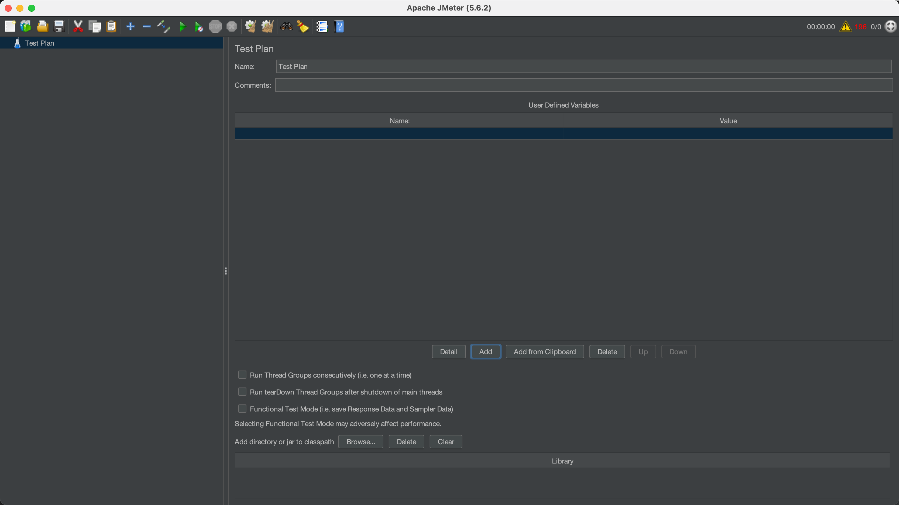

## 1 为什么性能测试

### 概述

软件性能测试是一种非功能性测试，其中应用程序的性能在预期或更高负载下进行评估。
进行性能测试以测量系统的不同性能属性，如响应时间(速度)，可靠性，资源使用，可扩展性，各种负载条件下的稳定性等。

### 基本功能

JMeter也称为“Apache JMeter”，它是一个开源的，100%基于Java的应用程序，带有图形界面。 它旨在分析和衡量Web应用程序和各种服务的性能和负载功能行为。

JMeter主要用于测试Web应用程序或FTP应用程序，但目前，它适用于功能测试，JDBC数据库连接，Web服务，通用TCP连接和OS本机进程。 您可以执行各种测试活动，如性能，负载，压力，回归和功能测试，以便针对您的Web服务器获得准确的性能指标。

* Web Services - SOAP / XML-RPC
* Web - HTTP, HTTPS sites ‘web 1.0’ web 2.0 (ajax, flex 和 flex-ws-amf)
* 通过JDBC驱动程序的数据库
* 目录 - LDAP
* 通过JMS面向消息传递的服务
* 服务 - POP3, IMAP, SMTP

## 2 使用教程

### 基本界面


### 核心概念

> https://www.yiibai.com/jmeter/build-jmeter-test-plan.html

* 测试计划（TestPlans）

  * 线程组（Thread Groups）

    * 采样器（Samplers）
      * 监听器
      * 配置文件
    * 监听器
    * 配置文件
  * 监听器
  * 配置文件


测试计划：可以将测试计划可视化为用于运行测试的JMeter脚本。测试计划由测试元素组成，例如线程组，逻辑控制器，样本生成控制器，监听器，定时器，断言和配置元素。每个测试计划中至少应有一个线程组。 我们可以根据要求添加或删除元素。

* JMeter文件或测试计划以 `.JMX`扩展文件的形式保存。JMX是一种基于开放测试的格式，它使测试计划能够在文本编辑器中启动。
* “测试计划(Test plan)”节点包含测试计划的名称和用户定义的变量。当您在测试计划的多个部分中有重复值时，可使用用户定义变量，它提供了灵活性。



线程组：线程组表示JMeter在测试期间将使用的线程组。 线程组元素是任何测试计划的起点。

* 设置线程数。
* 设置加速期。
* 设置执行测试的次数。


控制器—采样器：采样器是允许JMeter将特定类型的请求发送到服务器的组件。它模拟用户对目标服务器的页面的请求。

* 采样器是必须将组件添加到测试计划中的，因为它只能让JMeter知道需要将哪种类型的请求发送到服务器。 请求可以是HTTP，HTTP(s)，FTP，TCP，SMTP，SOAP等。


控制器-逻辑控制器：逻辑控制器可帮助您控制线程中采样器处理顺序的流程。 它还可以更改来自其子元素的请求的顺序。

* 运行时控制器
* IF控制器
* 事务控制器
* 录音控制器
* 简单控制器
* while控制器
* Switch控制器
* ForEach控制器
* 模块控制器
* 包括控制器
* 循环控制器
* 仅一次控制器
* 交错控制器
* 随机控制器
* 随机顺序控制器
* 吞吐量控制器


监听器：性能测试就是以各种形式分析服务器响应，然后将其呈现给客户端。当JMeter的采样器组件被执行时，监听器提供JMeter收集的关于那些测试用例的数据的图形表示。它便于用户在某些日志文件中以表格，图形，树或简单文本的形式查看采样器结果。监听器可以在测试的任何地方进行调整，直接包括在测试计划下。JMeter提供了大约15个监听器，但主要使用的是表，树和图形。

* 图表结果
* 样条曲线可视化器
* 断言结果
* 简单的数据编写者
* 监控结果
* 分布图(alpha)
* 聚合图
* 梅勒展示台
* BeanShell监听器
* 总结报告
* 示例结果保存配置
* 图表完整结果
* 查看结果树
* 汇总报告
* 查看表格中的结果


配置：配置元素的工作与采样器的工作类似。但是，它不发送请求，但它允许修改采样器发出的请求。这是一个简单的元素，您可以在其中收集所有采样器的关联配置值，如webserver的主机名或数据库URL等。配置元素只能从放置元素的分支内部访问。

* Java请求默认值
* LDAP请求默认值
* LDAP扩展请求默认值
* 密钥库配置
* JDBC连接配置
* 登录配置元素
* CSV数据集配置
* FTP请求默认值
* TCP采样器配置
* 用户定义的变量
* HTTP授权管理器
* HTTP缓存管理器
* HTTP Cookie管理器
* HTTP代理服务器
* HTTP请求默认值
* HTTP标头管理器
* 简单的配置元素
* 随机变量


预处理器元素在采样器发出请求之前执行，如果预处理器附加到采样器元素，那么它将在该采样器元素运行之前执行。
预处理器元素用于在运行之前修改样本请求的设置，或更新未从响应文本中提取的变量。
以下是JMeter提供的所有预处理器元素的列表:

* JDBC预处理器
* JSR223预处理器
* RegEx用户参数
* BeanShell预处理器
* BSF预处理器
* HTML链接解析器
* HTTP URL重写修饰符
* HTTP用户参数修饰符
* 用户参数


在发出采样器请求之后执行后处理器元素。 如果后处理器连接到Sampler元素，那么它将在该sampler元素运行之后执行。

后处理器最常用于处理响应数据，例如，为了将来目的而提取特定值。

下面给出了JMeter提供的所有后处理器元素的列表：

* CSS/JQuery抽取器
* BeanShell后处理器
* JSR223后处理器
* JDBC后处理器
* 调试后处理器
* 正则表达式提取器
* XPath抽取器
* 结果状态操作处理程序
* BSF后处理器


### 启动命令

在服务器上一版使用命令行启动测试脚本。

使用命令行启动 JMeter 时，可以通过命令行参数来配置 JMeter 的运行方式，比如设置测试计划文件、日志文件、执行模式以及各种系统属性等。以下是一些常用的 JMeter 命令行启动参数：

* `-n`：指定 JMeter 以**非图形界面模式**运行，适用于批量运行或分布式测试。
* `-t [测试计划.jmx]`：指定 JMeter 测试计划文件的路径。
* `-l [结果文件.jtl]`：指定 JMeter 测试结果的输出文件路径。
* `-j [日志文件.log]`：指定 JMeter 运行日志的输出文件路径。
* `-r`：告诉 JMeter 的 Master 连接到定义在 `jmeter.properties` 文件中的远程 Slave 服务器。只有在 `-n` 也被指定时才能使用 `-r`。
* `-R [逗号分隔的服务器列表]`：指定远程 Slave 服务器的列表，用于分布式测试。如 `-R 192.168.0.1,192.168.0.2`。
* `-d [目录]`：指定 JMeter 的“起始目录”，即 JMeter 将在该目录下查找用户类路径和插件。
* `-p [属性文件]`：指定 JMeter 属性文件的路径，通常是 `jmeter.properties` 文件。
* `-q [额外属性文件]`：指定一个额外的 JMeter 属性文件，可以用于覆盖默认的属性设置。
* `-J[属性名]=[值]`：直接在命令行中设置某个 JMeter 属性的值，如 `-JthreadNum=10` 设置属性 `threadNum` 的值为 10。
* `-G[属性名]=[值]`：用于分布式测试，给远程的 Slave 服务器设置全局属性。
* `-e`：在测试完成后以图形界面模式打开生成的报告分析数据。
* `-o [输出目录]`：指定输出文件夹，用于存放使用 `-e` 参数生成的 HTML 报告。如果文件夹不存在，JMeter 将会创建它。
* `-H [代理主机名]` 和 `-P [代理端口]`：配置 JMeter 使用代理服务器，如 `-H my.proxy.server -P 8000` 指定代理服务器。
* `-u` 和 `-a`：指定订阅和发布的令牌（JMeter 5.0 引入）。

典型的启动命令如下

jmeter -n -t /path/to/your/testplan.jmx -l /path/to/resultsfile.jtl

## 3 使用实例

web的使用实例：

https://www.yiibai.com/jmeter/jmeter-web-test-plan.html

## 4 自定义Jmeter采样器

<table>
<thead>
<tr>
<th>步骤</th>
<th>动作</th>
</tr>
</thead>
<tbody>
<tr>
<td>1</td>
<td>创建一个Java类并继承<code>AbstractJavaSamplerClient</code></td>
</tr>
<tr>
<td>2</td>
<td>实现<code>setupTest</code>方法，用于初始化</td>
</tr>
<tr>
<td>3</td>
<td>实现<code>runTest</code>方法，用于执行具体的请求</td>
</tr>
<tr>
<td>4</td>
<td>实现<code>teardownTest</code>方法，用于清理资源</td>
</tr>
<tr>
<td>5</td>
<td>编译并将生成的jar文件放入JMeter的lib/ext目录下</td>
</tr>
<tr>
<td>6</td>
<td>在JMeter中创建一个新的线程组</td>
</tr>
<tr>
<td>7</td>
<td>添加一个<code>Java Request</code>到线程组中，并设置相应的参数</td>
</tr>
<tr>
<td>8</td>
<td>运行测试，查看结果</td>
</tr>
</tbody>
</table>

#### 步骤 1: 创建一个Java类并继承 `AbstractJavaSamplerClient`

引入对应的依赖

```xml
        <dependency>
            <groupId>org.apache.jmeter</groupId>
            <artifactId>ApacheJMeter_core</artifactId>
            <version>4.0</version>
        </dependency>

        <dependency>
            <groupId>org.apache.jmeter</groupId>
            <artifactId>ApacheJMeter_java</artifactId>
            <version>4.0</version>
        </dependency>
```

首先，我们需要创建一个Java类，并继承 `AbstractJavaSamplerClient`。这个类将成为我们自定义Sampler的入口点。

1、setupTest 用来做一些初始化的操作，每一线程只会调用该方法一次。

2、teardownTest 用来做一些清理的操作，每一线程只会调用该方法一次。

3、getDefaultParameters 设置sample的参数以及默认值，这个方法设置的参数会显示在Java request组件的界面上。

4、runTest 这个方法就是sample的核心方法，每次迭代都会调用，并且返回SampleResult对象。由于该方法是抽象方法，所以自定的sample一定要实现该方法，其他方法可根据情况选择是否重写。

```java
package lym.iflytek.mt_scylla;

import org.apache.jmeter.config.Arguments;
import org.apache.jmeter.protocol.java.sampler.AbstractJavaSamplerClient;
import org.apache.jmeter.protocol.java.sampler.JavaSamplerContext;
import org.apache.jmeter.samplers.SampleResult;

public class TestSample extends AbstractJavaSamplerClient {
    private IatDemo iat;#业务类，具体代码不再贴出来

    public Arguments getDefaultParameters() {
        /*
        这个方法由JMeter调用，添加的Arguments参数会在界面上展示出来，可以设置默认值。
        * */
        Arguments arg = new Arguments();
        arg.addArgument("addr", "");
        arg.addArgument("appid", "");
        arg.addArgument("token", "");
        arg.addArgument("rate", "");
        arg.addArgument("filePath", "");
        arg.addArgument("printLog", "false");
        arg.addArgument("encoding", "utf-8");
        arg.addArgument("costTimeType", "3");
        return arg;
    }


    public void setupTest(JavaSamplerContext context) {
        /*进行初始化操作，每一个线程只执行一次*/
        String addr = context.getParameter("addr");
        String appid = context.getParameter("appid");
        String token = context.getParameter("token");
        String rate = context.getParameter("rate");
        String printLog = context.getParameter("printLog");
        String costTimeType = context.getParameter("costTimeType");
        iat = new IatDemo(addr, appid, token, rate, printLog, costTimeType);
        System.out.println(Thread.currentThread().getName()+":初始完成");

    }

    public void teardownTest(JavaSamplerContext context){
        /*做一些清理操作，每个线程只执行一次*/
        try {
            iat.UninitializeEx();
            System.out.println(Thread.currentThread().getName()+":逆初始化完成");
        } catch (IflytekException e) {
            getNewLogger().error(e.getMessage(), e);
        }
    }

    public SampleResult runTest(JavaSamplerContext javaSamplerContext) {
        /*每次迭代都会调用，并且返回SampleResult对象，该对象保存了每次运行的执行结果*/
        String filePath = javaSamplerContext.getParameter("filePath");
        String encoding = javaSamplerContext.getParameter("encoding");
        String costTimeType = javaSamplerContext.getParameter("costTimeType");
        #SampleResult ，用来保存每次运行的结果，以便JMeter进行数据统计。
        SampleResult sampleResult = new SampleResult();
        #通过参数控制运行时间的统计范围，如果你的业务没那么复杂，
        #完全可以在runTest开始时设置开始时间，方法结束时设置结束时间。
        if (costTimeType.equals("1")) {
            sampleResult.sampleStart();#设置运行的开始时间
        }
        try {
            String allresult = iat.start(filePath, sampleResult);

            sampleResult.setSamplerData(filePath);#设置输入数据
            sampleResult.setDataType(SampleResult.TEXT);#设置数据类型
            sampleResult.setResponseData(allresult, encoding);#设置sample接收到的数据
            sampleResult.setSuccessful(true);#设置sample执行结果
            sampleResult.setResponseCodeOK();#设置sample执行状态码

        } catch (Exception e) {
            sampleResult.setSuccessful(false);
            sampleResult.setResponseCode("500");
            sampleResult.setResponseMessage(e.getMessage());
            getNewLogger().error(e.getMessage(), e);
        }
        if (costTimeType.equals("1")) {
            #设置运行的结束时间，结束时间-开始时间，就是整个sample的运行时间
            #（JMeter就是用这个时间来计算平均响应时间的）。可以根据实际情况，设置在不同的位置。
            sampleResult.sampleEnd();
        }

        if (sampleResult.getStartTime() == 0) {
            sampleResult.sampleStart();
        }

        if (sampleResult.getEndTime() == 0) {
            sampleResult.sampleEnd();
        }
        return sampleResult;
    }

    public static void main(String[] args) {
        IflytekSample sample = new IflytekSample();
        Arguments arg = new Arguments();
        arg.addArgument("addr", "192.168.0.1:1234");
        arg.addArgument("appid", "00000000");
        arg.addArgument("token", "11111111");
        arg.addArgument("rate", "41000");
        arg.addArgument("filePath", "1.wav");
        arg.addArgument("printLog", "true");
        arg.addArgument("costTimeType", "2");

        JavaSamplerContext javaSamplerContext = new JavaSamplerContext(arg);
        sample.setupTest(javaSamplerContext);
        SampleResult sampleResult = sample.runTest(javaSamplerContext);
        System.out.println(sampleResult.getResponseDataAsString());
        sample.teardownTest(javaSamplerContext);

    }


```

#### 步骤 2: 实现 `setupTest`方法

`setupTest`方法在每个线程开始之前执行，用于初始化一些资源或设置。在这个方法中，你可以进行一些预处理的操作。

```java
@Override
public void setupTest(JavaSamplerContext context) {
    // TODO: 初始化操作
}
1.2.3.4.
```

#### 步骤 3: 实现 `runTest`方法

`runTest`方法是实际执行请求的地方。在这个方法中，你可以使用各种HTTP或其他类型的客户端库来发送请求，并处理响应。

```java
@Override
public SampleResult runTest(JavaSamplerContext context) {
    SampleResult result = new SampleResult();
    result.sampleStart(); // 标记请求的开始时间

    // TODO: 执行实际的请求操作

    result.sampleEnd(); // 标记请求的结束时间
    return result;
}
```

#### 步骤 4: 实现 `teardownTest`方法

`teardownTest`方法在每个线程结束之后执行，用于清理资源或做一些收尾的工作。

```java
@Override
public void teardownTest(JavaSamplerContext context) {
    // TODO: 清理操作
}
```

#### 步骤 5: 编译并将生成的jar文件放入JMeter的lib/ext目录下

完成以上步骤后，我们需要将代码编译成jar文件，并将该文件放入JMeter的lib/ext目录下。这样，JMeter就能够找到并加载我们自定义的Sampler。

#### 步骤 6: 在JMeter中创建一个新的线程组

在JMeter中，我们需要创建一个新的线程组来运行我们的测试。线程组表示一组并发的用户，可以设置线程数、循环次数等参数。

#### 步骤 7: 添加一个 `Java Request`到线程组中，并设置相应的参数

在线程组中，我们需要添加一个 `Java Request`。在该请求中，我们需要设置一些参数，例如类名、方法名等，以告诉JMeter我们要运行哪个自定义的Sampler。

#### 步骤 8: 运行测试，查看结果

最后，我们可以运行测试并查看结果。在结果树中，我们可以看到每个请求的响应时间、错误率等信息。

## 5 创建Jmeter集群

### 原理

1、Jmeter分布式测试时，选择其中一台作为控制机(Controller)，其它机器做为代理机(Agent)。

2、执行时，Controller会把脚本发送到每台Agent上，Agent 拿到脚本后开始执行，Agent执行时不需要启动Jmeter，只需要把jmeter-server.bat文件打开，它应该是通 过命令行模式来执行的。

3、执行后，Agent会把结果回传给Controller，Controller会收集所有Agent的信息并汇总。

### Slave配置

配置Slave的地址名称。Jmeter/bin/jmeter.properties，找到”remote_hosts=127.0.0.1”,把这一行修改为”remote_hosts=192.168.8.149:1099

```properties
# Remote Hosts - comma delimited
remote_hosts=127.0.0.1:1099
#remote_hosts=localhost:1099,localhost:2010

# RMI port to be used by the server (must start rmiregistry with same port)
server_port=1099
```

启动jmeter slave

```properties
jmeter-server
```

### Master配置

GUI方式：可以通过配置文件决定连接的remote。Jmeter/bin/jmeter.properties，找到”remote_hosts=127.0.0.1”,把这一行修改为”remote_hosts=192.168.8.149：1099,192.168.8.174：1099，1099是端口号，可以随意自定义。如果有多台代理机，这里需要把所有的代理机的IP地址和端口号都加入进来。

```properties
remote_hosts=192.168.8.149:1099,192.168.8.174:1099
```

命令行方式

```properties
jmeter -n -t Test.jmx -l test_results.csv -JserverAddr=123 -R remote_host1,remote_host2
```

### 其他问题

一个比较标准的参数解决方案如下：

```
Jserver.rmi.ssl.disable=true -Jjava.net.preferIPv4Stack=true -Jjava.net.preferIPv6Addresses=false -Jsearch_paths=/home/admin/run
```

配置user.properties关闭http用户校验

```properties
server.rmi.ssl.disable=true
```

配置system.properties中ipv4网络协议

```properties
java.net.preferIPv4Stack=true
java.net.preferIPv6Addresses=false
```
