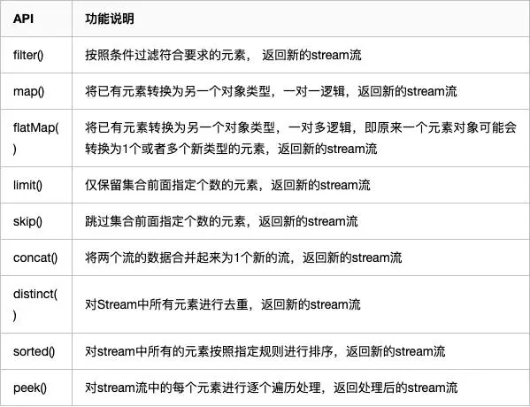
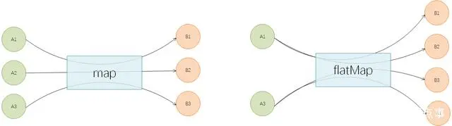

# Java 8 数据流教程


## 1 数据流原理
### 基本原理

> 数据流和输入输出流不同
这个示例驱动的教程是Java8**数据流**（Stream）的深入总结。当我第一次看到`Stream`API时，我非常疑惑，因为它听起来和Java IO的`InputStream` 和 `OutputStream`一样。但是Java8的数据流是完全不同的东西。


> 在函数式编程中，单体是一个结构，表示定义为步骤序列的计算。单体结构的类型定义了它对链式操作，或具有相同类型的嵌套函数的含义。

### 数据流的链式操作
数据流表示元素的序列，并支持不同种类的操作来执行元素上的计算：

```java
List<String> myList =
    Arrays.asList("a1", "a2", "b1", "c2", "c1");

myList
    .stream()
    .filter(s -> s.startsWith("c"))
    .map(String::toUpperCase)
    .sorted()
    .forEach(System.out::println);
```
* 这种数据流的链式操作也叫作操作流水线。
* 多数数据流操作都接受一些lambda表达式参数，函数式接口用来指定操作的具体行为。这些操作的大多数必须是无干扰而且是无状态的。
  * 当一个函数不修改数据流的底层数据源，它就是**无干扰的**。例如，在上面的例子中，没有任何lambda表达式通过添加或删除集合元素修改`myList`。
  * 当一个函数的操作的执行是确定性的，它就是**无状态的**。例如，在上面的例子中，没有任何lambda表达式依赖于外部作用域中任何在操作过程中可变的变量或状态。

## 2 数据流的不同类型
数据流可以从多种数据源创建，
### 从集合创建
`List`和`Set`支持新方法`stream()` 和 `parallelStream()`，来创建串行流或并行流。并行流能够在多个线程上执行操作。我们现在来看看串行流：

```java
Arrays.asList("a1", "a2", "a3")
    .stream()
    .findFirst()
    .ifPresent(System.out::println);  // a1
```

### Stream类创建
在对象列表上调用`stream()`方法会返回一个通常的对象流。但是我们不需要创建一个集合来创建数据流，就像下面那样：

```java
Stream.of("a1", "a2", "a3")
    .findFirst()
    .ifPresent(System.out::println);  // a1
```

只要使用`Stream.of()`，就可以从一系列对象引用中创建数据流。

### 基本数据流
Java8还自带了特殊种类的流，用于处理基本数据类型`int`、`long` 和 `double`。`IntStream`、`LongStream` 和 `DoubleStream`。

`IntStream`可以使用`IntStream.range()`替换通常的`for`循环：

```java
IntStream.range(1, 4)
    .forEach(System.out::println);
// 1
// 2
// 3
```

所有这些基本数据流都像通常的对象数据流一样，但有一些不同。基本的数据流使用特殊的lambda表达式，例如，`IntFunction`而不是`Function`，`IntPredicate`而不是`Predicate`。而且基本数据流支持额外的聚合终止操作`sum()`和`average()`：

```java
Arrays.stream(new int[] {1, 2, 3})
    .map(n -> 2 * n + 1)
    .average()
    .ifPresent(System.out::println);  // 5.0
```

有时需要将通常的对象数据流转换为基本数据流，或者相反。出于这种目的，对象数据流支持特殊的映射操作`mapToInt()`、`mapToLong()` 和 `mapToDouble()`：

```java
Stream.of("a1", "a2", "a3")
    .map(s -> s.substring(1))
    .mapToInt(Integer::parseInt)
    .max()
    .ifPresent(System.out::println);  // 3
```

基本数据流可以通过`mapToObj()`转换为对象数据流：

```java
IntStream.range(1, 4)
    .mapToObj(i -> "a" + i)
    .forEach(System.out::println);

// a1
// a2
// a3
```

下面是组合示例：浮点数据流首先映射为整数数据流，之后映射为字符串的对象数据流：

```java
Stream.of(1.0, 2.0, 3.0)
    .mapToInt(Double::intValue)
    .mapToObj(i -> "a" + i)
    .forEach(System.out::println);

// a1
// a2
// a3
```

## 3 处理顺序

### 衔接操作和终止操作
衔接操作的一个重要特性就是延迟性。观察下面没有终止操作的例子：

```java
Stream.of("d2", "a2", "b1", "b3", "c")
    .filter(s -> {
        System.out.println("filter: " + s);
        return true;
    });
```

执行这段代码时，不向控制台打印任何东西。这是因为衔接操作只在终止操作调用时被执行。

### 垂直执行
让我们通过添加终止操作`forEach`来扩展这个例子：

```java
Stream.of("d2", "a2", "b1", "b3", "c")
    .filter(s -> {
        System.out.println("filter: " + s);
        return true;
    })
    .forEach(s -> System.out.println("forEach: " + s));
```

执行这段代码会得到如下输出：

```
filter:  d2
forEach: d2
filter:  a2
forEach: a2
filter:  b1
forEach: b1
filter:  b3
forEach: b3
filter:  c
forEach: c
```

结果的顺序可能出人意料。原始的方法会在数据流的所有元素上，一个接一个地水平执行所有操作。但是每个元素在调用链上垂直移动。第一个字符串`"d2"`首先经过`filter`然后是`forEach`，执行完后才开始处理第二个字符串`"a2"`。

这种行为可以减少每个元素上所执行的实际操作数量，就像我们在下个例子中看到的那样：

```java
Stream.of("d2", "a2", "b1", "b3", "c")
    .map(s -> {
        System.out.println("map: " + s);
        return s.toUpperCase();
    })
    .anyMatch(s -> {
        System.out.println("anyMatch: " + s);
        return s.startsWith("A");
    });

// map:      d2
// anyMatch: D2
// map:      a2
// anyMatch: A2
```

只要提供的数据元素满足了谓词，`anyMatch`操作就会返回`true`。对于第二个传递`"A2"`的元素，它的结果为真。由于数据流的链式调用是垂直执行的，`map`这里只需要执行两次。所以`map`会执行尽可能少的次数，而不是把所有元素都映射一遍。

### 先过滤排除

下面的例子由两个衔接操作`map`和`filter`，以及一个终止操作`forEach`组成。让我们再来看看这些操作如何执行：

```java
Stream.of("d2", "a2", "b1", "b3", "c")
    .map(s -> {
        System.out.println("map: " + s);
        return s.toUpperCase();
    })
    .filter(s -> {
        System.out.println("filter: " + s);
        return s.startsWith("A");
    })
    .forEach(s -> System.out.println("forEach: " + s));

// map:     d2
// filter:  D2
// map:     a2
// filter:  A2
// forEach: A2
// map:     b1
// filter:  B1
// map:     b3
// filter:  B3
// map:     c
// filter:  C
```

就像你可能猜到的那样，`map`和`filter`会对底层集合的每个字符串调用五次，而`forEach`只会调用一次。

如果我们调整操作顺序，将`filter`移动到调用链的顶端，就可以极大减少操作的执行次数:

```java
Stream.of("d2", "a2", "b1", "b3", "c")
    .filter(s -> {
        System.out.println("filter: " + s);
        return s.startsWith("a");
    })
    .map(s -> {
        System.out.println("map: " + s);
        return s.toUpperCase();
    })
    .forEach(s -> System.out.println("forEach: " + s));

// filter:  d2
// filter:  a2
// map:     a2
// forEach: A2
// filter:  b1
// filter:  b3
// filter:  c
```

##  4 复用数据流

Java8的数据流不能被复用。一旦你调用了任何终止操作，数据流就关闭了：

```java
Stream<String> stream =
    Stream.of("d2", "a2", "b1", "b3", "c")
        .filter(s -> s.startsWith("a"));

stream.anyMatch(s -> true);    // ok
stream.noneMatch(s -> true);   // exception
```

在相同数据流上，在`anyMatch`之后调用`noneMatch`会产生下面的异常：

```
java.lang.IllegalStateException: stream has already been operated upon or closed
    at java.util.stream.AbstractPipeline.evaluate(AbstractPipeline.java:229)
    at java.util.stream.ReferencePipeline.noneMatch(ReferencePipeline.java:459)
    at com.winterbe.java8.Streams5.test7(Streams5.java:38)
    at com.winterbe.java8.Streams5.main(Streams5.java:28)
```

要克服这个限制，我们需要为每个我们想要执行的终止操作创建新的数据流调用链。例如，我们创建一个数据流供应器，来构建新的数据流，并且设置好所有衔接操作：

```java
Supplier<Stream<String>> streamSupplier =
    () -> Stream.of("d2", "a2", "b1", "b3", "c")
            .filter(s -> s.startsWith("a"));

streamSupplier.get().anyMatch(s -> true);   // ok
streamSupplier.get().noneMatch(s -> true);  // ok
```

每次对`get()`的调用都构造了一个新的数据流，我们将其保存来调用终止操作。

## 5 高级操作

数据流执行大量的不同操作。我们已经了解了一些最重要的操作，例如`filter`和`map`。我将它们留给你来探索所有其他的可用操作。下面让我们深入了解一些更复杂的操作：`collect`、`flatMap`和`reduce`。

这一节的大部分代码示例使用下面的`Person`列表来演示：

```java
class Person {
    String name;
    int age;

    Person(String name, int age) {
        this.name = name;
        this.age = age;
    }

    @Override
    public String toString() {
        return name;
    }
}

List<Person> persons =
    Arrays.asList(
        new Person("Max", 18),
        new Person("Peter", 23),
        new Person("Pamela", 23),
        new Person("David", 12));
```

### `collect`

`collect`是非常有用的终止操作，将流中的元素存放在不同类型的结果中，例如`List`、`Set`或者`Map`。`collect`接受收集器（Collector），它由四个不同的操作组成：供应器（supplier）、累加器（accumulator）、组合器（combiner）和终止器（finisher）。这在开始听起来十分复杂，但是Java8通过内置的`Collectors`类支持多种内置的收集器。所以对于大部分常见操作，你并不需要自己实现收集器。

让我们以一个非常常见的用例来开始：

```java
List<Person> filtered =
    persons
        .stream()
        .filter(p -> p.name.startsWith("P"))
        .collect(Collectors.toList());

System.out.println(filtered);    // [Peter, Pamela]
```

就像你看到的那样，它非常简单，只是从流的元素中构造了一个列表。如果需要以`Set`来替代`List`，只需要使用`Collectors.toSet()`就好了。

下面的例子按照年龄对所有人进行分组：

```java
Map<Integer, List<Person>> personsByAge = persons
    .stream()
    .collect(Collectors.groupingBy(p -> p.age));

personsByAge
    .forEach((age, p) -> System.out.format("age %s: %s\n", age, p));

// age 18: [Max]
// age 23: [Peter, Pamela]
// age 12: [David]
```

收集器十分灵活。你也可以在流的元素上执行聚合，例如，计算所有人的平均年龄：

```java
Double averageAge = persons
    .stream()
    .collect(Collectors.averagingInt(p -> p.age));

System.out.println(averageAge);     // 19.0
```

如果你对更多统计学方法感兴趣，概要收集器返回一个特殊的内置概要统计对象，所以我们可以简单计算最小年龄、最大年龄、算术平均年龄、总和和数量。

```java
IntSummaryStatistics ageSummary =
    persons
        .stream()
        .collect(Collectors.summarizingInt(p -> p.age));

System.out.println(ageSummary);
// IntSummaryStatistics{count=4, sum=76, min=12, average=19.000000, max=23}
```

下面的例子将所有人连接为一个字符串：

```java
String phrase = persons
    .stream()
    .filter(p -> p.age >= 18)
    .map(p -> p.name)
    .collect(Collectors.joining(" and ", "In Germany ", " are of legal age."));

System.out.println(phrase);
// In Germany Max and Peter and Pamela are of legal age.
```

连接收集器接受分隔符，以及可选的前缀和后缀。

既然我们知道了一些最强大的内置收集器，让我们来尝试构建自己的特殊收集器吧。我们希望将流中的所有人转换为一个字符串，包含所有大写的名称，并以`|`分割。为了完成它，我们通过`Collector.of()`创建了一个新的收集器。我们需要传递一个收集器的四个组成部分：供应器、累加器、组合器和终止器。

```java
Collector<Person, StringJoiner, String> personNameCollector =
    Collector.of(
        () -> new StringJoiner(" | "),          // supplier
        (j, p) -> j.add(p.name.toUpperCase()),  // accumulator
        (j1, j2) -> j1.merge(j2),               // combiner
        StringJoiner::toString);                // finisher

String names = persons
    .stream()
    .collect(personNameCollector);

System.out.println(names);  // MAX | PETER | PAMELA | DAVID
```

由于Java中的字符串是不可变的，我们需要一个助手类`StringJointer`。让收集器构造我们的字符串。供应器最开始使用相应的分隔符构造了这样一个`StringJointer`。累加器用于将每个人的大写名称加到`StringJointer`中。组合器知道如何把两个`StringJointer`合并为一个。最后一步，终结器从`StringJointer`构造出预期的字符串。

### `flatMap`

我们已经了解了如何通过使用`map`操作，将流中的对象转换为另一种类型。`map`有时十分受限，因为每个对象只能映射为一个其它对象。但如何我希望将一个对象转换为多个或零个其他对象呢？`flatMap`这时就会派上用场。

`flatMap`将流中的每个元素，转换为其它对象的流。所以每个对象会被转换为零个、一个或多个其它对象，以流的形式返回。这些流的内容之后会放进`flatMap`所返回的流中。

在我们了解`flatMap`如何使用之前，我们需要相应的类型体系：

```java
class Foo {
    String name;
    List<Bar> bars = new ArrayList<>();

    Foo(String name) {
        this.name = name;
    }
}

class Bar {
    String name;

    Bar(String name) {
        this.name = name;
    }
}
```

下面，我们使用我们自己的关于流的知识来实例化一些对象：

```java
List<Foo> foos = new ArrayList<>();

// create foos
IntStream
    .range(1, 4)
    .forEach(i -> foos.add(new Foo("Foo" + i)));

// create bars
foos.forEach(f ->
    IntStream
        .range(1, 4)
        .forEach(i -> f.bars.add(new Bar("Bar" + i + " <- " + f.name))));
```

现在我们拥有了含有三个`foo`的列表，每个都含有三个`bar`。

`flatMap`接受返回对象流的函数。所以为了处理每个`foo`上的`bar`对象，我们需要传递相应的函数：

```java
foos.stream()
    .flatMap(f -> f.bars.stream())
    .forEach(b -> System.out.println(b.name));

// Bar1 <- Foo1
// Bar2 <- Foo1
// Bar3 <- Foo1
// Bar1 <- Foo2
// Bar2 <- Foo2
// Bar3 <- Foo2
// Bar1 <- Foo3
// Bar2 <- Foo3
// Bar3 <- Foo3
```

像你看到的那样，我们成功地将含有三个`foo`对象中的流转换为含有九个`bar`对象的流。

最后，上面的代码示例可以简化为流式操作的单一流水线：

```java
IntStream.range(1, 4)
    .mapToObj(i -> new Foo("Foo" + i))
    .peek(f -> IntStream.range(1, 4)
        .mapToObj(i -> new Bar("Bar" + i + " <- " + f.name))
        .forEach(f.bars::add))
    .flatMap(f -> f.bars.stream())
    .forEach(b -> System.out.println(b.name));
```

`flatMap`也可用于Java8引入的`Optional`类。`Optional`的`flatMap`操作返回一个`Optional`或其他类型的对象。所以它可以用于避免烦人的`null`检查。

考虑像这样更复杂的层次结构：

```java
class Outer {
    Nested nested;
}

class Nested {
    Inner inner;
}

class Inner {
    String foo;
}
```

为了处理外层示例上的内层字符串`foo`，你需要添加多个`null`检查来避免潜在的`NullPointerException`：

```java
Outer outer = new Outer();
if (outer != null && outer.nested != null && outer.nested.inner != null) {
    System.out.println(outer.nested.inner.foo);
}
```

可以使用`Optional`的`flatMap`操作来完成相同的行为：

```java
Optional.of(new Outer())
    .flatMap(o -> Optional.ofNullable(o.nested))
    .flatMap(n -> Optional.ofNullable(n.inner))
    .flatMap(i -> Optional.ofNullable(i.foo))
    .ifPresent(System.out::println);
```

如果存在的话，每个`flatMap`的调用都会返回预期对象的`Optional`包装，否则为`null`的`Optional`包装。

### `reduce`

归约操作将所有流中的元素组合为单一结果。Java8支持三种不同类型的`reduce`方法。第一种将流中的元素归约为流中的一个元素。让我们看看我们如何使用这个方法来计算出最老的人：

```java
persons
    .stream()
    .reduce((p1, p2) -> p1.age > p2.age ? p1 : p2)
    .ifPresent(System.out::println);    // Pamela
```

`reduce`方法接受`BinaryOperator`积累函数。它实际上是两个操作数类型相同的`BiFunction`。`BiFunction`就像是`Function`，但是接受两个参数。示例中的函数比较两个人的年龄，来返回年龄较大的人。

第二个`reduce`方法接受一个初始值，和一个`BinaryOperator`累加器。这个方法可以用于从流中的其它`Person`对象中构造带有聚合后名称和年龄的新`Person`对象。

```java
Person result =
    persons
        .stream()
        .reduce(new Person("", 0), (p1, p2) -> {
            p1.age += p2.age;
            p1.name += p2.name;
            return p1;
        });

System.out.format("name=%s; age=%s", result.name, result.age);
// name=MaxPeterPamelaDavid; age=76
```

第三个`reduce`对象接受三个参数：初始值，`BiFunction`累加器和`BinaryOperator`类型的组合器函数。由于初始值的类型不一定为`Person`，我们可以使用这个归约函数来计算所有人的年龄总和。：

```java
Integer ageSum = persons
    .stream()
    .reduce(0, (sum, p) -> sum += p.age, (sum1, sum2) -> sum1 + sum2);

System.out.println(ageSum);  // 76
```

你可以看到结果是76。但是背后发生了什么？让我们通过添加一些调试输出来扩展上面的代码：

```java
Integer ageSum = persons
    .stream()
    .reduce(0,
        (sum, p) -> {
            System.out.format("accumulator: sum=%s; person=%s\n", sum, p);
            return sum += p.age;
        },
        (sum1, sum2) -> {
            System.out.format("combiner: sum1=%s; sum2=%s\n", sum1, sum2);
            return sum1 + sum2;
        });

// accumulator: sum=0; person=Max
// accumulator: sum=18; person=Peter
// accumulator: sum=41; person=Pamela
// accumulator: sum=64; person=David
```

你可以看到，累加器函数做了所有工作。它首先使用初始值`0`和第一个人Max来调用累加器。接下来的三步中`sum`会持续增加，直到76。

等一下。好像组合器从来没有调用过？以并行方式执行相同的流会揭开这个秘密：

```java
Integer ageSum = persons
    .parallelStream()
    .reduce(0,
        (sum, p) -> {
            System.out.format("accumulator: sum=%s; person=%s\n", sum, p);
            return sum += p.age;
        },
        (sum1, sum2) -> {
            System.out.format("combiner: sum1=%s; sum2=%s\n", sum1, sum2);
            return sum1 + sum2;
        });

// accumulator: sum=0; person=Pamela
// accumulator: sum=0; person=David
// accumulator: sum=0; person=Max
// accumulator: sum=0; person=Peter
// combiner: sum1=18; sum2=23
// combiner: sum1=23; sum2=12
// combiner: sum1=41; sum2=35
```

这个流的并行执行行为会完全不同。现在实际上调用了组合器。由于累加器被并行调用，组合器需要用于计算部分累加值的总和。

下一节我们会深入了解并行流。

## 6 并行流

流可以并行执行，在大量输入元素上可以提升运行时的性能。并行流使用公共的`ForkJoinPool`，由`ForkJoinPool.commonPool()`方法提供。底层线程池的大小最大为五个线程 -- 取决于CPU的物理核数。

```java
ForkJoinPool commonPool = ForkJoinPool.commonPool();
System.out.println(commonPool.getParallelism());    // 3
```

在我的机器上，公共池默认初始化为3。这个值可以通过设置下列JVM参数来增减：

```
-Djava.util.concurrent.ForkJoinPool.common.parallelism=5
```

集合支持`parallelStream()`方法来创建元素的并行流。或者你可以在已存在的数据流上调用衔接方法`parallel()`，将串行流转换为并行流。

为了描述并行流的执行行为，下面的例子向`sout`打印了当前线程的信息。

```java
Arrays.asList("a1", "a2", "b1", "c2", "c1")
    .parallelStream()
    .filter(s -> {
        System.out.format("filter: %s [%s]\n",
            s, Thread.currentThread().getName());
        return true;
    })
    .map(s -> {
        System.out.format("map: %s [%s]\n",
            s, Thread.currentThread().getName());
        return s.toUpperCase();
    })
    .forEach(s -> System.out.format("forEach: %s [%s]\n",
        s, Thread.currentThread().getName()));
```

通过分析调试输出，我们可以对哪个线程用于执行流式操作拥有更深入的理解：

```
filter:  b1 [main]
filter:  a2 [ForkJoinPool.commonPool-worker-1]
map:     a2 [ForkJoinPool.commonPool-worker-1]
filter:  c2 [ForkJoinPool.commonPool-worker-3]
map:     c2 [ForkJoinPool.commonPool-worker-3]
filter:  c1 [ForkJoinPool.commonPool-worker-2]
map:     c1 [ForkJoinPool.commonPool-worker-2]
forEach: C2 [ForkJoinPool.commonPool-worker-3]
forEach: A2 [ForkJoinPool.commonPool-worker-1]
map:     b1 [main]
forEach: B1 [main]
filter:  a1 [ForkJoinPool.commonPool-worker-3]
map:     a1 [ForkJoinPool.commonPool-worker-3]
forEach: A1 [ForkJoinPool.commonPool-worker-3]
forEach: C1 [ForkJoinPool.commonPool-worker-2]
```

就像你看到的那样，并行流使用了所有公共的`ForkJoinPool`中的可用线程来执行流式操作。在连续的运行中输出可能有所不同，因为所使用的特定线程是非特定的。

让我们通过添加额外的流式操作`sort`来扩展这个示例：

```java
Arrays.asList("a1", "a2", "b1", "c2", "c1")
    .parallelStream()
    .filter(s -> {
        System.out.format("filter: %s [%s]\n",
            s, Thread.currentThread().getName());
        return true;
    })
    .map(s -> {
        System.out.format("map: %s [%s]\n",
            s, Thread.currentThread().getName());
        return s.toUpperCase();
    })
    .sorted((s1, s2) -> {
        System.out.format("sort: %s <> %s [%s]\n",
            s1, s2, Thread.currentThread().getName());
        return s1.compareTo(s2);
    })
    .forEach(s -> System.out.format("forEach: %s [%s]\n",
        s, Thread.currentThread().getName()));
```

结果起初可能比较奇怪：

```
filter:  c2 [ForkJoinPool.commonPool-worker-3]
filter:  c1 [ForkJoinPool.commonPool-worker-2]
map:     c1 [ForkJoinPool.commonPool-worker-2]
filter:  a2 [ForkJoinPool.commonPool-worker-1]
map:     a2 [ForkJoinPool.commonPool-worker-1]
filter:  b1 [main]
map:     b1 [main]
filter:  a1 [ForkJoinPool.commonPool-worker-2]
map:     a1 [ForkJoinPool.commonPool-worker-2]
map:     c2 [ForkJoinPool.commonPool-worker-3]
sort:    A2 <> A1 [main]
sort:    B1 <> A2 [main]
sort:    C2 <> B1 [main]
sort:    C1 <> C2 [main]
sort:    C1 <> B1 [main]
sort:    C1 <> C2 [main]
forEach: A1 [ForkJoinPool.commonPool-worker-1]
forEach: C2 [ForkJoinPool.commonPool-worker-3]
forEach: B1 [main]
forEach: A2 [ForkJoinPool.commonPool-worker-2]
forEach: C1 [ForkJoinPool.commonPool-worker-1]
```

`sort`看起来只在主线程上串行执行。实际上，并行流上的`sort`在背后使用了Java8中新的方法`Arrays.parallelSort()`。如[javadoc](https://docs.oracle.com/javase/8/docs/api/java/util/Arrays.html#parallelSort-T:A-)所说，这个方法会参照数据长度来决定以串行或并行来执行。

> 如果指定数据的长度小于最小粒度，它使用相应的`Arrays.sort`方法来排序。

返回上一节中`reduce`的例子。我们已经发现了组合器函数只在并行流中调用，而不在串行流中调用。让我们来观察实际上涉及到哪个线程：

```java
List<Person> persons = Arrays.asList(
    new Person("Max", 18),
    new Person("Peter", 23),
    new Person("Pamela", 23),
    new Person("David", 12));

persons
    .parallelStream()
    .reduce(0,
        (sum, p) -> {
            System.out.format("accumulator: sum=%s; person=%s [%s]\n",
                sum, p, Thread.currentThread().getName());
            return sum += p.age;
        },
        (sum1, sum2) -> {
            System.out.format("combiner: sum1=%s; sum2=%s [%s]\n",
                sum1, sum2, Thread.currentThread().getName());
            return sum1 + sum2;
        });
```

控制台的输出表明，累加器和组合器都在所有可用的线程上并行执行：

```
accumulator: sum=0; person=Pamela; [main]
accumulator: sum=0; person=Max;    [ForkJoinPool.commonPool-worker-3]
accumulator: sum=0; person=David;  [ForkJoinPool.commonPool-worker-2]
accumulator: sum=0; person=Peter;  [ForkJoinPool.commonPool-worker-1]
combiner:    sum1=18; sum2=23;     [ForkJoinPool.commonPool-worker-1]
combiner:    sum1=23; sum2=12;     [ForkJoinPool.commonPool-worker-2]
combiner:    sum1=41; sum2=35;     [ForkJoinPool.commonPool-worker-2]
```

总之，并行流对拥有大量输入元素的数据流具有极大的性能提升。但是要记住一些并行流的操作，例如`reduce`和`collect`需要额外的计算（组合操作），这在串行执行时并不需要。

此外我们已经了解，所有并行流操作都共享相同的JVM相关的公共`ForkJoinPool`。所以你可能需要避免实现又慢又卡的流式操作，因为它可能会拖慢你应用中严重依赖并行流的其它部分。


## 7 功能列表


### 中间管道



### 终止管道


### map&flatmap

map与flatMap都是用于转换已有的元素为其它元素，区别点在于：
* map 必须是一对一的，即每个元素都只能转换为1个新的元素
* flatMap 可以是一对多的，即每个元素都可以转换为1个或者多个新的元素




### peek和foreach方法
peek和foreach，都可以用于对元素进行遍历然后逐个的进行处理。

但根据前面的介绍，peek属于中间方法，而foreach属于终止方法。这也就意味着peek只能作为管道中途的一个处理步骤，而没法直接执行得到结果，其后面必须还要有其它终止操作的时候才会被执行；而foreach作为无返回值的终止方法，则可以直接执行相关操作。