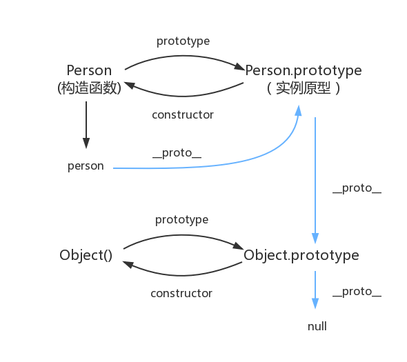

# 原型与继承
[参考文献](cnblogs.com/loveyaxin/p/11151586.html)
## 1 函数与对象的表面关系

* 函数是函数，对象是对象。
* 函数本身也是特殊对象，typeof 返回function。函数返回值可以是对象。
* 对象可以包含函数属性。typeof 返回object
* 函数可以作为对象的模板，称为对象构造器，typeof返回值，返回object。常见的内置类型构造器，首字母大写，通过new关键字，返回新的对象。new Array（）；new Function()；
* 变量可以指向函数，也可以指向对象。
* 函数的定义方法 function(){}匿名函数；或者function name(){}
* 对象的定义方法 new Creator();或者{}。从对象构造器中创建对象，或者直接创建对象。通过new创建的对象，proto指向Creator()对象构造器。通过{}创建的对象，proto指向Object()对象构造起，会形成，proto链。


## 2 原型

### 函数原型
* 原型的概念：每一个javascript对象(除null外)创建的时候，就会与之关联另一个对象，这个对象就是我们所说的原型，每一个对象都会从原型中“继承”属性。


```javascript
function Person(age) {
    this.age = age       
}
Person.prototype.name = 'kavin'
var person1 = new Person()
var person2 = new Person()
console.log(person1.name) //kavin
console.log(person2.name)  //kavin
```
* 在JavaScript中，每个函数都有一个prototype属性，这个属性指向函数的原型对象。函数的prototype指向了一个对象，而这个对象正是调用构造函数时创建的实例的原型，也就是person1和person2的原型。


### 对象原型

* 每个对象(除null外)都会有的属性，叫做__proto__，这个属性会指向该对象的原型。


### construtor构造函数

* 每个原型都有一个constructor属性，指向该关联的构造函数。


### 实例与原型
* 当读取实例的属性时，如果找不到，就会查找与对象关联的原型中的属性，如果还查不到，就去找原型的原型，一直找到最顶层为止。
```
function Person() {

}

Person.prototype.name = 'Kevin';

var person = new Person();

person.name = 'Daisy';
console.log(person.name) // Daisy

delete person.name;
console.log(person.name) // Kevin
```

### 原型的原型

原型也是一个对象，既然是对象，我们就可以用最原始的方式创建它，那就是：
```
var obj = new Object();
obj.name = 'Kevin'
console.log(obj.name) // Kevin
```

其实原型对象就是通过 Object 构造函数生成的，结合之前所讲，实例的 __proto__ 指向构造函数的 prototype .


### 原型链

*  简单的回顾一下构造函数、原型和实例的关系：每个构造函数都有一个原型对象，原型对象都包含一个指向构造函数的指针，而实例都包含一个指向原型对象的内部指针。那么假如我们让原型对象等于另一个类型的实例，结果会怎样？显然，此时的原型对象将包含一个指向另一个原型的指针，相应地，另一个原型中也包含着一个指向另一个构造函数的指针。假如另一个原型又是另一个类型的实例，那么上述关系依然成立。如此层层递进，就构成了实例与原型的链条。这就是所谓的原型链的基本概念。




### 补充

* 函数的原型属性，指向原型对象。prototype属性。
* 对象的原型属性，指向原型对象。__proto__属性。
* 原型对象是实例的原型。
* 原型对象的constructor指向对象构造器，也就是函数。
* 原型对象通过constructor和对象构造器通过prototype构成了指向环。
* 原型对象本身也是实例，她本身也具有原型对象。通过原型对象的原型对象，形成了原型链。原型对象通过__prpto__属性指向自己的原型。

> 也就是说，原型对象，有两个属性，一个是构造器constructor，指向对象构造器。另一个属性指向自身的原型对象。普通对象没有constructor属性。