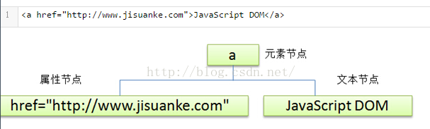
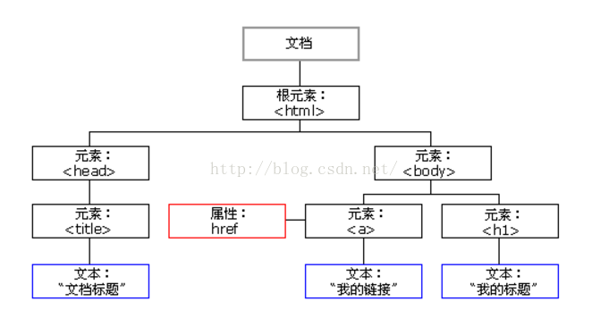

# Dom 相关的常用的操作

## 1 基础操作

### 五种节点类型

* 文档是一个文档节点。
* 所有的HTML元素都是元素节点。
* 所有 HTML 属性都是属性节点。
* 文本插入到 HTML 元素是文本节点。are text nodes。
* 注释是注释节点。

### DOM的组成

- 核心 DOM - 针对任何结构化文档的标准模型
- XML DOM - 针对 XML 文档的标准模型
- HTML DOM - 针对 HTML 文档的标准模型

### 节点关系

- 在节点树中，顶端点被称为根
- 每个节点都有父节点
- 一个节点可拥有任意数量的子节点
- 同胞是拥有相同父节点的结点

### 节点操作

可以通过JS等脚本语言对HTML_DOM进行访问

所有的HTML元素都被定义为对象，而编程接口则是对象的方法和对象的属性

方法是能够执行的动作（添加或修改元素节点）

属性是能够获取或设置的值（节点的名称或内容）

## 2 文档节点

### document object

model：文档对象模型，将HTML文档呈现为带有元素、属性和文本的树结构，成为节点树。三种DOM结点;

* 元素节点：`<html\>\<body\>\<p\>(tag)`
* 文本节点：````<li></li>```````<script><css>```
* 属性节点：元素属性 `<a href = "http://">`其中href即为元素的属性





#### 节点属性

* nodeName：

  * 元素节点的 nodeName 与标签名相同
  * 属性节点的 nodeName 是属性的名称
  * 文本节点的 nodeName 永远是#text
  * 文档节点的 nodeName 永远是#document
* nodeType：

  * 节点类型1-\>元素节点；
  * 2-\>属性节点；
  * 3-\>文本节点
* nodeValue：节点值，元素节点返回null，属性节点返回属性值，文本节点返回文本内容

  * 元素节点的 nodeValue 是 undefined 或 null
  * 文本节点的 nodeValue 是文本自身
  * 属性节点的 nodeValue 是属性的值
* childNodes：返回子节点数组（只有元素节点有子节点）
* firstChild：返回第一个子节点
* lastChild：返回最后一个子节点
* nextSibling：返回下一个兄弟节点
* previousSibling：返回节点的上一个兄弟节点
* parentNode：返回节点的父节点。

### 节点方法

document对象的节点方法

* write()：写入内容到文档
* getElementBYId()：返回指定ID的元素
* getElementsByTagName()：返回带有制定标签名的所有元素（是一个数组）
* get/setAttribute('key', 'value')：返回设置属性节点

其他元素的结点方法：

| 节点方法                         | 说明                           |
| -------------------------------- | ------------------------------ |
| createElenment('tafName')        | 创建元素节点                   |
| createTextNode(‘text’)         | 创建文本节点                   |
| appendChild(o)                   | 在父节点末尾附加子节点         |
| reateDocumentFragment()          | 创建文档片段                   |
| removeChild(oP)                  | 删除节点                       |
| replaceChild(newOp,targetOp)     | 替换节点                       |
| insertBefore(newOp,targerOp)     | 已有的子节点前插入一个新的节点 |
| insertAfter(newOp,targetOp)      | 已有的子节点后插入一个新的节点 |
| get/setAttribute('key', 'value') | 设置或得到属性节点             |
| clonNode(true/false)             | 复制节点                       |

元素内容

* innerHTML（替换时包括其中的html标签）
* innerText（替换时只有其中的文本内容）

元素样式

方法：

* style属性，能够创建新的属性并赋值
* className属性，只能改变标签的类属性，使用已经有的类来改变标签的属性

语法：

* object.style.property = new style;
* object.style.className = "class"

## 3 页面设置

### 页面尺寸

宽高尺寸

* clientWidth / clientHeight窗口的宽度高度
* scrollWidth / scrollHeight文档内容的高度宽度
* offsetWidth / offsetHeight文档内容的高度宽度

坐标位置

* scrollleft / scrollTop滚轴的水平便宜距离，垂直偏移距离
* offsetLeft / offsetTop对象与页面的边距
* event.clientX / event.clientY事件触发时，鼠标指针对窗口的水平垂直坐标(event为时间)

> 注意事项：documentElement是整个节点树的根节点root，即html标签，document.body也是document能直接调用的属性标签

语法：

* object.offsetLeft/oobject.offsetTop

## 4 节点遍历


### 父子节点

childNode

* 使用语法：elementNode.childNodes

> 注意事项：空白节点会被浏览器但顾总文本节点

firstChild lastChild

* 使用语法：node.firstChild node.lastChild

parentNode

* 使用语法:elementNode.parentNode

## 5 节点操作

### 主要方法

| 方法                     | 描述                                                            |
| ------------------------ | --------------------------------------------------------------- |
| getElementById()         | 返回带有指定 ID 的元素。                                        |
| getElementsByTagName()   | 返回包含带有指定标签名称的所有元素的节点列表（集合/节点数组）。 |
| getElementsByClassName() | 返回包含带有指定类名的所有元素的节点列表。                      |
| appendChild()            | 把新的子节点添加到指定节点。                                    |
| removeChild()            | 删除子节点。                                                    |
| replaceChild()           | 替换子节点。                                                    |
| insertBefore()           | 在指定的子节点前面插入新的子节点。                              |
| createAttribute()        | 创建属性节点。                                                  |
| createElement()          | 创建元素节点。                                                  |
| createTextNode()         | 创建文本节点。                                                  |
| getAttribute()           | 返回指定的属性值。                                              |
| setAttribute()           | 把指定属性设置或修改为指定的值。                                |

属性：

innerHTML //元素节点的文本值

parentNode//元素节点的父节点

childNodes//元素节点的子节点

atrributes//元素节点的属性节点

nodeName属性规定节点的名称（只读）

nodeValue规定节点的值

### nodeType属性返回节点的类型

| 元素类型 | NodeType |
| -------- | -------- |
| 元素     | 1        |
| 属性     | 2        |
| 文本     | 3        |
| 注释     | 8        |
| 文档     | 9        |

> 在这里，将html中的各个部分解析成节点的概念，有助于通过结点树建立节点关系模型，非常好，而且简单。然后，有将html中各个部分，定义成对象，并且定义了对象的属性和方法，能够很轻松的完成对元素的访问和操作。提到对象，联系C++中的知识，可以知道，对象，主要包括数据成员和成员函数，前者就是对象的属性，后者是对象的方法。然后再说一下这里的DOM的理解，文档对象模型。简单的说，就是讲整个html文档中的所有元素，定义成节点和对象的过程并且通过这种定义，简化并且系统的表达了对html的访问和操作。

### DOM中相关的事件

.onclick=function(){displayDate()};

onclick="displayDate()"

onload="checkCookies()"

onchange="upperCase()"

onmouseover onmouseout

onmousedown onmouseup
