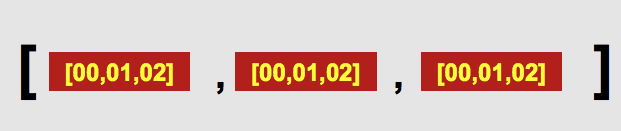

数组是值的有序集合。数组中的每个值叫做一个元素，而每个元素在数组中都有一个唯一的位置。这个位置用数字表示，叫做索引数据；用字符串表示，叫做关联数组。

JavaScript 数组是无类型的：数组的元素可以是任何类型，例如字符串、数字值、布尔值等，而且每个数组中的不同元素可能是不同类型。

JavaScript 数组是动态的：根据需要，可以动态地向数组插入新的元素，或者从数组中删除指定的元素。

## 一维数组

### 定义数组

数组的最大作用就是用于存储多个值。定义数组分别两种形式:

- 使用数组字面量方式:

```javascript
var arr1 = [ ];
var arr2 = [ 1, "a", true ];
```

- 使用数组关键字方式:

```javascript
var arr1 = Array( );
var arr2 = Array( 1, "a", true );
```

> **值得注意的是:** 在一个数组中的不同元素可以是不同数据类型。

### 索引数组

索引数组就是存储元素的位置使用数字值来表示，一般称之为下标或角标。具体创建方式如下述代码:

```javascript
var arr = [];
arr[0] = 1;
arr[1] = "a";
arr[2] = true;
```

> **值得注意的是:** 索引数组的下标是从 0 开始的。

### 关联数组

关联数组就是存储元素的位置使用字符串来表示，一般称之为名称（name或key）。具体创建方式如下述代码:

```javascript
var arr = [];
arr['num'] = 1;
arr['str'] = "a";
arr['bool'] = true;
```

> **值得注意的是:** 关联数组的名称（name或key）是字符串，必需使用单引号或双引号将其包裹。

### 稀疏数组

稀疏数组就是包含 0 开始的不连续索引的数组。具体创建方式如下述代码:

```javascript
var arr = Array( 10 );// 数组没有任何元素，数组的长度为 10

var arr = [];// 创建一个空数组
arr[100] = "a";// 向下标为 100 的位置添加一个元素 a
```

> **值得注意的是:** 上述代码中的第一行，并不是创建一个数组包含一个元素 10，而是创建一个不包含任何元素的数组长度为 10。

### 数组的长度

每个数组都有一个length属性，表示数组的长度。

- 如果为非稀疏数组的话，length 属性的值表示当前数组包含元素的个数。

```javascript
var arr1 = [ 1, "a", true ];
console.log( arr1.length );// 输出 3
```

- 如果为稀疏数组的话，length 属性的值大于当前数组包含元素的个数。

```javascript
var arr2 = [];
arr2[14] = "a";
console.log( arr2.length );// 输出 15
```

### 数组元素的读取

数组的主要作用是用于存储和读取数据信息，之前已经对数组存储数据信息掌握了。下面来看看如何从数组中读取指定的元素:

```javascript
var arr = [ 1, "a", true];
console.log( arr[1] );// 输出字符串 a

var arr = [];
arr['num'] = 1;
arr['str'] = "a";
arr['bool'] = true;

console.log( arr['str'] );// 输出字符串 a
```

### 数组元素的修改

不仅可以从数组中读取指定的元素，还可以根据需求修改数组中指定的元素值。

```javascript
var arr = [ 1, "a", true];
console.log( arr[1] );// 输出字符串 a
arr[1] = "b";
console.log( arr[1] );// 输出字符串 b

var arr = [];
arr['num'] = 1;
arr['str'] = "a";
console.log( arr['str'] );// 输出字符串 a
arr['str'] = "b";
console.log( arr['str'] );// 输出字符串 b
```

### 数组元素的删除

不仅可以根据需求修改数组中指定的元素值，也可以删除数组中指定的元素值。数组删除指定元素值使用 delete 关键字。

```javascript
var arr = [ 1, "a", true];
delete arr[1];
console.log( arr[1] );// 输出字符串 undefined
```

> **值得注意的是:** 上述代码使用 delete 关键字执行删除数组元素值的操作时，并不影响数组的长度。

```javascript
var arr = [ 1, "a", true];
delete arr[1];
console.log( arr.length );// 输出 3
```

### 遍历数组元素

使用for语句是遍历数组元素最常见的方法:

```javascript
var arr = [ 1, "a", true];
for( var i = 0; i < arr.length; i++ ){
	console.log( arr[i] );
}
```

也可以从数组的最后向前（倒序）进行遍历:

```javascript
var arr = [ 1, "a", true];
for( var i = arr.length-1; i >= 0; i-- ){
	console.log( arr[i] );
}
```

### for in 语句

在 ECMAScript 5 中新增了 for in 语句，同样也可以用于遍历数组:

```javascript
var arr = [ 1, "a", true];
for( var i in arr ){
	console.log( i + " : " + arr[i] );
}
```

> **值得注意的是:**
> 
> - for 关键字后定义的变量 i 表示当前数组的下标。
> - for in 语句不仅会遍历数组的所有元素，还有一些数组自带的属性。一般建议使用 for 语句进行数组遍历。

for in 语句还可以用于遍历稀疏数组，循环的每次将一个有效元素返回。不存在的索引将不会遍历到:

```javascript
var arr = [];
arr[100] = "a";
for( var i in arr ){
	console.log( i + " : " + arr[i] );
}
```

## 二维数组

数组是可以嵌套的，这就意味着一个数组可以作为一个元素被包含在另外一个数组里面。利用JavaScript 这个特点，创建二维数组，即数组的数组。


### 定义二维数组

- 定义一个规整的二维数组:

```javascript
var arr1 = [ [11,12,13], [21,22,23], [31,32,33] ];
```

- 定义一个不规整的二维数组:

```javascript
var arr2 = [];
arr2[0] = [ 101 ];
arr2[1] = [ 201, 202 ];
arr2[2] = [ 301, 302, 303 ]; 
```

### 使用二维数组

- 读取二维数组中的具体元素:

```javascript
var arr1 = [ [11,12,13], [21,22,23], [31,32,33] ] ;
console.log( arr1[0][0] );// 值为11
arr1[1][2] = 230;// 把23更改为230
```

- 二维数组的遍历需要使用循环嵌套来实现:

```javascript
for( var i = 0; i < arr1.length; i++ ){
	for( var j = 0; j < arr1[i].length; j++ ){
		console.log( arr1[i][j] );
	}
}
```

## 数组的常见方法

### 检测数组

如何确定当前是一个数组，JavaScript 提供如下几种方式:


1. typeof 无法检测数组对象：typeof [] 返回 object
2. instanceof ：[] instanceof Array 返回 true/false
3. Object.prototype.toString.call( [] )：返回 [ object Array ]
4. Array.prototype.isPrototypeOf( [] )：返回 true/false
5. ES5 中新方法： Array.isArray( [] ) : 返回 true/false

### 转换方法

JavaScript 提供了如下方法，用于数组的转换:

| 方法 | 说明 |
| --- | --- |
| toString() | 把数组转换为字符串，并返回结果。|
| valueOf() | 返回数组对象的原始值。 |

```javascript
var colors = [ "red", "blue", "green" ];

console.log( colors.toString() );// red,blue,green
console.log( colors.valueOf() );// red,blue,green
```

### 进出栈方法

JavaScript 提供了如下方法，用于数组的进出栈操作:

| 方法 | 说明 |
| --- | --- |
| push() | 向数组的末尾添加一个或更多元素，并返回新的长度。|
| pop() | 删除数组的最后一个元素并返回删除的元素。|
| shift() | 删除并返回数组的第一个元素。|
| unshift() | 向数组的开头添加一个或更多元素，并返回新的长度。|

```javascript
var colors = [ "red", "blue", "green" ];
var count = colors.push( "black" );// 4
var item = colors.pop();// black
var count = colors.unshift( "pink" );// 4
var item = colors.shift();// pink
```

### 排序方法

JavaScript 提供了如下方法，用于数组的排序操作:

| 方法 | 说明 |
| --- | --- |
| reverse() | 反转数组的元素顺序。|
| sort() | 对数组的元素进行排序。|

```javascript
var values = [ 0, 1, 5, 10, 20 ];

console.log( values.sort() );// 0,1,10,20,5
console.log( values.reverse() );// 20,10,5,1,0
```

> **值得注意的是:** reverse( ) 和 sort( ) 方法的返回值是经过排序之后的数组。

### 连接方法

JavaScript 提供了如下方法，用于多个数组之间的连接操作:

| 方法 | 说明 |
| --- | --- |
| concat() | 连接两个或更多的数组，并返回结果。|

```javascript
var colors = [ "red", "blue", "green" ];
var colors2 = colors.concat( "yellow", [ "black", "pink" ] );

console.log( colors2 );
// red,blue,green,yellow,black,pink
```

### 操作方法

JavaScript 提供了如下方法，用于数组的删除、插入和替换操作:

| 方法 | 说明 |
| --- | --- |
| slice() | 选取数组的的一部分，并返回一个新数组。|
| splice() | 从数组中添加或删除元素。|

```javascript
var colors = [ "red", "blue", "green", "yellow" ];
var colors2 = colors.slice( 1 );// blue,green,yellow
var colors3 = colors.slice( 1, 3 );// blue,green
var removed1 = colors.splice( 0, 1 );// red
colors.splice( 1, 0, "orange" );// red,orange,blue,green,yellow
var removed2 = colors.splice( 1, 1, "purple" );// blue
console.log( colors );// red,purple,green,yellow
```

### 位置方法

JavaScript 提供了如下方法，用于获取数组中指定元素的索引值:

| 方法 | 说明 |
| --- | --- |
| indexOf() | 搜索数组中的元素，并返回它所在的位置。|
| lastIndexOf() | 返回一个指定的字符串值最后出现的位置，在一个字符串中的指定位置从后向前搜索。|

```javascript
var numbers = [ 1, 2, 3, 4, 5 , 4, 3, 2, 1 ];

console.log( numbers.indexOf( 4 ) );// 3
console.log( numbers.lastIndexOf( 4 ) );// 5
```
