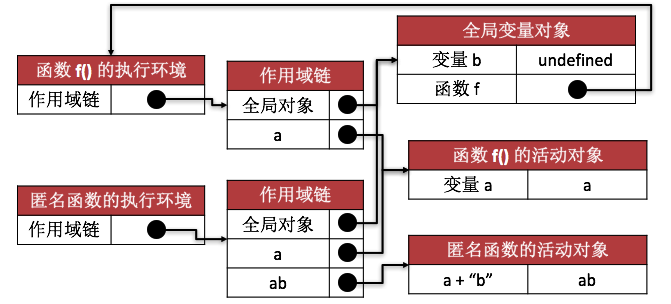

## 作用域链

很多开发语言中都具有块级作用域，但 JavaScript 中并没有跨级作用域，这经常会导致理解上的困惑。如下示例:

```javascript
if( true ){
	var color = "blue";
}
console.log( color );// blue
```

上述代码在 if 语句中定义了变量 color。但该变量的作用域是全局域，原因是 JavaScript 中没有块级作用域。

虽然 JavaScript 没有块级作用域，但具有函数作用域。在某个函数内部定义的变量的作用域就是该函数作用域。

```javascript
function fun(){
	var javascript = "this is javascript";
}
console.log( javascript );// 输出报错
```

上述代码在函数 fun 内部定义了变量 JavaScript，该变量的作用域是 fun 函数作用域。所以在全局域访问该变量时会出错。

每一段 JavaScript 代码（全局代码或函数）都有一个与之关联的作用域链。这个作用域链是一个对象列表或链表，这组对象定义了这段代码“作用域中”的变量。如下示例:

```javascript
var a = 1; 
// 在全局域中只能访问变量 a

function f(){
	// 在 f 函数作用域中可以访问变量 a 和 b
	var b = 2;
}
```

上述代码的作用域链如下图所示:


## 什么是闭包

JavaScript允许函数嵌套，并且内部函数可以访问定义在外部函数中的所有变量和函数，以及外部函数能访问的所有变量和函数。但是，外部函数却不能够访问定义在内部函数中的变量和函数。

当内部函数以某一种方式被任何一个外部函数作用域访问时，一个闭包就产生了。

闭包就是词法表示包括不必计算的变量的函数，也就是说，该函数能使用函数外定义的变量。

如下代码就是一个最简单形式的闭包结构:

```javascript
var b;
function f(){
	var a = "a";
	b = function(){
		return a + "b";
	}
	return a;
}

//测试
alert(f()); // a
alert(b()); // ab
```

上述代码的作用域链如下图所示:



## 闭包的特点

- 局部变量

在函数中定义有共享意义（如：缓存、计数器等）的局部变量。（注：定义成全局变量会对外造成污染）

- 内部函数

在函数（f）中声明有内嵌函数，内嵌函数（g）对函数（f）中的局部变量进行访问。

- 外部使用

函数（f）向外返回此内嵌函数（g），外部可以通过此内嵌函数持有并访问声明在函数（f）中的局部变量，而此变量在外部是通过其他途径无法访问的。

## 闭包的作用

- 提供可共享的局部变量。
- 保护共享的局部变量。提供专门的读写变量的函数。
- 避免全局污染。

## 闭包的应用

利用闭包保护共享的局部变量，提供专门的读写变量的函数。

```javascript
var getValue, setValue;
(function(){
	var secret = 0;
	getValue = function(){
		return secret;
	};
	setValue = function(v){
		secret = v;
	}
})();
```