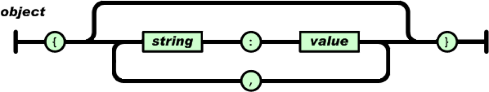
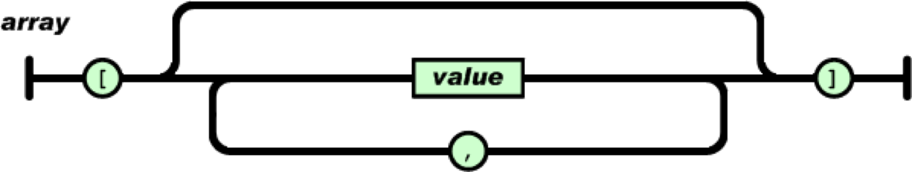

JSON 全称为 JavaScript Object Notation，译为 JavaScript 对象表示法。是一种轻量级的数据交换格式。

官网地址： [http://www.json.org/json-zh.html](http://www.json.org/json-zh.html)

JSON 易于开发者阅读和编写，也易于计算机解析和生成。它基于JavaScript Programming Language，Standard ECMA-262 3rd Edition - December 1999的一个子集。

JSON 采用完全独立于语言的文本格式，被 Java、C#、C++、PHP、OC 等几乎所有主流语言所支持。

JSON 作为一种轻量级的文本数据交换格式，已被广泛使用于存储和交换文本数据领域。

## 语法规则

JSON 构建于两种语法结构:

- “名称 / 值”对的集合。在 JavaScript 中被解释为 对象。



- 值的有序列表。在 JavaScript 中被解释为 数组。


JSON 存储数据的类型可以是字符串（string）、数值(number)、true、false、 null、对象（object）或者数组（array）。这些结构可以嵌套。


## JavaScript 中的 JSON

JavaScript 中使用字符串（String）来表示 JSON 的两种结构。

- “名称 / 值”对的集合。

```javascript
var jsonTxt = ' { 
	"ename" : "Tom", 
	"salary" : 3500,
	"isMarried" : true
} ';
```

- 值的有序列表。

```javascript
var jsonTxt =' [ "Tom", "Mary", "John" ] ';
```

> **值得注意的是:** 字符串必须用双引号括起来。

## JSON 对象

JavaScript 提供了 JSON 对象，该对象具有两种方式:

| 方法名 | 描述 |
| --- | --- |
| JSON.parse() | 解析JSON字符串，可以选择改变前面解析后的值及其属性，然后返回解析的值。|
| JSON.stringify() | 返回指定值的 JSON 字符串，可以自定义只包含某些特定的属性或替换属性值。|

> **值得注意的是:** IE 8 版本之前（包含 8 版本）并不支持 JSON 对象。必须下载 json2.js 或 json3.js 工具解决此问题。

- json2.js 的下载地址：[https://github.com/douglascrockford/JSON-js](https://github.com/douglascrockford/JSON-js)
- json3.js 的下载地址：[https://bestiejs.github.com/json3](https://bestiejs.github.com/json3)

## JSON 转换为 JavaScript

将 JSON 转换为 JavaScript 具有两种方式:

- 利用 JavaScript 中的 eval() 函数。该函数用于执行以字符串（String）形式出现的JavaScript代码。

```javascript
var jsonTxt = ' { "x": 60, "y": 30 } ';
var jsObj = eval( "(" + jsonTxt + ")" ) ;
```

> **值得注意的是:**
> 
> - 根据 eval() 的严格语法要求，其接收的参数只能是 string 类型，而不能是 String 类型！
> - 使用 eval() 将 JSON 字符串解析为 JavaScript 对象时，若不添加左右的小括号，会抛出 SyntaxError。

- 利用 JavaScript 中 JSON 对象的 parse() 方法。

```javascript
var jsonTxt = ' { "x": 60, "y": 30 } ';
var jsObj = JSON.parse( jsonTxt );
```

## JavaScript 转换为 JSON

利用 JavaScript 中 JSON 对象的 stringify() 方法将 JavaScript 转换为 JSON。

```javascript
var jsObj = { 'x': 60, 'y': 30 } ;
console.log( typeof JSON.stringify( jsObj ) ); 
```