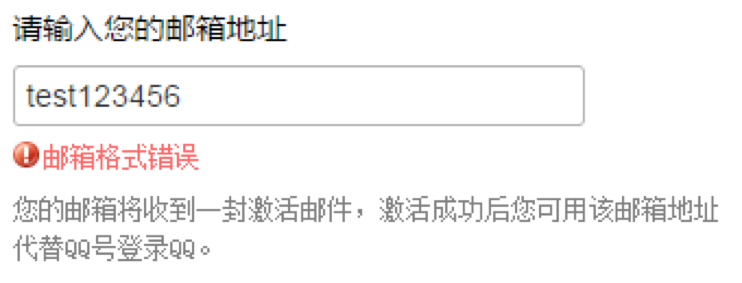

正则表达式(Regular Expression): 由一些普通字符和特殊字符组成的，用以描述一种特定的字符规则的表达式。

正则表达式常用于在一段文本中搜索、匹配或替换特定形式的文本。如: 词语出现频率统计、验证字符串是否符合邮箱格式、屏蔽一篇帖子中的限制性词语等。



### 创建正则表达式

JavaScript 中没有正则表达式数据类型，创建正则表达式的语法如下:

```javascript
var expression = / pattern / attributes ;
```

参数:

- pattern 参数: 被称为模式，可以是任何简单或复杂的正则表达式，包含字符类、限定符、分组、向前查找以及反响引用等。
- attributes 参数: 被称为修饰符，用于标明正则表达式的行为。

### 直接量字符

正则表达式中的所有字母和数字都是按照字面含义进行匹配的。JavaScript 正则表达式语法也支持非字母的字符匹配，这些字符需要通过反斜线（\）作为前缀进行转义。

| 字符 | 匹配 |
| --- | --- |
| 字母和数字 | 自身 |
| \0 | 匹配 NULL 字符，不要在这后面跟其它小数。|
| \t | 匹配一个水平制表符。|
| \n | 匹配一个换行符。|
| \v | 匹配一个垂直制表符。|
| \r | 匹配一个回车符。|
| \f | 匹配一个换页符。|
| \xhh | 匹配带有两位小数代码（hh）的字符。|
| \uhhhh | 匹配带有四位小数代码（hh）的字符。|
| \cX | 当X是处于A到Z之间的字符的时候，匹配字符串中的一个控制符。当X是处于A到Z之间的字符的时候，匹配字符串中的一个控制符。例如，/\cM/ 匹配字符串中的 control-M (U+000D)。|

在正则表达式中，许多标点符号具有特殊含义，如下:

```
^ $ . * + ? = ! : | \ / ( ) [ ] { } 
```

### 字符类

将直接量字符单独放进方括号内就组成了字符类。一个字符类可以匹配它所包含的任意字符。由于某些字符类非常常用，JavaScript 的正则表达式中，使用特殊转义字符表示它们。

| 字符 | 匹配 |
| --- | --- |
| […] | 一个字符集合。匹配方括号的中任意字符。你可以使用破折号（-）来指定一个字符范围。对于点（.）和星号（*）这样的特殊符号在一个字符集中没有特殊的意义。 |
| [^…] | 一个反向字符集。|
| . | （小数点）匹配除了换行符（\n）之外的任何单个字符。|
| \w | 匹配一个单字字符（字母、数字或者下划线）。等价于[A-Za-z0-9_]。|
| \W | 匹配一个非单字字符。等价于[^A-Za-z0-9_]。|
| \s | 匹配一个空白字符，包括空格、制表符、换页符和换行符。|
| \S | 匹配一个非空白字符。|
| \d | 匹配一个数字。等价于[0-9]。|
| \D | 匹配一个非数字字符。等价于[^0-9]。|
| [\b] | 匹配一个退格. （不要和\b混淆了）|

> **值得注意的是:** 在方括号之内也可以编写这些特殊转义字符。

### 重复

在 JavaScript 中的正则表达式用来描述任意多位的数字，或者描述由三个字母和一个数字构成的字符串时，可以使用字符重复的标记。

| 字符 | 匹配 |
| --- | --- |
| {n,m} | n 和 m 都是正整数。匹配前面的字符至少n次，最多m次。如果 n 或者 m 的值是0， 这个值被忽略。|
| {n} | n是一个正整数，匹配了前面一个字符刚好发生了n次。|
| ? | 匹配前面一个字符0次或者1次，和{0,1}有相同的效果。|
| + | 匹配前面一个字符1次或者多次，和{1,}有相同的效果。|
| * | 匹配前一个字符0次或者是多次。|

> **值得注意的是:** “*”和“?”可以匹配 0 个字符，允许什么都不匹配。

### 选择、分组和引用

正则表达式包括指定选择项、子表达式分组和引用前一子表达式的特殊字符。

| 字符 | 匹配 |
| --- | --- |
| x|y | 匹配“x”或者“y”。|
| (x) | 匹配“x”并且记住匹配项。这个被叫做捕获括号。|
| (?:x) | 匹配“x”但是不记住匹配项。这种被叫做非捕获括号。|
| \n | 当 n 是一个正整数，一个返回引用到最后一个与有n插入的正值表达式(counting left parentheses)匹配的副字符串。比如 /apple(,)\sorange\1/ 匹配"apple, orange, cherry, peach."中的'apple, orange,'。|

### 指定匹配位置

正则表达式中的多个元素才能够匹配字符串的一个字符，这些元素称之为正则表达式的锚。因为它们将模式定位在搜索字符串的特定位置上。

| 字符 | 匹配 |
| --- | --- |
| ^ | 匹配输入的开始。如果多行标示被设置为true,同时匹配换行后紧跟的字符。|
| $ | 匹配输入的结束，如果多行标示被设置为true,同时会匹配换行前紧跟的字符。|
| \b | 匹配一个词的边界。一个词的边界就是一个词不被另外一个词跟随的位置或者不是另一个词汇字符前边的位置。|
| \B | 匹配一个非单词边界。|
| x(?=y) | 匹配“x”仅仅当“x”后面跟着“y”。这种叫做正向肯定查找。|
| x(?!y) | 匹配“x”仅仅当“x”后面不跟着“y”,这个叫做正向否定查找。|

### 修饰符

正则表达式的修饰符，用于说明高级匹配模式的规则。修饰符是放在“/”符号后面的，JavaScript 支持三个修饰符。

| 字符 | 匹配 |
| --- | --- |
| i | 不区分大小写搜索。|
| g | 全局搜索。|
| m | 多行搜索。|

## RegExp 对象

JavaScript 可以通过引用类型 RegExp 创建正则表达式对象，语法如下:

```javascript
var pattern =new RegExp( pattern, attributes );
```

参数:

- pattern 参数: 被称为模式，可以是任何简单或复杂的正则表达式，包含字符类、限定符、分组、向前查找以及反响引用等。
- attributes 参数: 被称为修饰符，用于标明正则表达式的行为。

### RegExp 对象的属性

RegExp 对象的属性如下:

| 属性名 | 说明 |
| --- | --- |
| global | （只读）RegExp 对象是否具有 g 修饰符。|
| ignoreCase | （只读）RegExp 对象是否具有 i 修饰符。|
| multiline | （只读）RegExp 对象是否具有 m 修饰符。|
| lastIndex | 用于设置/获取下次匹配的起始位置。|
| source | （只读）返回模式匹配所使用的文本。|

### RegExp 对象的方法

RegExp 对象的方法如下:

| 方法名 | 说明 |
| --- | --- |
| compile() | 编译/重新编译正则表达式，将 pattern 转换为内部格式，加快执行速度。|
| exec() | 检索字符串中指定的值。返回找到的值，并确定其位置；影响lastIndex 属性的值。|
| test() | 检索字符串中指定的值。返回 true 或 false；影响 lastIndex 属性的值。|

## 字符串的模式匹配

### 替换子字符串

String 对象提供如下方法，用于替换子字符串。

| 方法名 | 说明 |
| --- | --- |
| replace() | 在字符串中查找匹配的子串， 并替换与正则表达式匹配的子串。|

```javascript
var data = 'Microsoft is a big Company, microsoft’s color is red and has MICROSOFT logo like microsoft';

console.log( data.replace('microsoft', 'oracle') );

console.log( data.replace(/microsoft/, 'oracle') );
console.log( data.replace(/microsoft/i, 'oracle') );
console.log( data.replace(/microsoft/ig, 'oracle') );
```

### 匹配字符串

String 对象提供如下方法，用于匹配字符串。

| 方法名 | 说明 |
| --- | --- |
| match() | 查找找到一个或多个正则表达式的匹配。|

```javascript
var data = 'Microsoft is a big Company, microsoft’s color is red and has MICROSOFT logo like microsoft';

console.log( data.match('microsoft') );

console.log( data.match(/microsoft/) );
console.log( data.match(/microsoft/i) ); console.log( data.match(/microsoft/ig) );
```

### 查找字符串

String 对象提供如下方法，用于查找字符串。

| 方法名 | 说明 |
| --- | --- |
| search() | 查找与正则表达式相匹配的值。|

```javascript
var data = 'Microsoft is a big Company, microsoft’s color is red and has MICROSOFT logo like microsoft';

console.log( data.search('microsoft') );

console.log( data.search(/microsoft/) );
console.log( data.search(/microsoft/i) );
```
