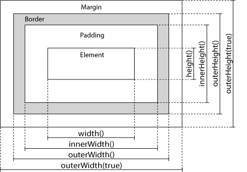

## 1 获取设置内容的方法

* * text() - 设置或返回所选元素的文本内容
* * html() - 设置或返回所选元素的内容（包括 HTML 标记）
* * val() - 设置或返回表单字段的值

```
$("#btn1").click(function(){
  alert("Text: " + $("#test").text());
});
$("#btn2").click(function(){
  alert("HTML: " + $("#test").html());
});
$("#btn1").click(function(){
  alert("值为: " + $("#test").val());
});

$("#btn1").click(function(){
    $("#test1").text("Hello world!");
});
$("#btn2").click(function(){
    $("#test2").html("<b>Hello world!</b>");
});
$("#btn3").click(function(){
    $("#test3").val("RUNOOB");
});
```

## 2 获取设置属性的方法
attr() 方法用于获取属性值。
```
$("button").click(function(){
  alert($("#runoob").attr("href"));
});

$("button").click(function(){
  $("#runoob").attr("href","http://www.runoob.com/jquery");
});
```
jQuery 方法 attr()，也提供回调函数。回调函数有两个参数：被选元素列表中当前元素的下标，以及原始（旧的）值。然后以函数新值返回您希望使用的字符串。

```
$("button").click(function(){
  $("#runoob").attr("href", function(i,origValue){
    return origValue + "/jquery"; 
  });
});
```

## 3 添加元素

* append() - 在被选元素的结尾插入内容
* prepend() - 在被选元素的开头插入内容
* after() - 在被选元素之后插入内容
* before() - 在被选元素之前插入内容

```
$("p").append("追加文本");
$("p").prepend("在开头追加文本");
$("img").after("在后面添加文本");
$("img").before("在前面添加文本");
```

## 4 删除元素

* remove() - 删除被选元素（及其子元素）
* empty() - 从被选元素中删除子元素
```
$("#div1").remove();
$("#div1").empty();
```


## 5 CSS设置

* addClass() - 向被选元素添加一个或多个类
* removeClass() - 从被选元素删除一个或多个类
* toggleClass() - 对被选元素进行添加/删除类的切换操作
* css() - 设置或返回样式属性


```
$("button").click(function(){
  $("h1,h2,p").addClass("blue");
  $("div").addClass("important");
});

$("button").click(function(){
  $("h1,h2,p").removeClass("blue");
});

$("button").click(function(){
  $("h1,h2,p").toggleClass("blue");
});

$("p").css("background-color","yellow");
```

## 7 尺寸设置



* width()
* height()
* innerWidth()
* innerHeight()
* outerWidth()
* outerHeight()

