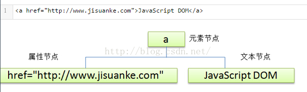

\>简介

\>\>document object
model：文档对象模型，将HTML文档呈现为带有元素、属性和文本的树结构，成为节点树

\>\>三种DOM结点;

>   元素节点：\<html\>\<body\>\<p\>(tag)

>   文本节点：\<li\>\</li\>\<script\>\<css\>

>   属性节点：元素属性\<a href = "http://"\>其中href即为元素的属性

\>\>节点属性：

>   nodeName：

>   1\. 元素节点的 nodeName 与标签名相同

>   2\. 属性节点的 nodeName 是属性的名称

>   3\. 文本节点的 nodeName 永远是\#text

>   4\. 文档节点的 nodeName 永远是\>\#document

>   nodeType：节点类型1-\>元素节点；2-\>属性节点；3-\>文本节点

>   nodeValue：节点值，元素节点返回null，属性节点返回属性值，文本节点返回文本内容

>   1\. 元素节点的 nodeValue 是 undefined 或 null

>   2\. 文本节点的 nodeValue 是文本自身

>   3\. 属性节点的 nodeValue 是属性的值

>   childNodes：返回子节点数组（只有元素节点有子节点）

>   firstChild：返回第一个子节点

>   lastChild：返回最后一个子节点

>   nextSibling：返回下一个兄弟节点

>   previousSibling：返回节点的上一个兄弟节点

>   parentNode：返回节点的父节点。

\>\>节点方法（是document对象的节点方法）

>   write()：写入内容到文档

>   getElementBYId()：返回指定ID的元素

>   getElementsByTagName()：返回带有制定标签名的所有元素（是一个数组）

>   get/setAttribute('key', 'value')：返回设置属性节点

\>\>其他元素的结点方法：

| 节点方法                         | 说明                           |
|----------------------------------|--------------------------------|
| createElenment('tafName')        | 创建元素节点                   |
| createTextNode(‘text’)           | 创建文本节点                   |
| appendChild(o)                   | 在父节点末尾附加子节点         |
| reateDocumentFragment()          | 创建文档片段                   |
| removeChild(oP)                  | 删除节点                       |
| replaceChild(newOp,targetOp)     | 替换节点                       |
| insertBefore(newOp,targerOp)     | 已有的子节点前插入一个新的节点 |
| insertAfter(newOp,targetOp)      | 已有的子节点后插入一个新的节点 |
| get/setAttribute('key', 'value') | 设置或得到属性节点             |
| clonNode(true/false)             | 复制节点                       |

\>元素内容

>   innerHTML（替换时包括其中的html标签）

>   innerText（替换时只有其中的文本内容）

>   修改p标签的这两个值会得到不同的结果

**[html]** [view plain](http://blog.csdn.net/estom_yin/article/details/51898168)
[copy](http://blog.csdn.net/estom_yin/article/details/51898168)

1.  **\<span** style="font-size:14px;"**\>\<body\>**

2.  **\<p\>**JavaScript**\</p\>**

3.  **\<p\>**JavaScript**\</p\>**

4.  **\<input** type="button" id="inp" value="click"**\>**

5.  **\<script** type="text/javascript"**\>**

6.  var inp = document.getElementById('inp');

7.  inp.onclick = function(){

8.  var ip = document.getElementsByTagName('p');

9.  alert(ip[0].innerHTML);

10. ip[0].innerHTML = "\<i\>hello\</i\>";

11. ip[1].innerText = "\<i\>hello\</i\>";

12. }

13. **\</script\>**

14. **\</body\>\</span\>**

\>元素样式

>   方法：

>   style属性，能够创建新的属性并赋值

>   className属性，只能改变标签的类属性，使用已经有的类来改变标签的属性

>   语法：

>   object.style.property = new style;

>   object.style.className = "class"

**[html]** [view plain](http://blog.csdn.net/estom_yin/article/details/51898168)
[copy](http://blog.csdn.net/estom_yin/article/details/51898168)

1.  **\<span** style="font-size:14px;"**\>\<body\>**

2.  **\<h2** id="ih"**\>**JavaScript**\</h2\>**

3.  **\<input** type="button" id="inp" value="click"**\>**

4.  **\<script** type="text/javascript"**\>**

5.  var inp = document.getElementById("inp");

6.  inp.onclick = function () {

7.  var oh = document.getElementById("ih");

8.  oh.style.color = "red";

9.  oh.style.width = "300px";

10. oh.style.backgroundColor = "\#CCC";

11. }

12. **\</script\>**

13. **\</body\>\</span\>**

\>显示和隐藏

>   display = none 或者block

**[html]** [view plain](http://blog.csdn.net/estom_yin/article/details/51898168)
[copy](http://blog.csdn.net/estom_yin/article/details/51898168)

1.  **\<span** style="font-size:14px;"**\>\<body\>**

2.  **\<p** id="ip"**\>**你可以把我隐藏，也可以让我显示哦\~**\</p\>**

3.  **\<input** type="button" id="ihide" value="hide"**\>**

4.  **\<input** type="button" id="ishow" value="show"**\>**

5.  **\<script** type="text/javascript"**\>**

6.  var op = document.getElementById("ip");

7.  var inp = document.getElementsByTagName("input");

8.  inp[0].onclick = function () {

9.  op.style.display = "none";

10. }

11. inp[1].onclick = function () {

12. op.style.display = 'block';

13. }

14. **\</script\>**

15. **\</body\>\</span\>**
