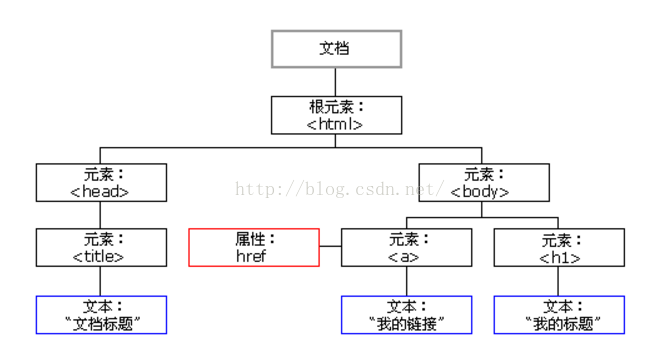

\>DOM树（document_object_moudule）

\>\>DOM定义

是w3c文档对象模型，是中立于平台和语言的接口，它允许程序和脚本动态的访问和更新文档内容、结构和样式。

\>\>DOM的组成

-   核心 DOM - 针对任何结构化文档的标准模型

-   XML DOM - 针对 XML 文档的标准模型

-   HTML DOM - 针对 HTML 文档的标准模型

\>DOM节点（通过结点树的方法指明了各个元素之间的关系）

\>\>文档节点、元素节点、文本节点、属性节点、注释节点

\>\>所有的结点都可以通过JS进行访问、所有的HTML元素节点都可以别修改，也可以创建删除节点

\>\>节点关系

-   再节点树中，顶端点被称为根

-   每个节点都有父节点

-   一个节点可拥有任意数量的子节点

-   同胞是拥有相同父节点的结点

\>DOM方法（通过定义类的对象的方法，实现了访问结点）

\>\>编程接口

可以通过JS等脚本语言对HTML_DOM进行访问

所有的HTML元素都被定义为对象，而编程接口则是对象的方法和对象的属性

方法是能够执行的动作（添加或修改元素节点）

属性是能够获取或设置的值（节点的名称或内容）

\>\>常用的HTML_DOM方法和属性

方法：

访方法id,tagName,ClassName

修改方法修改内容、修改样式、修改属性、创建节点、删除节点。

修改内容

document.getElementById("p1").innerHTML="New text!";

修改样式

document.getElementById("p2").style.color="blue";

创建节点

var node=document.createTextNode("This is new.");

使用事件节点

\<input type="button" onclick="document.body.style.backgroundColor='lavender';"
value="Change background color" /\>

添加元素

para.appendChild(node);

element.insertBefore(para,child);

删除元素

parent.removeChild(child);

替换元素

parent.replaceChild(para,child);

| 方法                     | 描述                                                            |
|--------------------------|-----------------------------------------------------------------|
| getElementById()         | 返回带有指定 ID 的元素。                                        |
| getElementsByTagName()   | 返回包含带有指定标签名称的所有元素的节点列表（集合/节点数组）。 |
| getElementsByClassName() | 返回包含带有指定类名的所有元素的节点列表。                      |
| appendChild()            | 把新的子节点添加到指定节点。                                    |
| removeChild()            | 删除子节点。                                                    |
| replaceChild()           | 替换子节点。                                                    |
| insertBefore()           | 在指定的子节点前面插入新的子节点。                              |
| createAttribute()        | 创建属性节点。                                                  |
| createElement()          | 创建元素节点。                                                  |
| createTextNode()         | 创建文本节点。                                                  |
| getAttribute()           | 返回指定的属性值。                                              |
| setAttribute()           | 把指定属性设置或修改为指定的值。                                |

属性：

innerHTML //元素节点的文本值

parentNode//元素节点的父节点

childNodes//元素节点的子节点

atrributes//元素节点的属性节点

nodeName属性规定节点的名称（只读）

nodeValue规定节点的值

nodeType属性返回节点的类型

| 元素类型 | NodeType |
|----------|----------|
| 元素     | 1        |
| 属性     | 2        |
| 文本     | 3        |
| 注释     | 8        |
| 文档     | 9        |

\>\>说一下自己的理解

在这里，将html中的各个部分解析成节点的概念，有助于通过结点树建立节点关系模型，非常好，而且简单。

然后，有将html中各个部分，定义成对象，并且定义了对象的属性和方法，能够很轻松的完成对元素的访问和操作。

提到对象，联系C++中的知识，可以知道，对象，主要包括数据成员和成员函数，前者就是对象的属性，后者是对象的方法。

然后再说一下这里的DOM的理解，文档对象模型。简单的说，就是讲整个html文档中的所有元素，定义成节点和对象的过程

并且通过这种定义，简化并且系统的表达了对html的访问和操作。

\>DOM中相关的事件

.onclick=function(){displayDate()};

onclick="displayDate()"

onload="checkCookies()"

onchange="upperCase()"

onmouseover onmouseout

onmousedown onmouseup

\>DOM

var x = document.getElementsByTagName("p")

返回是节点数组

x.length能返回数组的长度
