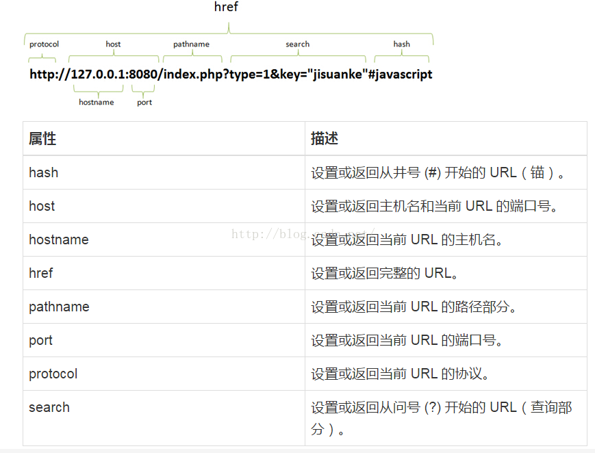

\>location对象

\>\>作用：用于获取或设置窗体的URL，并且可用于解析URL

\>\>语法：location.[属性\|方法]

\>\>对象属性：

\>\>对象方法：

>   assign()：加载新的文档

>   reload()：重新加载当前文档

>   replace()：用心的文档替换当前的文档

\>navigator对象

\>\>作用：包含浏览器信息和操作系统版本

\>\>对象属性

\>screen对象

\>\>作用：半酣了关于屏幕的信息，高度宽度、颜色深度

\>\>属性：

>   screen.height：返回屏幕分辨率的高

>   screen.whidth：返回屏幕分辨率的宽

>   screen.availWidth：屏幕的宽度

>   screen.availHeight：屏幕宽度
