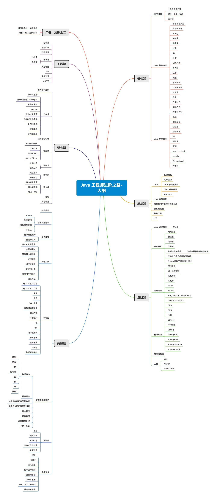

## Java学习路线
> 生命的长度是有限的，但Java的知识是无限的！

总共包括六个主要的部分。学完就能毕业啦。开始吧。
* [ ] 前置知识
  * [ ] 数据库&Mysql
  * [ ] 操作系统&Linux
  * [ ] 计算机网络
  * [ ] 数据结构与算法
  * [ ] 设计模式
* [ ] Java基础教程（Java的基本语法和使用及原理，晚上自学，第一周学完）
    * [X] Java语言基础。语言语法。：20200830
    * [ ] Java标注库开发.(自动拆装箱、String、集合类、枚举类、IO类、反射、动态代理、序列化、注解、泛型、单元测试、正则表达式、工具库、异常、日期时间、编码方式)
    * [ ] Java并发编程（线程、锁、同步、并发包）
    * [ ] Java网络编程（网络基础、Socket编程）
    * [ ] Java基本原理。JVM底层的原理和技术。（内存结构、垃圾回收）
    * [ ] Java架构模式。面向对象和设计模式
* [ ] Java网站开发（JavaWeb相关的技术知识。）
  * [ ] 数据库技术
    * [ ] JDBC
    * [ ] MyBatis
  * [ ] 容器技术
    * [ ] Servlet和JSP
    * [ ] JBOSS和Resteasy
    * [ ] Tomcat
  * [ ] 服务器技术
    * [ ] Nginx
    * [ ] Netty
* [ ] Java工具教程（Java使用的关键工具，白天学习一下）
    * [ ] Maven教程：20221030
    * [x] Idea教程：20221023
    * [ ] Git教程
* [ ] Java框架教程（Spring全家桶，白天自学）
    * [x] Spring5：20221010
    * [ ] Springboot
    * [ ] Spring MVC
    * [ ] SpringCloud
    * [ ] sofaboot（sofarpc）
* [ ] Java云原生和微服务
  * [ ] 云原生基础
    * [x] shell（bash&awk&grep&find&vim）：20220926
    * [x] docker：20221003
    * [ ] k8s
  * [ ] 服务框架
    * [ ] dubbo
    * [ ] eureka
    * [ ] zookeeper
    * [ ] servicemesh（Istio&MOSN）
    * [ ] sofaregistry&sofams
  * [ ] 数据中间件&消息中间件
    * [ ] redis中间件
    * [ ] tbase中间件
    * [ ] kfk消息队列
    * [ ] sofamq消息队列
* [ ] Java性能优化
    * [ ] 高可用(预防监控、应急容灾)
      * [ ] 双机/主备机房（主机房活跃、备机房停止）
      * [ ] 异地/同城多活（多个节点都获取）
    * [ ] 高性能
      * [ ] 高性能缓存
      * [ ] PPC TPC
    * [ ] 高并发
      * [ ] 分库分表
      * [ ] 消息队列
  * [ ] Java分布式基础
      * [ ] 负载均衡和调度
      * [ ] 分布式缓存
      * [ ] 分布式算法
      

> 一份可以参考的文档。其中大数据、网络安全和扩展篇不学。
> 