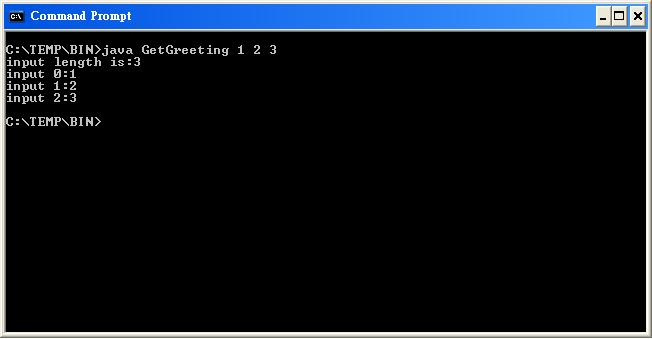

简单的命令行（没有package）

c:/temp/bin/GetGreeting.java

**[java]** [view
plain](http://blog.csdn.net/lee_decimal/article/details/5885406)
[copy](http://blog.csdn.net/lee_decimal/article/details/5885406)

1.  **public** **class** GetGreeting

2.  {

3.  **public** **static** **void** main(String [] args)

4.  {

5.  System.out.println("Hello world");

6.  

7.  }

8.  }

1.编译：cmd--cd到c:/temp/bin javac GetGreeting.java

生成GetGreeting.class文件

2.执行：java Greeting

打印出Hello world

有package的java程序

c:/temp/bin/client/GetGreeting.java

1.cd到c:/temp/bin/client javac GetGreeting.java

在c:/temp/bin/client 目录中生成 GetGreeting.class文件

2.cd.. 退回到c:/temp/bin

执行 java client.GetGreeting

打印出Hello world

用命令行调用jar文件（无package）

将GetGreeting.java放在c:/temp/bin中----javac 编译生成GetGreeting.class

将GetGreeting.java删除，用jar -cvf test.jar \*.\*命令打包成jar文件

修改jar文件中的META-INF/MANIFEST.MF文件

在最后加一行 Main-Class:
GetGreeting（注意：冒号和GetGreeting间有一空格，否则报错-Invalid or corrupt
jarfile C:/temp/bin/test.jar），然后回车，否则也报错-Failed to load Main-Class
manifest attribute from

C:/temp/bin/test.jar

命令行执行：java -jar c:/temp/bin/test.jar

用命令行调用jar（有package）

将GetGreeting.java放在c:/temp/bin/client中----cd到client目录，用javac
编译生成GetGreeting.class

将GetGreeting.java删除，返回到bin目录，用jar -cvf test.jar
\*.\*命令打包成jar文件

修改jar文件中的META-INF/MANIFEST.MF文件

在最后加一行 Main-Class:
client.GetGreeting（注意：冒号和client.GetGreeting间有一空格，否则报错-Invalid
or corrupt jarfile C:/temp/bin/test.jar），然后回车，否则也报错-Failed to load
Main-Class manifest attribute from

C:/temp/bin/test.jar

命令行执行：java -jar c:/temp/bin/test.jar

用命令行执行class（带参数）

GetGreeting.java

**[java]** [view
plain](http://blog.csdn.net/lee_decimal/article/details/5885406)
[copy](http://blog.csdn.net/lee_decimal/article/details/5885406)

1.  **public** **class** GetGreeting

2.  {

3.  **public** **static** **void** main(String [] args)

4.  {

5.  System.out.println("input length is:"+args.length);

6.  **for**(**int** i=0;i\<args.length;i++)

7.  {

8.  System.out.println("input "+i+":"+args[i]);

9.  }

10. }

11. }

示例：

命令行调用jar文件（带参数）

类似第三步，使用命令 java -jar c:/temp/bin/test.jar 1 2 3

输出结果与上图一样。

第七：命令行调用jar文件（jar文件代码里引用其他jar文件）

以连接数据库为例

将ConnDB.java放在c:/temp/bin中

**[java]** [view
plain](http://blog.csdn.net/lee_decimal/article/details/5885406)
[copy](http://blog.csdn.net/lee_decimal/article/details/5885406)

1.  **import** java.sql.Connection;

2.  **import** java.sql.DriverManager;

3.  

4.  **public** **class** ConnDB

5.  {

6.  **public** **static** **void** main(String[] args)

7.  {

8.  String drive = "oracle.jdbc.driver.OracleDriver";

9.  String url = "jdbc:oracle:thin:@ip:1521:esd";

10. String username = "scylla";

11. String password = "\*\*\*\*\*\*";

12. **try**

13. {

14. Connection conn = **null**;

15. Class.forName(drive);

16. DriverManager.registerDriver(**new** oracle.jdbc.driver.OracleDriver());

17. conn = DriverManager.getConnection(url,username,password);

18. System.out.println("conn is:"+conn);

19. }

20. **catch** (Exception e)

21. {

22. e.printStackTrace();

23. }

24. }

25. }

用javac编译时需将classes12.jar包解压缩放在bin中（否则编译不通过，提示找不到package）

删掉ConnDB.java，打jar包conn.jar

在bin中建立文件夹lib，将classes12.jar文件放在lib目录中

修改conn.jar中META-INF/MANIFEST.MF

Class-Path: ./lib/classes12.jar（制定jar路径）

Main-Class: ConnDB(注意冒号后面有一个空格，最后回车)

用java -jar c:/temp/bin/conn.jar 调用即可！
