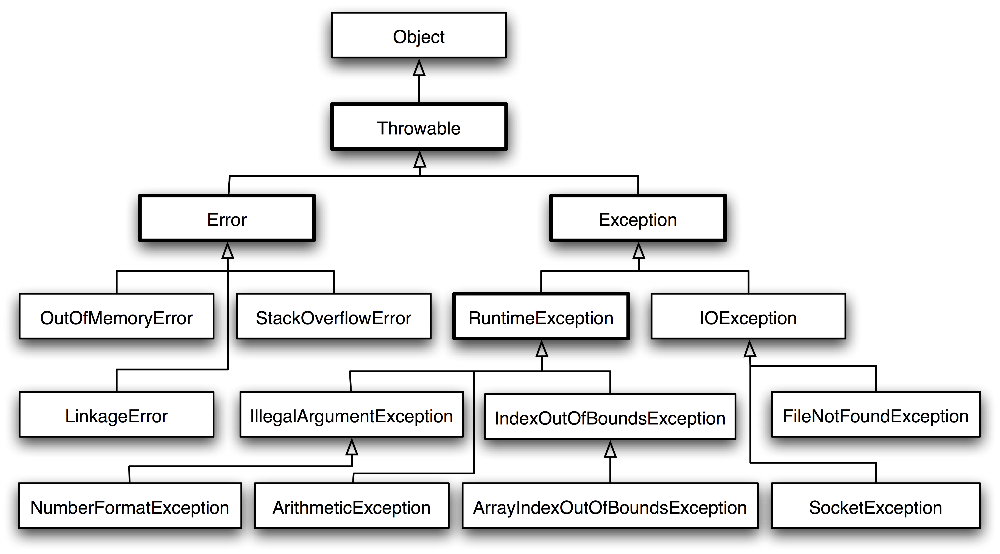

## 1 异常概述

### 异常与错误
异常是程序中的一些错误。

* 检查性异常：最具代表的检查性异常是用户错误或问题引起的异常，这是程序员无法预见的。例如要打开一个不存在文件时，一个异常就发生了，这些异常在编译时不能被简单地忽略。
* 运行时异常：运行时异常是可能被程序员避免的异常。与检查性异常相反，运行时异常可以在编译时被忽略。
* 错误：错误不是异常，而是脱离程序员控制的问题。错误在代码中通常被忽略。例如，当栈溢出时，一个错误就发生了，它们在编译也检查不到的。


### 异常的产生

* 用户输入了非法数据。
* 要打开的文件不存在。
* 网络通信时连接中断
* JVM内存溢出。


### 异常的层次


Throwable 可以用来表示任何可以作为异常抛出的类，分为两种：  **Error**   和 **Exception**。其中 Error 用来表示 JVM 无法处理的错误，Error 用来指示运行时环境发生的错误，程序不会从Error中恢复，而是直接down掉。Exception 分为两种：

-   **受检异常**  ：需要用 try...catch... 语句捕获并进行处理，并且可以从异常中恢复；
-   **非受检异常**  ：是程序运行时错误，例如除 0 会引发 Arithmetic Exception，此时程序崩溃并且无法恢复。





## 2 异常使用

### 异常中的方法

* public String getMessage()
返回关于发生的异常的详细信息。这个消息在Throwable 类的构造函数中初始化了。
* public Throwable getCause()
返回一个 Throwable 对象代表异常原因。
* public String toString()
返回此 Throwable 的简短描述。
* public void printStackTrace()
将此 Throwable 及其回溯打印到标准错误流。。
* public StackTraceElement [] getStackTrace()
返回一个包含堆栈层次的数组。下标为0的元素代表栈顶，最后一个元素代表方法调用堆栈的栈底。
* public Throwable fillInStackTrace()
用当前的调用栈层次填充Throwable 对象栈层次，添加到栈层次任何先前信息中。

### 捕获异常
* 使用 try 和 catch 关键字可以捕获异常。
* Catch 语句包含要捕获异常类型的声明。
```java
try
{
   // 程序代码
}catch(ExceptionName e1)
{
   //Catch 块
}

// 文件名 : ExcepTest.java
import java.io.*;
public class ExcepTest{
 
   public static void main(String args[]){
      try{
         int a[] = new int[2];
         System.out.println("Access element three :" + a[3]);
      }catch(ArrayIndexOutOfBoundsException e){
         System.out.println("Exception thrown  :" + e);
      }
      System.out.println("Out of the block");
   }
}
```

### 多重捕获结构

* 没有发生异常，会通过所有的捕获语句，不会进入catch
* 发生异常，则进入捕获语句，并且不再执行其他捕获语句。执行完成后跳出try-catch语句块，然后执行后续内容。不会终端程序执行。
```java
try{
   // 程序代码
}catch(异常类型1 异常的变量名1){
  // 程序代码
}catch(异常类型2 异常的变量名2){
  // 程序代码
}catch(异常类型3 异常的变量名3){
  // 程序代码
}
```

### throws/throw 抛出异常
如果一个方法无法处理捕获到的异常，那么该方法必须使用 throws 关键字来声明。使用 throw 关键字抛出一个异常。

throws关键字用来声明该方法可能抛出的异常。只起到声明作用。

```java
import java.io.*;
public class className
{
  public void deposit(double amount) throws RemoteException
  {
    // Method implementation
    throw new RemoteException();
  }
  //Remainder of class definition
}
```

### finally关键字

无论是否发生异常，finally 代码块中的代码总会被执行。在 finally 代码块中，可以运行清理类型等收尾善后性质的语句。

> 即使之前的catch语句中有return语句。finally语句块仍旧会被执行。

```java
try{
  // 程序代码
}catch(异常类型1 异常的变量名1){
  // 程序代码
}catch(异常类型2 异常的变量名2){
  // 程序代码
}finally{
  // 程序代码
}

public class ExcepTest{
  public static void main(String args[]){
    int a[] = new int[2];
    try{
       System.out.println("Access element three :" + a[3]);
    }catch(ArrayIndexOutOfBoundsException e){
       System.out.println("Exception thrown  :" + e);
    }
    finally{
       a[0] = 6;
       System.out.println("First element value: " +a[0]);
       System.out.println("The finally statement is executed");
    }
  }
}
```


### try-with-resources

> 模仿python的with语句

JDK7 之后，Java 新增的 try-with-resource 语法糖来打开资源，并且可以在语句执行完毕后确保每个资源都被自动关闭 。

JDK7 之前所有被打开的系统资源，比如流、文件或者 Socket 连接等，都需要被开发者手动关闭，否则将会造成资源泄露。
```java
import java.io.*;

public class RunoobTest {

    public static void main(String[] args) {
    String line;
        try(BufferedReader br = new BufferedReader(new FileReader("test.txt"))) {
            while ((line = br.readLine()) != null) {
                System.out.println("Line =>"+line);
            }
        } catch (IOException e) {
            System.out.println("IOException in try block =>" + e.getMessage());
        }
    }
}
try (resource declaration) {
  // 使用的资源
} catch (ExceptionType e1) {
  // 异常块
}
```

* try with resource declaration可以同时处理多个打开的资源
* 多个声明资源时，try-with-resources 语句以相反的顺序关闭这些资源。
```java
import java.io.*;
import java.util.*;
class RunoobTest {
    public static void main(String[] args) throws IOException{
        try (Scanner scanner = new Scanner(new File("testRead.txt"));
            PrintWriter writer = new PrintWriter(new File("testWrite.txt"))) {
            while (scanner.hasNext()) {
                writer.print(scanner.nextLine());
            }
        }
    }
}
```
## 3 自定义异常

### 自定义异常
* 所有异常都必须是 Throwable 的子类。
* 如果希望写一个检查性异常类，则需要继承 Exception 类。
* 如果你想写一个运行时异常类，那么需要继承 RuntimeException 类。

```java
class MyException extends Exception{
}

// 文件名InsufficientFundsException.java
import java.io.*;
 
//自定义异常类，继承Exception类
public class InsufficientFundsException extends Exception
{
  //此处的amount用来储存当出现异常（取出钱多于余额时）所缺乏的钱
  private double amount;
  public InsufficientFundsException(double amount)
  {
    this.amount = amount;
  } 
  public double getAmount()
  {
    return amount;
  }
}
```

### 使用自定义的异常

```java
/ 文件名称 CheckingAccount.java
import java.io.*;
 
//此类模拟银行账户
public class CheckingAccount
{
  //balance为余额，number为卡号
   private double balance;
   private int number;
   public CheckingAccount(int number)
   {
      this.number = number;
   }
  //方法：存钱
   public void deposit(double amount)
   {
      balance += amount;
   }
  //方法：取钱
   public void withdraw(double amount) throws
                              InsufficientFundsException
   {
      if(amount <= balance)
      {
         balance -= amount;
      }
      else
      {
         double needs = amount - balance;
         throw new InsufficientFundsException(needs);
      }
   }
  //方法：返回余额
   public double getBalance()
   {
      return balance;
   }
  //方法：返回卡号
   public int getNumber()
   {
      return number;
   }
}
```

### 处理自定义的异常

```
//文件名称 BankDemo.java
public class BankDemo
{
   public static void main(String [] args)
   {
      CheckingAccount c = new CheckingAccount(101);
      System.out.println("Depositing $500...");
      c.deposit(500.00);
      try
      {
         System.out.println("\nWithdrawing $100...");
         c.withdraw(100.00);
         System.out.println("\nWithdrawing $600...");
         c.withdraw(600.00);
      }catch(InsufficientFundsException e)
      {
         System.out.println("Sorry, but you are short $"
                                  + e.getAmount());
         e.printStackTrace();
      }
    }
}
```


## 4 常见的异常

### 常见的运行时异常

| 异常                              | 描述                                                               |
|---------------------------------|------------------------------------------------------------------|
| ArithmeticException             | 当出现异常的运算条件时，抛出此异常。例如，一个整数"除以零"时，抛出此类的一个实例。                       |
| ArrayIndexOutOfBoundsException  | 用非法索引访问数组时抛出的异常。如果索引为负或大于等于数组大小，则该索引为非法索引。                       |
| ArrayStoreException             | 试图将错误类型的对象存储到一个对象数组时抛出的异常。                                       |
| ClassCastException              | 当试图将对象强制转换为不是实例的子类时，抛出该异常。                                       |
| IllegalArgumentException        | 抛出的异常表明向方法传递了一个不合法或不正确的参数。                                       |
| IllegalMonitorStateException    | 抛出的异常表明某一线程已经试图等待对象的监视器，或者试图通知其他正在等待对象的监视器而本身没有指定监视器的线程。         |
| IllegalStateException           | 在非法或不适当的时间调用方法时产生的信号。换句话说，即 Java 环境或 Java 应用程序没有处于请求操作所要求的适当状态下。 |
| IllegalThreadStateException     | 线程没有处于请求操作所要求的适当状态时抛出的异常。                                        |
| IndexOutOfBoundsException       | 指示某排序索引（例如对数组、字符串或向量的排序）超出范围时抛出。                                 |
| NegativeArraySizeException      | 如果应用程序试图创建大小为负的数组，则抛出该异常。                                        |
| NullPointerException            | 当应用程序试图在需要对象的地方使用 null 时，抛出该异常                                   |
| NumberFormatException           | 当应用程序试图将字符串转换成一种数值类型，但该字符串不能转换为适当格式时，抛出该异常。                      |
| SecurityException               | 由安全管理器抛出的异常，指示存在安全侵犯。                                            |
| StringIndexOutOfBoundsException | 此异常由 String 方法抛出，指示索引或者为负，或者超出字符串的大小。                            |
| UnsupportedOperationException   | 当不支持请求的操作时，抛出该异常。                                                |


### 常见的检查性异常

| 异常                         | 描述                                                                         |
|----------------------------|----------------------------------------------------------------------------|
| ClassNotFoundException     | 应用程序试图加载类时，找不到相应的类，抛出该异常。                                                  |
| CloneNotSupportedException | 当调用 Object 类中的 clone 方法克隆对象，但该对象的类无法实现 Cloneable 接口时，抛出该异常。                |
| IllegalAccessException     | 拒绝访问一个类的时候，抛出该异常。                                                          |
| InstantiationException     | 当试图使用 Class 类中的 newInstance 方法创建一个类的实例，而指定的类对象因为是一个接口或是一个抽象类而无法实例化时，抛出该异常。 |
| InterruptedException       | 一个线程被另一个线程中断，抛出该异常。                                                        |
| NoSuchFieldException       | 请求的变量不存在                                                                   |
| NoSuchMethodException      | 请求的方法不存在                                                                   |
