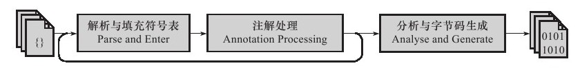

> https://www.cnblogs.com/qingshanli/p/9281760.html
## 1 Java编译流程

### 基本流程

* 前端编译主要指与源语言有关但与目标机无关的部分，包括词法分析、语法分析、语义分析与中间代码生成。把*.java文件转变成*.class文件
* 后端编译主要指与目标机有关的部分，包括代码优化和目标代码生成等。指把字节码转变成机器码


关键工具：词法分析器、语法分析器、语义分析器和代码生成器

1. 读取源码，进行词法分析。也就是找出源码字节中的关键字，识别出合法的关键字，最后得出一些规范化的Token(中文意思是“标记“、”象征”等)流。
2. 对Token流进行语法分析，检查关键词的组合是否符合语法，最后得到抽象的语法树（语法树是吧语言的主要此法用一个结构化的形式组合在一起）
3. 进行语法分析，把难懂的，复杂的语法转化成更加简单的的语法(对计算机来说)，最后得到一个注解过后的抽象语法树
4. 通过字节码生成器将经过注解的抽象语法树生成字节码
## 2 Java前端编译

java的前端编译(即javac编译)可分为解析与填充符号表、插入式注解处理器的注解处理、分析与字节码生成等三个过程。




1. 解析与填充符号表。解析步骤包括词法分析和语法分析两个阶段。词法分析是将源代码的字符流转变为标记(Token)集合, 单个字符是程序编写过程的最小单位, 而标记则是编译过程的最小单位, 关键字、变量名、字面量、运算符都可以成为标记。语法分析是根据Token序列构造抽象语法树的过程, 抽象语法树(AST)是一种用来描述程序代码语法结构的树形表示方式, 语法树的每一个节点都代表着程序代码中的一个语法结构, 如包、类型、修饰符、运算符、接口、返回值都可以是一个语法结构。 符号表是由一组符号地址和符号信息构成的表格。在语法分析中, 符号表所登记的内容将用于语义检查和产生中间代码。在目标代码生成阶段, 符号表是当对符号名进行地址分配时的依据。

2. 插入式注解处理器。插入式注解处理器可以看做是一组编译器的插件, 在这些插件里面, 可以读取、修改、添加抽象语法树中的任意元素。如果这些插件在处理注解期间对语法数进行了修改, 编译器将回到解析与填充符号表的过程重新处理, 直到所有插入式注解处理器都没有再对语法数进行修改为止, 每一次循环称为一个Round。
3. 语义分析与字节码生成。语法分析后, 编译器获得了程序代码的抽象语法树表示, 语法数能表示一个结构正确的源程序的抽象, 但无法保证源程序是符合逻辑的。而语义分析的主要任务是对结构正确的源程序进行上下文有关性质的审查。Javac的编译过程中, 语义分析过程分为标注检查、数据及控制流分析两个步骤。
   1. 标注检查的内容包括诸如变量使用前是否已被声明、变量与赋值之间的数据类型是否能够匹配等。另外在标注检查步骤中, 还有一个重要的动作称为常量折叠。
   2. 数据及控制流分析是对程序上下文逻辑更进一步的验证, 他可以检查出诸如程序局部变量在使用前是否有赋值、方法的每条路径是否都有返回值、是否所有的受查异常都被正确处理等问题。


Java中常用的语法糖有泛型、变长参数、自动装箱/拆箱、遍历循环、条件编译等等。虚拟机运行时并不支持这些语法, 它们在编译阶段还原回简单的基础语法结构, 这个过程称为解语法糖。

字节码生成是Javac编译过程的最后一个阶段, 它将前面各个步骤所生成的信息(语法数、符号表)转化成字节码写到磁盘中, 另外还进行少量的代码添加(如实例构造器)和转换工作。

## 3 Java中的后端编译
在部分商用虚拟机中, Java程序最初是通过解释器进行解释执行的, 当虚拟机发现某个方法或代码块的运行特别频繁时, 就会把这些代码认定为"热点代码"。为了提高热点代码的执行效率, 在运行时, 虚拟机将会把这些代码编译成与本地平台相关的机器码, 并进行各种层析的优化, 完成这个任务的编译器称为即时编译器(JIT编译器)。

### 编译器与解释器
HotSpot虚拟机中内置了两个即时编译器, 分别称为Client Compiler(C1编译器)和Server Compiler(C2编译器)。在HotSpot虚拟机中, 默认采用解释器与其中一个编译器直接配合的方式工作, 程序使用哪个编译器, 取决于虚拟机运行的模式, HotSpot虚拟机会根据自身版本与宿主机器的硬件性能自动选择运行模式, 这种解释器与编译器搭配使用的方式在虚拟机中称为"混合模式"(Mixed Mode)。在个人机器上, 通过java -version命令可查看自己安装的JDK中是哪种模式。

```sh
➜  ~ java -version
java version "1.8.0_291"
Java(TM) SE Runtime Environment (build 1.8.0_291-b10)
Java HotSpot(TM) 64-Bit Server VM (build 25.291-b10, mixed mode)
```

### 分层编译
在JDK 1.7的Server模式虚拟机中, 默认开启分层编译的策略。分层编译根据编译器编译、优化的规模与耗时, 划分出不同的编译层次:

1. 第0层, 程序解释执行, 解释器不开启性能监控功能, 可触发第1层编译。
2. 第1层, 也称为C1编译, 将字节码编译为本地代码, 进行简单可靠的优化, 如有必要将加入性能性能监控的逻辑。
3. 第2层(或2层以上), 也称为C2编译, 也是将字节码编译为本地代码, 但是会启用一些编译耗时较长的优化, 甚至会根据性能监控信息进行一些不可靠的激进优化。

实施分层编译后, C1编译器和C2编译器将会同时工作, 用C1编译器获取更高的编译速度, 用C2编译器获取更好的编译质量。

### 编译对象与触发条件
在运行过程中会被即时编译器编译的"热点代码"有如下两类:
* 被多次调用的方法。
* 被多次执行的循环体。

对于第一种情况, 编译器会以整个方法作为编译对象, 这种编译也是虚拟机中标准的JIT编译方式。而对于第二种, 尽管编译动作是由循环体所触发的, 但编译器依然会以整个方法(而不是单独的循环体)作为编译对象, 这种编译方式因为编译发生在方法执行过程之中, 因此形象的称之为栈上替换(即OSR编译)。

### 热点探测

判断是否需要触发即时编译, 需要先识别出热点代码, 这个行为称之为热点探测。目前主要的热点探测判定方式有以下两种:

基于采样的热点探测: 虚拟机周期性地检查各个线程的栈顶, 如发现某个方法经常出现在栈顶, 它就是"热点方法"。好处是简单高效, 还可以获取方法调用关系; 缺点是很难精确的确认一个方法的热点, 容易受到线程阻塞或别的外界因素干扰。
基于计数器的热点探测: 虚拟机会为每个方法(甚至是代码块)建立计数器, 统计方法的执行次数, 如果执行次数超过一定的阈值就认为是"热点方法"。
在HotSpot虚拟机中使用的是第二种————基于计数器的热点探测, 它为每个方法准备了两类计数器: 方法调用计数器和回边计数器。在确定虚拟机运行参数的前提下, 这两个计数器都有一个的确定的阈值, 当计数器超过阈值溢出, 就会触发JIT编译。

方法调用计数器用于统计方法被调用的次数; 回边计数器用于统计一个方法中循环体代码执行的次数, 在字节码中遇到控制流向后跳转的指令称为"回边"。关于这两种计数器, 读者可参阅<<深入理解Java虚拟机>>, 这里不多做深入分析。


### 编译过程
在默认设置下, 无论是方法调用产生的标准JIT编译请求, 还是OSR编译请求, 虚拟机在代码编译器还未完成之前, 都仍然将按照解释方式继续执行, 而编译动作则在后台的编译线程中进行。

## 4 Java的后端编译优化技术
### 公共子表达式消除
如果一个表达式E已经计算过了，并且从先前的计算到现在E中所有变量的值都没有发生变化，那E的这次出现就成为了公共子表达式。对于这种表达式, 没必要花时间再对它进行计算, 只需要直接用前面计算过的表达式结果替代E就可以了。

### 数组边界检查消除
顾名思义就是如果编译器根据数据流分析, 访问数组的下标没有越界, 那么就可以消除数组的边界检查, 这样能节省很多的条件判断操作, 提升程序性能。

### 方法内联
内联函数就是在程序编译时，编译器将程序中出现的内联函数的调用表达式用内联函数的函数体来直接进行替换。

### 逃逸分析
逃逸分析的基本行为就是分析对象动态作用域：当一个对象在方法中被定义后，它可能被外部方法所引用，例如作为调用参数传递到其他地方中，称为方法逃逸。甚至还有可能被外部线程访问到，譬如赋值给类变量或可以在其他线程中访问的实例变量，称为线程逃逸。

如果能证明一个对象不会逃逸到方法或线程外，则可能为这个变量进行一些高效的优化, 如栈上替换、同步消除、标量替换。

