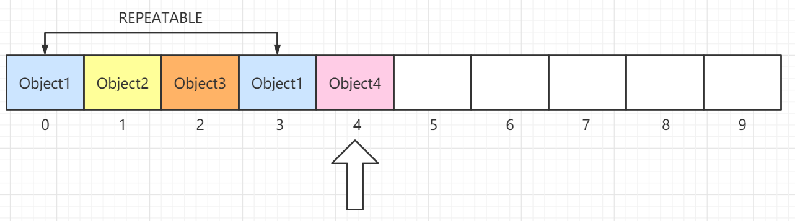

# List 接口

## 0 概述

### 简介
List 接口和 Set 接口齐头并进，是我们日常开发中接触的很多的一种集合类型了。整个 List 集合的组成部分如下图


`List` 接口直接继承 Collection 接口，它定义为可以存储**重复**元素的集合，并且元素按照插入顺序**有序排列**，且可以通过**索引**访问指定位置的元素。常见的实现有：ArrayList、LinkedList、Vector和Stack

### AbstractList  和 AbstractSequentialList

AbstractList 抽象类实现了 List 接口，其内部实现了所有的 List 都需具备的功能，子类可以专注于实现自己具体的操作逻辑。

```java
// 查找元素 o 第一次出现的索引位置
public int indexOf(Object o)
// 查找元素 o 最后一次出现的索引位置
public int lastIndexOf(Object o)
//···
```

AbstractSequentialList 抽象类继承了 AbstractList，在原基础上限制了访问元素的顺序**只能够按照顺序访问**，而**不支持随机访问**，如果需要满足随机访问的特性，则继承 AbstractList。子类 LinkedList 使用链表实现，所以仅能支持**顺序访问**，顾继承了 `AbstractSequentialList`而不是 AbstractList。


## 1 ArrayList

### 底层原理
ArrayList 以**数组**作为存储结构，它是**线程不安全**的集合；具有**查询快、在数组中间或头部增删慢**的特点，所以它除了线程不安全这一点，其余可以替代`Vector`，而且线程安全的 ArrayList 可以使用 `CopyOnWriteArrayList`代替 Vector。



关于 ArrayList 有几个重要的点需要注意的：

- 具备**随机访问**特点，**访问元素的效率**较高，ArrayList 在**频繁插入、删除**集合元素的场景下效率较`低`。

- 底层数据结构：ArrayList 底层使用数组作为存储结构，具备**查找快、增删慢**的特点

- 线程安全性：ArrayList 是**线程不安全**的集合

- ArrayList **首次扩容**后的长度为 `10`，调用 `add()` 时需要计算容器的最小容量。可以看到如果数组`elementData`为空数组，会将最小容量设置为`10`，之后会将数组长度完成首次扩容到 10。

另外一篇文章
* Ordered – arraylist中的元素保留其排序，默认情况下是其添加到列表的顺序。
* Index based –可以使用索引位置随机访问元素。 索引以'0'开头。
* Dynamic resizing –当需要添加的元素数量超过当前大小时，ArrayList会动态增长。
* Non synchronized –默认情况下，ArrayList不同步。 程序员需要适当地使用synchronized关键字，或者仅使用Vector类。
* Duplicates allowed -我们可以在arraylist中添加重复元素。 不能成组放置。

```Java
// new ArrayList 时的默认空数组
private static final Object[] DEFAULTCAPACITY_EMPTY_ELEMENTDATA = {};
// 默认容量
private static final int DEFAULT_CAPACITY = 10;
// 计算该容器应该满足的最小容量
private static int calculateCapacity(Object[] elementData, int minCapacity) {
    if (elementData == DEFAULTCAPACITY_EMPTY_ELEMENTDATA) {
        return Math.max(DEFAULT_CAPACITY, minCapacity);
    }
    return minCapacity;
}
```

- 集合从**第二次扩容**开始，数组长度将扩容为原来的 `1.5` 倍，即：`newLength = oldLength * 1.5`


### 构造函数

* 没有逐个元素初始化的方法，使用Arrays.asList能够添加对象初始化。
```java
//Empty arraylist
List<String> names = new ArrayList<>(); 
 
//Arraylist initialized with another collection
List<Integer> numbers = new ArrayList<>(Arrays.asList(1,2,3,4,5)); 
```


### 常用方法

* add()添加单个元素
```java
public boolean add(E e) {
    ensureCapacityInternal(size + 1);  // Increments modCount!!
    elementData[size++] = e;
    return true;
}
```
* addAll()方法将给定集合的所有元素添加到arraylist中。 始终使用泛型来确保您仅在给定列表中添加某种类型的元素。

```java
import java.util.ArrayList;
 
public class ArrayListExample 
{
    public static void main(String[] args) 
    {
        ArrayList<String> list1 = new ArrayList<>();    //list 1
         
        list1.add("A");
        list1.add("B");
        list1.add("C");
        list1.add("D");
         
        ArrayList<String> list2 = new ArrayList<>();    //list 2
         
        list2.add("E");
         
        list1.addAll(list2);
         
        System.out.println(list1);      //combined list
    }
}
```
* clear()方法将arraylist clear

```java
import java.util.ArrayList;
 
public class ArrayListExample 
{
    public static void main(String[] args) 
    {
        ArrayList<String> arrayList = new ArrayList<>(); 
         
        arrayList.add("A");
        arrayList.add("B");
        arrayList.add("C");
        arrayList.add("D");
         
        System.out.println(arrayList);   
         
        arrayList.clear();
         
        System.out.println(arrayList);   
    }
}
```

* clone()方法创建arraylist的浅表副本 。
```java
import java.util.ArrayList;
 
public class ArrayListExample 
{
    @SuppressWarnings("unchecked")
    public static void main(String[] args) 
    {
        ArrayList<String> arrayListObject = new ArrayList<>(); 
         
        arrayListObject.add("A");
        arrayListObject.add("B");
        arrayListObject.add("C");
        arrayListObject.add("D");
         
        System.out.println(arrayListObject);   
         
        ArrayList<String> arrayListClone =  (ArrayList<String>) arrayListObject.clone();
         
        System.out.println(arrayListClone);   
    }
}
```
* clone深拷贝。创建集合的深层副本非常容易。 我们需要创建一个新的collection实例，并将给定collection中的所有元素一一复制到克隆的collection中。 请注意，我们将在克隆集合中复制元素的克隆。
```java
ArrayList<Employee> employeeList = new ArrayList<>(); 
ArrayList<Employee> employeeListClone = new ArrayList<>();
 
Iterator<Employee> iterator = employeeList.iterator();
 
while(iterator.hasNext())
{
    //Add the object clones
    employeeListClone.add((Employee) iterator.next().clone());  
}
```
* cantains()数组列表中存储了几个字母。 我们将尝试找出列表中是否包含字母“ A”和“ Z”。
```java
public class ArrayListExample 
{
    public static void main(String[] args) 
    {
        ArrayList<String> list = new ArrayList<>(2);
         
        list.add("A");
        list.add("B");
        list.add("C");
        list.add("D");
         
        System.out.println( list.contains("A") );       //true
         
        System.out.println( list.contains("Z") );       //false
    }
}
```

* indexOf()判断是否存在.返回此列表中指定元素的首次出现的索引。 如果列表不包含元素，它将返回'-1' 。

```java
public class ArrayListExample 
{
    public static void main(String[] args) 
    {
        ArrayList<String> list = new ArrayList<>(2);
         
        list.add("A");
        list.add("B");
        list.add("C");
        list.add("D");
         
        System.out.println( list.indexOf("A") > 0 );       //true
         
        System.out.println( list.indexOf("Z") > 0);       //false
    }
}
```
* lastIndexOf()返回此列表中最后一次出现的指定元素的索引。 如果列表不包含元素，它将返回'-1' 。

```java
public int lastIndexOf(Object object) {
    if (o == null) {
        for (int i = size-1; i >= 0; i--)
            if (elementData[i]==null)
                return i;
    } else {
        for (int i = size-1; i >= 0; i--)
            if (o.equals(elementData[i]))
                return i;
    }
    return -1;
}

```
* get(int index)方法返回列表中指定位置'index'处的元素。
```java
import java.util.ArrayList;
import java.util.Arrays;
 
public class ArrayListExample 
{
    public static void main(String[] args) 
    {
        ArrayList<String> list = new ArrayList<>(Arrays.asList("alex", "brian", "charles", "dough"));
         
        String firstName = list.get(0);         //alex
        String secondName = list.get(1);        //brian
         
        System.out.println(firstName);
        System.out.println(secondName);
    }
}
```

* boolean remove(Object o) –从列表中删除第一次出现的指定元素。 true从列表中删除了任何元素，则返回true ，否则返回false 。对象remove（int index）引发IndexOutOfBoundsException-移除此列表中指定位置的元素。 将所有后续元素向左移动。 返回从列表中移除的元素。 如果参数索引无效，则引发异常。

```java
import java.util.ArrayList;
import java.util.Arrays;
 
public class ArrayListExample 
{
    public static void main(String[] args) throws CloneNotSupportedException 
    {
        ArrayList<String> alphabets = new ArrayList<>(Arrays.asList("A", "B", "C", "D"));
         
        System.out.println(alphabets);
         
        alphabets.remove("C");          //Element is present
         
        System.out.println(alphabets);
         
        alphabets.remove("Z");          //Element is NOT present
         
        System.out.println(alphabets);
    }
}
```
* removeAll()方法遍历arraylist的所有元素。 对于每个元素，它将元素传递给参数集合的contains()方法。如果在参数集合中找到element，它将重新排列索引。 如果未找到element，则将其保留在后备数组中。

```java
import java.util.ArrayList;
import java.util.Arrays;
import java.util.Collections;
 
public class ArrayListExample 
{
    public static void main(String[] args) throws CloneNotSupportedException 
    {
        ArrayList<String> alphabets = new ArrayList<>(Arrays.asList("A", "B", "A", "D", "A"));
         
        System.out.println(alphabets);
         
        alphabets.removeAll(Collections.singleton("A"));
         
        System.out.println(alphabets);
    }
}
```

* removeIf()方法采用Predicate类型的单个参数。 谓词接口是一种功能接口，表示一个参数的条件（布尔值函数）。 它检查给定参数是否满足条件。

```java
import java.util.ArrayList;
import java.util.Arrays;
 
public class ArrayListExample 
{
    public static void main(String[] args) throws CloneNotSupportedException 
    {
        ArrayList<Integer> numbers = new ArrayList<>(Arrays.asList(1,2,3,4,5,6,7,8,9,10));
 
        numbers.removeIf( number -> number%2 == 0 );
         
        System.out.println(numbers);
    }
}

```

* retainAll()方法来保留列表中存在于指定参数集合中的所有元素。

```java
import java.util.ArrayList;
import java.util.Arrays;
import java.util.Collections;
 
public class ArrayListExample 
{
    public static void main(String[] args) throws CloneNotSupportedException 
    {
        ArrayList<String> alphabets = new ArrayList<>(Arrays.asList("A", "B", "A", "D", "A"));
         
        System.out.println(alphabets);
         
        alphabets.retainAll(Collections.singleton("A"));
         
        System.out.println(alphabets);
    }
}
```

* sort()方法使用Arrays.sort()方法对列表中的元素进行比较和排序。sort()方法接受Comparator实现类的实例，该实例必须能够比较arraylist中包含的元素

```java
import java.util.Comparator;
 
public class NameSorter implements Comparator<Employee> 
{
    @Override
    public int compare(Employee o1, Employee o2) {
        return o1.getName().compareToIgnoreCase(o1.getName());
    }
}


import java.time.LocalDate;
import java.time.Month;
import java.util.ArrayList;
 
public class ArrayListExample 
{
    public static void main(String[] args) throws CloneNotSupportedException 
    {
        ArrayList<Employee> employees = new ArrayList<>();
         
        employees.add(new Employee(1l, "Alex", LocalDate.of(2018, Month.APRIL, 21)));
        employees.add(new Employee(4l, "Brian", LocalDate.of(2018, Month.APRIL, 22)));
        employees.add(new Employee(3l, "David", LocalDate.of(2018, Month.APRIL, 25)));
        employees.add(new Employee(5l, "Charles", LocalDate.of(2018, Month.APRIL, 23)));
        employees.add(new Employee(2l, "Edwin", LocalDate.of(2018, Month.APRIL, 24)));
                
        employees.sort(new NameSorter());
        System.out.println(employees);
    }
}

```

* toArray()将arraylist转换为对象数组并遍历数组内容

```java
import java.util.ArrayList;
import java.util.Arrays;
 
public class ArrayListExample 
{
    public static void main(String[] args) 
    {
        ArrayList<String> list = new ArrayList<>(2);
         
        list.add("A");
        list.add("B");
        list.add("C");
        list.add("D");
         
        //Convert to object array
        Object[] array = list.toArray();
         
        System.out.println( Arrays.toString(array) );
 
        //Iterate and convert to desired type
        for(Object o : array) {
            String s = (String) o;
             
            System.out.println(s);
        }
    }
}
// 可以控制转换完成的结果。
import java.util.ArrayList;
import java.util.Arrays;
 
public class ArrayListExample 
{
    public static void main(String[] args) 
    {
        ArrayList<String> list = new ArrayList<>(2);
         
        list.add("A");
        list.add("B");
        list.add("C");
        list.add("D");
         
        //Convert to string array
        String[] array = list.toArray(new String[list.size()]);
         
        System.out.println(Arrays.toString(array));
    }
}
```

* sublist获取子列表

```java
import java.util.ArrayList;
import java.util.Arrays;
 
public class ArrayListExample 
{
    public static void main(String[] args) 
    {
        ArrayList<Integer> list = new ArrayList<>(Arrays.asList(0,1,2,3,4,5,6,7,8,9));
         
        ArrayList<Integer> sublist = new ArrayList<Integer>( list.subList(2, 6) );
         
        System.out.println(sublist);
    }
}
```


### 遍历方法
五种loop ArrayList 

* Java程序使用standard for loop遍历对象的数组列表。(能够控制遍历计数，方便进行排序等算法操作)

```java
ArrayList<String> namesList = new ArrayList<String>(Arrays.asList( "alex", "brian", "charles") );
         
for(int i = 0; i < namesList.size(); i++)
{
    System.out.println(namesList.get(i));
}
```
* 使用foreach loop遍历对象的数组列表。（最方便的遍历。）

```java
ArrayList<String> namesList = new ArrayList<String>(Arrays.asList( "alex", "brian", "charles") );
         
for(String name : namesList)
{
    System.out.println(name);
}
```
* 使用列表迭代器对象迭代对象的数组列表。(能够在遍历的时候删除。)
```java
ArrayList<String> namesList = new ArrayList<String>(Arrays.asList( "alex", "brian", "charles") );
         
ListIterator<String> listItr = namesList.listIterator();
 
while(listItr.hasNext())
{
    System.out.println(listItr.next());
}
```

* while循环。（可能在某些算法中比较方便，除非你想让循环体控制遍历计数）

```java
ArrayList<String> namesList = new ArrayList<String>(Arrays.asList( "alex", "brian", "charles") );
 
int index = 0;          
while (namesList.size() > index) 
{
   System.out.println(namesList.get(index++));
}
```
* 使用Java 8流API遍历对象的数组列表。 使用stream.foreach()方法从arraylist对象创建元素流，并stream.foreach()获取元素。
```java
Iterate arraylist with stream api
ArrayList<String> namesList = new ArrayList<String>(Arrays.asList( "alex", "brian", "charles") );
namesList.forEach(name -> System.out.println(name));
```

* listIterator()方法获得的列表迭代器来迭代arraylist。ListIterator支持在迭代列表时添加和删除列表中的元素。
  * listIterator.add(Element e) –将该元素立即插入将由next()返回的元素之前或将要返回的previous()方法的元素之后。
  * listIterator.remove() –从列表中删除next()或previous()方法返回的最后一个元素。

```java
import java.util.ArrayList;
import java.util.Arrays;
import java.util.ListIterator;
 
public class ArrayListExample 
{
    public static void main(String[] args) throws CloneNotSupportedException 
    {
        ArrayList<String> alphabets = new ArrayList<>(Arrays.asList("A", "B", "C", "D"));
         
        ListIterator<String> listItr = alphabets.listIterator();
         
        System.out.println("===========Forward=========");
         
        while(listItr.hasNext()) {
            System.out.println(listItr.next());
        }
         
        System.out.println("===========Backward=========");
         
        while(listItr.hasPrevious()) {
            System.out.println(listItr.previous());
        }
    }
}
```

## 2 Vector
### 底层原理


`Vector` 在现在已经是一种过时的集合了，包括继承它的 `Stack` 集合也如此，它们被淘汰的原因都是因为**性能**低下。

> JDK 1.0 时代，ArrayList 还没诞生，大家都是使用 Vector 集合，但由于 Vector 的**每个操作**都被 **synchronized** 关键字修饰，即使在线程安全的情况下，仍然**进行无意义的加锁与释放锁**，造成额外的性能开销，做了无用功。

```java
public synchronized boolean add(E e);
public synchronized E get(int index);
```

在 JDK 1.2 时，Collection 家族出现了，它提供了大量**高性能、适用於不同场合**的集合，而 Vector 也是其中一员，但由于 Vector 在每个方法上都加了锁，由于需要兼容许多老的项目，很难在此基础上优化`Vector`了，所以渐渐地也就被历史淘汰了。

现在，在**线程安全**的情况下，不需要选用 Vector 集合，取而代之的是 **ArrayList** 集合；在并发环境下，出现了 `CopyOnWriteArrayList`，Vector 完全被弃用了。


## 3 Stack
### 底层原理


`Stack`是一种`后入先出（LIFO）`型的集合容器，如图中所示，`大雄`是最后一个进入容器的，top指针指向大雄，那么弹出元素时，大雄也是第一个被弹出去的。

Stack 继承了 Vector 类，提供了栈顶的压入元素操作（push）和弹出元素操作（pop），以及查看栈顶元素的方法（peek）等等，但由于继承了 Vector，正所谓跟错老大没福报，Stack 也渐渐被淘汰了。

取而代之的是后起之秀 `Deque`接口，其实现有 `ArrayDeque`，该数据结构更加完善、可靠性更好，依靠队列也可以实现`LIFO`的栈操作，所以优先选择 ArrayDeque 实现栈。

```java
Deque<Integer> stack = new ArrayDeque<Integer>();
```

ArrayDeque 的数据结构是：`数组`，并提供**头尾指针下标**对数组元素进行操作。本文也会讲到哦，客官请继续往下看，莫着急！:smile:
	

## 4 CopyOnWriteArrayList
> 用来替代vector，提供现成安全的list
### 底层原理

Java CopyOnWriteArrayList是ArrayList的thread-safe变体，其中所有可变操作（添加，设置等）都通过对基础array进行全新复制来实现。

* CopyOnWriteArrayList类实现List和RandomAccess接口，因此提供ArrayList类中可用的所有功能。
* 使用CopyOnWriteArrayList进行更新操作的成本很高，因为每个突变都会创建基础数组的克隆副本，并为其添加/更新元素。
* 它是ArrayList的线程安全版本。 每个访问列表的线程在初始化此列表的迭代器时都会看到自己创建的后备阵列快照版本。
* 因为它在创建迭代器时获取基础数组的快照，所以它不会抛出ConcurrentModificationException 。
* 不支持对迭代器的删除操作（删除，设置和添加）。 这些方法抛出UnsupportedOperationException 。
* CopyOnWriteArrayList是synchronized List的并发替代，当迭代的次数超过突变次数时，CopyOnWriteArrayList可以提供更好的并发性。
* 它允许重复的元素和异构对象（使用泛型来获取编译时错误）。因为它每次创建迭代器时都会创建一个新的数组副本，所以performance is slower比ArrayList performance is slower 。


### 实例

```java
CopyOnWriteArrayList<Integer> list = new CopyOnWriteArrayList<>(new Integer[] {1,2,3});
 
System.out.println(list);   //[1, 2, 3]
 
//Get iterator 1
Iterator<Integer> itr1 = list.iterator();
 
//Add one element and verify list is updated
list.add(4);
 
System.out.println(list);   //[1, 2, 3, 4]
 
//Get iterator 2
Iterator<Integer> itr2 = list.iterator();
 
System.out.println("====Verify Iterator 1 content====");
 
itr1.forEachRemaining(System.out :: println);   //1,2,3
 
System.out.println("====Verify Iterator 2 content====");
 
itr2.forEachRemaining(System.out :: println);   //1,2,3,4
```

### 主要方法

```java
CopyOnWriteArrayList() ：创建一个空列表。
CopyOnWriteArrayList(Collection c) ：创建一个列表，该列表包含指定集合的​​元素，并按集合的迭代器返回它们的顺序。
CopyOnWriteArrayList(object[] array) ：创建一个保存给定数组副本的列表。
boolean addIfAbsent(object o) ：如果不存在则追加元素。
int addAllAbsent(Collection c) ：以指定集合的​​迭代器返回的顺序，将指定集合中尚未包含在此列表中的所有元素追加到此列表的末尾。
```

