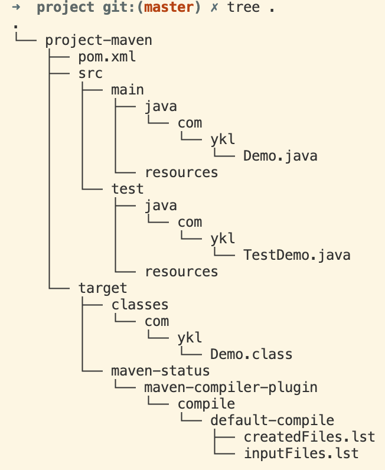

## 1 maven基本概念

### 概念

1. 项目对象模型（Project Object Management,POM）。Maven 是一个项目管理工具，可以对 Java 项目进行构建、依赖管理。Maven利用一个中央信息片断能管理一个项目的构建、报告和文档等步骤。


### 作用

1. 项目构建。提供标准的跨平台的项目构建方法。
2. 依赖管理。方便快捷地管理项目依赖的资源，避免资源间的版本冲突。
3. 统一开发结构。提供标准的、统一的项目结构。


### 仓库
* 本地仓库：在本地维护的maven的仓库。
* 远程仓库：不在电脑上的。
  * 中央仓库：maven维护的服务器上的仓库。
  * 私服仓库：在局域网内维护的仓库。一方面是快，小范围内进行共享的资源。


### 坐标
坐标的组成。坐标也是仓库中存放包的路径。
* groupId:定义当前maven项目所属的组织名称，域名反写
* artifactId:定义当前maven项目的名称。通常是模块名字
* version:定义当前版本号。

> packaging 能够规定打包方式。例如可以打包成jar/war

使用唯一标识。定位资源的位置。

### 镜像

* 在maven目录conf下的setting.xml中可以配置全局镜像mirrors
* 在.m2目录下的setting.xml中可以配置用户镜像mirrors


## 2 Maven项目构建


### 工程目录结构

```
工程-项目-src源代码+target编译结果-main+test-java+resource-groupId-fileID
```

1. 最顶层是工程，次顶层是模块或项目，可以自行编译执行的模块或项目。模块或项目下有src和target目录，即源代码和编译生成的代码。



2. 在src同层目录下创建pom.xml。即模块或项目的顶层目录下使用pom.xml进行配置。

```xml
<?xml version="1.0" encoding="UTF-8"?>
<project xmlns="http://maven.apache.org/POM/4.0.0"
         xmlns:xsi="http://www.w3.org/2001/XMLSchema-instance"
         xsi:schemaLocation="http://maven.apache.org/POM/4.0.0 http://maven.apache.org/xsd/maven-4.0.0.xsd">
    <modelVersion>4.0.0</modelVersion>

    <groupId>com.ykl</groupId>
    <artifactId>project-maven</artifactId>
    <version>1.0.2</version>

    <packaging>jar</packaging>
    <dependencies>
        <dependency>
            <groupId>junit</groupId>
            <artifactId>junit</artifactId>
            <version>4.12</version>
        </dependency>
    </dependencies>
</project>
```


### maven命令

* mvn compile 下载插件、下载依赖、编译项目的源代码、将编译后的代码放到target目录下。
* mvn clean 删除target目录，即本项目编译生成的文件。
* mvn test 下载对应插件，编译后，运行Test目录下的测试脚本。
* mvn package 首先进行compile，然后进行test，最后打包程序。 
* mvn install 把打包好的jar包放到仓库里。一次运行compile/test/package命令，最后将jar包安装到本地仓库中。


### maven创建工程
maven提供了工程创建的命令
1. 创建一个java工程
```shell
mvn archetype:generate -DgroupId=com.demo -DartifactId=javaproject -DarchetypeArtifactId=maven-archetype-quickstart -Dversion=0.0.1-snapshot -DinteractiveMode=false
```
2. 创建一个web工程

```
mvn archetype:generate -DgroupId=com.demo -DartifactId=webproject -DarchetypeArtifactId=maven-archetype-webapp -Dversion=0.0.1-snapshot -DinteractiveMode=false
```


### idea创建maven工程

1. 需要自己指定源代码、测试代码、源代码资源文件和测试资源文件。
2. 可以在idea中自动创建启动参数。edit configuration
3. 使用原型创建Maven模块。选择不同的Maven原型文件。


### idea创建web项目

1. 直接在web中添加tomcat插件，即可在本地展示网站。

