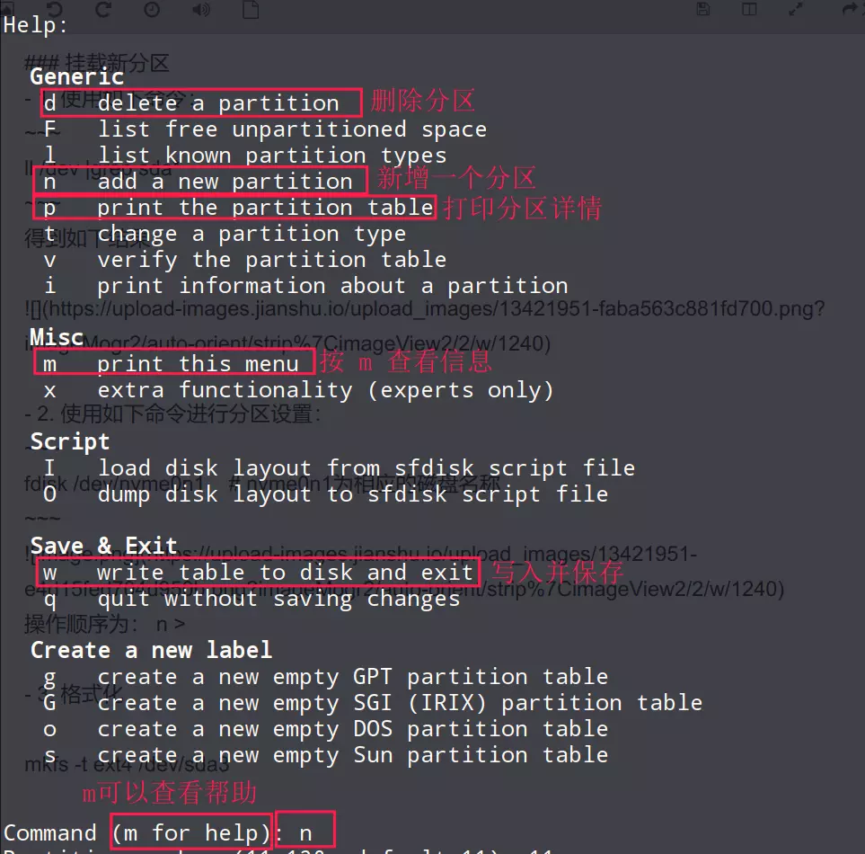

# 分区与挂载

> 文件系统是软件系统，为其他程序提供访问数据的接口。
> 磁盘管理是对硬件的管理，为文件管理提供上层接口。
> 文件系统建立在磁盘管理之上。

## 1 文件系统

## 2 分区方式

### MBR分区

最多支持 4 个主分区，只能用扩展分区衍生出更多的逻辑分区。
扩展分区要占一个主分区。
主分区：安装操作系统。
逻辑分区：安装除去操作系统之外的文件
主分区与扩展分区最多有四个
逻辑分区的总和称为扩展分区
系统只能转在主分区。
MBR 最大支持的分区大小为 2 TB（大数据时代显然是不够的）。

### GPT分区

支持无线多个主分区（ OS 可能会做限制，例如：windows 下最多 128 个分区）。
最大支持 18EB 的大容量。（1024TB=1PB，1024PB=1EB）。
Windows 7 后只支持 GPT 方式。

### Win与Linux分区区别

区别在于挂载。

Windows 中都是分区都是按照磁盘号来分区的，分区就拥有一个磁盘号，每一个磁盘分区的根目录都可以说是平级的，没有太大的相关性。文件系统位于磁盘分区之上。

Linux中文件系统与磁盘管理相互独立，通过“挂载”过程建立关联。文件系统并非确定位于某个磁盘分区上的系统。在 Linux 中就是把某个目录树中的目录与分区关联起来，即挂载。一个分区必须和目录树上的一个文件目录关联起来，这个目录里的所有文件都会存储与这个分区之中。

其与 Windows 最大的区别点就在于：不管怎么分区，Linux 中的目录结构不会改变，与磁盘分区相互独立，互补影响。而不像 Windows 中每个分区的根目录都是平级存在的，分区决定了目录的位置。

### 硬盘接口说明

IDE 、 STATA 、M2、NVME，IDE一般都是机械硬盘使用的，STATA、M2、MVME都是固态硬盘使用的接口，速度会比 IDE 快上许多，随着时间的流逝，IDE 肯定会像 MBR 分区格式一样被淘汰的。


自动分区的编号分别是

* IDE：hda,hda1,hda2,hdb
* STATA：sda,sda1,sda2,sdb
* NVME：nvme0n1,nvme0n1p1,nvme0n1p2,
* virtio（虚拟机）：vda,vda1,vda2


## 3 分区配置

### 3.1 查看分区

* 查看系统分区
```
lsblk -f    # 查看系统分区情况

type:disk 表示硬盘
type:part 表示硬盘分区
fstype:表示文件系统格式。
size:表示分区大小
name: 分区的名字（由系统生成的物理名称）
label:分区标识符
mountpoint:表示挂载点。ubuntu至少有两个挂载点
    boot/efi:启动分区
    /:主目录分区。
```
* 查看dev目录下的设备

```
ll /dev |grep nvme*
```
* 查看更详细的分区信息
```
fdisk -l
```
* 查看文件系统
```
df -h
du -h
```

### 3.2 设置分区

使用如下命令进行分区设置：
```
sudo fdisk /dev/nvme0n1    # nvme0n1为相应的磁盘名称 
```


可以通过交互式命令来配置磁盘的分区。按照操作提示一步一步完成操作过程

### 3.3 格式化分区

使用如下命令进行格式化分区：
```
sudo mkfs -t ext4 /dev/nvme0n1p11  # ext4表示分区类型，具体可自行 Google 查询
```

### 3.4 挂载分区

*  挂载分区
使用如下命令将 nvme0n1p11 分区挂载到 /opt/test 目录
```
mount /dev/nvme0n1p11 /opt/test       # 这里是挂载命令
```
* 卸载分区
```
umount /dev/nvme0n1p11 /opt/test
```

### 3.5 永久挂载
通过修改配置文件（/etc/fstab），新增如下图的内容保存即可完成永久挂载。

挂载的配置可以直接是defaults


### 3.6 修改权限

因为挂载后默认文件夹是root用户有读写权限
```
chmod 777 /home/ykl/work
```