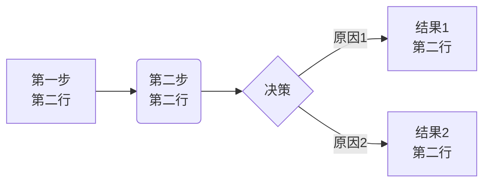
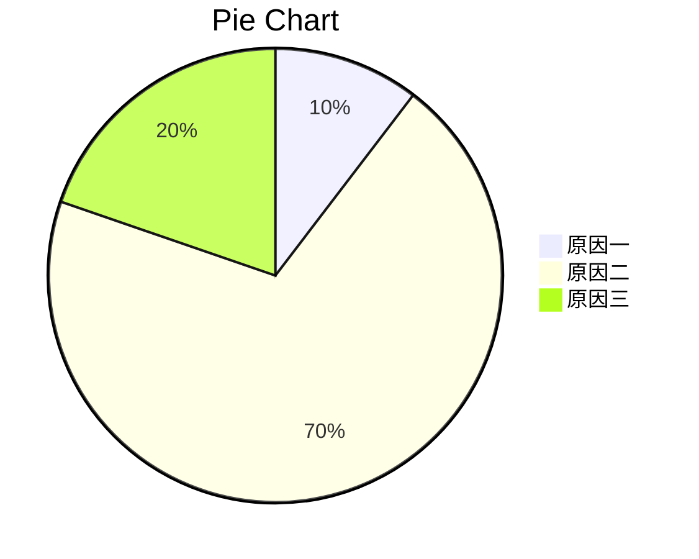

## markdonw绘图

### 时序图
```sequence
A->B:因果关系

B->A:返回值
```

### 流程图

​```flow
st=>start: 第一步
op=>operation: 第二步
cond=>condition: Yes or No?
e=>end

st->op->cond
cond(yes)->e
cond(no)->op
​```

### 右向图


### 扇形图



