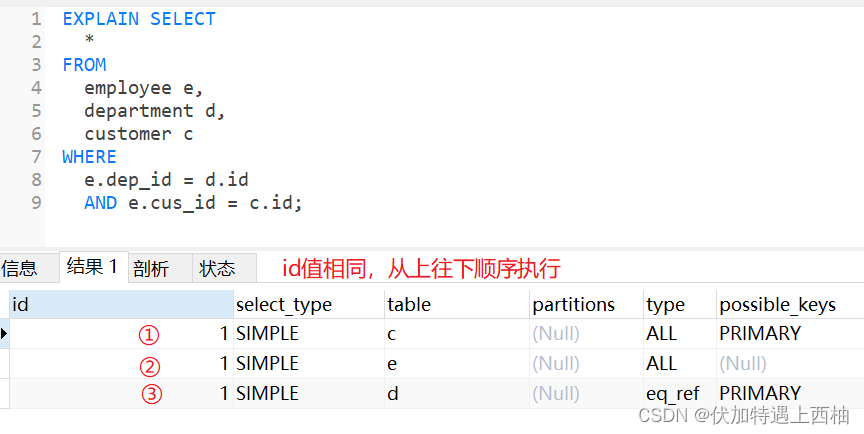
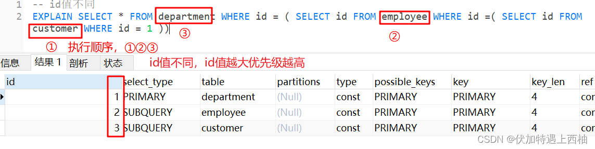
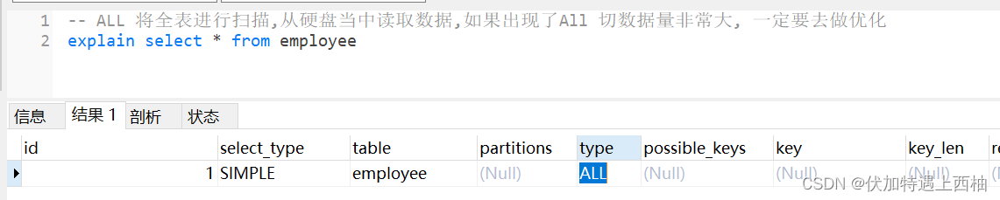
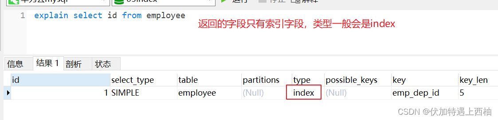
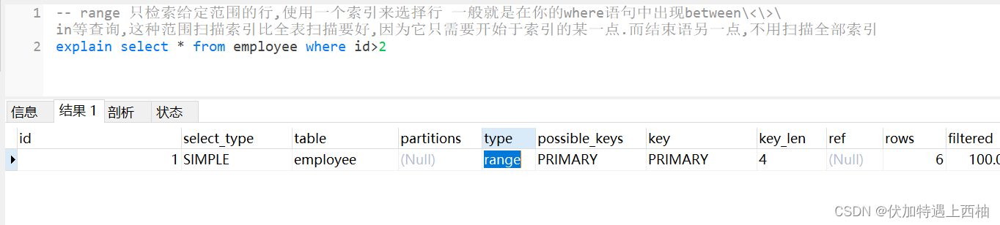
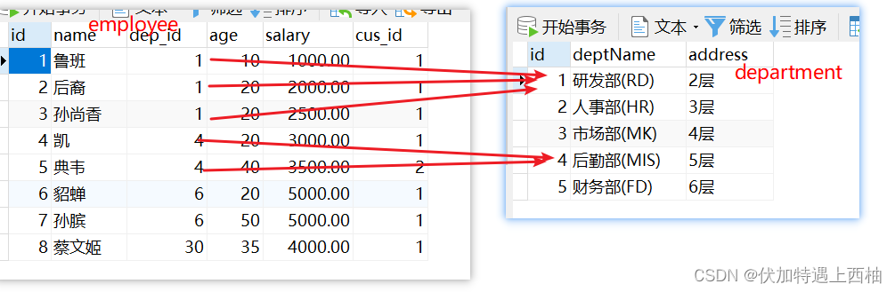
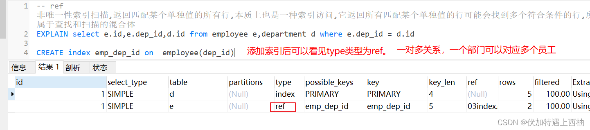
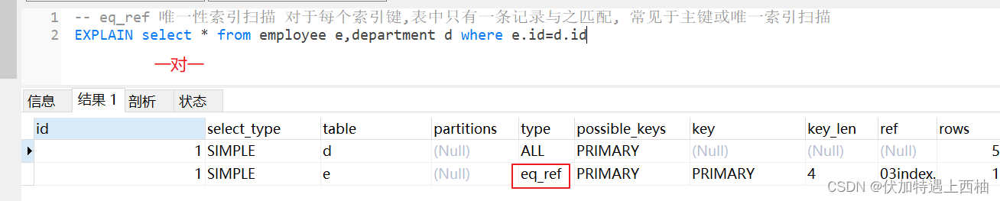
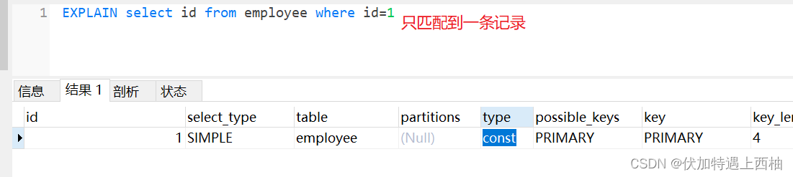
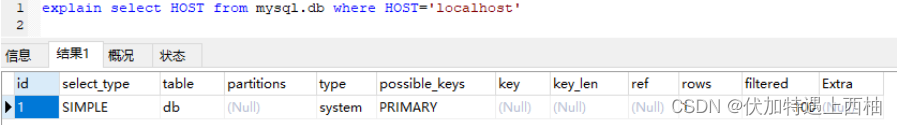

## 1 简介
在MySQL中，EXPLAIN命令的返回值是一个表格，包含了查询语句的执行计划。表格中的每一行代表了一个访问方式，每一列代表了一个属性，例如：
```sql
+----+-------------+-------+-------+---------------+---------+---------+------+------+-------------+
| id | select_type | table | type  | possible_keys | key     | key_len | ref  | rows | Extra       |
+----+-------------+-------+-------+---------------+---------+---------+------+------+-------------+
|  1 | SIMPLE      | users | const | PRIMARY       | PRIMARY | 4       | const|    1 |             |
+----+-------------+-------+-------+---------------+---------+---------+------+------+-------------+
```
下面是表格中各个属性的含义：

* id: 查询的标识符，每个查询都有一个唯一的标识符。如果是子查询,id的序号会递增,id值越大优先级越高,优先被执行
  * 
  * 
* select_type: 查询的类型，共有以下几种类型：
	* SIMPLE：简单select查询,查询中不包含子查询或者UNION
	* PRIMARY：查询中若包含任何复杂的子查询,最外层查询则被标记为primary
	* SUBQUERY：在select或where中包含了子查询
	* DERIVED：在from列表中包含的子查询被标记为derived(衍生)把结果放在临时表当		
	* UNION：若第二个select出现的union之后,则被标记为union。若union包含在from子句的子查询中,外层select将被标记为deriver
	* UNION RESULT：从union表获取结果select,两个UNION合并的结果集在最后

* table: 此行正在访问的表。
* type: 表示访问类型，包括以下几种类型：
  * ALL: 全表扫描，将访问表的每一行数据。将全表进行扫描,从硬盘当中读取数据,如果出现了All 切数据量非常大, 一定要去做优化
  * index: 全索引扫描，将访问索引的每一行数据。index与All区别为index类型只遍历索引树,通常比All要快,
因为索引文件通常比数据文件要小all和index都是读全表,
但index是从索引中读取,all是从硬盘当中读取
  * range: 只检索给定范围的行,使用一个索引来选择行 一般就是在你的where语句中出现between<>\ in等查询,这种范围扫描索引比全表扫描要好,因为它只需要开始于索引的某一点.而结束语另一点,不用扫描全部索引。
  * ref: 非唯一性索引扫描。出现在一对多关系中，例如部门和员工。ref 非唯一性索引扫描,返回匹配某个单独值的所有行,本质上也是一种索引访问,它返回所有匹配某个单独值的行可能会找到多个符合条件的行,所以它应该属于查找和扫描的混合体
  * eq_ref: 唯一索引引用，类似于ref，但使用的是唯一索引。eq_ref 唯一性索引扫描 对于每个索引键,表中只有一条记录与之匹配, 常见于主键或唯一索引扫描
  * const: 表示通过索引一次就找到了。常量复杂度
  * system: 表中有一行记录(系统表)  这是const类型的特例,平时不会出现
* partitions：如果查询是基于分区表的话, 会显示查询访问的分区
* possible_keys: 可能使用的索引列表。
* key: 实际使用的索引。
  * 实际使用的索引,如果为NULL,则没有使用索引,查询中若使用了覆盖索引 ,则该索引仅出现在key列表possible_keys与key关系,理论应该用到哪些索引实际用到了哪些索引覆盖索引 查询的字段和建立的字段刚好吻合,
这种我们称为覆盖索引
* key_len: 索引键使用的字节数。
* ref: 列与索引之间的匹配。索引是否被引入到, 到底引用到了哪几个索引
* rows: 表示MySQL估计需要扫描的行数。语句中出现了Using Filesort 和 Using Temporary说明没有使用到索引。出现 impossible where说明条件永远不成立
  * Extra: 额外的信息，包括以下几种类型：
  * Using filesort: MySQL需要额外排序。
  * Using temporary: MySQL需要创建临时表。
  * Using index: 查询使用了覆盖索引。
  * Using where: MySQL需要过滤部分数据。
  * Using join buffer: MySQL正在使用连接缓冲区。
* filtered满足查询的记录数量的比例，注意是百分比，不是具体记录数 . 值越大越好，filtered列的值依赖统计信息，并不十分准确


通过分析执行计划，可以发现哪些地方需要优化，例如是否可以添加索引、是否可以缩小查询范围等等。


## 2 实例

### id值与执行顺序
* id值相同


* id值不同


* id值
