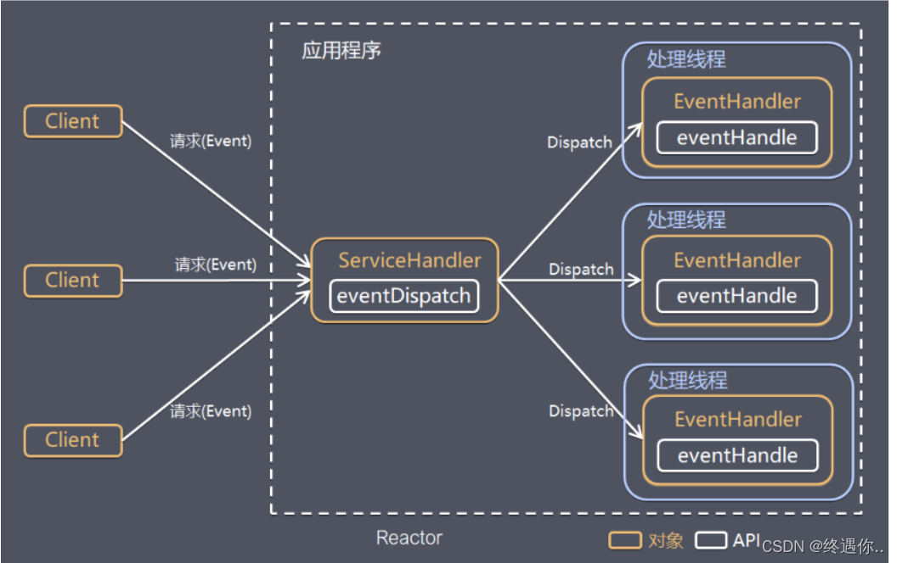
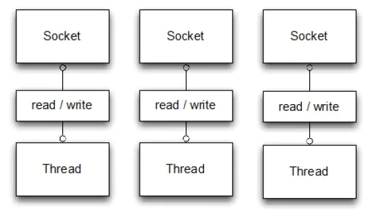
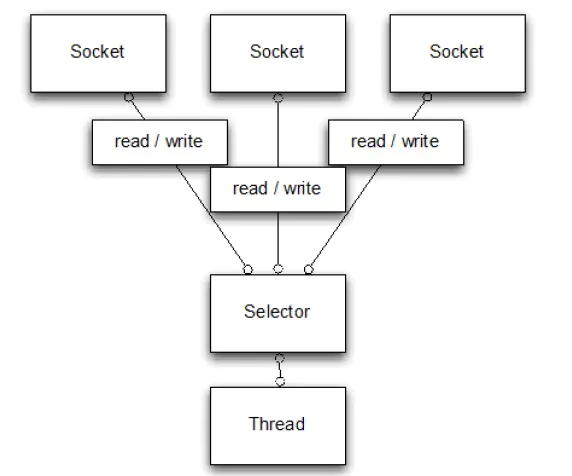
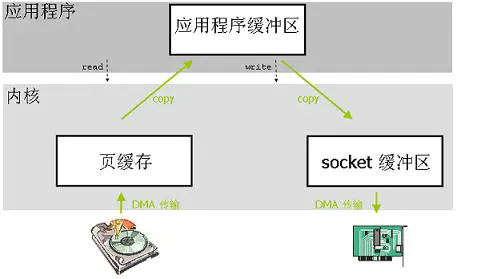
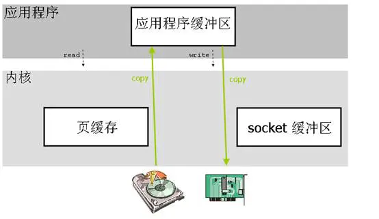

## 概述

### 是什么

Netty 是一个利用 Java 的高级网络的能力，隐藏其背后的复杂性而提供一个易于使用的 API 的客户端/服务器框架。


Netty和Tomcat最大的区别就在于通信协议，Tomcat是基于Http协议的Servlet容器，他的实质是一个基于http协议的web容器，但是Netty不一样，他能通过编程自定义各种协议，因为netty能够通过codec自己来编码/解码字节流，完成类似redis访问的功能，这就是netty和tomcat最大的不同。


### 对比

Netty vs NIO，工作量大，bug 多

* 需要自己构建协议

* 解决 TCP 传输问题，如粘包、半包

* epoll 空轮询导致 CPU 100%

* 对 API 进行增强，使之更易用，如 FastThreadLocal => ThreadLocal，ByteBuf => ByteBufferNetty更友好更强大：1、JDK中NIO的一些API功能薄弱且复杂，Netty隔离了JDK中NIO的实现变化及实现细节譬如：ByteBuffer -> ByteBuf主要负责从底层的IO中读取数据到ByteBuf，然后传递给应用程序，应用程序处理完之后封装为ByteBuf，写回给IO。
*         Netty自身线程安全：使用JDK原生API需要对多线程要很熟悉， 因为N I O 涉及到Reactor设计模式，得对里面的原理要相当的熟悉。


### 原理
Netty是一款基于NIO（Nonblocking I/O，非阻塞IO）开发的网络通信框架，对比于BIO（Blocking I/O，阻塞IO）

当一个连接建立之后，他有两个步骤要做，第一步是接收完客户端发过来的全部数据，第二步是服务端处理完请求业务之后返回response给客户端。NIO和BIO的区别主要是在第一步。
1. 在BIO中，等待客户端发数据这个过程是阻塞的，这样就造成了一个线程只能处理一个请求的情况，而机器能支持的最大线程数是有限的，这就是为什么BIO不能支持高并发的原因。


2. 而NIO中，当一个Socket建立好之后，Thread并不会阻塞去接受这个Socket，而是将这个请求交给Selector，Selector会不断的去遍历所有的Socket，一旦有一个Socket建立完成，他会通知Thread，然后Thread处理完数据再返回给客户端——这个过程是不阻塞的，这样就能让一个Thread处理更多的请求了



### 零拷贝

Netty的传输快其实也是依赖了NIO的一个特性——零拷贝。我们知道，Java的内存有堆内存、栈内存和字符串常量池等等，其中堆内存是占用内存空间最大的一块，也是Java对象存放的地方，一般我们的数据如果需要从IO读取到堆内存，中间需要经过Socket缓冲区，也就是说一个数据会被拷贝两次才能到达他的的终点，如果数据量大，就会造成不必要的资源浪费。


Netty针对这种情况，使用了NIO中的另一大特性——零拷贝，当他需要接收数据的时候，他会在堆内存之外开辟一块内存，数据就直接从IO读到了那块内存中去，在netty里面通过ByteBuf可以直接对这些数据进行直接操作，从而加快了传输速度。
下两图就介绍了两种拷贝方式的区别

* 传统的数据拷贝方式



* 零拷贝



## 2 不同IO方式的Socket编程

### 阻塞IO

```java
public class PlainOioServer {

    public void serve(int port) throws IOException {
        final ServerSocket socket = new ServerSocket(port);     //1
        try {
            for (;;) {
                final Socket clientSocket = socket.accept();    //2
                System.out.println("Accepted connection from " + clientSocket);

                new Thread(new Runnable() {                        //3
                    @Override
                    public void run() {
                        OutputStream out;
                        try {
                            out = clientSocket.getOutputStream();
                            out.write("Hi!\r\n".getBytes(Charset.forName("UTF-8")));                            //4
                            out.flush();
                            clientSocket.close();                //5

                        } catch (IOException e) {
                            e.printStackTrace();
                            try {
                                clientSocket.close();
                            } catch (IOException ex) {
                                // ignore on close
                            }
                        }
                    }
                }).start();                                        //6
            }
        } catch (IOException e) {
            e.printStackTrace();
        }
    }
}
```


### 非阻塞IO


* java原生的channel机制
```java
public class PlainNioServer {
    public void serve(int port) throws IOException {
        ServerSocketChannel serverChannel = ServerSocketChannel.open();
        serverChannel.configureBlocking(false);
        ServerSocket ss = serverChannel.socket();
        InetSocketAddress address = new InetSocketAddress(port);
        ss.bind(address);                                            //1
        Selector selector = Selector.open();                        //2
        serverChannel.register(selector, SelectionKey.OP_ACCEPT);    //3
        final ByteBuffer msg = ByteBuffer.wrap("Hi!\r\n".getBytes());
        for (;;) {
            try {
                selector.select();                                    //4
            } catch (IOException ex) {
                ex.printStackTrace();
                // handle exception
                break;
            }
            Set<SelectionKey> readyKeys = selector.selectedKeys();    //5
            Iterator<SelectionKey> iterator = readyKeys.iterator();
            while (iterator.hasNext()) {
                SelectionKey key = iterator.next();
                iterator.remove();
                try {
                    if (key.isAcceptable()) {                //6
                        ServerSocketChannel server =
                                (ServerSocketChannel)key.channel();
                        SocketChannel client = server.accept();
                        client.configureBlocking(false);
                        client.register(selector, SelectionKey.OP_WRITE |
                                SelectionKey.OP_READ, msg.duplicate());    //7
                        System.out.println(
                                "Accepted connection from " + client);
                    }
                    if (key.isWritable()) {                //8
                        SocketChannel client =
                                (SocketChannel)key.channel();
                        ByteBuffer buffer =
                                (ByteBuffer)key.attachment();
                        while (buffer.hasRemaining()) {
                            if (client.write(buffer) == 0) {        //9
                                break;
                            }
                        }
                        client.close();                    //10
                    }
                } catch (IOException ex) {
                    key.cancel();
                    try {
                        key.channel().close();
                    } catch (IOException cex) {
                        // 在关闭时忽略
                    }
                }
            }
        }
    }
}
```


### Netty实现Socket编程

```java
public class NettyOioServer {

    public void server(int port) throws Exception {
        final ByteBuf buf = Unpooled.unreleasableBuffer(
                Unpooled.copiedBuffer("Hi!\r\n", Charset.forName("UTF-8")));
        EventLoopGroup group = new OioEventLoopGroup();
        try {
            ServerBootstrap b = new ServerBootstrap();        //1

            b.group(group)                                    //2
             .channel(OioServerSocketChannel.class)
             .localAddress(new InetSocketAddress(port))
             .childHandler(new ChannelInitializer<SocketChannel>() {//3
                 @Override
                 public void initChannel(SocketChannel ch) 
                     throws Exception {
                     ch.pipeline().addLast(new ChannelInboundHandlerAdapter() {            //4
                         @Override
                         public void channelActive(ChannelHandlerContext ctx) throws Exception {
                             ctx.writeAndFlush(buf.duplicate()).addListener(ChannelFutureListener.CLOSE);//5
                         }
                     });
                 }
             });
            ChannelFuture f = b.bind().sync();  //6
            f.channel().closeFuture().sync();
        } finally {
            group.shutdownGracefully().sync();        //7
        }
    }
}
```

