> 参考文献
> https://www.jianshu.com/p/b9f3f6a16911
> https://blog.csdn.net/weixin_53142722/article/details/124942857
> https://blog.csdn.net/qq_39339965/article/details/122344873
> https://www.cnblogs.com/lbhym/p/12753314.html
> https://zhuanlan.zhihu.com/p/514448867

> 为什么这样排版
> 因为这是bootstrap创建的步骤
> EventLoop/EventLoopGroup
> Channel
> ChannelFuture sync/addlistener
> Handler
> Pipeline/PipelineGroup

## 0 HelloWorld


### 服务器
```java
public static void main(String[] args) {
//1.启动器，负责组转netty组件，启动服务器
new ServerBootstrap()
        // 2.加入nio组的监听器（在里面包含selector选择器）
        .group(new NioEventLoopGroup())
        // 3.选择服务器的ServerSocketChannel实现
        .channel(NioServerSocketChannel.class)
        //4.boss负责处理连接   worker(child)负责处理读写，决定了worker(child)能执行哪些操作(handler)
        .childHandler(
          //5.channel代表和客户端进行数据读写通道initializer初始化，负责添加其他的handler
              new ChannelInitializer<NioSocketChannel>() {
            //该方法是连接建立后才执行
            protected void initChannel(NioSocketChannel ch) {
                //6.添加具体的handler
                ch.pipeline().addLast(new StringDecoder()); //将ByteBuf转换为字符串
                ch.pipeline().addLast(new SimpleChannelInboundHandler<String>() {  //自定义handler
                    @Override  //读事件
                    protected void channelRead0(ChannelHandlerContext ctx, String msg) {
                        //打印上一步转换好的字符串
                        System.out.println(msg);
                    }
                });
            }
        })
        //7.绑定监听器端口
        .bind(8080);
}
```
1. group()创建 NioEventLoopGroup，可以简单理解为 线程池 + Selector 

2. channel()选择服务 Scoket 实现类，其中 NioServerSocketChannel 表示基于 NIO 的服务器端实现，其它实现还有:

3. childHandler()接下来添加的处理器都是给 SocketChannel 用的，而不是给 ServerSocketChannel。ChannelInitializer 处理器（仅执行一次），它的作用是待客户端 SocketChannel 建立连接后，执行 initChannel 以便添加更多的处理器

4. bind()ServerSocketChannel 绑定的监听端口。返回ChannelFuture对象。

5. SocketChannel 的处理器，解码 ByteBuf => String

6. SocketChannel 的业务处理器，使用上一个处理器的处理结果


### 客户端

```java

        //1.启动类
new Bootstrap()
  //2.添加eventLoop
  .group(new NioEventLoopGroup())
  //3.选择客户端channel实现
  .channel(NioSocketChannel.class)
  //4.添加处理器
  .handler(new ChannelInitializer<Channel>() {
      @Override  //建立连接后被调用
      protected void initChannel(Channel ch) {
          ch.pipeline().addLast(new StringEncoder());
      }
  })
  //连接服务器
  .connect("127.0.0.1", 8080)
  .sync()
  .channel()
  //向服务器发生数据
  .writeAndFlush(new Date() + ": hello world!");
```

1. group()创建 NioEventLoopGroup，同 Server

2. channel选择客户 Socket 实现类，NioSocketChannel 表示基于 NIO 的客户端实现，其它实现还有

3. handler()添加 SocketChannel 的处理器，ChannelInitializer 处理器（仅执行一次），它的作用是待客户端 SocketChannel 建立连接后，执行 initChannel 以便添加更多的处理器

4. connect()指定要连接的服务器和端口，返回channelFuture对象，可以进行后续的通信操作

5. sync()Netty 中很多方法都是异步的，如 connect，这时需要使用 sync 方法等待 connect 建立连接完毕

6. channel获取 channel 对象，它即为通道抽象，可以进行数据读写操作

7. writeAndFlush写入消息并清空缓冲区

8. 消息会经过通道 handler 处理，这里是将 String => ByteBuf 发出，数据经过网络传输，到达服务器端，服务器端 5 和 6 处的 handler 先后被触发，走完一个流程

## 1 EventLoop&EventLoopGroup

### 基本概念
* EventLoop 本质是一个单线程执行器（同时维护了一个 Selector），里面有 run 方法处理 Channel 上源源不断的 io 事件。

* EventLoopGroup（是一个接口） 是一组 EventLoop，Channel 一般会调用 EventLoopGroup 的 register 方法来绑定其中一个 EventLoop，后续这个 Channel 上的 io 事件都由此 EventLoop 来处理（保证了 io 事件处理时的线程安全）


### 组件关系

EventLoop用于处理连接的生命周期中所发生的事件。 Channel、EventLoop、Thread 以及 EventLoopGroup 之间的关系。

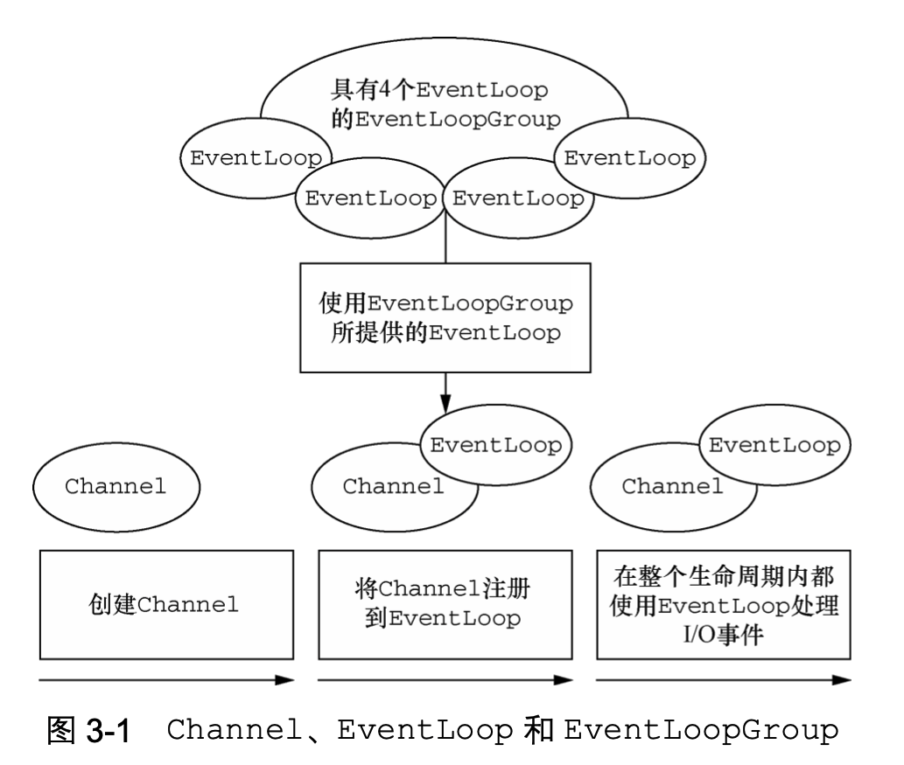

1. 一个 EventLoopGroup 包含一个或者多个 EventLoop;
2. 一个 EventLoop 在它的生命周期内只和一个 Thread 绑定;所有由 EventLoop 处理的 I/O 事件都将在它专有的 Thread 上被处理;
3. 一个 Channel 在它的生命周期内只注册于一个 EventLoop;一个 EventLoop 可能会被分配给一个或多个 Channel。


### 主要方法
* EventLoop判断。inEventLoop(Thread thread) 方法判断一个线程是否属于此 EventLoop
* EventLoop属组。parent 方法来看看自己属于哪个 EventLoopGroup
* EventLoopGroup 遍历
```java
DefaultEventLoopGroup group = new DefaultEventLoopGroup(2);
for (EventExecutor eventLoop : group) {
    System.out.println(eventLoop);
}
```
* EventLoopGroup 关闭。shutdownGracefully 方法首先切换 EventLoopGroup 到关闭状态从而拒绝新的任务的加入，然后在任务队列的任务都处理完成后，停止线程的运行。从而确保整体应用是在正常有序的状态下退出 
* NioEventLoop 处理普通任务。除了可以处理 io 事件，同样可以向它提交普通任务；
```java
NioEventLoopGroup nioWorkers = new NioEventLoopGroup(2);
 
log.debug("server start...");
Thread.sleep(2000);
nioWorkers.execute(()->{
    log.debug("normal task...");
});
```

* NioEventLoop 处理定时任务
```java
NioEventLoopGroup nioWorkers = new NioEventLoopGroup(2);
 
log.debug("server start...");
Thread.sleep(2000);
nioWorkers.scheduleAtFixedRate(() -> {
    log.debug("running...");
}, 0, 1, TimeUnit.SECONDS);  //第一个参数是任务，第二个参数是初始等待时间，第三个参数是时间间隔，第四个参数是时间单位
```


## 2 Channel&ChannelFuture
> 对应java NIO中的Channel


### 是什么

它代表一个到实体(如一个硬件设备、一个文件、一个网络套接字或者一个能够执行一个或者多个不同的I/O操作的程序组件)的开放连接，如读操作和写操作

它可以被打开或者被关闭，连接或者断开连接。


### 主要方法

* close() 可以用来关闭 channel

* closeFuture() 用来处理 channel 的关闭

  * sync() 方法作用是同步等待 channel 关闭

  * addListener() 方法是异步等待 channel 关闭

* pipeline() 方法添加处理器

* write() 方法将数据写入channel，但是并不会直接发出，而是先存在缓冲区中，要刷新缓冲区才会发出去；

* writeAndFlush() 方法将数据立刻写入并刷出


### 获取连接建立的ChannelFuture

* 服务器端
```java
new ServerBootstrap().bind()
```
* 客户端
```java
new Bootstrap().connect()

ChannelFuture channelFuture = new Bootstrap()
    .group(new NioEventLoopGroup())
    .channel(NioSocketChannel.class)
    .handler(new ChannelInitializer<Channel>() {
        @Override
        protected void initChannel(Channel ch) {
            ch.pipeline().addLast(new StringEncoder());
        }
    })
    .connect("127.0.0.1", 8080);
```


* 利用 channel() 方法来获取 Channel 对象。


### ChannelFuture同步操作
sync 方法是同步等待连接建立完成（阻塞当前线程直到nio线程建立连接完毕）。connect 方法是异步的，意味着不等连接建立，方法执行就返回了，拿到的可能是未初始化的channel。因此 channelFuture 对象中不能【立刻】获得到正确的 Channel 对象

```java
ChannelFuture channelFuture = new Bootstrap()
    .group(new NioEventLoopGroup())
    .channel(NioSocketChannel.class)
    .handler(new ChannelInitializer<Channel>() {
        @Override
        protected void initChannel(Channel ch) {
            ch.pipeline().addLast(new StringEncoder());
        }
    })
    .connect("127.0.0.1", 8080);
 
System.out.println(channelFuture.channel()); // 1
channelFuture.sync(); // 2
System.out.println(channelFuture.channel()); // 3
```

### ChannelFuture异步通知

因为一个操作可能不会 立即返回，所以我们需要一种用于在之后的某个时间点确定其结果的方法。

Netty 提供了 ChannelFuture接口，其addListener()方法注册了一个ChannelFutureListener，以 便在某个操作完成时(无论是否成功)得到通知。

Future 提供了另一种在操作完成时通知应用程序的方式。这个对象可以看作是一个异步操 作的结果的占位符;它将在未来的某个时刻完成，并提供对其结果的访问

ChannelFuture提供了几种额外的方法，这些方法使得我们能够注册一个或者多个 ChannelFutureListener实例。监听器的回调方法operationComplete()，将会在对应的 操作完成时被调用 。

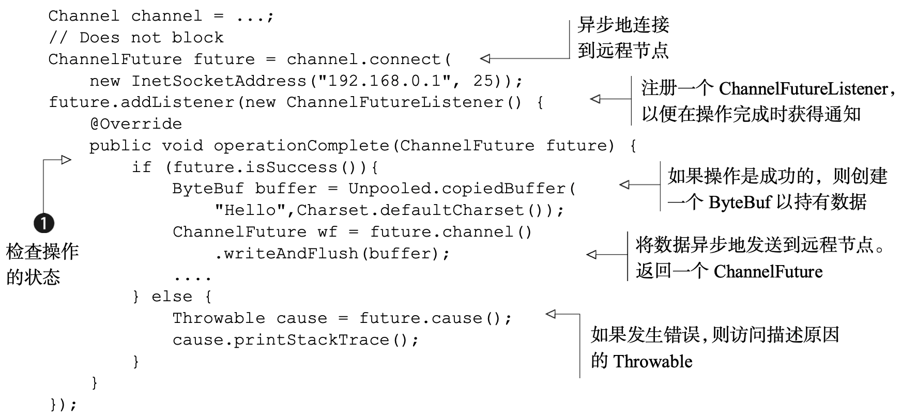

```java
// 获取 CloseFuture 对象， 1) 同步处理关闭， 2) 异步处理关闭
//主要是做在关闭之后的善后操作
ChannelFuture closeFuture = channel.closeFuture();
/*log.debug("waiting close...");
closeFuture.sync();  //同步的处理方式，就是关闭之后才会继续往下执行善后操作
log.debug("处理关闭之后的操作");*/
closeFuture.addListener(new ChannelFutureListener() {
    @Override
    public void operationComplete(ChannelFuture future) throws Exception {
      log.debug("处理关闭之后的操作"); //这里的关闭以及善后的工作都是同一个LoopGroup来完成
      group.shutdownGracefully(); //关闭连接，该线程的eventLoopGroup里面的资源都会被释放
    }
});
```


## 3 ChannelPipeline & ChannelHandler

### 基本概念

处理器ChannelHandler：ChannelPipeline 提供了 ChannelHandler 链的容器。以服务端程序为例，客户端发送过来的数据要接收，读取处理，我们称数据是入站的，需要经过一系列Handler处理后；如果服务器想向客户端写回数据，也需要经过一系列Handler处理，我们称数据是出站的。ChannelPipeline 和 ChannelHandler 之间是相互绑定的，也就是一对一关系。
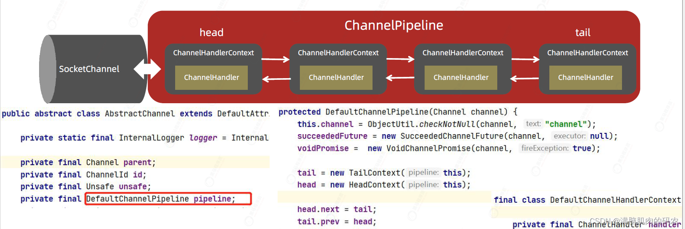


每个 Channel 是一个产品的加工车间，Pipeline 是车间中的流水线，ChannelHandler 就是流水线上的各道工序，而后面要讲的 ByteBuf 是原材料，经过很多工序的加工：先经过一道道入站工序，再经过一道道出站工序最终变成产品


* 当一个回调被触发时，相关的事件可以被一个 interface ChannelHandler 的实现处理。

* 通过回调机制处理事件。当一个新的连接已经被建立时， ChannelHandler的 channelActive()回调方法将会被调用，并将打印出
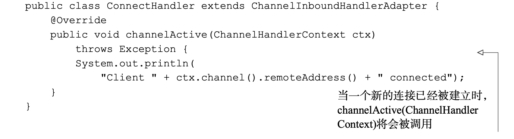

### ChannelHandler分类


ChannelHandler 用来处理 Channel 上的各种事件，分为入站、出站两种。所有 ChannelHandler 被连成一串，就是 Pipeline
* 入站处理器通常是 ChannelInboundHandlerAdapter 的子类，主要用来读取客户端数据，写回结果
* 出站处理器通常是 ChannelOutboundHandlerAdapter 的子类，主要对写回结果进行加工

inbound/outbound：对于数据的出站和入站，有着不同的ChannelHandler类型与之对应：
* ChannelInboundHandler 入站事件处理器、
* ChannelOutBoundHandler 出站事件处理器、
* ChannelHandlerAdapter提供了一些方法的默认实现，可减少用户对于ChannelHandler的编写、
* ChannelDuplexHandler：混合型，既能处理入站事件又能处理出站事件。从下面的关系图可以看出，如果我们需要自己的Handler的时候，
* 读取事件可以继承ChannelInboundHandlerAbapter，
* 写出事件可以继承ChannelOutBoundHandlerAbapter。

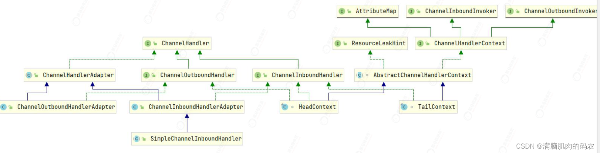
### 组件关系

数据传输流，与channel相关的概念有以下四个，上一张图让你了解netty里面的Channel。


* Channel，表示一个连接，可以理解为每一个请求，就是一个Channel。ChannelFuture 一种基于回调的事件处理接口。
* ChannelHandler，核心处理业务就在这里，用于处理业务请求。ChannelHandlerContext，用于传输业务数据。ChannelPipeline，用于保存处理过程需要用到的ChannelHandler和ChannelHandlerContext。


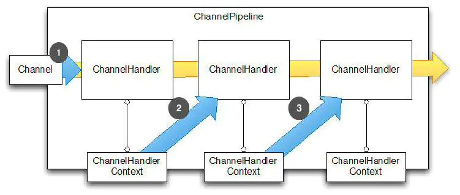


### 体系结构

inbound/outbound：inbound入站事件处理顺序（方向）是由链表的头到链表尾，outbound事件的处理顺序是由链表尾到链表头。inbound入站事件由netty内部触发，最终由netty外部的代码消费。outbound事件由netty外部的代码触发，最终由netty内部消费。

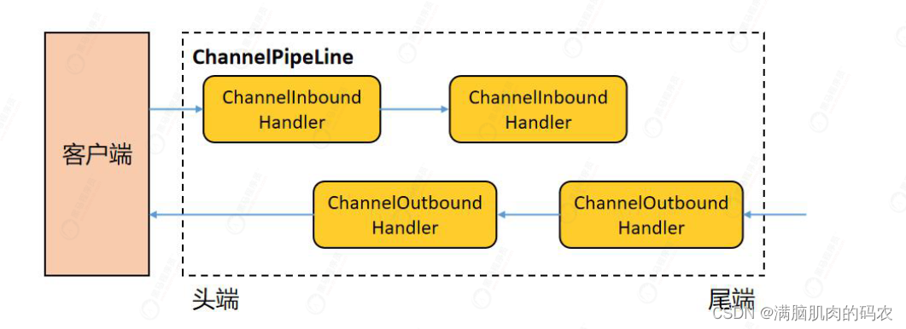

* 服务器端
```java
new ServerBootstrap()
    .group(new NioEventLoopGroup())
    .channel(NioServerSocketChannel.class)
    .childHandler(new ChannelInitializer<NioSocketChannel>() {
        protected void initChannel(NioSocketChannel ch) {
            ch.pipeline().addLast(new ChannelInboundHandlerAdapter(){
                @Override
                public void channelRead(ChannelHandlerContext ctx, Object msg) {
                    System.out.println(1);
                    ctx.fireChannelRead(msg); //1 让消息传递给下一个handler，不然下一个handler可能就会执行出错！！！这是自定义handler尤其需要注意点！
                }
            });
            // 添加处理器 我们添加的处理器虽然这里是叫last，但是真正收尾的handler是 tail
            //head  -> 我们自定义的处理器 -> tail
            ch.pipeline().addLast(new ChannelInboundHandlerAdapter(){
                @Override
                public void channelRead(ChannelHandlerContext ctx, Object msg) {
                    System.out.println(2);
                    ctx.fireChannelRead(msg); // 2  
                }
            });
            ch.pipeline().addLast(new ChannelInboundHandlerAdapter(){
                @Override
                public void channelRead(ChannelHandlerContext ctx, Object msg) {
                    System.out.println(3);
                    ctx.channel().write(msg); // 3
                }
            });
            //出站的handler要先外写数据才会触发不就是摆设
            ch.pipeline().addLast(new ChannelOutboundHandlerAdapter(){
                @Override
                public void write(ChannelHandlerContext ctx, Object msg, 
                                  ChannelPromise promise) {
                    System.out.println(4);
                    ctx.write(msg, promise); // 4
                }
            });
            ch.pipeline().addLast(new ChannelOutboundHandlerAdapter(){
                @Override
                public void write(ChannelHandlerContext ctx, Object msg, 
                                  ChannelPromise promise) {
                    System.out.println(5);
                    ctx.write(msg, promise); // 5
                }
            });
            ch.pipeline().addLast(new ChannelOutboundHandlerAdapter(){
                @Override
                public void write(ChannelHandlerContext ctx, Object msg, 
                                  ChannelPromise promise) {
                    System.out.println(6);
                    ctx.write(msg, promise); // 6
                }
            });
        }
    })
    .bind(8080);
```

* 客户端

```java
new Bootstrap()
    .group(new NioEventLoopGroup())
    .channel(NioSocketChannel.class)
    .handler(new ChannelInitializer<Channel>() {
        @Override
        protected void initChannel(Channel ch) {
            ch.pipeline().addLast(new StringEncoder());
        }
    })
    .connect("127.0.0.1", 8080)
    .addListener((ChannelFutureListener) future -> {
        //必须要flush刷新一下缓存
        future.channel().writeAndFlush("hello,world");
    });
```
* 执行结果
```
1
2
3
6
5
4
```
ChannelInboundHandlerAdapter 是按照 addLast 的顺序执行的，而 ChannelOutboundHandlerAdapter 是按照 addLast 的逆序执行的。ChannelPipeline 的实现是一个 ChannelHandlerContext（包装了 ChannelHandler） 组成的双向链表

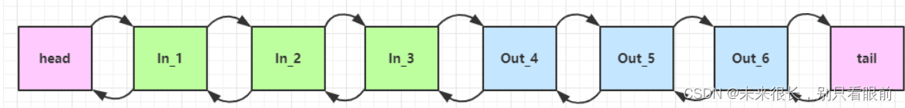

* 入站处理器中，ctx.fireChannelRead(msg) 是 调用下一个入站处理器
  * 如果注释掉 1 处代码，则仅会打印 1
  * 如果注释掉 2 处代码，则仅会打印 1 2

* 出站处理器中，ctx.channel().write(msg) 和ctx.write(msg, promise) 会 从尾部开始触发 后续出站处理器的执行
  * 如果注释掉 3 处代码，则仅会打印 1 2 3
  * 如果注释掉 6 处代码，则仅会打印 1 2 3 6 （注释掉6表示不会去寻找上一个出站处理器）

* ctx.channel().write(msg) vs ctx.write(msg)
  * 都是触发出站处理器的执行
  * ctx.channel().write(msg) 从尾部开始查找出站处理器
  * ctx.write(msg) 是从当前节点找上一个出站处理器
  * 3 处的 ctx.channel().write(msg) 如果改为 ctx.write(msg) 仅会打印 1 2 3，因为节点3 之前没有其它出站处理器了
  * 6 处的 ctx.write(msg, promise) 如果改为 ctx.channel().write(msg) 会打印 1 2 3 6 6 6... 因为 ctx.channel().write() 是从尾部开始查找，结果又是节点6 自己


## 4 ByteBuf


### 简介
> 对应java NIO中的Buffer

ByteBuf是一个存储字节的容器，最大特点就是使用方便，它既有自己的读索引和写索引，方便你对整段字节缓存进行读写，也支持get/set，方便你对其中每一个字节进行读写。

ByteBuf 维护了两个不同的索引:一个用于读取，一个用于写入。当你从 ByteBuf 读取时， 它的 readerIndex 将会被递增已经被读取的字节数。同样地，当你写入 ByteBuf 时，它的 writerIndex 也会被递增。


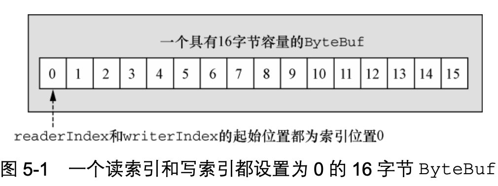

### 三种模式

* Heap Buffer 堆缓冲区。堆缓冲区是ByteBuf最常用的模式，他将数据存储在堆空间。

* Direct Buffer 直接缓冲区。直接缓冲区是ByteBuf的另外一种常用模式，他的内存分配都不发生在堆，jdk1.4引入的nio的ByteBuffer类允许jvm通过本地方法调用分配内存，这样做有两个好处
  * 通过免去中间交换的内存拷贝, 提升IO处理速度; 直接缓冲区的内容可以驻留在垃圾回收扫描的堆区以外。
  * DirectBuffer 在 -XX:MaxDirectMemorySize=xxM大小限制下, 使用 Heap 之外的内存, GC对此”无能为力”,也就意味着规避了在高负载下频繁的GC过程对应用线程的中断影响.
  * 直接内存创建和销毁的代价昂贵，但读写性能高（少一次内存复制），适合配合池化功能一起用。直接内存对 GC 压力小，因为这部分内存不受 JVM 垃圾回收的管理，但也要注意及时主动释放。默认使用直接内存
* Composite Buffer 复合缓冲区。复合缓冲区相当于多个不同ByteBuf的视图，这是netty提供的，jdk不提供这样的功能。

### 组成
最开始读写指针都在 0 位置；不用像NIO一样需要开发人员切换读写模式，而且这个ByteBuf还是动态扩容；扩容不能超过 max capacity 会报错。选择下一个 2^n容量。

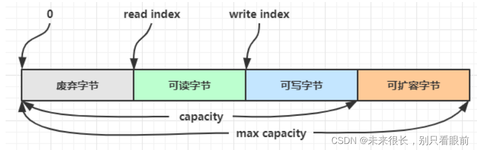


### Codec
Netty中的编码/解码器，通过他你能完成字节与pojo、pojo与pojo的相互转换，从而达到自定义协议的目的。
在Netty里面最有名的就是HttpRequestDecoder和HttpResponseEncoder了。

### 主要方法
* 创建

```
ByteBuf buffer = ByteBufAllocator.DEFAULT.buffer(10);  //默认容量是256，可以动态扩容
ByteBuf buffer = ByteBufAllocator.DEFAULT.heapBuffer(10);
ByteBuf buffer = ByteBufAllocator.DEFAULT.directBuffer(10);
```
* 读写。名称以 read 或者 write 开头的 ByteBuf 方法，将会推进其对应的索引，而名称以 set 或 者 get 开头的操作则不会。后面的这些方法将在作为一个参数传入的一个相对索引上执行操作。
* 重复读写，使用mark,或者get
```java
buffer.markReaderIndex();
System.out.println(buffer.readInt());
buffer.resetReaderIndex();
```
### retain & release
### slice零拷贝的体现

【零拷贝】的体现之一，对原始 ByteBuf 进行切片成多个 ByteBuf，切片后的 ByteBuf 并没有发生内存复制，还是使用原始 ByteBuf 的内存，切片后的 ByteBuf 维护独立的 read，write 指针 ；

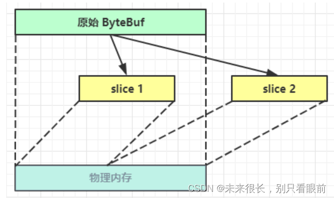

* 基本操作
```java
ByteBuf origin = ByteBufAllocator.DEFAULT.buffer(10);
origin.writeBytes(new byte[]{1, 2, 3, 4});
origin.readByte();
System.out.println(ByteBufUtil.prettyHexDump(origin));
```

* slice操作。这时调用 slice 进行切片，无参 slice 是从原始 ByteBuf 的 read index 到 write index 之间的内容进行切片，切片后的 max capacity 被固定为这个区间的大小，因此不能追加 write（因为一旦追加就会导致切片前后的内容受到影响）；
* read操作互补干扰
* 修改操作互相可见。

### duplicate零拷贝的体现
【零拷贝】的体现之一，就好比截取了原始 ByteBuf 所有内容，并且没有 max capacity 的限制，也是与原始 ByteBuf 使用同一块底层内存，只是读写指针是独立的;

### copy
会将底层内存数据进行深拷贝，因此无论读写，都与原始 ByteBuf 无关

## 5 实例

### 服务器

```java
new ServerBootstrap()
    //更加细化的进行分工，一个是专门用来处理accept请求的，另外的是用来处理read和write的
    .group(new NioEventLoopGroup(1), new NioEventLoopGroup(2))
    .channel(NioServerSocketChannel.class)
    .childHandler(new ChannelInitializer<NioSocketChannel>() {
        @Override
        protected void initChannel(NioSocketChannel ch) {
            ch.pipeline().addLast(new ChannelInboundHandlerAdapter() {
                //这里监听的方法是根据我们自己的需求来的
                @Override							//因为没有进行转换字符集，msg是ByteBuf类型
                public void channelRead(ChannelHandlerContext ctx, Object msg) {
                    ByteBuf byteBuf = msg instanceof ByteBuf ? ((ByteBuf) msg) : null;
                    if (byteBuf != null) {
                        byte[] buf = new byte[16];
                        ByteBuf len = byteBuf.readBytes(buf, 0, byteBuf.readableBytes());
                        log.debug(new String(buf));
                    }
                }
            });
        }
    }).bind(8080).sync();
```


### 客户端

```java
public static void main(String[] args) throws InterruptedException {
    Channel channel = new Bootstrap()
            .group(new NioEventLoopGroup(1))
            .handler(new ChannelInitializer<NioSocketChannel>() {
                @Override
                protected void initChannel(NioSocketChannel ch) throws Exception {
                    System.out.println("init...");
                    ch.pipeline().addLast(new LoggingHandler(LogLevel.DEBUG));
                }
            })
            .channel(NioSocketChannel.class).connect("localhost", 8080)
            .sync()
            .channel();
 
    channel.writeAndFlush(ByteBufAllocator.DEFAULT.buffer().writeBytes("wangwu".getBytes()));
    Thread.sleep(2000);
    channel.writeAndFlush(ByteBufAllocator.DEFAULT.buffer().writeBytes("wangwu".getBytes()));
```

