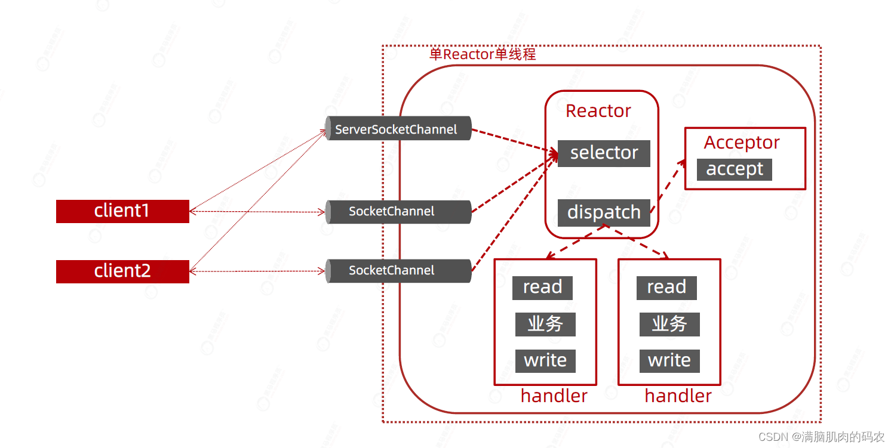
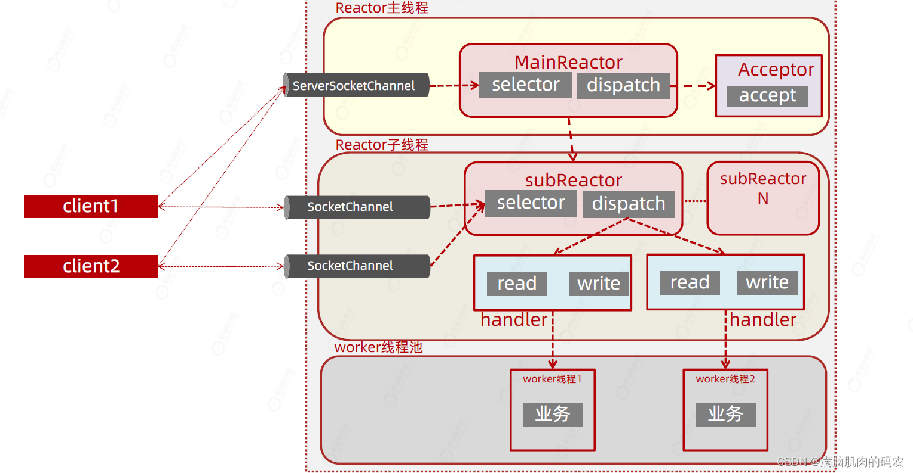
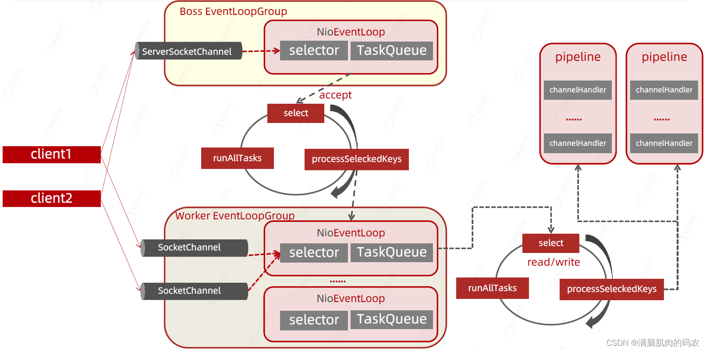

##  Reactor与Netty

### Reactor概念

Reactor模型中定义了三种角色：

* Reactor：负责监听和分配事件，将I/O事件分派给对应的Handler。新的时间包含连接建立就绪、读就绪、写就绪等。
* Acceptor：处理客户端新连接，并分派请求到处理器链中。
* Handler：将自身与事件绑定，执行费阻塞读/写人物，完成channel的读入，完成处理业务逻辑后，负责将结果写出channel。

### 单Reactor - 单线程模型
NIO下Reactor单线程，所有的接受连接，处理数据的相关操作都在一个线程中完成，性能上有瓶颈。

### 单Reactor - 多线程模型
把比较消耗时的数据的编解码运算操作放入线程池中执行，虽然提升了性能但是还不是最好的方式。

### 主从Reactor - 多线程
主从多线程，对于服务器来说，接收客户端的连接是比较重要的，因此将这部分操作单独用线程去操作。

这种模式的基本工作流程为：

1. Reactor主线程MainReactor对象通过select监听客户端连接事件，收到事件后，通过Acceptor处理客户端连接事件。
2. 当Acceptor处理完客户端连接事件之后（与客户端建立号socket连接），MainReactor将连接分配给subReactor。（即：MainReactor只负责监听客户端的请求，和客户端建立连接后将连接交给subReactor监听后面的IO事件。）
3. subReactor将连接加入到自己的连接队列进行监听，并创建Handler对各种事件进行处理。
4. 当连接上有新事件发生的时候，subReactor将会调用对应的Handler处理。
5. Handler通过read从连接上读取请求数据，将请求数据分发给Worker线程池进行业务处理。
6. worker线程池会分配独立的线程来完成真正的业务处理，并将处理结果返回给handler。Handler通过send向客户端发送响应数据。
7. 一个MainReactor可以对应多个subReactor，即一个MainReactor线程可以对应多个subReactor线程。

### 主从Reactor优势
这种模式的优势如下：

1. MainReactor 线程与SubReactor 线程的数据交互简单职责明确，MainReactor 线程只需要接受新连接，SubReactor 线程完成后续的业务处理。
2. MainReactor 线程与SubReactor 线程的数据交互简单，MainReactor 线程只需要把新连接传给SubReactor 线程，SubReactor 线程无需返回数据。
3. 多个SubReactor 线程能够应对更高的并发请求。

这种模式的缺点是编程复杂度高。但是由于优点明显，在许多项目中被广泛使用，包括Nginx、Memcachend、Netty等。

这种模式也被叫做服务器的 1+M+N线程模式，即使用改模式开发的服务器包含一个（或多个，1只是表示相对较少）连接建立线程 + M 个IO 线程 + N 个业务处理线程。这是业界成熟的服务器程序设计模式。

### Netty中的Reactor实现
1. Netty抽象出两组线程池：Boss EventLoopGroup和Worker EventLoopGroup，每个线程池中都有 EventLoopGroup 线程（可以是OIO，NIO，AIO）。Boss EventLoopGroup中的线程专门负责处理和客户端建立连接，Worker EventLoopGroup 中的线程专门负责处理连接上的读写，EventLoopGroup 相当于一个事件循环组，这个组中含有锁多个事件循环。
2. EventLoop 表示一个不断循环的执行事件处理的线程，每个EventLoop 都含有一个selector，用于监听注册在其上的socket 网络连接（channel）。
3. 每一个Boss EventLoopGroup 中循环执行以下三个步骤：a、select：轮询注册在其上的serverSocketChannel 的 accept 事件（OP_ACCEPT 事件）；b、processSeleckendKeys：处理 accept 事件，与客户端建立连接，生产一个socketChannel，并将其注册到Worker EventLoop 上的某个selector 上；c、runAllTasks：再去以此循环处理任务队列中的其他任务。
3. 每个Worker EventLoop 中循环执行这三个步骤：a、select：轮询注册在其上的socketChannel 的read / write 事件（OP_READ / OP_WRITE 事件）；b、processSeleckendKeys：在对应的socketChannel 上处理read / write 事件；c、runAllTasks：再去以此循环处理任务队列中的其他任务。
4. 在以上两个processSeleckendKeys步骤中，会使用Pipeline（管道），Pipeline 中引用了channel，即通过Pipeline 可以获取对应的Channel，Pipeline 中维护了很多的处理器（拦截处理器、过滤处理器、自定义处理器等）。

