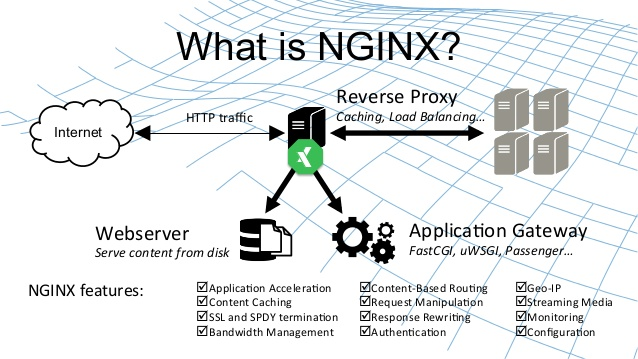
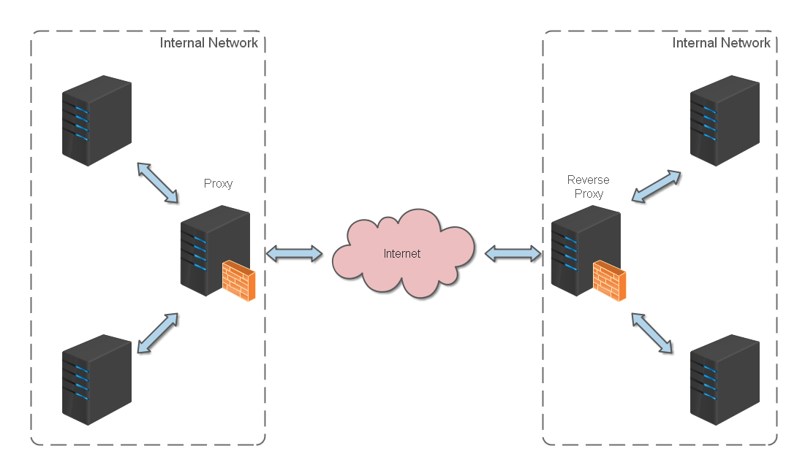
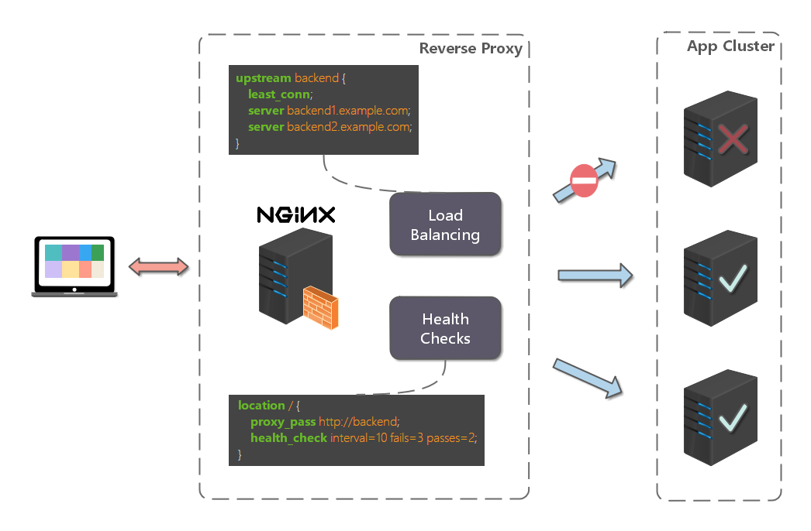

## 1. Nginx
> 参考文件 https://dunwu.github.io/nginx-tutorial/#/nginx-quickstart?id=%e7%bd%91%e7%ab%99%e6%9c%89%e5%a4%9a%e4%b8%aa-webapp-%e7%9a%84%e9%85%8d%e7%bd%ae
> https://zhuanlan.zhihu.com/p/389438482
### Nginx是什么
Nginx (engine x) 是一款轻量级的 Web 服务器 、反向代理服务器、负载均衡及电子邮件（IMAP/POP3）代理服务器。

Nginx本身也是一个静态资源的服务器，当只有静态资源的时候，就可以使用Nginx来做服务器，如果一个网站只是静态页面的话，那么就可以通过这种方式来实现部署。

特点：轻量级、高性能、稳定性高、并发性好



### mac上安装Nginx

1. 安装命令
```
brew install nginx
```
2. 启动nginx服务
```
brew services start nginx
```
3. 在mac上nginx的配置目录

```
```

## 2. 命令配置

### 常用命令

```
nginx -s stop       快速关闭Nginx，可能不保存相关信息，并迅速终止web服务。
nginx -s quit       平稳关闭Nginx，保存相关信息，有安排的结束web服务。
nginx -s reload     因改变了Nginx相关配置，需要重新加载配置而重载。
nginx -s reopen     重新打开日志文件。
nginx -c filename   为 Nginx 指定一个配置文件，来代替缺省的。
nginx -t            不运行，仅仅测试配置文件。nginx 将检查配置文件的语法的正确性，并尝试打开配置文件中所引用到的文件。
nginx -v            显示 nginx 的版本。
nginx -V            显示 nginx 的版本，编译器版本和配置参数。
```


### location中支持的正则表达式

location uri正则表达式

* `.` ：匹配除换行符以外的任意字符
* `?` ：重复0次或1次
* `+` ：重复1次或更多次
* `*` ：重复0次或更多次
* `\d` ：匹配数字
* `^` ：匹配字符串的开始
* `$` ：匹配字符串的结束
* `{n}` ：重复n次
* `{n,}` ：重复n次或更多次
* `[c]` ：匹配单个字符c
* `[a-z]` ：匹配a-z小写字母的任意一个
* `(a|b|c)` : 属线表示匹配任意一种情况，每种情况使用竖线分隔，一般使用小括号括括住，匹配符合a字符 或是b字符 或是c字符的字符串。小括号()之间匹配的内容，可以在后面通过$1来引用，$2表示的是前面第二个()里的内容。正则里面容易让人困惑的是\转义特殊字符。
* `\` 反斜杠：用于转义特殊字符


常见的location路径映射路径有以下几种：

* = 进行普通字符精确匹配。也就是完全匹配。
* ^~ 前缀匹配。如果匹配成功，则不再匹配其他location。
* ~ 表示执行一个正则匹配，区分大小写
* ~* 表示执行一个正则匹配，不区分大小写
* /xxx/ 常规字符串路径匹配
* / 通用匹配，任何请求都会匹配到

### location优先级
当一个路径匹配多个location时究竟哪个location能匹配到时有优先级顺序的，而优先级的顺序于location值的表达式类型有关，和在配置文件中的先后顺序无关。相同类型的表达式，字符串长的会优先匹配。

* 等号类型（=）的优先级最高。一旦匹配成功，则不再查找其他匹配项，停止搜索。
* ^~类型表达式，不属于正则表达式。一旦匹配成功，则不再查找其他匹配项，停止搜索。
* 正则表达式类型（~ ~*）的优先级次之。如果有多个location的正则能匹配的话，则使用正则表达式最长的那个。
* 常规字符串匹配类型。按前缀匹配。
* / 通用匹配，如果没有匹配到，就匹配通用的


优先级搜索问题：不同类型的location映射决定是否继续向下搜索

* 等号类型、^~类型：一旦匹配上就停止搜索了，不会再匹配其他location了
* 正则表达式类型`(~ ~*）`,常规字符串匹配类型/xxx/ : 匹配到之后，还会继续搜索其他其它location，直到找到优先级最高的，或者找到第一种情况而停止搜索

location优先级从高到底：

(location =) > (location 完整路径) > (location ^~ 路径) > (location ~,~* 正则顺序) > (location 部分起始路径) > (/)


```
location = / {
    # 精确匹配/，主机名后面不能带任何字符串 /
    [ configuration A ]
}
location / {
    # 匹配所有以 / 开头的请求。
    # 但是如果有更长的同类型的表达式，则选择更长的表达式。
    # 如果有正则表达式可以匹配，则优先匹配正则表达式。
    [ configuration B ]
}
location /documents/ {
    # 匹配所有以 /documents/ 开头的请求，匹配符合以后，还要继续往下搜索。
    # 但是如果有更长的同类型的表达式，则选择更长的表达式。
    # 如果有正则表达式可以匹配，则优先匹配正则表达式。
    [ configuration C ]
}
location ^~ /images/ {
    # 匹配所有以 /images/ 开头的表达式，如果匹配成功，则停止匹配查找，停止搜索。
    # 所以，即便有符合的正则表达式location，也不会被使用
    [ configuration D ]
}

location ~* \.(gif|jpg|jpeg)$ {
    # 匹配所有以 gif jpg jpeg结尾的请求。
    # 但是 以 /images/开头的请求，将使用 Configuration D，D具有更高的优先级
    [ configuration E ]
}

location /images/ {
    # 字符匹配到 /images/，还会继续往下搜索
    [ configuration F ]
}


location = /test.htm {
    root   /usr/local/var/www/htm;
    index  index.htm;
}
```
注意：location的优先级与location配置的位置无关


### 特定指令

1. return指令
返回http状态码 和 可选的第二个参数可以是重定向的URL
```
location /permanently/moved/url {
    return 301 http://www.example.com/moved/here;
}
```

2. rewrite指令
重写URI请求 rewrite，通过使用rewrite指令在请求处理期间多次修改请求URI，该指令具有一个可选参数和两个必需参数。
   * 第一个(必需)参数是请求URI必须匹配的正则表达式。
   * 第二个参数是用于替换匹配URI的URI。
   * 可选的第三个参数是可以停止进一步重写指令的处理或发送重定向(代码301或302)的标志

```
location /users/ {
    rewrite ^/users/(.*)$ /show?user=$1 break;
}
```
1. error_page指令
使用error_page指令，您可以配置NGINX返回自定义页面以及错误代码，替换响应中的其他错误代码，或将浏览器重定向到其他URI。在以下示例中，error_page指令指定要返回404页面错误代码的页面(/404.html)。

```
error_page 404 /404.html;
```

4. log_format日志。
   访问日志：需要开启压缩 gzip on; 否则不生成日志文件，打开log_format、access_log注释

```
log_format  main  '$remote_addr - $remote_user [$time_local] "$request" '
                      '$status $body_bytes_sent "$http_referer" '
                      '"$http_user_agent" "$http_x_forwarded_for"';

access_log  /usr/local/etc/nginx/logs/host.access.log  main;

gzip  on;
```

5. deny 指令
```
# 禁止访问某个目录
location ~* \.(txt|doc)${
    root $doc_root;
    deny all;
}
```

### 内置变量
nginx的配置文件中可以使用的内置变量以美元符$开始，也有人叫全局变量。其中，部分预定义的变量的值是可以改变的。

- `$args` ：#这个变量等于请求行中的参数，同$query_string
- `$content_length` ：请求头中的Content-length字段。
- `$content_type` ：请求头中的Content-Type字段。
- `$document_root` ：当前请求在root指令中指定的值。
- `$host` ：请求主机头字段，否则为服务器名称。
- `$http_user_agent` ：客户端agent信息
- `$http_cookie` ：客户端cookie信息
- `$limit_rate` ：这个变量可以限制连接速率。
- `$request_method` ：客户端请求的动作，通常为GET或POST。
- `$remote_addr` ：客户端的IP地址。
- `$remote_port` ：客户端的端口。
- `$remote_user` ：已经经过Auth Basic Module验证的用户名。
- `$request_filename` ：当前请求的文件路径，由root或alias指令与URI请求生成。
- `$scheme` ：HTTP方法（如http，https）。
- `$server_protocol` ：请求使用的协议，通常是HTTP/1.0或HTTP/1.1。
- `$server_addr` ：服务器地址，在完成一次系统调用后可以确定这个值。
- `$server_name `：服务器名称。
- `$server_port` ：请求到达服务器的端口号。
- `$request_uri` ：包含请求参数的原始URI，不包含主机名，如：”/foo/bar.php?arg=baz”。
- `$uri` ：不带请求参数的当前URI，`$uri`不包含主机名，如”/foo/bar.html”。
- `$document_uri` ：与`$uri`相同

## 3. 反向代理

### 什么是反向代理
反向代理（Reverse Proxy）方式是指以代理服务器来接受 internet 上的连接请求，然后将请求转发给内部网络上的服务器，并将从服务器上得到的结果返回给 internet 上请求连接的客户端，此时代理服务器对外就表现为一个反向代理服务器。



### Http反向代理
conf/nginx.conf 是 nginx 的默认配置文件。你也可以使用 nginx -c 指定你的配置文件。nginx.conf 配置文件如下

```
#运行用户
#user somebody;

#启动进程,通常设置成和cpu的数量相等
worker_processes  1;

#全局错误日志
error_log  D:/Tools/nginx-1.10.1/logs/error.log;
error_log  D:/Tools/nginx-1.10.1/logs/notice.log  notice;
error_log  D:/Tools/nginx-1.10.1/logs/info.log  info;

#PID文件，记录当前启动的nginx的进程ID
pid        D:/Tools/nginx-1.10.1/logs/nginx.pid;

#工作模式及连接数上限
events {
    worker_connections 1024;    #单个后台worker process进程的最大并发链接数
}

#设定http服务器，利用它的反向代理功能提供负载均衡支持
http {
    #设定mime类型(邮件支持类型),类型由mime.types文件定义
    include       D:/Tools/nginx-1.10.1/conf/mime.types;
    default_type  application/octet-stream;

    #设定日志
    log_format  main  '[$remote_addr] - [$remote_user] [$time_local] "$request" '
                      '$status $body_bytes_sent "$http_referer" '
                      '"$http_user_agent" "$http_x_forwarded_for"';

    access_log    D:/Tools/nginx-1.10.1/logs/access.log main;
    rewrite_log     on;

    #sendfile 指令指定 nginx 是否调用 sendfile 函数（zero copy 方式）来输出文件，对于普通应用，
    #必须设为 on,如果用来进行下载等应用磁盘IO重负载应用，可设置为 off，以平衡磁盘与网络I/O处理速度，降低系统的uptime.
    sendfile        on;
    #tcp_nopush     on;

    #连接超时时间
    keepalive_timeout  120;
    tcp_nodelay        on;

    #gzip压缩开关
    #gzip  on;

    #设定实际的服务器列表
    upstream zp_server1{
        server 127.0.0.1:8089;
    }

    #HTTP服务器
    server {
        #监听80端口，80端口是知名端口号，用于HTTP协议
        listen       80;

        #定义使用www.xx.com访问
        server_name  www.helloworld.com;

        #首页
        index index.html

        #指向webapp的目录
        root D:\01_Workspace\Project\github\zp\SpringNotes\spring-security\spring-shiro\src\main\webapp;

        #编码格式
        charset utf-8;

        #代理配置参数
        proxy_connect_timeout 180;
        proxy_send_timeout 180;
        proxy_read_timeout 180;
        proxy_set_header Host $host;
        proxy_set_header X-Forwarder-For $remote_addr;

        #反向代理的路径（和upstream绑定），location 后面设置映射的路径
        location / {
            proxy_pass http://zp_server1;
        }

        #静态文件，nginx自己处理
        location ~ ^/(images|javascript|js|css|flash|media|static)/ {
            root D:\01_Workspace\Project\github\zp\SpringNotes\spring-security\spring-shiro\src\main\webapp\views;
            #过期30天，静态文件不怎么更新，过期可以设大一点，如果频繁更新，则可以设置得小一点。
            expires 30d;
        }

        #设定查看Nginx状态的地址
        location /NginxStatus {
            stub_status           on;
            access_log            on;
            auth_basic            "NginxStatus";
            auth_basic_user_file  conf/htpasswd;
        }

        #禁止访问 .htxxx 文件
        location ~ /\.ht {
            deny all;
        }

        #错误处理页面（可选择性配置）
        #error_page   404              /404.html;
        #error_page   500 502 503 504  /50x.html;
        #location = /50x.html {
        #    root   html;
        #}
    }
}
```

启动调试

1. 启动 webapp，注意启动绑定的端口要和 nginx 中的 upstream 设置的端口保持一致。
2. 更改 host：在 C:\Windows\System32\drivers\etc 目录下的 host 文件中添加一条 DNS 记录
```
127.0.0.1 www.helloworld.com
```
3. 启动前文中 startup.bat 的命令
4. 在浏览器中访问 www.helloworld.com，不出意外，已经可以访问了。

### Https反向代理

一些对安全性要求比较高的站点，可能会使用 HTTPS（一种使用 ssl 通信标准的安全 HTTP 协议）。

这里不科普 HTTP 协议和 SSL 标准。但是，使用 nginx 配置 https 需要知道几点：

* HTTPS 的固定端口号是 443，不同于 HTTP 的 80 端口
* SSL 标准需要引入安全证书，所以在 nginx.conf 中你需要指定证书和它对应的 key
其他和 http 反向代理基本一样，只是在 Server 部分配置有些不同。
```
  #HTTP服务器
  server {
      #监听443端口。443为知名端口号，主要用于HTTPS协议
      listen       443 ssl;

      #定义使用www.xx.com访问
      server_name  www.helloworld.com;

      #ssl证书文件位置(常见证书文件格式为：crt/pem)
      ssl_certificate      cert.pem;
      #ssl证书key位置
      ssl_certificate_key  cert.key;

      #ssl配置参数（选择性配置）
      ssl_session_cache    shared:SSL:1m;
      ssl_session_timeout  5m;
      #数字签名，此处使用MD5
      ssl_ciphers  HIGH:!aNULL:!MD5;
      ssl_prefer_server_ciphers  on;

      location / {
          root   /root;
          index  index.html index.htm;
      }
  }
```

## 4. 负载均衡

### 什么是负载均衡

前面的例子中，代理仅仅指向一个服务器。

但是，网站在实际运营过程中，大部分都是以集群的方式运行，这时需要使用负载均衡来分流。

nginx 也可以实现简单的负载均衡功能。




### Nginx配置
假设这样一个应用场景：将应用部署在 192.168.1.11:80、192.168.1.12:80、192.168.1.13:80 三台 linux 环境的服务器上。网站域名叫 www.helloworld.com，公网 IP 为 192.168.1.11。在公网 IP 所在的服务器上部署 nginx，对所有请求做负载均衡处理（下面例子中使用的是加权轮询策略）。

nginx.conf 配置如下：

```
http {
     #设定mime类型,类型由mime.type文件定义
    include       /etc/nginx/mime.types;
    default_type  application/octet-stream;
    #设定日志格式
    access_log    /var/log/nginx/access.log;

    #设定负载均衡的服务器列表
    upstream load_balance_server {
        #weigth参数表示权值，权值越高被分配到的几率越大
        server 192.168.1.11:80   weight=5;
        server 192.168.1.12:80   weight=1;
        server 192.168.1.13:80   weight=6;
    }

   #HTTP服务器
   server {
        #侦听80端口
        listen       80;

        #定义使用www.xx.com访问
        server_name  www.helloworld.com;

        #对所有请求进行负载均衡请求
        location / {
            root        /root;                 #定义服务器的默认网站根目录位置
            index       index.html index.htm;  #定义首页索引文件的名称
            proxy_pass  http://load_balance_server ;#请求转向load_balance_server 定义的服务器列表

            #以下是一些反向代理的配置(可选择性配置)
            #proxy_redirect off;
            proxy_set_header Host $host;
            proxy_set_header X-Real-IP $remote_addr;
            #后端的Web服务器可以通过X-Forwarded-For获取用户真实IP
            proxy_set_header X-Forwarded-For $remote_addr;
            proxy_connect_timeout 90;          #nginx跟后端服务器连接超时时间(代理连接超时)
            proxy_send_timeout 90;             #后端服务器数据回传时间(代理发送超时)
            proxy_read_timeout 90;             #连接成功后，后端服务器响应时间(代理接收超时)
            proxy_buffer_size 4k;              #设置代理服务器（nginx）保存用户头信息的缓冲区大小
            proxy_buffers 4 32k;               #proxy_buffers缓冲区，网页平均在32k以下的话，这样设置
            proxy_busy_buffers_size 64k;       #高负荷下缓冲大小（proxy_buffers*2）
            proxy_temp_file_write_size 64k;    #设定缓存文件夹大小，大于这个值，将从upstream服务器传

            client_max_body_size 10m;          #允许客户端请求的最大单文件字节数
            client_body_buffer_size 128k;      #缓冲区代理缓冲用户端请求的最大字节数
        }
    }
}
```

### 负载均衡策略

Nginx 提供了多种负载均衡策略，负载均衡策略在各种分布式系统中基本上原理一致

### 轮询
```
upstream bck_testing_01 {
  # 默认所有服务器权重为 1
  server 192.168.250.220:8080
  server 192.168.250.221:8080
  server 192.168.250.222:8080
}
```
### 加权轮询
```
upstream bck_testing_01 {
  server 192.168.250.220:8080   weight=3
  server 192.168.250.221:8080              # default weight=1
  server 192.168.250.222:8080              # default weight=1
}
```
### 最少连接
```
upstream bck_testing_01 {
  least_conn;

  # with default weight for all (weight=1)
  server 192.168.250.220:8080
  server 192.168.250.221:8080
  server 192.168.250.222:8080
}
```
### 加权最少连接
```
upstream bck_testing_01 {
  least_conn;

  server 192.168.250.220:8080   weight=3
  server 192.168.250.221:8080              # default weight=1
  server 192.168.250.222:8080              # default weight=1
}
```
### IP Hash
```
upstream bck_testing_01 {

  ip_hash;

  # with default weight for all (weight=1)
  server 192.168.250.220:8080
  server 192.168.250.221:8080
  server 192.168.250.222:8080

}
```
#### 普通 Hash
```
upstream bck_testing_01 {

  hash $request_uri;

  # with default weight for all (weight=1)
  server 192.168.250.220:8080
  server 192.168.250.221:8080
  server 192.168.250.222:8080

}
```

## 5. 网络转发

### 什么是网络转发

当一个网站功能越来越丰富时，往往需要将一些功能相对独立的模块剥离出来，独立维护。这样的话，通常，会有多个 webapp。

举个例子：假如 www.helloworld.com 站点有好几个 webapp，finance（金融）、product（产品）、admin（用户中心）。访问这些应用的方式通过上下文(context)来进行区分:

www.helloworld.com/finance/

www.helloworld.com/product/

www.helloworld.com/admin/

我们知道，http 的默认端口号是 80，如果在一台服务器上同时启动这 3 个 webapp 应用，都用 80 端口，肯定是不成的。所以，这三个应用需要分别绑定不同的端口号。

那么，问题来了，用户在实际访问 www.helloworld.com 站点时，访问不同 webapp，总不会还带着对应的端口号去访问吧。所以，你再次需要用到反向代理来做处理。

### Nginx配置

```
http {
    #此处省略一些基本配置

    upstream product_server{
        server www.helloworld.com:8081;
    }

    upstream admin_server{
        server www.helloworld.com:8082;
    }

    upstream finance_server{
        server www.helloworld.com:8083;
    }

    server {
        #此处省略一些基本配置
        #默认指向product的server
        location / {
            proxy_pass http://product_server;
        }

        location /product/{
            proxy_pass http://product_server;
        }

        location /admin/ {
            proxy_pass http://admin_server;
        }

        location /finance/ {
            proxy_pass http://finance_server;
        }
    }
}
```

## 6. 静态站点

### 什么是静态站带你
我们需要配置静态站点(即 html 文件和一堆静态资源)。


### Nginx配置
举例来说：如果所有的静态资源都放在了 /app/dist 目录下，我们只需要在 nginx.conf 中指定首页以及这个站点的 host 即可。

配置如下：
```
worker_processes  1;

events {
    worker_connections  1024;
}

http {
    include       mime.types;
    default_type  application/octet-stream;
    sendfile        on;
    keepalive_timeout  65;

    gzip on;
    gzip_types text/plain application/x-javascript text/css application/xml text/javascript application/javascript image/jpeg image/gif image/png;
    gzip_vary on;

    server {
        listen       80;
        server_name  static.zp.cn;

        location / {
            root /app/dist;
            index index.html;
            #转发任何请求到 index.html
        }
    }
}
```
然后，添加 HOST：
```
127.0.0.1 static.zp.cn
```
此时，在本地浏览器访问 static.zp.cn ，就可以访问静态站点了。