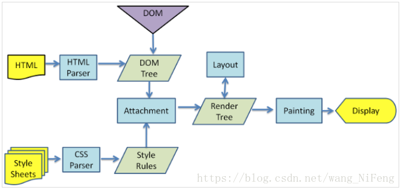
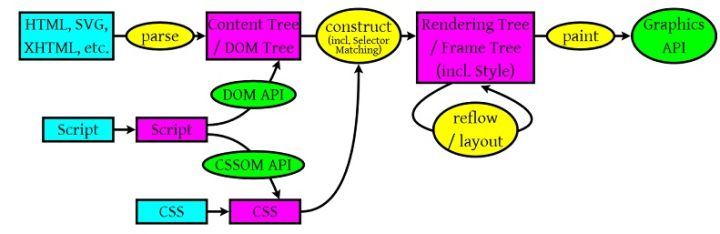

## electron
> 使用网页技术开发桌面应用。

* electron提供了一系列本地应用的框架，主要包括桌面图标、桌面菜单等本地应用独有的部分。
* 界面显示的部分，由electron提供运行环境。
* 界面显示的功能，主要由nodejs实现。所以，本质上还是使用nodejs

## 逻辑说明

* 在web技术当中，分为前端和后端。前端通过HTML、CSS、JavaScript实现页面的动态变化。
* 后端使用nodejs处理数据，将数据渲染到页面，并返回新的页面。
* 前端和后端通过url脚本进行通信。nodejs的脚本不能在前端执行。
* nodejs是JavaScript的一个扩展库，使得JavaScript能做到更多的本地数据处理，从而成为可以在服务器端运行，通过虚拟的V8处理器，访问服务器资源。
* Node.js是一个事件驱动I/O服务端JavaScript环境，基于Google的V8引擎，V8引擎执行Javascript的速度非常快，性能非常好。Node.js使用JavaScript进行编程，运行在JavaScript引擎上（V8）
* 前端JavaScript主要参与页面响应，通过接口API向后端请求数据。
* 后端nodejs主要参与访问服务器资源，进行业务逻辑，并形成接口API。

## electron

* electron允许使用web页面创建单机应用。electron与web开发的逻辑完全不同。web开发区分前后端，前后端通过URL-api通信。前端只负责页面变化，后端只负责数据处理。但在electron并不区分前后端，主要借鉴了JavaScript语言和nodejs平台，分为主线程和渲染线程。主线程由electron提供，负责单机GUI相关功能的实现，例如app主程序、browserwindow窗口、窗口菜单、窗口内容（webcontent）等内容；渲染线程，主要由JavaScript和nodejs实现，相当于原来的前端+后端，包括后端的数据处理和前端的页面变化。
* 因为electron运行在nodejs环境当中，而不是浏览器环境当中。所以能运行nodejs脚本。
* electron不分前后端，只有GUI图形界面和JavaScript的逻辑处理两部分组成。
* electron主要包括两个进程：
  * 主进程，GUI进程。负责控制图形界面的进程。通过app和browserwindow模块来处理GUI相关的事件。
  * 渲染进程，web进程。负责渲染html页面，处理web事件。通过前端的js和后端的nodejs获取数据、处理数据、渲染数据到页面，同时实现前端的动态变化。
* electron支持两类事件的处理：
  * GUI事件。由electron的内建对象产生并处理，控制整个app的进程，处理图形界面事件。
  * web事件。由普通的JavaScript+nodejs脚本处理，同时完成原来在前端和后端的处理过程。

## 浏览起的主要功能

浏览器基础结构主要包括如下7部分：

1. 用户界面（User Interface）:用户所看到及与之交互的功能组件，如地址栏，返回，前进按钮等；

2. 浏览器引擎（Browser engine）:负责控制和管理下一级的渲染引擎；
3. 渲染引擎（Rendering engine）:负责解析用户请求的内容（如HTML或XML，渲染引擎会解析HTML或XML，以及相关CSS，然后返回解析后的内容）；
4. 网络（Networking）:负责处理网络相关的事务，如HTTP请求等；
5. UI后端（UI backend）:负责绘制提示框等浏览器组件，其底层使用的是操作系统的用户接口；
6. JavaScript解释器（JavaScript interpreter）:负责解析和执行JavaScript代码；
7. 数据存储（Data storage）:负责持久存储诸如cookie和缓存等应用数据

## 浏览器渲染的过程

1. HTML解析出DOM Tree

2. CSS解析出Style Rules

3. 将二者关联生成Render Tree

4. Layout 根据Render Tree计算每个节点的信息

5. Painting 根据计算好的信息绘制整个页面

## 浏览器解析过程

* 一个是HTML/SVG/XHTML，事实上，Webkit有三个C++的类对应这三类文档。解析这三种文件会产生一个DOM Tree。
* CSS，解析CSS会产生CSS规则树。
* Javascript，脚本，主要是通过DOM API和CSSOM API来操作DOM Tree和CSS Rule Tree.
