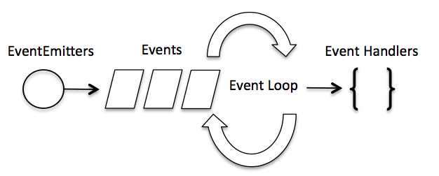

# 事件循环

## 1 模块说明

### 过程
* Node.js 是单进程单线程应用程序
* Node.js 几乎每一个 API 都是支持回调函数的。
* Node.js 基本上所有的事件机制都是用设计模式中观察者模式实现。
* Node.js 单线程类似进入一个while(true)的事件循环，直到没有事件观察者退出，每个异步事件都生成一个事件观察者，如果有事件发生就调用该回调函数.

### 示例



* Node.js 使用事件驱动模型，当web server接收到请求，就把它关闭然后进行处理，然后去服务下一个web请求。当这个请求完成，它被放回处理队列，当到达队列开头，这个结果被返回给用户。
* 非阻塞式IO，事件驱动IO
* 事件相当于一个主题(Subject)，而所有注册到这个事件上的处理函数相当于观察者(Observer)。

## 2 模块应用

### 示例
```javascript
// 引入 events 模块
var events = require('events');
// 创建 eventEmitter 对象
var eventEmitter = new events.EventEmitter();
 
// 创建事件处理程序
var connectHandler = function connected() {
   console.log('连接成功。');
  
   // 触发 data_received 事件 
   eventEmitter.emit('data_received');
}
 
// 绑定 connection 事件处理程序
eventEmitter.on('connection', connectHandler);
 
// 使用匿名函数绑定 data_received 事件
eventEmitter.on('data_received', function(){
   console.log('数据接收成功。');
});
 
// 触发 connection 事件 
eventEmitter.emit('connection');
 
console.log("程序执行完毕。");
```

### 方法

1. addListener(event, listener)
为指定事件添加一个监听器到监听器数组的尾部。
2.	on(event, listener)
为指定事件注册一个监听器，接受一个字符串 event 和一个回调函数。
server.on('connection', function (stream) {
  console.log('someone connected!');
});
3. once(event, listener)
为指定事件注册一个单次监听器，即 监听器最多只会触发一次，触发后立刻解除该监听器。
server.once('connection', function (stream) {
  console.log('Ah, we have our first user!');
});
4.	removeListener(event, listener)
移除指定事件的某个监听器，监听器必须是该事件已经注册过的监听器。
它接受两个参数，第一个是事件名称，第二个是回调函数名称。
```
var callback = function(stream) {
  console.log('someone connected!');
};
server.on('connection', callback);
// ...
server.removeListener('connection', callback);
```
5.	removeAllListeners([event])
移除所有事件的所有监听器， 如果指定事件，则移除指定事件的所有监听器。
6.	setMaxListeners(n)
默认情况下， EventEmitters 如果你添加的监听器超过 10 个就会输出警告信息。 setMaxListeners 函数用于提高监听器的默认限制的数量。
7.	listeners(event)
返回指定事件的监听器数组。
8.	emit(event, [arg1], [arg2], [...])
按监听器的顺序执行执行每个监听器，如果事件有注册监听返回 true，否则返回 false

### 应用
```
var events = require('events');
var eventEmitter = new events.EventEmitter();

// 监听器 #1
var listener1 = function listener1() {
   console.log('监听器 listener1 执行。');
}

// 监听器 #2
var listener2 = function listener2() {
  console.log('监听器 listener2 执行。');
}

// 绑定 connection 事件，处理函数为 listener1 
eventEmitter.addListener('connection', listener1);

// 绑定 connection 事件，处理函数为 listener2
eventEmitter.on('connection', listener2);

var eventListeners = eventEmitter.listenerCount('connection');
console.log(eventListeners + " 个监听器监听连接事件。");

// 处理 connection 事件 
eventEmitter.emit('connection');

// 移除监绑定的 listener1 函数
eventEmitter.removeListener('connection', listener1);
console.log("listener1 不再受监听。");

// 触发连接事件
eventEmitter.emit('connection');

eventListeners = eventEmitter.listenerCount('connection');
console.log(eventListeners + " 个监听器监听连接事件。");

console.log("程序执行完毕。");
```