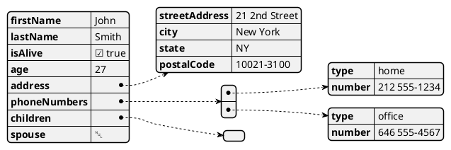
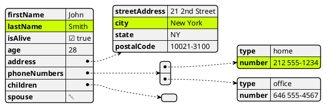
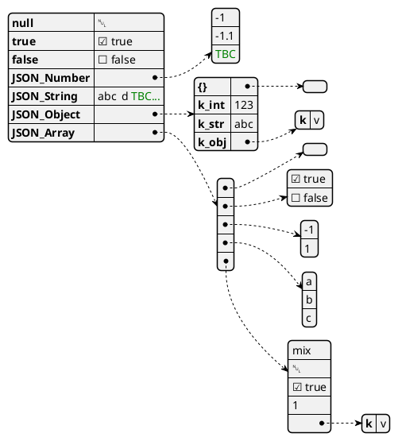

## 1 可视化JSON数据

```plantuml 
@startjson
{
  "firstName": "John",
  "lastName": "Smith",
  "isAlive": true,
  "age": 27,
  "address": {
    "streetAddress": "21 2nd Street",
    "city": "New York",
    "state": "NY",
    "postalCode": "10021-3100"
  },
  "phoneNumbers": [
    {
      "type": "home",
      "number": "212 555-1234"
    },
    {
      "type": "office",
      "number": "646 555-4567"
    }
  ],
  "children": [],
  "spouse": null
}
@endjson
```

```plantuml 
@startjson
#highlight "lastName"
#highlight "address" / "city"
#highlight "phoneNumbers" / "0" / "number"
{
  "firstName": "John",
  "lastName": "Smith",
  "isAlive": true,
  "age": 28,
  "address": {
    "streetAddress": "21 2nd Street",
    "city": "New York",
    "state": "NY",
    "postalCode": "10021-3100"
  },
  "phoneNumbers": [
    {
      "type": "home",
      "number": "212 555-1234"
    },
    {
      "type": "office",
      "number": "646 555-4567"
    }
  ],
  "children": [],
  "spouse": null
}
@endjson
```

```plantuml 
@startjson
{
"null": null,
"true": true,
"false": false,
"JSON_Number": [-1, -1.1, "<color:green>TBC"],
"JSON_String": "a\nb\rc\td <color:green>TBC...",
"JSON_Object": {
  "{}": {},
  "k_int": 123,
  "k_str": "abc",
  "k_obj": {"k": "v"}
},
"JSON_Array" : [
  [],
  [true, false],
  [-1, 1],
  ["a", "b", "c"],
  ["mix", null, true, 1, {"k": "v"}]
]
}
@endjson
```