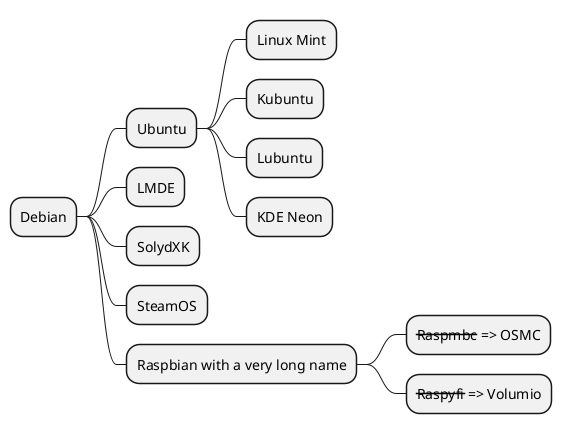
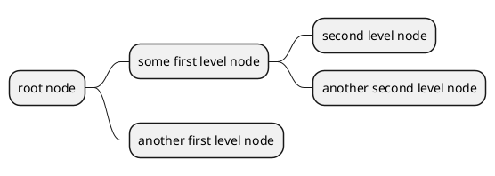
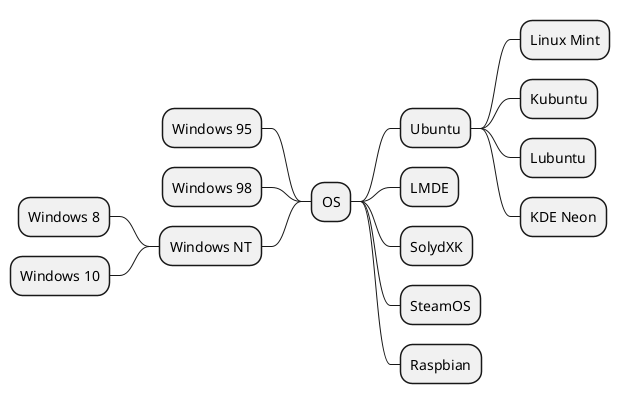
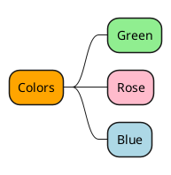

## mindmap

### 兼容 orgmode 语法

```plantuml 
@startmindmap
* Debian
** Ubuntu
*** Linux Mint
*** Kubuntu
*** Lubuntu
*** KDE Neon
** LMDE
** SolydXK
** SteamOS
** Raspbian with a very long name
*** <s>Raspmbc</s> => OSMC
*** <s>Raspyfi</s> => Volumio
@endmindmap
```

### 兼容markdown语法

```plantuml 
@startmindmap
* root node
	* some first level node
		* second level node
		* another second level node
	* another first level node
@endmindmap
```

### 用运算符决定方向

```plantuml 
@startmindmap
+ OS
++ Ubuntu
+++ Linux Mint
+++ Kubuntu
+++ Lubuntu
+++ KDE Neon
++ LMDE
++ SolydXK
++ SteamOS
++ Raspbian
-- Windows 95
-- Windows 98
-- Windows NT
--- Windows 8
--- Windows 10
@endmindmap
```

## 2 设置颜色和其他属性

```plantuml 
@startmindmap
*[#Orange] Colors
**[#lightgreen] Green
**[#FFBBCC] Rose
**[#lightblue] Blue
@endmindmap
```