## 0 实例

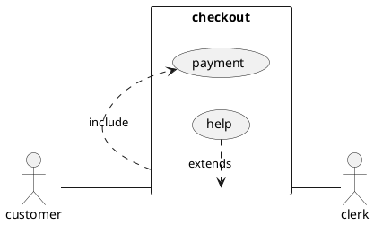

## 1 定义

### 用例

* 用例用圆括号括起来（两个圆括号看起来就像椭圆）。
* 也可以用关键字usecase来定义用例。

### 角色

角色用两个冒号包裹起来。
也可以用actor关键字来定义角色。

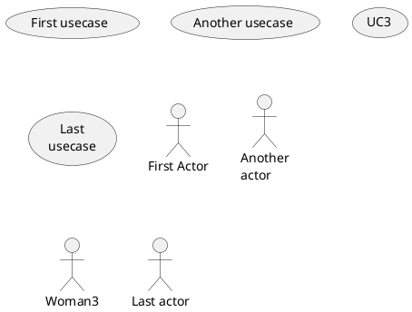

## 2 角色样式
* 火柴人样式：默认
* 用户头像样式：skinparam actorStyle awesome
* 透明人样式：skinparam actorStyle hollow

## 3 用例描述

* --（横线）
* ..（虚线）
* ==（双横线）
* __（下划线）

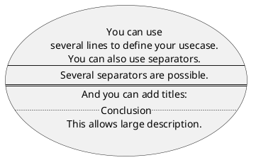

## 4 用例包

* package 可以一使用包来对角色或用例进行分组。
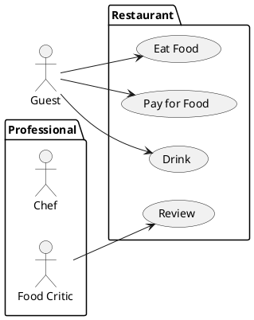

## 5 继承关系

如果一个角色或者用例继承于另一个，那么可以用<|--符号表示。

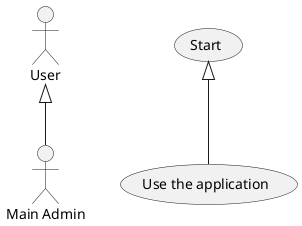

## 6 使用注释
可以用note left of , note right of , note top of , note bottom of等关键字给一个对象添加注释。

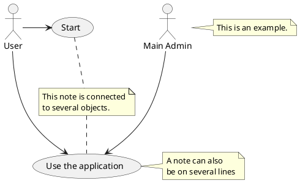

## 7 构造类型

用 << 和 >> 来定义角色或者用例的构造类型。

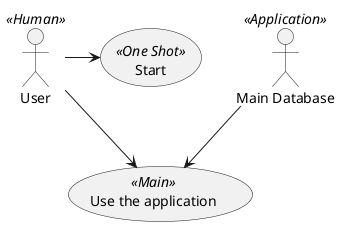

## 8 改变箭头方向
默认连接是竖直方向的，用--表示，可以用一个横杠或点来表示水平连接。

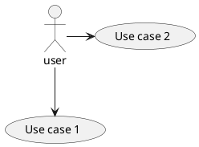

还可以通过给箭头添加left, right, up或down等关键字来改变方向

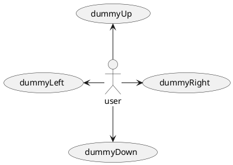

## 9 改变风格
* 改变箭头风格
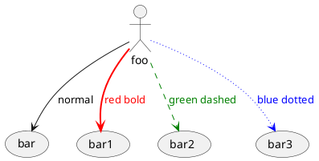

* 改变用例风格
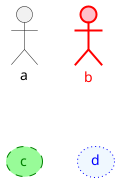