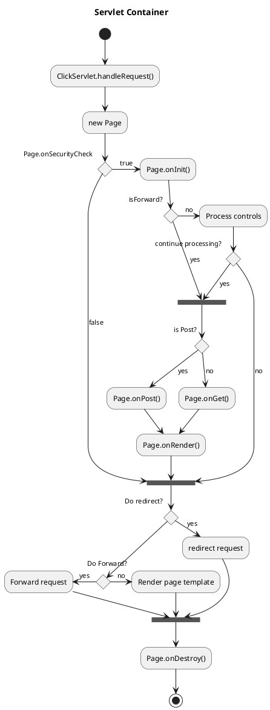
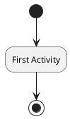
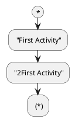
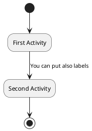
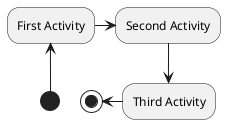
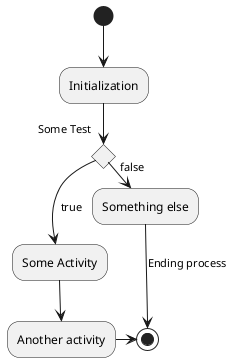
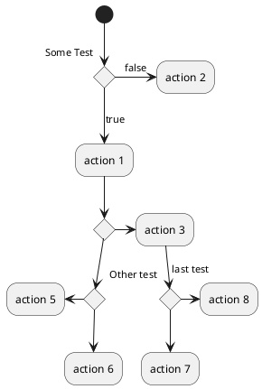
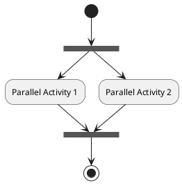
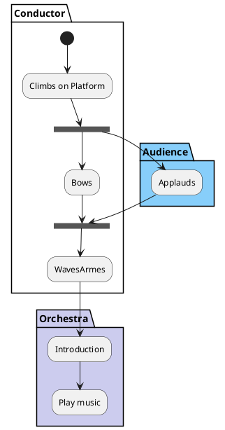

## 0 活动图实例

## 1 基本元素

* 使用(*)作为活动图的开始点和结束点。用(*top)强制开始点位于图示的顶端。
* 使用-->绘制箭头。默认情况下，箭头开始于最接近的活动。

* 简略写法

## 2 箭头
### 箭头标签
用[和]放在箭头定义的后面来添加标签。

### 箭头方向

* -down-> (default arrow)
* -right-> or ->
* -left->
* -up->

## 3 分支同步

### 分支

你可以使用关键字if/then/else创建分支。

### 分支嵌套
* 默认情况下，一个分支连接上一个最新的活动，但是也可以使用if关键字进行连接。还可以嵌套定义分支。

### 同步

你可以使用 === code === 来显示同步条。

## 4 分区

用关键字partition定义分区，还可以设置背景色(用颜色名或者颜色值)。
定义活动的时候，它自动被放置到最新的分区中。
用}结束分区的定义。
