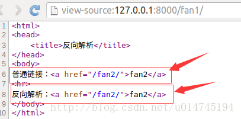
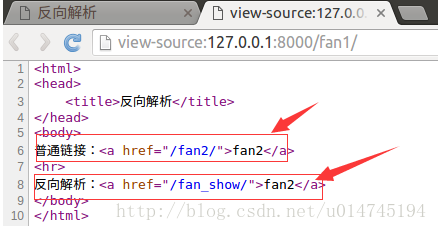
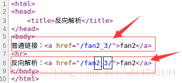
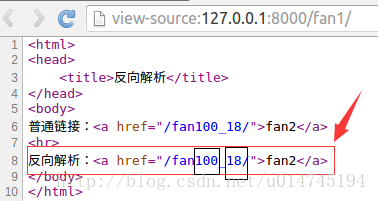

**基本原则说明：**

-   Django会一次匹配列表中的每个URL模式，在遇到第一个请求的URL相匹配的模式时停下来

-   分组传参包括以下内容：

    -   一个HttpRequest实例。

    -   如果正则表达式是无名组，那么正则表达式所匹配的内容将作为位置参数提供给视图。

    -   如果正则表达式是命名组，那么正则表达式所匹配的内容将作为关键参数提供给视图。

    -   对于GET、POST请求本身的参数不进行匹配。作为扩展参数kwargs提供给视图。

-   如果请求的URL没有匹配到任何一个正则表达式，或者匹配过程中抛出异常，会进行相应的错误处理。

分组参数

关键参数

**匹配分组算法说明：**

\> 分组对应参数，是如何传递参数的过程；匹配分组算法，是如何匹配字符串的过程。

-   如果有命名参数，则使用命名参数，忽略非命名参数。

-   否则，将以位置参数传递所有的非命名参数。

-   所有的匹配结果都是字符串

能够通过url函数额外传递多个参数。

终于他妈的明白这种关键参数和位置参数的意思了：

关键参数是为了匹配具体的字符串，位置参数是按照先后位置匹配字符串。他妈的，果然看不天不如写两行试试。谨记，这里的匹配原则。和之前的分组传递参数原则。如此简单，是自己最近变愚钝了吗，好久没做数学题了吗，思路一点都不够灵活，而且好像由于电子屏幕的原因，记忆力下降好快。

**URL反向解析说明：**

-   在视图中使用标签进行反向解析

**\<a** href="****"**\>{{** yearvar
**}}** Archive**\</a\>**

-   在代码中使用reverse函数进行反向解析

reverse('news-year-archive', args**=**(year,))

**模板标签URL反向解析**

-   通过url标签、名称、位置参数直接反转

****

-   通过url标签、名称、关键参数直接反转。没有成功验证过这种关键参数长什么模样。

****

\> 位置参数和关键参数不能混用

**1,定义：**

>   随着功能的增加会出现更多的视图，可能之前配置的正则表达式不够准确，于是就要修改正则表达式，但是正则表达式一旦修改了，之前所有对应的超链接都要修改，真是一件麻烦的事情，而且可能还会漏掉一些超链接忘记修改，有办法让链接根据正则表达式动态生成吗？
>   就是用反向解析的办法。

**2,应用范围：**

-   模板中的超链接

-   视图中的重定向

**3,使用方法：**

-   定义url时，需要为include定义namespace属性，为url定义name属性

-   使用时，在模板中使用url标签，在视图中使用reverse函数，根据正则表达式动态生成地址，减轻后期维护成本。

**4,模板中超链接步骤：**

1）在项目urls.py中为include定义namespace属性。

>   url(r’\^’,include(‘booktest.urls’,namespace=’booktest’)),

2）在应用的urls.py中为url定义name属性，并修改为fan2。

>   url(r’\^fan2/\$’, views.fan2,name=’fan2’),

3）在模板中使用url标签做超链接，此处为templates/booktest/fan1.html文件。

\<html\>\<head\> \<title\>反向解析\</title\>\</head\>\<body\>普通链接：\<a
href="/fan2/"\>普通fan2\</a\>\<hr\>反向解析：\<a href=""\>反向解析fan2\</a\>\</body\>\</html\>

4）回到浏览器中，后退，刷新，查看源文件，两个链接地址一样。

这里写图片描述

5）在应用的urls.py中，将fan2修改为fan_show。

>   url(r’\^fan_show/\$’, views.fan2,name=’fan2’),

6）回到浏览器中，刷新，查看源文件，两个链接地址不一样。

这里写图片描述

**4,视图中的重定向：**

from django.shortcuts import redirect from django.core.urlresolvers import
reverse return redirect(reverse('booktest:fan2'))

**5,反向解析中URL的参数**

**位置参数**

1）在booktest/urls.py中，修改fan2如下：

>   url(r’\^fan(\\d+)\_(\\d+)/\$’, views.fan2,name=’fan2’),

2）修改templates/booktest/fan1.html文件如下：

\<html\>\<head\> \<title\>反向解析\</title\>\</head\>\<body\>普通链接：\<a
href="/fan2_3/"\>fan2\</a\>\<hr\>反向解析：\<a href=""\>fan2\</a\>\</body\>\</html\>

3）回到浏览器中，刷新，查看源文件如下图：

这里写图片描述

-   使用重定向传递位置参数格式如下：

    return redirect(reverse(‘booktest:fan’, args=(2,3)))

**关键字参数**

1）在booktest/urls.py中，修改fan2如下：

url(r'\^fan(?P\<id\>\\d+)\_(?P\<age\>\\d+)/\$', views.fan2,name='fan2'),

-   1

2）修改templates/booktest/fan1.html文件如下：

\<html\>\<head\> \<title\>反向解析\</title\>\</head\>\<body\>普通链接：\<a
href="/fan100_18/"\>fan2\</a\>\<hr\>反向解析：\<a href=""\>fan2\</a\>\</body\>\</html\>

3）回到浏览器中，刷新，查看源文件如下图：

这里写图片描述

-   使用重定向传递关键字参数格式如下：

    return redirect(reverse(‘booktest:fan2’, kwargs={‘id’:110,’age’:26}))

真他妈的日了够了，老子居然又因为拼写错误浪费了这么多时间。
