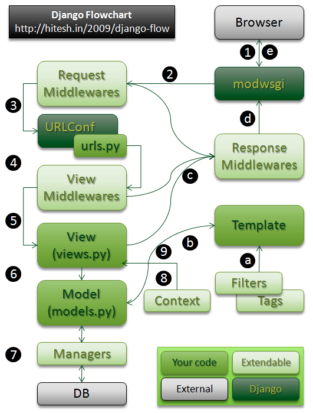
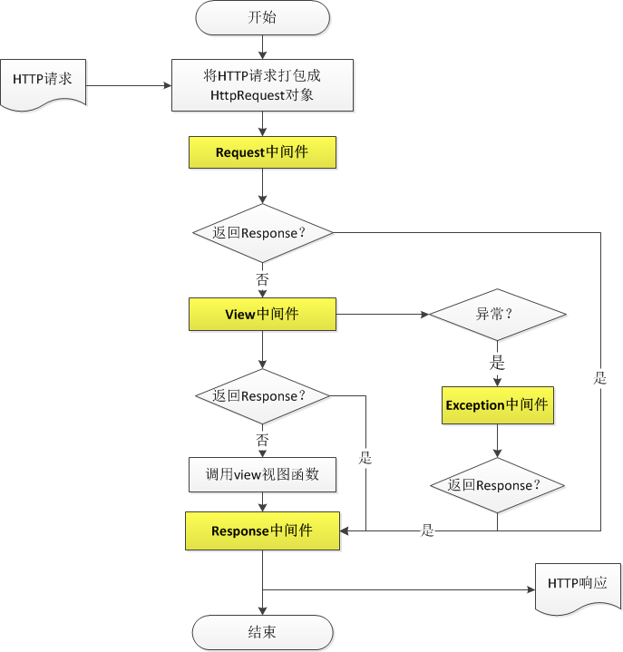
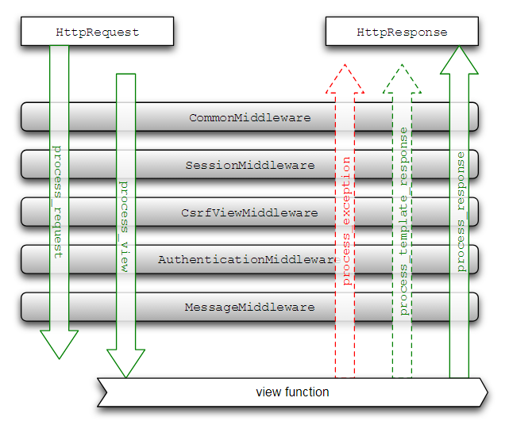

**http请求处理的MVC结构**

**HTTP处理的中间件结构**

记住几个重要的预处理函数

**process\_request(self, request)**

request预处理函数

在**Django接收到request**之后，但仍未解析URL以确定应当运行的view之前。调用

返回 None（Django将继续处理这个request，执行后续的中间件，
然后调用相应的view，“我对继续处理这个request没意见”）

或者返回 HttpResponse 对象（Django
将不再执行任何其它的中间件(无视其种类)以及相应的view。 Django将立即返回该
HttpResponse，“我不想其他代码处理这个request，我要提早返回” ）.

process\_view(self, request, callback, callback_args, callback_kwargs)

view预处理函数

在Django执行完request预处理函数并确定待执行的view之后，但在view函数实际执行之前。

process\_response(self, request, response)

Response后处理函数

在\*\*\*\*Django\*\*\*\*执行view\*\*\*\*函数\*\*\*\*并生成\*\*\*\*response\*\*\*\*之后

该处理器能修改response\*\*\*\*的内容

**记住一些琐碎的知识**

-   一个工程可以有很多model，一个model就代表一个一个app，他有自己的数据（关联到相应的数据库）和自己的控制器视图views用来实现对model的操作和访问。现在的疑问可能就是每一部分是负责做什么的，到底该怎样组织整个工程。

-   url支持的各种匹配。可以通过正则表达式来实现不同url的配置。request中的对GET与POST对象都是queryDict的实例，是普通Dict的扩展，兼容了普通Dict的一些基本方法。

**django的组成结构**

管理工具（Management）：主要通过管理工具的命令来实现对整个工程的控制。一整套内置的创建站点、迁移数据、维护静态文件的命令。

模型（model）：提供数据访问的接口和模块。

视图（view）：封装了HTTP request和response的一系列操作和数据流，函数、类视图

模板（template）：一整套Django自己的页面渲染语言。若干内置的tags和filters

表单（form）：通过内置的数据类型控制表单和控件生成HTML表单。已经差不多了

管理站（Admin）：通过生命管理Model，快速生成后台数据管理网站。
