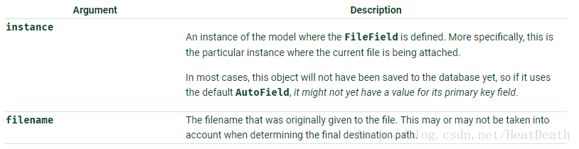

文件上传字段FileField(upload_to=Node,max_length=100, \*\*options)[source]

-   FileField.upload_to

    此属性提供了一种设置上传目录和文件名的方式，可以通过两种方式进行设置。
    在这两种情况下，该值都将传递给Storage.save（）方法。

-   如果您指定了一个字符串值，它可能包含strftime（）格式，将由文件上传的日期/时间替换（以便上传的文件不填满给定的目录）。
    例如：

    class MyModel(models.Model): \# 文件将会上传到 MEDIA_ROOT/uploads upload =
    models.FileField(upload_to='uploads/') \# or... \# 文件将会保存到
    MEDIA_ROOT/uploads/2015/01/30 upload =
    models.FileField(upload_to='uploads/%Y/%m/%d/')

-   如果使用默认的FileSystemStorage，则字符串值将被附加到MEDIA_ROOT路径上，以形成存储上传文件的本地文件系统上的位置。
    如果您正在使用其他存储空间，请检查该存储的文档，以查看它如何处理upload_to。

-   upload_to也可以是可调用的，作为一个函数。
    这将被调用来获取上传路径，包括文件名。 此 可调用
    必须接受两个参数，并返回一个Unix样式的路径（带有斜杠），以传递到存储系统。
    两个参数是：

def user_directory\_path(instance, filename): \# file will be uploaded to
MEDIA_ROOT/user_\<id\>/\<filename\> return
'user_{0}/{1}'.format(instance.user.id, filename) class MyModel(models.Model):
upload = models.FileField(upload_to=user_directory_path)
