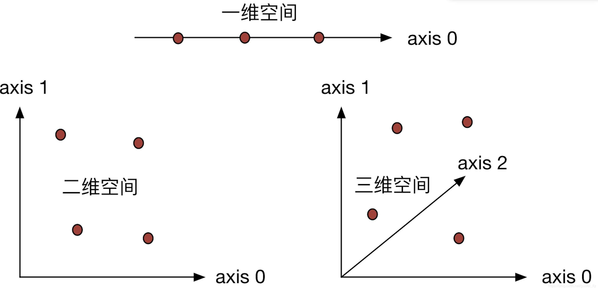
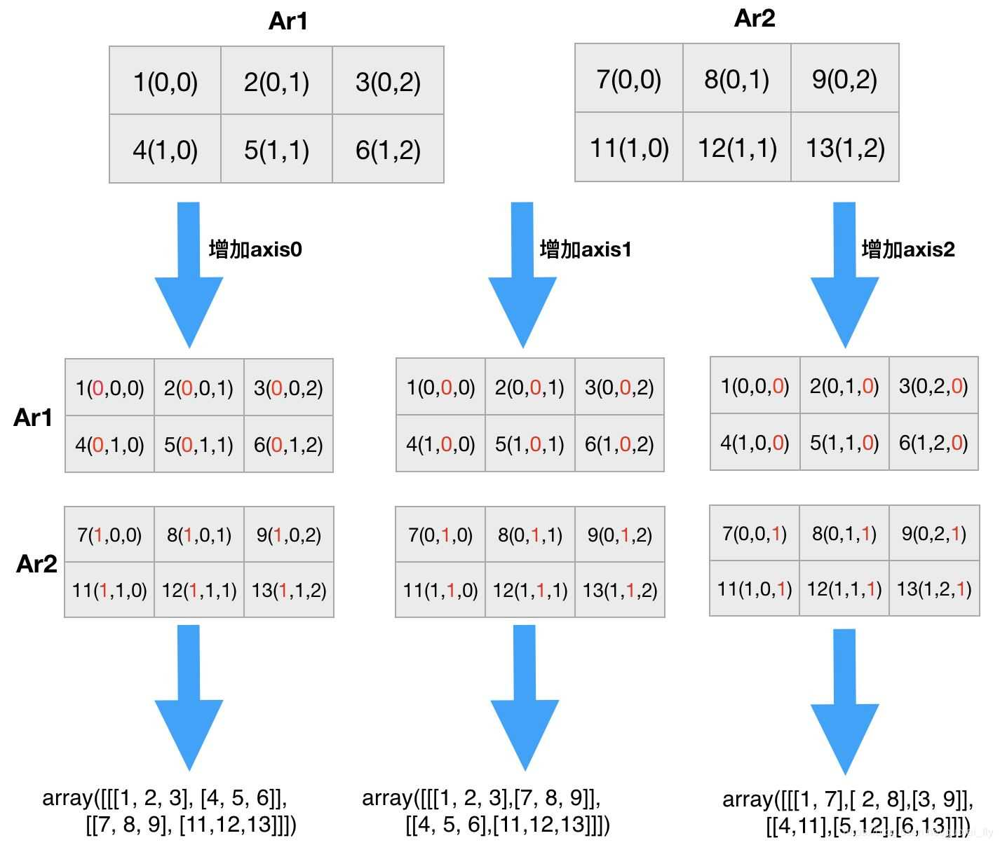

# 数组处理程序

> 主要对数组本身的进行更改。并不是进行运算。

## 复制数组

方法 | 描述
---|---
[copyto](https://numpy.org/devdocs/reference/generated/numpy.copyto.html#numpy.copyto)(dst, src[, casting, where]) | 将值从一个数组复制到另一个数组，并根据需要进行广播。

## 改变形状

方法 | 描述
---|---
[reshape](https://numpy.org/devdocs/reference/generated/numpy.reshape.html#numpy.reshape)(a, newshape[, order]) | 在不更改数据的情况下为数组赋予新的形状。
[ravel](https://numpy.org/devdocs/reference/generated/numpy.ravel.html#numpy.ravel)(a[, order]) | 返回一个连续的扁平数组。
[ndarray.flat](https://numpy.org/devdocs/reference/generated/numpy.ndarray.flat.html#numpy.ndarray.flat) | 数组上的一维迭代器。
[ndarray.flatten](https://numpy.org/devdocs/reference/generated/numpy.ndarray.flatten.html#numpy.ndarray.flatten)([order]) | 返回折叠成一维的数组副本。

## 转置数组

方法 | 描述
---|---
[moveaxis](https://numpy.org/devdocs/reference/generated/numpy.moveaxis.html#numpy.moveaxis)(a, source, destination) | 将数组的轴移到新位置。
[rollaxis](https://numpy.org/devdocs/reference/generated/numpy.rollaxis.html#numpy.rollaxis)(a, axis[, start]) | 向后滚动指定的轴，直到其位于给定的位置。
[swapaxes](https://numpy.org/devdocs/reference/generated/numpy.swapaxes.html#numpy.swapaxes)(a, axis1, axis2) | 互换数组的两个轴。
[ndarray.T](https://numpy.org/devdocs/reference/generated/numpy.ndarray.T.html#numpy.ndarray.T) | 转置数组。
[transpose](https://numpy.org/devdocs/reference/generated/numpy.transpose.html#numpy.transpose)(a[, axes]) | 排列数组的尺寸。

## 更改维度数

方法 | 描述
---|---
[atleast_1d](https://numpy.org/devdocs/reference/generated/numpy.atleast_1d.html#numpy.atleast_1d)(\*arys) | 将输入转换为至少一维的数组。
[atleast_2d](https://numpy.org/devdocs/reference/generated/numpy.atleast_2d.html#numpy.atleast_2d)(\*arys) | 将输入视为至少具有二维的数组。
[atleast_3d](https://numpy.org/devdocs/reference/generated/numpy.atleast_3d.html#numpy.atleast_3d)(\*arys) | 以至少三个维度的数组形式查看输入。
[broadcast](https://numpy.org/devdocs/reference/generated/numpy.broadcast.html#numpy.broadcast) | 产生模仿广播的对象。
[broadcast_to](https://numpy.org/devdocs/reference/generated/numpy.broadcast_to.html#numpy.broadcast_to)(array, shape[, subok]) | 将数组广播为新形状。
[broadcast_arrays](https://numpy.org/devdocs/reference/generated/numpy.broadcast_arrays.html#numpy.broadcast_arrays)(\*args, \*\*kwargs) | 互相广播任意数量的阵列。
[expand_dims](https://numpy.org/devdocs/reference/generated/numpy.expand_dims.html#numpy.expand_dims)(a, axis) | 扩展数组的形状。
[squeeze](https://numpy.org/devdocs/reference/generated/numpy.squeeze.html#numpy.squeeze)(a[, axis]) | 从数组形状中删除一维条目。

## 改变种类

方法 | 描述
---|---
[asarray](https://numpy.org/devdocs/reference/generated/numpy.asarray.html#numpy.asarray)(a[, dtype, order]) | 将输入转换为数组。
[asanyarray](https://numpy.org/devdocs/reference/generated/numpy.asanyarray.html#numpy.asanyarray)(a[, dtype, order]) | 将输入转换为ndarray，但通过ndarray子类。
[asmatrix](https://numpy.org/devdocs/reference/generated/numpy.asmatrix.html#numpy.asmatrix)(data[, dtype]) | 将输入解释为矩阵。
[asfarray](https://numpy.org/devdocs/reference/generated/numpy.asfarray.html#numpy.asfarray)(a[, dtype]) | 返回转换为浮点类型的数组。
[asfortranarray](https://numpy.org/devdocs/reference/generated/numpy.asfortranarray.html#numpy.asfortranarray)(a[, dtype]) | 返回以Fortran顺序排列在内存中的数组（ndim> = 1）。
[ascontiguousarray](https://numpy.org/devdocs/reference/generated/numpy.ascontiguousarray.html#numpy.ascontiguousarray)(a[, dtype]) | 返回内存中的连续数组（ndim> = 1）（C顺序）。
[asarray_chkfinite](https://numpy.org/devdocs/reference/generated/numpy.asarray_chkfinite.html#numpy.asarray_chkfinite)(a[, dtype, order]) | 将输入转换为数组，检查NaN或Infs。
[asscalar](https://numpy.org/devdocs/reference/generated/numpy.asscalar.html#numpy.asscalar)(a) | 将大小为1的数组转换为其等效的标量。
[require](https://numpy.org/devdocs/reference/generated/numpy.require.html#numpy.require)(a[, dtype, requirements]) | 返回提供的类型满足要求的ndarray。

## 组合数组

方法 | 描述
---|---
[concatenate](https://numpy.org/devdocs/reference/generated/numpy.concatenate.html#numpy.concatenate)((a1, a2, …) | 沿现有轴连接一系列数组。
[stack](https://numpy.org/devdocs/reference/generated/numpy.stack.html#numpy.stack)(arrays[, axis, out]) | 沿新轴连接一系列数组。
[column_stack](https://numpy.org/devdocs/reference/generated/numpy.column_stack.html#numpy.column_stack)(tup) | 将一维数组作为列堆叠到二维数组中。
[dstack](https://numpy.org/devdocs/reference/generated/numpy.dstack.html#numpy.dstack)(tup) | 沿深度方向（沿第三轴）按顺序堆叠数组。
[hstack](https://numpy.org/devdocs/reference/generated/numpy.hstack.html#numpy.hstack)(tup) | 水平（按列）顺序堆叠数组。
[vstack](https://numpy.org/devdocs/reference/generated/numpy.vstack.html#numpy.vstack)(tup) | 垂直（行）按顺序堆叠数组。
[block](https://numpy.org/devdocs/reference/generated/numpy.block.html#numpy.block)(arrays) | 从块的嵌套列表中组装一个nd数组。

## 拆分数组

方法 | 描述
---|---
[split](https://numpy.org/devdocs/reference/generated/numpy.split.html#numpy.split)(ary, indices_or_sections[, axis]) | 将数组拆分为多个子数组，作为ary的视图。
[array_split](https://numpy.org/devdocs/reference/generated/numpy.array_split.html#numpy.array_split)(ary, indices_or_sections[, axis]) | 将一个数组拆分为多个子数组。
[dsplit](https://numpy.org/devdocs/reference/generated/numpy.dsplit.html#numpy.dsplit)(ary, indices_or_sections) | 沿第3轴（深度）将数组拆分为多个子数组。
[hsplit](https://numpy.org/devdocs/reference/generated/numpy.hsplit.html#numpy.hsplit)(ary, indices_or_sections) | 水平（按列）将一个数组拆分为多个子数组。
[vsplit](https://numpy.org/devdocs/reference/generated/numpy.vsplit.html#numpy.vsplit)(ary, indices_or_sections) | 垂直（行）将数组拆分为多个子数组。

## 平铺数组

方法 | 描述
---|---
[tile](https://numpy.org/devdocs/reference/generated/numpy.tile.html#numpy.tile)(A, reps) | 通过重复A代表次数来构造一个数组。
[repeat](https://numpy.org/devdocs/reference/generated/numpy.repeat.html#numpy.repeat)(a, repeats[, axis]) | 重复数组的元素。

## 添加和删除元素

方法 | 描述
---|---
[delete](https://numpy.org/devdocs/reference/generated/numpy.delete.html#numpy.delete)(arr, obj[, axis]) | 返回一个新的数组，该数组具有沿删除的轴的子数组。
[insert](https://numpy.org/devdocs/reference/generated/numpy.insert.html#numpy.insert)(arr, obj, values[, axis]) | 沿给定轴在给定索引之前插入值。
[append](https://numpy.org/devdocs/reference/generated/numpy.append.html#numpy.append)(arr, values[, axis]) | 将值附加到数组的末尾。
[resize](https://numpy.org/devdocs/reference/generated/numpy.resize.html#numpy.resize)(a, new_shape) | 返回具有指定形状的新数组。
[trim_zeros](https://numpy.org/devdocs/reference/generated/numpy.trim_zeros.html#numpy.trim_zeros)s(filt[, trim]) | 修剪一维数组或序列中的前导和/或尾随零。
[unique](https://numpy.org/devdocs/reference/generated/numpy.unique.html#numpy.unique)(ar[, return_index, return_inverse, …]) | 查找数组的唯一元素。

## 重新排列元素

方法 | 描述
---|---
[flip](https://numpy.org/devdocs/reference/generated/numpy.flip.html#numpy.flip)(m[, axis]) | 沿给定轴颠倒数组中元素的顺序。
[fliplr](https://numpy.org/devdocs/reference/generated/numpy.fliplr.html#numpy.fliplr)(m) | 左右翻转数组。
[flipud](https://numpy.org/devdocs/reference/generated/numpy.flipud.html#numpy.flipud)(m) | 上下翻转阵列。
[reshape](https://numpy.org/devdocs/reference/generated/numpy.reshape.html#numpy.reshape)(a, newshape[, order])	| 在不更改数据的情况下为数组赋予新的形状。
[roll](https://numpy.org/devdocs/reference/generated/numpy.roll.html#numpy.roll)(a, shift[, axis]) | 沿给定轴滚动数组元素。
[rot90](https://numpy.org/devdocs/reference/generated/numpy.rot90.html#numpy.rot90)(m[, k, axes]) | 在轴指定的平面中将阵列旋转90度。


## 数组拼接（博客）

> [参考文献](https://www.jb51.net/article/161997.htm)


| concatenate  | 提供了axis参数，用于指定拼接方向        |
|--------------|---------------------------|
| append       | 默认先ravel再拼接成一维数组，也可指定axis |
| stack        | 提供了axis参数，用于生成新的维度        |
| hstack       | 水平拼接，沿着行的方向，对列进行拼接        |
| vstack       | 垂直拼接，沿着列的方向，对行进行拼接        |
| dstack       | 沿着第三个轴（深度方向）进行拼接          |
| column_stack | 水平拼接，沿着行的方向，对列进行拼接        |
| row_stack    | 垂直拼接，沿着列的方向，对行进行拼接        |
| r_           | 垂直拼接，沿着列的方向，对行进行拼接        |
| c_           | 水平拼接，沿着行的方向，对列进行拼接        |


### 0. 维度和轴

在正确理解Numpy中的数组拼接、合并操作之前，有必要认识下维度和轴的概念：
ndarray(多维数组)是Numpy处理的数据类型。多维数组的维度即为对应数据所在的空间维度，1维可以理解为直线空间，2维可以理解为平面空间，3维可以理解为立方体空间。



轴是用来对多维数组所在空间进行定义、描述的一组正交化的直线，根据数学惯例可以用i,j,ki, j ,ki,j,k来表示。
* 在一维空间中，用一个轴就可以表示清楚，numpy中规定为axis 0，空间内的数可以理解为直线空间上的离散点 (x iii, )。
* 在二维空间中，需要用两个轴表示，numpy中规定为axis 0和axis 1，空间内的数可以理解为平面空间上的离散点（x iii，y jjj）。
* 在三维空间中，需要用三个轴才能表示清楚，在二维空间的基础上numpy中又增加了axis 2，空间内的数可以理解为立方体空间上的离散点（x iii，y jjj，z kkk）。

Python中可以用numpy中的ndim和shape来分别查看维度，以及在对应维度上的长度。直观上可以根据符号“[ ]”的层数来判断，有m层即为m维，最外面1层对应axis0， 依次为axis1，axis2…

```py
>>> a = np.array([1,2,3])
>>> a.ndim   # 一维数组
1
>>> a.shape   # 在这个维度上的长度为3
(3,)
 
>>> b = np.array([[1,2,3], [4,5,6]])
>>> b.ndim   # 二维数组
2
>>> b.shape   # 在axis 0 上的长度为2， 在axis 1上的长度为3.或者可以感性的理解为2行3列
(2, 3)
 
>>> c = np.array([[[1,2,3], [4,5,6]]])
>>> c.ndim   # 三维数组
3
>>> c.shape   # 在axis 0 上的长度为1，在axis 1上的长度为2, 在axis 2上的长度为3. 或者可以感性的理解为1层2行3列
(1, 2, 3)
```


### 1. np.concatenate()

```py
concatenate(a_tuple, axis=0, out=None)
"""
参数说明：
a_tuple:对需要合并的数组用元组的形式给出
axis: 沿指定的轴进行拼接，默认0，即第一个轴
"""
```
示例

```
>>> import numpy as np
>>> ar1 = np.array([[1,2,3], [4,5,6]])
>>> ar2 = np.array([[7,8,9], [11,12,13]])
>>> ar1
array([[1, 2, 3],
    [4, 5, 6]])
>>> ar2
array([[ 7, 8, 9],
    [11, 12, 13]])
 
>>> np.concatenate((ar1, ar2))  # 这里的第一轴(axis 0)是行方向
array([[ 1, 2, 3],
    [ 4, 5, 6],
    [ 7, 8, 9],
    [11, 12, 13]])
 
>>> np.concatenate((ar1, ar2),axis=1)  # 这里沿第二个轴，即列方向进行拼接
array([[ 1, 2, 3, 7, 8, 9],
    [ 4, 5, 6, 11, 12, 13]])
 
>>> ar3 = np.array([[14,15,16]]) # shape为（1，3）的2维数组
>>> np.concatenate((ar1, ar3))  # 一般进行concatenate操作的array的shape需要一致，当然如果array在拼接axis方向的size不一样，也可以完成
>>> np.concatenate((ar1, ar3)) # ar3虽然在axis0方向的长度不一致，但axis1方向上一致，所以沿axis0可以拼接
array([[ 1, 2, 3],
    [ 4, 5, 6],
    [14, 15, 16]])
>>> np.concatenate((ar1, ar3), axis=1)  # ar3和ar1在axis0方向的长度不一致，所以报错
```


### 2. np.append()

```py
append(arr, values, axis=None)
"""
参数说明：
arr：array_like的数据
values: array_like的数据，若axis为None，则先将arr和values进行ravel扁平化,再拼接；否则values应当与arr的shape一致，或至多
    在拼接axis的方向不一致
axis：进行append操作的axis的方向，默认无
"""
```
示例

```py
>>> np.append(ar1, ar2)  # 先ravel扁平化再拼接，所以返回值为一个1维数组
array([ 1, 2, 3, 4, 5, 6, 7, 8, 9, 11, 12, 13])
 
>>> np.append(ar1, ar2, axis=0)   # 沿第一个轴拼接，这里为行的方向 
array([[ 1, 2, 3],
    [ 4, 5, 6],
    [ 7, 8, 9],
    [11, 12, 13]])
 
>>> np.append(ar1, ar2, axis=1)   # 沿第二个轴拼接，这里为列的方向 
array([[ 1, 2, 3, 7, 8, 9],
    [ 4, 5, 6, 11, 12, 13]])
Python客栈送红包、纸质书
```

### 3. np.stack()

```py
stack(arrays, axis=0, out=None)
"""
沿着指定的axis对arrays(每个array的shape必须一样)进行拼接，返回值的维度比原arrays的维度高1
axis：默认为0，即第一个轴，若为-1即为第二个轴
"""
```
示例

```
>>> np.stack((ar1, ar2))   # 增加第一个维度（axis0，之后的axis向后顺延：0—>1, 1—>2）
array([[[ 1, 2, 3],
    [ 4, 5, 6]],
    [[ 7, 8, 9],
    [11, 12, 13]]])
 
>>> np.stack((ar1, ar2), axis=1)   # 增加第二个维度（axis1，之后的axis向后顺延, 1—>2）
array([[[ 1, 2, 3],
    [ 7, 8, 9]],
    [[ 4, 5, 6],
    [11, 12, 13]]])
 
>>> np.stack((ar1, ar2), axis=2)   # 增加第三个维度（axis2，和axis=-1的效果一样，原来的axis0和axis1保持不变）
array([[[ 1, 7],
    [ 2, 8],
    [ 3, 9]],
    [[ 4, 11],
    [ 5, 12],
    [ 6, 13]]])
```
关于维度增加的一种理解方式




### 4. hstack、vstack和vstack

```py
>>> np.hstack((ar1,ar2))  # 水平拼接，沿着行的方向，对列进行拼接
array([[ 1, 2, 3, 7, 8, 9],
    [ 4, 5, 6, 11, 12, 13]])
 
>>> np.vstack((ar1,ar2))  # 垂直拼接，沿着列的方向，对行进行拼接
array([[ 1, 2, 3],
    [ 4, 5, 6],
    [ 7, 8, 9],
    [11, 12, 13]])
     
>>> np.dstack((ar1,ar2))  # 对于2维数组来说，沿着第三轴（深度方向）进行拼接, 效果相当于stack(axis=-1)
array([[[ 1, 7],
    [ 2, 8],
    [ 3, 9]],
    [[ 4, 11],
    [ 5, 12],
    [ 6, 13]]])
```
### 5. column_stack和row_stack

```py
>>> np.column_stack((ar1,ar2))  # 水平拼接，沿着行的方向，对列进行拼接
array([[ 1, 2, 3, 7, 8, 9],
   [ 4, 5, 6, 11, 12, 13]])
 
>>> np.row_stack((ar1,ar2))  # 垂直拼接，沿着列的方向，对行进行拼接
array([[ 1, 2, 3],
   [ 4, 5, 6],
   [ 7, 8, 9],
   [11, 12, 13]])
```

### 6. np.r_ 和np.c_

常用于快速生成ndarray数据

```
>>> np.r_[ar1,ar2]   # 垂直拼接，沿着列的方向，对行进行拼接
array([[ 1, 2, 3],
    [ 4, 5, 6],
    [ 7, 8, 9],
    [11, 12, 13]])
  
>>> np.c_[ar1,ar2]  # 水平拼接，沿着行的方向，对列进行拼接
array([[ 1, 2, 3, 7, 8, 9],
    [ 4, 5, 6, 11, 12, 13]])
```
### 7. 总结

对于两个shape一样的二维array来说:

增加行（对行进行拼接）的方法有：

```py
np.concatenate((ar1, ar2),axis=0)
np.append(ar1, ar2, axis=0)
np.vstack((ar1,ar2))
np.row_stack((ar1,ar2))
np.r_[ar1,ar2]
```
增加列（对列进行拼接）的方法有：

```py
np.concatenate((ar1, ar2),axis=1)
np.append(ar1, ar2, axis=1)
np.hstack((ar1,ar2))
np.column_stack((ar1,ar2))
np.c_[ar1,ar2]
```