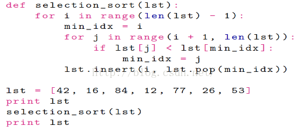
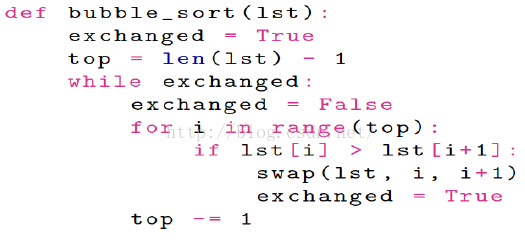
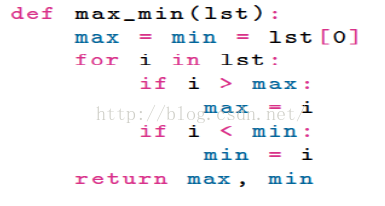

\>列表简介

\>\>是一种内建的数据结构，用来存储一系列的元素

\>\>同JS一样，由于解释性语言不必声明数据类型，所以数组的元素也可以很灵或的不相同。

\>列表的运算

>   index索引运算：[]

>   切片运算：[:]

>   拼接运算+

>   重复运算\*

>   成员运算in

>   长度运算len（）

>   循环for（）

\>列表方法：

>   list.intex()可以返回任意的方法

>   my_list[2] = a \#元素赋值

>   my_list.append()\#末尾追加元素

>   my_list.extend()\#末尾追加子表

>   my_list.insert()\#任意位置插入元素

>   my_list.pop()结尾删除元素

>   my_lise.sort()\#排序

>   my_list.remove()\#删除任意位置元素

>   my_list.reverse()\#倒序

\>列表应用

\>\>内建函数：sum()求和，max（）求最大值，min()求最小值

\>\>列表名本身就是一种指针和地址。所以在赋值是只是一个指针的指向赋值给另一个指针的指向

**[python]** [view
plain](http://blog.csdn.net/estom_yin/article/details/51916941)
[copy](http://blog.csdn.net/estom_yin/article/details/51916941)

1.  \程序一\</span\>

**[python]** [view
plain](http://blog.csdn.net/estom_yin/article/details/51916941)
[copy](http://blog.csdn.net/estom_yin/article/details/51916941)

1.  \a = [1, 2, 3, 4]

2.  b = a

3.  b[1] = 100

4.  **print** a[1]

5.  程序二

6.  a = [1, 2, 3, 4]

7.  b = a[:]

8.  b[1] = 100

9.  **print** a[1]\</span\>

    程序一的输出100，因为a和b指向同一个位置

    程序二的输出1，因为a和b指向不同的位置。

\>\>交换列表中两个元素的值

**[python]** [view
plain](http://blog.csdn.net/estom_yin/article/details/51916941)
[copy](http://blog.csdn.net/estom_yin/article/details/51916941)

1.  \**def** swap(lst, a, b)

2.  tmp = lst[a]

3.  lst[a] = lst[b]

4.  lst[b] = lst[a]

5.  x = [10, 20, 30]

6.  swap(x, 0, 1)\</span\>

\>\>查找并返回元素位置

**[python]** [view
plain](http://blog.csdn.net/estom_yin/article/details/51916941)
[copy](http://blog.csdn.net/estom_yin/article/details/51916941)

1.  \**def** search(lst, x):

2.  **for** i **in** range(len(lst)):

3.  **if** lst[i] == x:

4.  **return** i

5.  **return** -1\</span\>

    也可以直接使用lst.index(待查找元素)直接进行查找

\>\>时间复杂度的计算

\>二分查找

**[python]** [view
plain](http://blog.csdn.net/estom_yin/article/details/51916941)
[copy](http://blog.csdn.net/estom_yin/article/details/51916941)

1.  \**def** bi\_search(lst, v):

2.  low = 0

3.  up = len(lst) - 1

4.  **while** low \<= up

5.  mid = (low + up) / 2

6.  **if** lst[mid] \< v:

7.  low = mid + 1

8.  **elif** lst[mid] == v:

9.  **return** mid

10. **else**:

11. up = mid - 1

12. **return** -1\</span\>

\>排序

\>\>选择排序

\>\>冒泡排序

\>\>使用内置函数

>   sorted（lst）

>   lst.sort()

\>嵌套列表

students = [ ['zhang', 84], ['wang', 77], ['li', 100], ['zhao',53] ]

\>列表的解析

\>\>作用：一种有源列表创建新列表的方法

\>\>语法：[表达式for 变量 in 列表 if 条件]

生成函数-变化范围-约束条件

普通方法

>   lst = []

>   for x in range(1, 10)

>   lst.append(x\*\*2)

>   print lst

列表解析法：

>   lst = [x\*\*2 for x in range(1,10) if x % 2 == 0]

>   生成函数x\*\*2；生成范围1-10；生成条件x%2==0

\>定义匿名函数lambda

g = lambda x: x \*\* 2

print f(8)

所以可以用一下程序实现嵌套列表的值排序

students = [ ['zhang', 84], ['wang', 77], ['li', 100], ['zhao',53] ]

students.sort(key = lambda x: x[1], reverse = true)

\>元组

\>\>注意事项

1、元组同字符串一样具有不可变性，本质上是一个列表

2、append、extend、del等改变列表内容的函数不再适用，其它函数可以用

3、用括号直接创建元组（引号直接创建字符串，方括号直接创建列表）

4、元组的括号可以省略，直接用逗号隔开相同元组里的不同项

\>\>使用元组赋值

使用元组交换两个值

a, b = b , a

name, domai = 'car@163.com'.split('@') //这样就直接将值赋给两个变量了。

\>\>函数和元组

使用元组可以返回多个函数值

\>\>DSU模式（decorate,sort,undecorete）修饰排序反修饰

**[python]** [view
plain](http://blog.csdn.net/estom_yin/article/details/51916941)
[copy](http://blog.csdn.net/estom_yin/article/details/51916941)

1.  \**def** sort_by_length(words):

2.  \#decorate

3.  t = []

4.  **for** word **in** words:

5.  t.append((len(word),word))

6.  \#将元素和元素长度组成一个二元组

7.  \#sort

8.  t.sort(reverse = true)

9.  

10. \#undecorate

11. res = []

12. **for** length, word **in** t:

13. res.append(word)

14. **return** res

15. 

16. \</span\>

**[python]** [view
plain](http://blog.csdn.net/estom_yin/article/details/51916941)
[copy](http://blog.csdn.net/estom_yin/article/details/51916941)

1.  \

2.  

3.  words.sort(key = **lambda** x:len(x),reverse =true)\</span\>

//巧妙地利用了元组对应的灵活性完成了合成和分割
